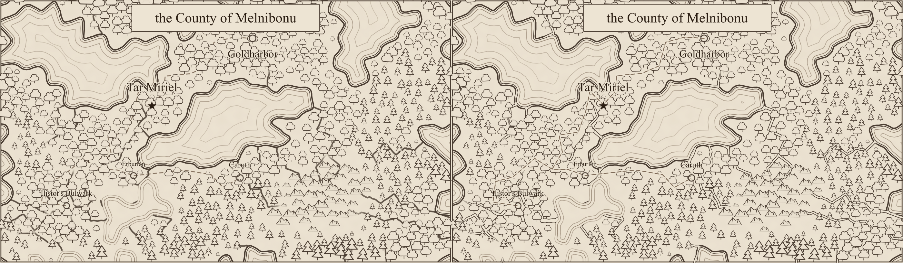
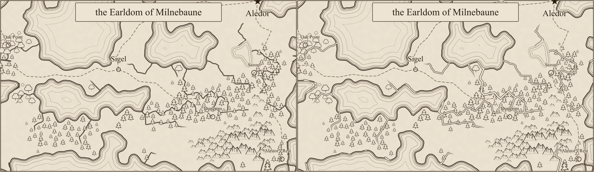
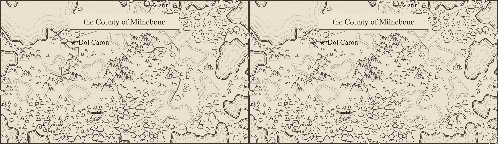

# River and road review (#235)

Each comparison has **before on the left, after on the right**, rasterized with `rsvg-convert` at
1400 pixels per map. These are review illustrations, not golden-image tests. Human visual review
is pending.

Rivers now have fine sepia banks around a pale parchment channel, sharing the water's parallel-line
vocabulary. Width increases with flow. Natural headwaters taper to points; tributaries join at full
width and mouths connect to the processed coast. The shared radial fade is gone, so one source
cannot erase a nearby river. Rivers draw below trees, mountains, and hills; roads remain above terrain artwork, keeping their course visible.

The road audit found no dropped-settlement stubs in Alpha, Bravo, or Charlie: every degree-one road
node is a settlement. Alpha's intermediate endpoint at node 27 is a three-way junction; Charlie
has two such junctions, at nodes 240 and 322. Roads retain their exact routed cell centres, with
narrow parchment clearance and a faint continuous line beneath the dashes. Rendering prunes any
unanchored dangling branch without editing the stored road graph.

The audit did find a simulation defect: Charlie's river mouths at corners 75 and 85 are marked
ocean but touch only dry cells. This is tracked separately in
[#244](https://github.com/ironarachne/ironarachne/issues/244). The renderer omits the 12 edges feeding
these unmapped outlets. It preserves all 146 positive-flow river edges in Alpha and all 131 in
Bravo, and draws 121 of 133 in Charlie. No geography or settlement data changes.

| Seed    | Before SVG bytes | After SVG bytes | River edges drawn |
| ------- | ---------------: | --------------: | ----------------: |
| alpha   |          161,029 |         203,802 |        146 of 146 |
| bravo   |          121,048 |         166,805 |        131 of 131 |
| charlie |          153,989 |         180,914 |        121 of 133 |

Separate bank/channel geometry increases size, but simplification removes detail smaller than
0.01 map units at this scale. All three maps remain under their existing SVG size limits.
Processed water definitions, terrain glyph placements, and label markup are identical before and
after. The land ink beneath a road is covered locally so the road stays visible. Terrain symbols can overlap rivers.

## Alpha



## Bravo



## Charlie



## Reproduction

The baseline is main at `f9a12004`, after #234. For each seed:

```sh
npm run render:region -- --svg-out /tmp/alpha.svg --seed alpha
rsvg-convert -w 1400 /tmp/alpha.svg -o /tmp/alpha.png
```

Repeat with `bravo` and `charlie`. The supplied lossless WebP comparisons join each pair at its
original 1400-pixel width. Tests cover downstream destinations, flow at confluences and mouths,
headwater taper, crop exits, disconnected branches, degenerate geometry, stable output, and graph
immutability. Reference tests check the Charlie defect and ensure rivers draw before terrain and roads after it.
