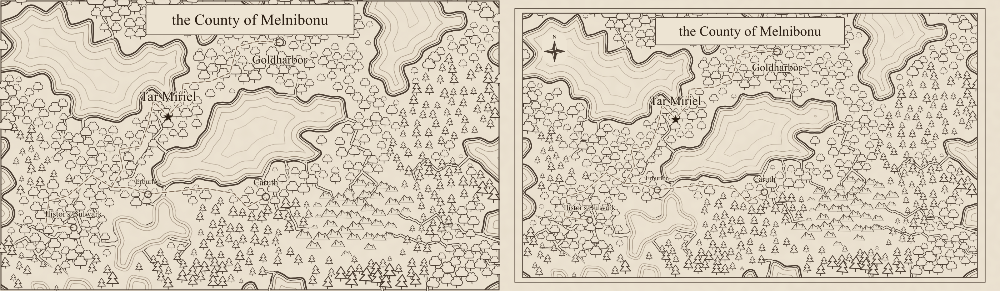
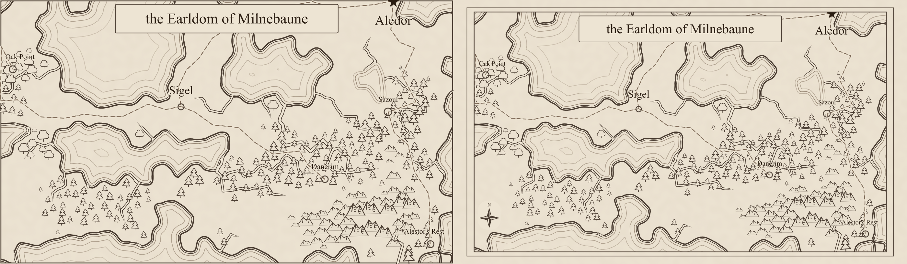
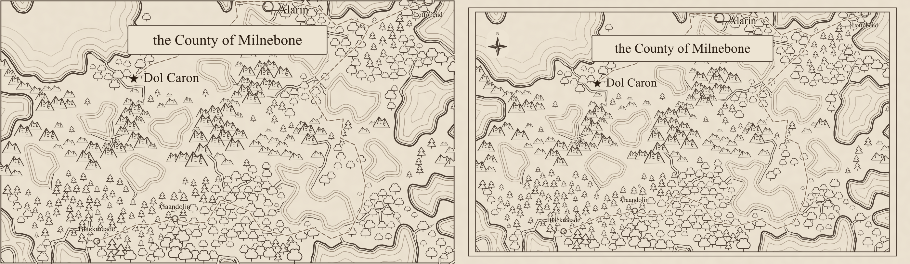

# Cartographic furniture review (#236)

Each comparison has **before on the left, after on the right**, rasterized with `rsvg-convert` at
1400 pixels per map. Human visual review was approved in
[PR #246](https://github.com/ironarachne/ironarachne/pull/246), which is merged. These are review
illustrations, not golden images.

Every map now has a parchment margin and a restrained two-line frame. The drawing is clipped at
the inner ruled line, so geometry and filters cannot bleed to the sheet edge. The viewBox grows by
five percent of the original width on either side and five percent of its height above and below.
The map keeps its aspect ratio and pixel-size cap; its existing geometry fits uniformly inside the
larger sheet.

A small north-up compass occupies clear space. Its placement reuses the label reservation boxes
and avoids final labels, markers, terrain silhouettes, shores, and routes. It can sit over open
water hatching, with a small parchment backing for legibility. All three reference maps fit the
full-size rose. A crowded map can try two smaller sizes or omit the rose if no clear spot exists.

There is **no scale bar**: map units have no physical distance, and defining one would change
generated geography. This decision is recorded in `docs/region-cartography.md`, as the issue
requires. There is **no legend** because the existing glyph vocabulary is self-explanatory.

| Seed    | Before SVG bytes | After SVG bytes |
| ------- | ---------------: | --------------: |
| alpha   |          203,802 |         204,679 |
| bravo   |          166,805 |         167,685 |
| charlie |          180,914 |         181,791 |

Water definitions, terrain transforms, and label markup are unchanged. Rivers remain below terrain
and roads above it. Stored geography and settlement data are unchanged. The visual inset comes
from the larger sheet, rather than regenerating or distorting the map.

Tests check the margin, frame, clip, compass/text clearance, determinism, and graph immutability.
Browser checks rasterize the SVG to verify a clear outer paper rim and compare the compass with
actual text, marker, and terrain bounds. Inland maps and wide/tall aspect ratios are covered too.

## Alpha



## Bravo



## Charlie



## Reproduction

The baseline is main at `72cc1977`, after #235. For each seed:

```sh
npm run render:region -- --svg-out /tmp/alpha.svg --seed alpha
rsvg-convert -w 1400 /tmp/alpha.svg -o /tmp/alpha.png
```

Repeat with `bravo` and `charlie`. Each lossless WebP comparison joins the two 1400-pixel maps.
