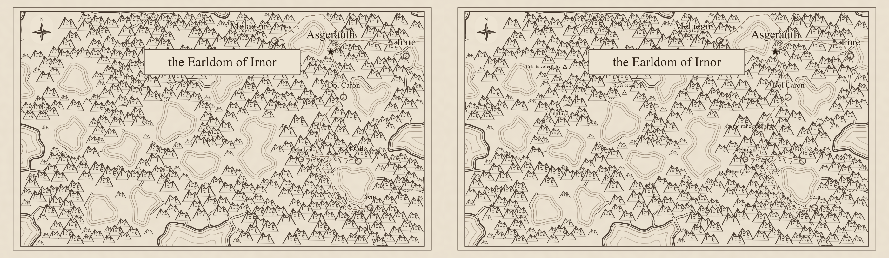
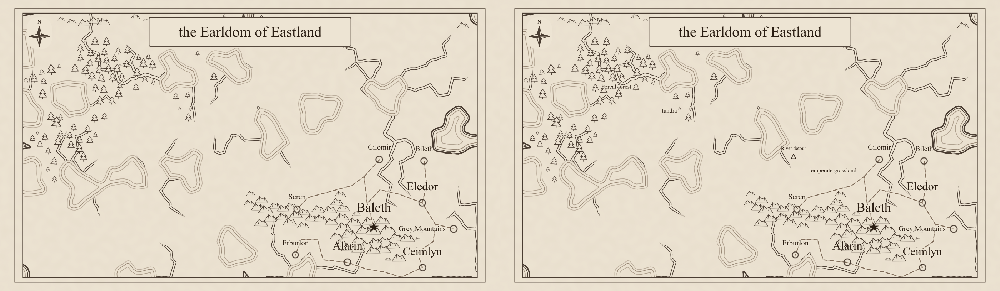
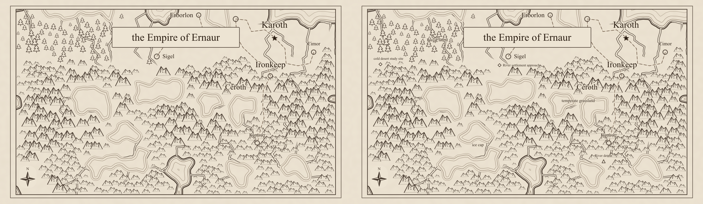

# Regional map facts review (#343)

Each comparison has **before on the left, after on the right**, rasterized with `rsvg-convert`
at 1400 pixels per map. The seeds and 60 × 35 CLI configuration follow the
[existing cartography reviews](../region_cartography_236/README.md). Both sides use exactly the
same generated snapshot; the left omits habitat and notable drawing inputs. The right adds them.

Settlements retain priority, the cartouche and compass remain clear, and optional symbols leave
space in dense terrain. Habitats name major saved footprints without adding boundaries or washes.
Blank, unresolved and crowded facts produce no unlabeled symbol. No geography is regenerated
between the two views. In these fixtures, selected settlement-approach sites can be omitted when
they conflict with a settlement marker or label; their saved facts remain available in prose.

## Alpha



## Bravo



## Charlie



## Reproduction

For each seed, render the current facts with the shared page/export presentation path:

```sh
npm run render:region -- --svg-out /tmp/alpha.svg --seed alpha
rsvg-convert -w 1400 /tmp/alpha.svg -o /tmp/alpha.png
```

For the left side, call `regionToMapSvg` on the same `toRegionSnapshot` result with only
`facts.habitats` and `facts.notables` replaced by empty arrays. Repeat with bravo and charlie,
then join each pair as lossless WebP. Existing older review images are retained unchanged.
