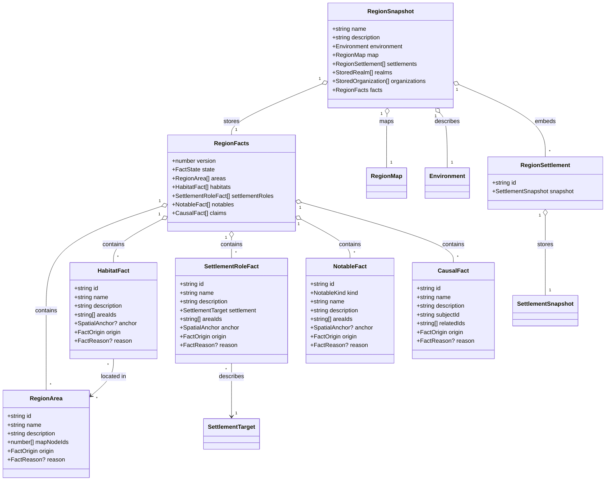
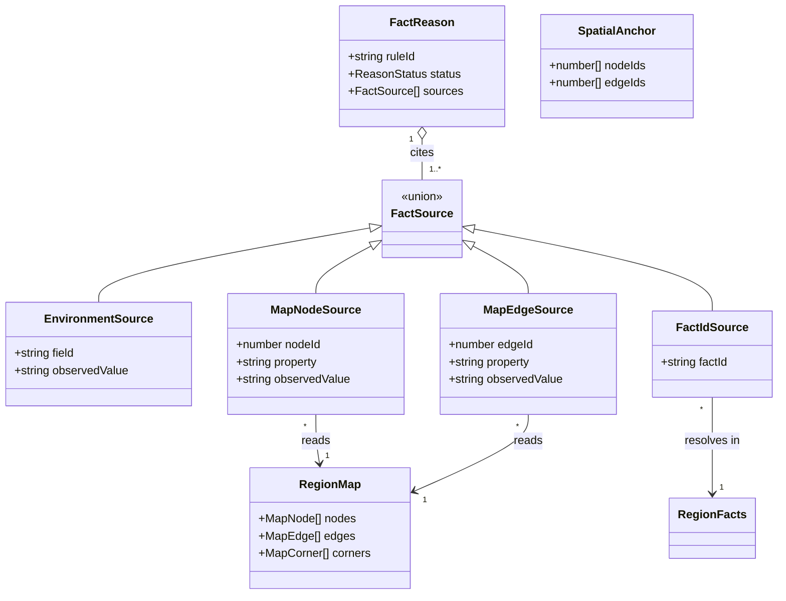
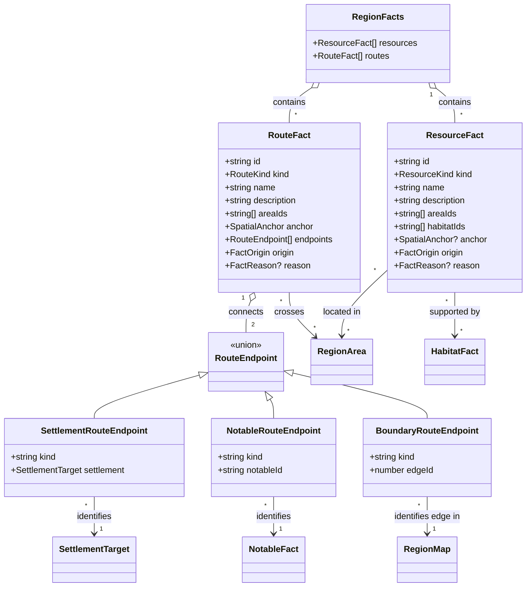

# Regions Release Contract

This is the design for [#326](https://github.com/ironarachne/ironarachne/issues/326), the foundation
of the [Regions release](https://github.com/ironarachne/ironarachne/issues/322).

**Status:** accepted. The human reviewer approved the release boundary and domain model on
2026-09-28. Implementation remains tracked by #328–#349.

The remaining optional integrations have separate approved models:
[creature context #337](region-creature-context.md) and
[settlement material context #342](region-material-context.md). Those models were approved on 2026-10-03 and are implemented. The [second-genre assessment #351](region-second-genre.md)
records an explicit deferral, using the alternative permitted by that issue's acceptance criteria.

## User flow and release boundary

A referee enters a seed and generates a fantasy region. The result reads like a short sourcebook
entry: an overview, distinct areas and habitats, settlements with geographic roles, and a few
landmarks or hazards. The referee can inspect a fact's reason (for example, a town is a river
crossing because it occupies a traversable river edge), save the region to a project, revise the
written facts, and export a compact gazetteer with the existing illustrative map. Reopening an
edited region must show the saved work, not regenerate it from the seed.

The minimum release covers one fantasy path. A region must make physical conditions, habitation,
settlement roles, and notable features agree, rather than merely place unrelated generated text next
to the map. Existing culture, realm, organization, and character generators remain independently
useful; the region may compose their results without taking ownership of their internal rules.

## Existing contracts and gaps

| Existing contract                                                                                                                                                                                                          | Consequence for this design                                                                                                                                                   |
| -------------------------------------------------------------------------------------------------------------------------------------------------------------------------------------------------------------------------- | ----------------------------------------------------------------------------------------------------------------------------------------------------------------------------- |
| `Region` and `RegionSnapshot` already contain an `Environment`, `RegionMap`, settlements, realms, authority, organizations, and an optional embedded culture.                                                              | Extend the region's stored facts; do not replace the artifact kind or duplicate composed payloads.                                                                            |
| `RegionMap` stores Voronoi nodes, edges, corners, climate, water, biome, roads, and drawing-unit coordinates. `MapNode.id` and `MapEdge.id` are graph identifiers.                                                         | New location references may point to the saved graph. They must be checked against it, and must not assume a real-world distance or a permanent identity across a fresh roll. |
| `Environment` summarizes one climate, terrain, biome, water system, and ecosystem. The completed #249 work chooses a shared terrain profile and makes map terrain and overview agree.                                      | Use that result as an input. Do not reclassify terrain, remap elevations, or add an independent terrain model.                                                                |
| A region artifact already has a payload version and optional origin provenance (`toolPath`, seed, config). Referenced culture and settlement artifacts live in the artifact's reference list, not as stale payload copies. | Version the new payload shape and migrate old snapshots without rewriting the map. Keep origin provenance distinct from reasons for individual facts.                         |
| The current editor changes prose and selected list fields without recomputing the map. Markdown, PDF text, and SVG map export already exist.                                                                               | Preserve saved edits. Expand the gazetteer from the structured facts and keep the SVG a separate, illustrative export.                                                        |

Today `region.description` repeats `environment.description`; settlements and organizations are
generated mostly independently of map geography; the gazetteer lists them without explaining why
they exist. Realm `parent` and `mainRealm` are array indices, and a settlement has an optional
`mapNodeId`. These legacy links remain valid in migrated content, but new semantic relationships
must not depend on array position or mutable display names.

## Decisions

### 1. Structured facts are the source for new explanations

The region gains a versioned `RegionFacts` section in `RegionSnapshot`. Its areas, habitats,
settlement roles, landmarks, hazards, and causal statements are plain stored data. Generation
produces them in dependent passes from the realized environment, map, and composed settlements.
Overview prose and exports render from these facts. They must never be the only place a causal
claim exists. Existing `description` and component snapshots remain as stored user content, and
legacy snapshots may have no `RegionFacts` after migration.

Each new fact has a stable **semantic ID within one region artifact**. IDs are opaque strings with
a type prefix, minted once when the fact is created; editing a name, prose, or list order retains
the ID. A fresh full roll creates a new fact set, even if the same seed happens to yield similar
names. IDs need only be unique within `RegionFacts`, not globally across projects. Cross-artifact
identity continues to use `ArtifactReference.targetId` and `role`. Within a fact, relationships
refer to semantic IDs; spatial anchors refer to map graph IDs. Display names and array positions
are never relationship keys.

The first version uses explicit lists and finite vocabularies for fact kinds and relationship
roles. Unknown future kinds or roles cannot be silently treated as known facts; payload migration
must either preserve them as opaque data with a visible unsupported state or reject them without
discarding the artifact. Every fact has editable `name` and `description`; generated reasons stay
separate so rewriting the description does not falsely rewrite the cause.

### 2. Reasons form a small, inspectable graph

`FactReason` records the producing rule ID and references to the facts or observed inputs that
support a claim. `FactSource` is a discriminated value: `environment` field, map node/edge, or
another semantic fact. The rule ID identifies a versioned fantasy rule, not a prose template.
Reasons are assertions about the saved result, not instructions to replay the generator. A user
can inspect the source and see a human sentence assembled from it, such as “crossing: the road
meets this river here.” The UI must not invent an explanation from a label alone.

On edit, a changed fact is marked `authored`, and affected generated reasons are either
recomputed from still-valid sources or marked `stale` with a visible explanation. Partial
regeneration (#347) replaces only the chosen generated facts and their dependent generated facts;
it never silently overwrites authored facts. A fact may be user-authored from the start and have no
generated reason. An invalid or missing source cannot be presented as a valid explanation.

Artifact origin provenance remains the seed/config record in `$lib/artifacts`; fact reasons live
inside the region payload. The former answers “how was this artifact first made?” and the latter
answers “why does this feature belong here?” Neither is a substitute for the other.

### 3. Spatial meaning is coarse and tied to the saved map

The saved `RegionMap` is the physical substrate. `RegionArea` groups node IDs into broad named
areas; a habitat is associated with one or more areas and can cite specific nodes as evidence.
Settlement roles and notable features use a `SpatialAnchor` containing node IDs, edge IDs, or
both. An anchor is optional for a region-wide cultural or narrative fact. Every referenced
graph ID must exist in the snapshot's map. The graph's IDs are stable only while that saved map is
held; a full reroll must rebuild anchors.

Areas are narrative zones, not a second polygon mesh. Their node sets may touch and may overlap
when a feature spans a boundary; they need not partition every land cell. No distance in miles,
travel time, cadastral border, or claim of cartographic accuracy is implied by map width and
height. The SVG remains a visual illustration of the stored graph. The map may show selected
labels or symbols, but the gazetteer carries the authoritative explanations.

The completed #249 terrain coherence is a fixed input contract. New rules consume its shared
terrain classification and realized map/overview data; they do not tune terrain to justify a
later landmark, invent a conflicting biome, or rerun terrain generation. The existing SVG style
and ability to render old saved maps are preserved.

### 4. Core data is neutral; first rules are fantasy-specific

The `RegionFacts`, identity, source, reason, and spatial-anchor types express geography and causal
relationships without naming a game system or genre. The first rule catalog is explicitly fantasy:
it may define habitats, settlement roles, and landmarks in fantasy terms and produces the first
gazetteer vocabulary. Rule IDs carry a namespace and version so later rules can coexist without
reinterpreting saved reasons. A second genre is an extension point, not a release promise.

No fantasy rule may be hidden inside the generic payload validator or persistence layer. Those
validate structure and references; the fantasy generator validates its own domain postconditions.

### 5. Migration and editing preserve the user's artifact

The new region payload version adds `facts` to `RegionSnapshot` and wraps embedded settlement
snapshots with a region-local ID. Migration from versions 1 and 2 keeps the entire realized
`Environment`, `RegionMap`, and composed snapshots intact. It assigns local IDs to the existing
settlements once, and adds an empty `RegionFacts` container with a `legacy` state; it does **not** fabricate reasons for old
settlements or reroll old maps. The existing gazetteer remains usable for such artifacts. A user
can explicitly upgrade a legacy region through a reviewed generation action that explains which
new facts will be added and which authored fields will be kept. A failed migration leaves the
original artifact readable or exportable through the vault's existing failure path.

The same payload validator checks semantic ID uniqueness, source targets, and spatial anchors.
Editing APIs use IDs, never list indices, for new facts. Removing a fact checks inbound reasons and
relationships before saving: the editor either updates dependents or marks their reasons stale.
Reference targets in other artifacts retain their existing dangling-reference behavior. Full
reroll remains an explicit destructive action; partial regeneration has its own review step.

## Domain model

These are the proposed persisted types. Existing component snapshot types are abbreviated to keep
the new model legible; implementation type files must spell out the same fields and variants. The
`RegionFacts.version` value versions the semantic schema independently of the artifact payload
version, while `RegionSnapshot`'s payload version still governs storage migration.



`FactState = 'current' | 'legacy'`; `FactOrigin = 'generated' | 'authored'`;
`NotableKind = 'landmark' | 'hazard'`. A `SettlementTarget` discriminates an embedded
`RegionSettlement.id` from a referenced artifact's `targetId`. The wrapper gives an embedded
settlement stable identity without changing the standalone settlement kind. Migration assigns IDs
in existing list order and saves them with the migrated snapshot on the next write; later ordering
and name edits retain them. Existing `SettlementSnapshot.mapNodeId` is retained.



`ReasonStatus = 'current' | 'stale'`. `observedValue` records the tested value at generation time;
the source path and saved payload let the UI detect when an edit or migration invalidates it. The
allowed environment fields and map properties are typed enums in the implementation, rather than
arbitrary executable paths. `ruleId` is data, never code to evaluate from a saved artifact.

## Resource and route extension for #328

**Status:** accepted on 2026-09-29. This extends the accepted model above with the dedicated
resource and route facts named in #328.

A resource is a named occurrence grounded in a habitat, area, or observed map feature. It
does not store a duplicate biome, a quantity, or an economy forecast. A route is a named corridor
over saved map edges between two identifiable endpoints. It does not store travel time, distance in
miles, or a second road graph. Both are facts with the same editable text, origin, and optional
reason as the approved fact types.

### Domain model



`ResourceKind = 'freshwater' | 'arable-land' | 'fish' | 'timber'` and
`RouteKind = 'road' | 'river'`. These resource kinds can be supported by the saved water, climate,
biome, and habitat data; ore or other geological claims need a new observed input before a
generator may assert them. A river route means a corridor following the river, not a claim that
boats can navigate it. The exact `RouteEndpoint` union is:

```typescript
type RouteEndpoint =
  | { kind: 'settlement'; settlement: SettlementTarget }
  | { kind: 'notable'; notableId: string }
  | { kind: 'boundary'; edgeId: number };
```

The existing `SettlementTarget` variant distinguishes an embedded `RegionSettlement.id` from an
artifact `targetId`; the route stores neither settlement
snapshot nor display name. A route has exactly two endpoints. A boundary endpoint means its edge
ID is on the saved map boundary, not that a neighboring region or destination has been invented.

Resource IDs use `resource:` and route IDs use `route:`. They join the existing one-region semantic
ID namespace and can be cited by `FactSource.kind = 'fact'` and `CausalFact` relationships. Every
`areaId`, `habitatId`, `notableId`, embedded settlement ID, and map node/edge ID must resolve in the
same saved snapshot; artifact settlement targets retain the existing dangling-reference behavior.
A resource needs at least one area or anchored map node/edge. A route needs at least one anchored
edge and two distinct endpoints. The generic validator checks structure and references; fantasy
generation checks whether the cited map edges actually support the proposed road or river and
whether the resource's environment and habitat support its kind. A missing or changed source marks
a generated reason stale rather than asserting an unsupported cause.

The two required arrays are part of the version 3 payload, with `RegionFacts.version` remaining
`1`; migrations from payload versions 1 and 2 initialize both arrays empty alongside the other
legacy fact lists. Old regions reopen and export without newly invented resources or routes.
Derived route drawing remains outside the payload, just like the current SVG map.

## Representative result

For an illustrative seed, the map contains a western hill belt, a river crossing its lower edge,
and a settled valley. The overview might read: “The western hills feed a river into the valley.
Roads converge at Greyford's crossing, while the wet upstream flats shelter reed marsh.” The
stored facts behind this short passage would include:

| Fact                                         | Anchor                                  | Inspectable reason                                                             |
| -------------------------------------------- | --------------------------------------- | ------------------------------------------------------------------------------ |
| Western Hills (`area:western-hills`)         | Hill-classified map node IDs            | Shared #249 landform classes and contiguous map nodes.                         |
| Reed Marsh (`habitat:reed-marsh`)            | Wet valley node IDs                     | Saved moisture, water adjacency, and the selected fantasy habitat rule.        |
| Greyford crossing (`role:greyford-crossing`) | Greyford's node and a nearby river edge | The saved settlement occupies a traversable crossing; the road uses that edge. |
| Flooded causeway (`hazard:flooded-causeway`) | The same river edge                     | The crossing and wet flats support a seasonal obstacle.                        |

The names are editable. A referee may change “Greyford” to “Vey's Ford” while retaining the role's
semantic ID and its geographic reason. If the referee moves the settlement off the crossing, the
old reason becomes visibly stale until they update or regenerate that role. The map shows the river,
road, and settlement as an illustration; the gazetteer explains their relationship.

## Release acceptance

1. For a fixed seed, generation is repeatable. Every generated claim can be traced to saved input
   facts or observed map/environment values and a versioned fantasy rule. No claim depends on a
   freshly rolled value that is absent from the snapshot.
2. Generated areas, habitats, settlement roles, and landmarks or hazards form a coherent short
   gazetteer. Their anchors and semantic references validate against the saved map and facts.
   Causal prose does not contradict its structured sources.
3. The completed #249 terrain and biome coherence remains true. Existing saved maps stay loadable,
   and the map remains an illustration rather than an authoritative navigation or editing surface.
4. Saving, reopening, editing, partial regeneration, and exporting preserve authored facts and
   expose stale explanations. The exported Markdown/PDF entry and SVG map agree with the current
   saved snapshot, including referenced settlements when resolved for presentation.
5. Old region payloads migrate without fabrication or map rewriting. Automated tests cover version
   migration, identity and source validation, deterministic passes, edits, exports, and representative
   seeds; browser checks cover the end-to-end flow and mobile layout.

## Explicit exclusions and work sequence

The release does not add another genre, navigable GIS, map editing, real-world distance or travel
simulation, deep culture generation, a full economy, a scientific climate model, settlement imagery
(#250), or weather design (#18). These may consume the core later, but no schema field or acceptance
criterion here presumes they ship with Regions.

After approval, #327 measures the existing workflow; #328 implements the versioned facts and
migration; #329 and #330 build deterministic dependent passes and spatial habitats; #331–#333 add
settlement roles, grounded notable features, and causal prose; #347 handles edit consistency and
partial regeneration; #348 verifies the complete user flow; and #349 documents the implemented
data flow. Each work item must keep the existing region artifact and map usable while the release is
assembled.
