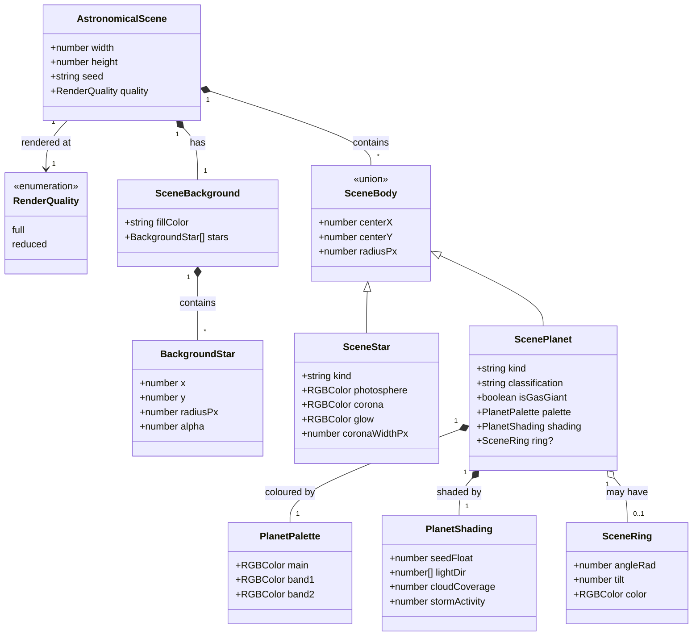
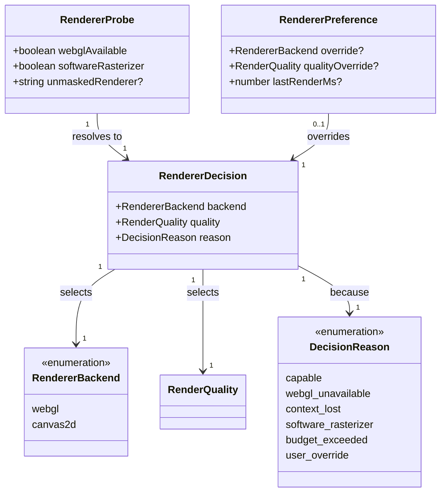

# Rendering astronomical previews

This design document covers `src/lib/renderers`: how a planet, star, or star system becomes a
preview image, how the site chooses between the WebGL and Canvas2D backends, and what happens when
the hardware in front of us cannot run the first one well.

It exists because the library has three problems that are all the same problem wearing different
hats — the two backends duplicate the arithmetic that decides what a picture contains, and nothing
holds them to the same answer.

**Status:** proposal; awaiting review. Nothing here is built. The [domain model](#domain-model) is
drafted and implementation does not begin until those diagrams are approved, per the design process
in CLAUDE.md. Issue #95 (raise `renderers` coverage to 80%) is deliberately blocked on this
document: writing tests against the current shape would cement the duplication this removes.

## The problem

### The renderer toggle changes the picture

`ImageRendererSelect` offers "WebGL" and "Canvas2D" as a user-facing choice. The two backends draw
different random numbers, in a different order, from the same seed:

|                | `canvas2d_planet_renderer`                                                             | `webgl_planet_renderer`                                                                 |
| -------------- | -------------------------------------------------------------------------------------- | --------------------------------------------------------------------------------------- |
| RNG draw order | `seedFloat`, `lx`, cloud, storm, **~180 background-star draws**, ring angle, ring tilt | `lx`, `randomString(13)`, cloud, storm, `seedFloat`, ring angle, ring tilt, ring colour |
| Planet colours | `resolvePlanetCanvasTheme(classification, seed)`                                       | `getRandomGasGiantRgbTriplet(...)`, whatever the classification                         |
| Ring colour    | `randomRingRgb(seed)`                                                                  | three floats off the main RNG                                                           |

The same seed therefore produces a different planet depending on which backend drew it — a
different palette, and, because Canvas2D consumes the RNG for background stars part-way through,
different ring geometry too. The star-system renderers have the same split; `star_system_layout.ts`
records the situation in its own doc comment, that it "mirrors placement math in
`webgl_star_system_renderer` for consistent previews". The mirroring is manual, and manual mirroring
drifts.

This matters because the toggle is not an aesthetic choice. It is there so the site keeps working
on hardware that cannot run WebGL — which means the two backends are meant to show **the same
thing**, at whatever fidelity the machine can manage.

### The fallback is slower than the thing it falls back from

`drawPlanetSpherePatch` shades every pixel of the disk in JavaScript on the main thread. Each pixel
calls `calcNormalFromMap`, which calls `fbmMap` six times; each `fbmMap` runs six octaves of eight
lattice hashes; each hash is a `Math.sin`. That is roughly three hundred `Math.sin` calls per pixel.

Measured on a developer machine — not the weak hardware this path exists to serve:

| Body        | Disk radius | Pixels  | Time  |
| ----------- | ----------- | ------- | ----- |
| Terrestrial | 200px       | 125,629 | 1.0 s |
| Gas giant   | 200px       | 125,629 | 1.4 s |
| Gas giant   | 320px       | 321,657 | 3.4 s |

That is per planet, synchronously, blocking the UI. `canvas2d_star_system_renderer` loops over every
planet in the system, so an eight-planet system is a multi-second freeze. On a low-end device,
multiply by three to ten.

WebGL on the same machine — including when it falls back to software rasterization through
SwiftShader or llvmpipe, which is what a machine without a usable GPU actually runs — executes the
same maths as compiled native code across parallel fragments. The fallback is very likely slower
than what it replaces, on exactly the hardware it was built for.

The e2e configuration already half-knows this: WebGL pages get a 90s test timeout and a 30s button
timeout, against 45s and 15s for everything else.

### The coverage gate cannot see what is verified

The Playwright suite loads `/planet`, `/star-system`, and `/star-nation` in Chromium at pinned
seeds, so the WebGL path runs in CI on every PR. But `expectGeneratorOutput` only asserts that an
`img` or `canvas` is visible — a shader that renders solid black passes. And
`scripts/check_library_coverage.ts` reads Vitest output only, so none of that browser exercise
reaches the gate. `renderers` reports 37% while the truth is: the maths is unit-tested, the
orchestration is smoke-tested in a browser, and nothing checks the pixels.

## Two failure modes, not one

The toggle conflates two situations that need different answers.

**WebGL is unavailable.** Context creation fails, the extension is blocked, the context is lost.
Canvas2D is the only option and slow beats nothing. This is a genuine backend fallback.

**WebGL works, but the GPU is weak.** Swapping to a per-pixel JavaScript loop makes it worse. The
right response is less work — fewer pixels, fewer octaves — not a different backend.

The principle this document adopts:

> **Backend choice is a capability question with one right answer. Quality is a budget question with
> a dial.**

## The shape of the solution

### One scene, two backends

A pure function builds an **`AstronomicalScene`**: plain data describing what the picture contains —
background fill, background star positions, body centres and radii, colours, shading parameters,
ring geometry. Both backends consume that scene. Canvas2D walks it issuing context calls; WebGL
walks it building meshes and uniforms. Neither computes anything the other might compute
differently.

This is the display-list separation that Skia (`SkPicture`) and Flutter (`SceneBuilder`) use, and it
buys three things at once:

- The backends agree by construction rather than by discipline, which fixes the divergence above.
- Roughly two hundred lines of untestable orchestration become a pure function returning data.
- The quality tier has somewhere to live that is not duplicated across six renderers.

Background stars are carried as an array of positions rather than as a count to be re-rolled. It is
a few hundred small objects, it is what makes the two backends identical rather than merely similar,
and it removes the RNG-ordering hazard entirely.

### Choosing a backend is automatic

Selection stops being a question the user is asked first:

1. Probe once: `canvas.getContext('webgl2') ?? canvas.getContext('webgl')`. Failure resolves to
   Canvas2D with no user involvement.
2. Inspect `WEBGL_debug_renderer_info` → `UNMASKED_RENDERER_WEBGL`. A string containing
   `SwiftShader`, `llvmpipe`, `Software`, or `Microsoft Basic Render` means CPU rasterization, which
   starts the quality tier at `reduced` — it does **not** switch backends.
3. Time the first render. Over budget drops a tier and remembers.
4. Listen for `webglcontextlost` and re-resolve at runtime.

The manual control stays, demoted to an override for when detection guesses wrong.
`astronomical_renderer_storage.ts` already persists a choice; it persists the wrong thing today, a
backend name rather than a resolved decision.

### Degrading means less work, not different work

`reduced` quality renders at half linear scale and upscales — a quarter of the fragments — and drops
the bump-normal pass. It applies to both backends, because a weak GPU and a weak CPU both benefit.

### The Canvas2D planet path gets simpler, not faster

Per-pixel FBM shading is removed from the fallback. Planets are drawn the way
`canvas2d_star_draw.ts` already draws stars: radial gradients for the lit limb and terminator, a
banding overlay for gas giants, rings as the existing stroked ellipse. Microseconds instead of
seconds, and visibly simpler — which is what a fallback should look like.

`planet_canvas_surface_shade.ts` is not deleted. It stops being the mandatory fallback path and
becomes an optional high-fidelity Canvas2D mode, available where someone wants an offline or
GPU-free render and can wait for it. It keeps its tests.

## Domain model

The types this document implies, stated as types. What a diagram declares here is what the
corresponding `*-types.ts` file declares in code.

Two diagrams: the scene, and the capability decision. They version separately and read badly
together.

Field names are TypeScript. A trailing `?` marks an optional field and `[]` an array; `lightDir` is
an `[number, number, number]` tuple, which Mermaid has no spelling for. **These are types, not
classes** — CODE_STYLE.md rules classes out. Mermaid's only "is a" arrow is `<|--`, so it stands for
a discriminated union here, never for `extends`.

### The scene

Everything a backend needs, and nothing about how to draw it. `RGBColor` is the existing
`$lib/graphics/rgb_color`.

`kind` is the discriminant, `'star'` or `'planet'`. `isGasGiant` is resolved once by the builder
rather than each backend re-deriving it from `classification`, which is how the WebGL path came to
hand gas-giant colours to terrestrial planets.

### The capability decision

What the site knows about the machine, what it decided, and what it remembers.

`reason` is carried so the settings UI can say _why_ — "Canvas2D, because WebGL is unavailable" is a
different message from "Canvas2D, because you chose it" — and so a bug report can tell them apart.

## Decisions taken here

### 1. The backends agree on composition, not on pixels

Exact pixel equality between a GLSL shader and a JavaScript reimplementation is not achievable, and
under the simplification above it is not even attempted. The contract is: **same layout, same
palette, same ring geometry, same light direction, same background stars.** Shading detail differs
and is expected to.

This is what makes the contract testable. Cross-backend equality is asserted on the _scene_ — plain
data, exact comparison, free — and never on the images.

### 2. Selection is automatic; the control becomes an override

Asking a user whether their GPU is any good is asking them to debug the site. The probe answers the
part that has a right answer, the budget answers the part that does not, and the control remains for
the cases both get wrong.

### 3. The Canvas2D planet path is simplified rather than optimised

Optimising it — half-scale rendering, cached normals, a Worker with `OffscreenCanvas` — was
considered and rejected as the primary route. It is real work for a path whose entire purpose is to
be cheap, and it would leave the expensive shape in place for someone to reintroduce on the main
thread later. Gradient shading is a tenth of the code and roughly four orders of magnitude faster.

The high-fidelity path survives as an option, so the fidelity is not lost — only its position as the
default fallback.

### 4. GPU submission leaves the coverage denominator only once golden tests exist

There is a real distinction the config should state: a baseline entry says "this is untested debt";
a `coverage.exclude` says "this is verified by a different suite". The second is honest **only if
the other suite exists**. So the sequencing is golden images first, exclusion second, never the
reverse. Everything else in `renderers` clears 80% on its own once the scene builder lands, because
the scene builder is where the logic will be.

## Testing strategy

Three tiers, matching what the code actually is:

1. **Unit** — the scene builder and the existing maths modules. Assert numbers: layout positions,
   scaling curves, palette resolution, background star counts, ring geometry. This is where the
   coverage lives and it should be high.
2. **Draw-call structure** — a recording `Proxy` context, the technique used in
   `src/lib/dungeon/render/classic_module_map.test.ts`, over the Canvas2D backends. No DOM, no
   jsdom; asserts that a scene produces the expected sequence of draws.
3. **Golden images** — Playwright `toHaveScreenshot` on a handful of representative outputs at
   pinned seeds with a tolerance for GPU variance. This is the only tier that catches "the shader
   renders black", and it runs in the browser CI already starts.

Plus one contract test that is neither: for a set of seeds, build the scene once and assert both
backends were handed the identical object.

## Tidy-ups folded in

- `svg-to-png.ts` moves out of `renderers` — it is a download utility, not an astronomical renderer.
  It also never calls `revokeObjectURL`, leaking a blob URL per invocation, and throws inside an
  `onload` handler where nothing can catch it. Both are fixed on the way past.
- `rgbaCss` is defined identically in `canvas2d_planet_draw.ts` and `canvas2d_star_draw.ts`;
  `rgbColorToVector3` and `vectorTripletFromRgbTriplet` are the same function under two names in two
  WebGL files. One home each.
- `ringSemicircleAngles` and `ringBackHalfIsHalfZero` are real geometry, currently private inside a
  canvas module and reachable only through a context. They move to the scene builder, where they are
  ordinary testable functions.
- `render()` returns a base64 data URL. A 1024px PNG as a string held in Svelte state is heavy;
  whether a `Blob` or `ImageBitmap` serves better is worth settling while the signatures are already
  changing.

## The plan

Ordered so each step is independently mergeable and green.

1. **Scene types and builder.** `astronomical_scene.ts` plus `astronomical_scene_types.ts`, built
   from the diagrams above, with unit tests. Nothing consumes it yet.
2. **Canvas2D backends consume the scene.** Includes the simplified planet path from decision 3.
   Draw-call tests land with it.
3. **WebGL backends consume the scene.** The cross-backend scene-equality test lands here, and the
   divergence bug closes.
4. **Capability detection and quality tiers.** `RendererProbe`, `RendererDecision`, automatic
   selection, `webglcontextlost` handling; `ImageRendererSelect` becomes an override and
   `astronomical_renderer_storage` starts persisting a decision.
5. **Golden images** in Playwright.
6. **Coverage exclusion** for GPU submission files, with the comment explaining what covers them —
   and `renderers` leaves `scripts/library_coverage_baseline.json`, closing #95.

Steps 1 through 3 are the ones that fix a live bug. Steps 4 through 6 are what make it stay fixed.
