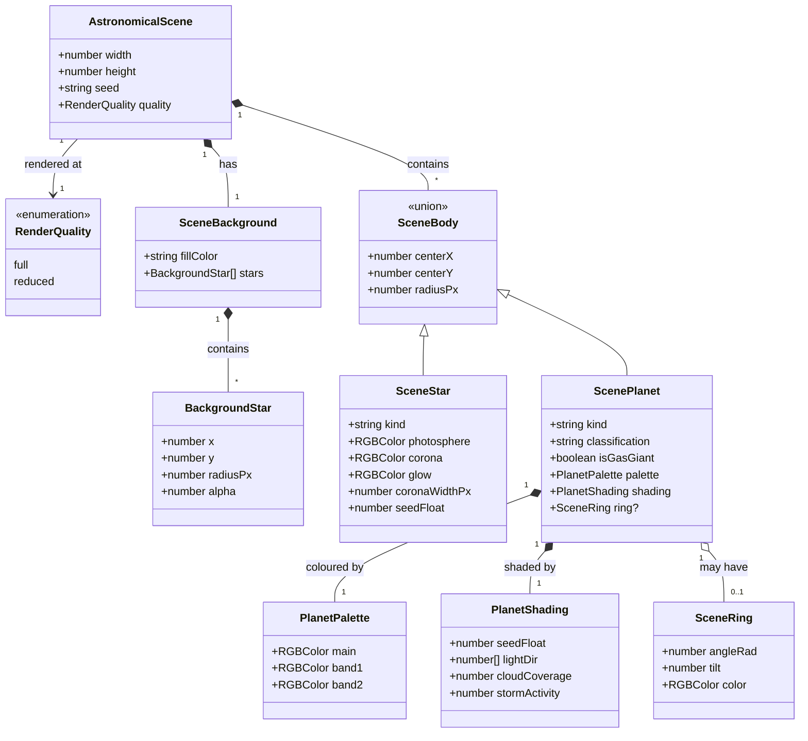
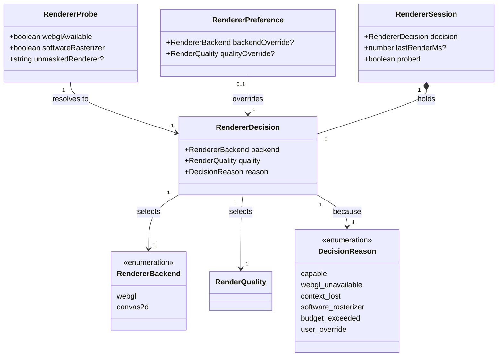

# Rendering astronomical previews

This design document covers `src/lib/renderers`: how a planet, star, or star system becomes a
preview image, how the site chooses between the WebGL and Canvas2D backends, and what happens when
the hardware in front of us cannot run the first one well.

It exists because the library has three problems that are all the same problem wearing different
hats — the two backends duplicate the arithmetic that decides what a picture contains, and nothing
holds them to the same answer.

**Status:** accepted 2026-08-01; **implemented**. All six steps of [the plan](#the-plan) have
landed: the divergence bug is closed, backend selection is automatic, the previews are checked as
images, and `renderers` is out of the coverage debt register. Step 5 amended decision 4 and added a
fourth testing tier; both are recorded below.

The golden-image baselines have been generated from CI and committed, so every tier the document
describes is live. The [domain model](#domain-model) went through one round of review (#115), which amended the
diagrams and settled the two questions the first draft had left open as decisions 5 and 6. It has
taken one amendment since, `SceneStar.seedFloat` in step 3, described where the diagram declares it.

Issue #95 (raise `renderers` coverage to 80%) was blocked on this document, because tests written
against the current shape would have cemented the duplication the plan removes. The library reached
80% with step 3 and has left `scripts/library_coverage_baseline.json`, ahead of the step 6 the plan
expected to get it there.

Amend this document rather than working around it: if implementation contradicts a diagram, the
diagram is what needs changing first.

## The problem

### The renderer toggle changes the picture

`ImageRendererSelect` offers "WebGL" and "Canvas2D" as a user-facing choice. The two backends draw
different random numbers, in a different order, from the same seed:

|                | `canvas2d_planet_renderer`                                                                  | `webgl_planet_renderer`                                                                 |
| -------------- | ------------------------------------------------------------------------------------------- | --------------------------------------------------------------------------------------- |
| RNG draw order | `seedFloat`, `lx`, cloud, storm, **up to 720 background-star draws**, ring angle, ring tilt | `randomString(13)`, `lx`, cloud, storm, `seedFloat`, ring angle, ring tilt, ring colour |
| Planet colours | `resolvePlanetCanvasTheme(classification, seed)`                                            | `getRandomGasGiantRgbTriplet(...)`, whatever the classification                         |
| Ring colour    | `randomRingRgb(seed)`                                                                       | three floats off the main RNG                                                           |
| Ring tilt      | `rng.float(0.15, 0.45)`                                                                     | `rng.float(0.1, 0.4)`                                                                   |

The same seed therefore produces a different planet depending on which backend drew it — a
different palette, and, because Canvas2D consumes the RNG for background stars part-way through,
different ring geometry too.

Two details sharpen this. `sprinkleStars` draws **four** floats per star — x, y, alpha, radius — so
the desync is up to 720 draws, not 180. And the count is
`Math.min(180, Math.floor((width * height) / 900))`, which means **the offset depends on the canvas
size**: the same seed at two different preview dimensions produces different ring geometry from the
same backend. Ring tilt diverges independently of all of that, on range rather than on ordering
(`0.15–0.45` against `0.1–0.4`), so aligning the RNG sequence alone would not have made the two
agree.

The star-system renderers have the same split; `star_system_layout.ts` records the situation in its
own doc comment, that it "mirrors placement math in `webgl_star_system_renderer` for consistent
previews". The mirroring is manual, and manual mirroring drifts.

This matters because the toggle is not an aesthetic choice. It is there so the site keeps working
on hardware that cannot run WebGL — which means the two backends are meant to show **the same
thing**, at whatever fidelity the machine can manage.

### The fallback is slower than the thing it falls back from

`drawPlanetSpherePatch` shades every pixel of the disk in JavaScript on the main thread. Each pixel
calls `calcNormalFromMap`, which calls `fbmMap` six times; each `fbmMap` runs six octaves of eight
lattice hashes; each hash is a `Math.sin`. That is 288 `Math.sin` calls per pixel from the bump-normal
pass alone, before the surface itself: the terrestrial path adds three more `fbm` calls at five, four
and three octaves, and the gas giant path adds five. Call it three hundred as a floor, not an
estimate.

Measured on two developer machines — neither of them the weak hardware this path exists to serve:

| Body        | Disk radius | Pixels  | Time (1) | Time (2) |
| ----------- | ----------- | ------- | -------- | -------- |
| Terrestrial | 200px       | 125,629 | 1.0 s    | 1.1 s    |
| Gas giant   | 200px       | 125,629 | 1.4 s    | 2.0 s    |
| Gas giant   | 320px       | 321,657 | 3.4 s    | 4.7 s    |

Both columns come from driving `shadePlanetDiskPixel` directly over the disk, so they measure the
shading and nothing else. The pixel counts are identical because the disk is the same; the spread
between columns is ordinary hardware variation, and it runs in the wrong direction — the second
machine is a current developer laptop.

That is per planet, synchronously, blocking the UI. `canvas2d_star_system_renderer` loops over every
planet in the system, so an eight-planet system is a multi-second freeze. On a low-end device,
multiply by three to ten.

WebGL on the same machine — including when it falls back to software rasterization through
SwiftShader or llvmpipe, which is what a machine without a usable GPU actually runs — executes the
same maths as compiled native code across parallel fragments. The fallback is very likely slower
than what it replaces, on exactly the hardware it was built for.

The e2e configuration already half-knows this: WebGL pages get a 90s test timeout and a 30s button
timeout, against 45s and 15s for everything else.

### The coverage gate cannot see what is verified

The Playwright suite loads `/planet`, `/star-system`, and `/star-nation` in Chromium at pinned
seeds, so the WebGL path is exercised in a browser. But `expectGeneratorOutput` only asserts that an
`img` or `canvas` is visible — a shader that renders solid black passes. And
`scripts/check_library_coverage.ts` reads Vitest output only, so none of that browser exercise
reaches the gate. `renderers` reports 37% while the truth is: the maths is unit-tested, the
orchestration is smoke-tested in a browser, and nothing checks the pixels.

Since this document was drafted, that browser exercise has also moved: the suite no longer runs on
a pull request, only on merges to `main` (`.worktree/workflows/e2e.yaml`). So the smoke test now
happens _after_ a change lands rather than before it. That does not change what this document
proposes — it makes the case for it sharper, because the tier that would catch a black shader is
now the tier furthest from the person who broke it.

## Two failure modes, not one

The toggle conflates two situations that need different answers.

**WebGL is unavailable.** Context creation fails, the extension is blocked, the context is lost.
Canvas2D is the only option and slow beats nothing. This is a genuine backend fallback.

**WebGL works, but the GPU is weak.** Swapping to a per-pixel JavaScript loop makes it worse. The
right response is less work — fewer pixels, fewer octaves — not a different backend.

The principle this document adopts:

> **Backend choice is a capability question with one right answer. Quality is a budget question with
> a dial.**

## The shape of the solution

### One scene, two backends

A pure function builds an **`AstronomicalScene`**: plain data describing what the picture contains —
background fill, background star positions, body centres and radii, colours, shading parameters,
ring geometry. Both backends consume that scene. Canvas2D walks it issuing context calls; WebGL
walks it building meshes and uniforms. Neither computes anything the other might compute
differently.

This is the display-list separation that Skia (`SkPicture`) and Flutter (`SceneBuilder`) use, and it
buys three things at once:

- The backends agree by construction rather than by discipline, which fixes the divergence above.
- Roughly two hundred lines of untestable orchestration become a pure function returning data.
- The quality tier has somewhere to live that is not duplicated across six renderers.

Background stars are carried as an array of positions rather than as a count to be re-rolled. It is
a few hundred small objects, it is what makes the two backends identical rather than merely similar,
and it removes the RNG-ordering hazard entirely.

### Choosing a backend is automatic

Selection stops being a question the user is asked first:

1. Probe once: `canvas.getContext('webgl2') ?? canvas.getContext('webgl')`. Failure resolves to
   Canvas2D with no user involvement.
2. Inspect `WEBGL_debug_renderer_info` → `UNMASKED_RENDERER_WEBGL`. A string containing
   `SwiftShader`, `llvmpipe`, `Software`, or `Microsoft Basic Render` means CPU rasterization, which
   starts the quality tier at `reduced` — it does **not** switch backends.
3. Time the first render. Over budget drops a tier and remembers.
4. Listen for `webglcontextlost` and re-resolve at runtime.

The manual control stays, demoted to an override for when detection guesses wrong.
`astronomical_renderer_storage.ts` already persists a choice; it persists the wrong thing today, a
backend name rather than a resolved decision.

### Degrading means less work, not different work

`reduced` quality renders at half linear scale and upscales — a quarter of the fragments — and drops
the bump-normal pass. It applies to both backends, because a weak GPU and a weak CPU both benefit.

### The Canvas2D planet path gets simpler, not faster

Per-pixel FBM shading is removed from the fallback. Planets are drawn the way
`canvas2d_star_draw.ts` already draws stars: radial gradients for the lit limb and terminator, a
banding overlay for gas giants, rings as the existing stroked ellipse. Microseconds instead of
seconds, and visibly simpler — which is what a fallback should look like.

`planet_canvas_surface_shade.ts` is not deleted. It stops being the mandatory fallback path and
becomes an optional high-fidelity Canvas2D mode, available where someone wants an offline or
GPU-free render and can wait for it. It keeps its tests.

## Domain model

The types this document implies, stated as types. What a diagram declares here is what the
corresponding `*-types.ts` file declares in code.

Two diagrams: the scene, and the capability decision. They version separately and read badly
together.

Field names are TypeScript. A trailing `?` marks an optional field and `[]` an array; `lightDir` is
an `[number, number, number]` tuple, which Mermaid has no spelling for. **These are types, not
classes** — CODE_STYLE.md rules classes out. Mermaid's only "is a" arrow is `<|--`, so it stands for
a discriminated union here, never for `extends`.

That last point needs care where a union has fields of its own, because TypeScript has no such
thing: a union cannot declare shared members for its variants to inherit. Where a diagram shows
fields on a union box and `<|--` arrows beneath it, the code shape is a base type intersected into
each variant, and the union is over the results:

```ts
type SceneBodyBase = { centerX: number; centerY: number; radiusPx: number };
type SceneStar = SceneBodyBase & { kind: 'star' /* … */ };
type ScenePlanet = SceneBodyBase & { kind: 'planet' /* … */ };
type SceneBody = SceneStar | ScenePlanet;
```

`SceneBodyBase` is not drawn as its own box because it is a spelling device, not a concept — it has
no meaning apart from the two variants that use it.

### The scene

Everything a backend needs, and nothing about how to draw it. `RGBColor` is the existing
`$lib/graphics/rgb_color`.

Note what is deliberately absent: there is no star-system type. A system's layout — the unit
arithmetic in `computeStarSystemLayout`, the ordering of stars before planets — resolves to absolute
positions inside the builder and does not survive into the scene. That is the point of a display
list. A backend that could see `totalUnits` would be able to do its own arithmetic with it, which is
how the two backends drifted apart in the first place.



`SceneStar.seedFloat` was added while step 3 was being built, and is the one amendment this diagram
has taken since it was approved. A star's _colours_ follow from its surface temperature and need no
seed, which is what the note below meant in saying stars need none — but the star shader also
rotates its plasma convection and corona flares from a seed, and with nowhere in the scene to carry
it the WebGL backend drew that number itself, from whichever RNG was to hand. That is the same
shape of divergence as the rest of this document, so the number belongs here. It is seeded from the
star's own ordinal, exactly as a planet's is, and the Canvas2D backend has no surface detail to
rotate and ignores it.

`kind` is the discriminant, `'star'` or `'planet'`. `isGasGiant` is resolved once by the builder
rather than each backend re-deriving it from `classification`, which is how the WebGL path came to
hand gas-giant colours to terrestrial planets.

Resolving it once narrows the blast radius but does not fix what is underneath:
`isGasGiantPlanetClassification` is `classification === 'gas giant planet'`, an exact string match
against a value produced elsewhere. Renaming that classification would silently shade every gas
giant as terrestrial, with nothing failing. Moving the check into the builder at least gives it one
call site and a unit test that names the string; a stricter fix — a classification union rather than
a bare `string` on `SceneBody` — is worth considering when `astronomical_bodies` is next opened, and
is out of scope here.

### The capability decision

What the site knows about the machine, what it decided, where that decision lives, and what survives
the tab closing. Those last two are different questions and the first draft of this diagram ran them
together; see decision 6.



`reason` is carried so the settings UI can say _why_ — "Canvas2D, because WebGL is unavailable" is a
different message from "Canvas2D, because you chose it" — and so a bug report can tell them apart.

`RendererSession` is the runtime holder: one module-level value in `renderer_decision.ts`, resolved
on first use and re-resolved on `webglcontextlost`. `RendererPreference` is the persisted half, and
holds only what a person chose. Nothing measured is persisted — see decision 6.

## Decisions taken here

### 1. The backends agree on composition, not on pixels

Exact pixel equality between a GLSL shader and a JavaScript reimplementation is not achievable, and
under the simplification above it is not even attempted. The contract is: **same layout, same
palette, same ring geometry, same light direction, same background stars.** Shading detail differs
and is expected to.

This is what makes the contract testable. Cross-backend equality is asserted on the _scene_ — plain
data, exact comparison, free — and never on the images.

### 2. Selection is automatic; the control becomes an override

Asking a user whether their GPU is any good is asking them to debug the site. The probe answers the
part that has a right answer, the budget answers the part that does not, and the control remains for
the cases both get wrong.

### 3. The Canvas2D planet path is simplified rather than optimised

Optimising it — half-scale rendering, cached normals, a Worker with `OffscreenCanvas` — was
considered and rejected as the primary route. It is real work for a path whose entire purpose is to
be cheap, and it would leave the expensive shape in place for someone to reintroduce on the main
thread later. Gradient shading is a tenth of the code and roughly four orders of magnitude faster.

The high-fidelity path survives as an option, so the fidelity is not lost — only its position as the
default fallback.

### 4. GPU submission leaves the coverage denominator only once golden tests exist

There is a real distinction the config should state: a baseline entry says "this is untested debt";
a `coverage.exclude` says "this is verified by a different suite". The second is honest **only if
the other suite exists**. So the sequencing is that suite first, exclusion second, never the
reverse. Everything else in `renderers` clears 80% on its own once the scene builder lands, because
the scene builder is where the logic will be.

**Amended in step 5.** The suite that makes the exclusion honest is the pixel-assertion tier, not
the golden-image one. Goldens depend on a baseline generated by CI and committed by hand, so
`webgl_scene_draw.ts` would be excluded on the strength of files that might not exist yet and that
nothing forces anyone to regenerate. The pixel assertions have no such dependency: they run on
every merge, they fail on a backend that has stopped drawing, and there is nothing to keep up to
date. Step 6 may therefore proceed on the strength of `e2e/preview_pixels.spec.ts`, and the
exclusion comment should name that file. Goldens remain wanted, for the regressions that are
subtler than "nothing was drawn".

The exclusion must be **file-scoped, never directory-scoped** — the specific modules that submit to
the GPU and nothing else. A directory-wide exclusion would silently swallow every future file added
beside them, which turns the one honest use of `coverage.exclude` into the loophole the coverage
gate exists to prevent.

### 5. Render entry points stay synchronous, and the image-handle change is out of scope

Capability detection needs the pipeline to be **stateful**, which it is not today, and that is
easily confused with needing it to be **asynchronous**, which it does not. Probing is synchronous
(`getContext`, then one extension read). Only context loss is an event, and it is handled by
invalidating `RendererSession` and asking the caller to render again — not by making every render
return a promise.

So `renderPlanetPreviewImage` and its two siblings keep their current shape and keep returning a
data URL. This matters because the tidy-up below floats replacing that string with a `Blob` or
`ImageBitmap`, and both are async APIs (`canvas.toBlob` is callback-based, `createImageBitmap`
returns a promise). Taking that on here would turn a rendering-correctness change into an
async-refactor of three Svelte components and their e2e coverage, for a benefit — memory — that
nobody has yet shown to be a problem in this app.

The base64 weight is real and worth revisiting. It is a separate piece of work with a separate
justification, and folding it in would make this one harder to review and harder to revert.

### 6. Persist what a person chose; recompute what a machine measured

The first draft of the capability diagram put `lastRenderMs` on `RendererPreference`, the type that
goes to `localStorage`. That is wrong in a way worth recording. A render timing is a fact about a
machine at a moment — thermal state, what else held the GPU, whether the tab was backgrounded — and
persisting it lets one unlucky first render pin a capable machine to `reduced` quality permanently,
with no way for the user to discover why.

So the split is: `RendererPreference` persists only `backendOverride` and `qualityOverride`, both of
which a person set deliberately and can unset the same way. `RendererSession` holds the resolved
decision and the timing, lives for the page session, and starts over on reload. Re-probing costs one
`getContext` call.

This also keeps `astronomical_renderer_storage.ts` honest about what it is: a record of a choice,
not a cache of a measurement.

## Testing strategy

Three tiers, matching what the code actually is:

1. **Unit** — the scene builder and the existing maths modules. Assert numbers: layout positions,
   scaling curves, palette resolution, background star counts, ring geometry. This is where the
   coverage lives and it should be high.
2. **Draw-call structure** — a recording `Proxy` context, the technique used in
   `src/lib/dungeon/render/classic_module_map.test.ts`, over the Canvas2D backends. No DOM, no
   jsdom; asserts that a scene produces the expected sequence of draws.

   The WebGL side gets the same treatment against its **uniforms**: build the uniform object from a
   scene and assert it, without a GL context. Without this, tier 2 covers one backend and the
   scene-equality test below covers the handover, but a backend that quietly ignores a scene field
   it was handed goes unnoticed — which is the exact class of bug this whole document is about.

3. **Golden images** — Playwright `toHaveScreenshot` on a handful of representative outputs at
   pinned seeds with a tolerance for GPU variance. This is the only tier that catches "the shader
   renders black".

   Goldens are generated **in CI and committed from CI's output**, never from a developer machine.
   CI renders through SwiftShader while a developer machine renders on a real GPU, and a baseline
   captured on one will not match the other at any tolerance loose enough to still catch a black
   frame. A local `--update-snapshots` is how this tier becomes permanently red and then disabled.

   Note that this tier runs only on `main`, since the browser suite no longer runs on a pull
   request. It therefore reports a regression rather than preventing one, and `npm run verify:all`
   before merging is what stands in for it. That is a weaker guarantee than this document assumed
   when it was drafted, and it is an argument for putting as much as possible into tiers 1 and 2 —
   which run on every pull request — rather than leaning on the images.

4. **Pixel assertions** — the tier this document did not have, added in step 5 and described in
   the finding below. Properties of the produced image rather than a comparison with a stored one:
   something is lit, it is where the scene put it, the sky is dark, the image is not one flat
   colour. No baseline, so nothing to drift between machines, and it is what actually catches "the
   shader renders black" on every merge.

Plus one contract test that is neither: for a set of seeds, build the scene once and assert both
backends were handed the identical object.

### Finding: what a golden-image tier can and cannot be held to here (step 5)

Step 5 asked first whether a stable baseline is achievable at all before writing a suite. Measured,
on a machine whose headless Chromium rasterizes through SwiftShader exactly as CI does:

- **The renderers are deterministic.** The same seed rendered in five separate browser launches
  produced byte-identical output, on both backends and both quality tiers.
- **Two of the pages were not.** `/star-system` drew a fresh RNG value for every preview seed on
  every rebuild, so changing the renderer redrew every body differently rather than redrawing it —
  the very bug this document exists to close, one layer above the library. Worse, that page and
  `/star-nation` never wired their own RNG into `getDefaultStarSystemGeneratorConfig`, which seeds
  itself from `Date.now()`: the seed control did not control the system at all. Both are fixed in
  step 5, and the pinned-seed mobile tests were quietly not pinned until then either.
- **What the experiment could not answer from a developer machine** was whether a baseline rendered
  by CI's CPU matches one rendered by another. That is why the loop runs through CI and why the
  suite skips rather than writes when a baseline is absent.

  **Answered, once the first baselines existed:** CI's five images and a regeneration on a
  developer machine are **byte-identical** — not merely inside the tolerance, the same SHA-256 for
  every file. Both are Linux x86-64 running the Chromium that `@playwright/test` pins, rasterizing
  through SwiftShader, which is evidently enough to make the output reproducible. That is one pair
  of machines rather than a general law: an ARM developer machine has not been tried and might
  well differ, and the tolerance is there for exactly that case.

  The practical consequence is the good one. A local `npm run verify:all` runs these goldens
  against CI's baselines and passes, so the tier does not become a thing developers have to skip.
  It also sharpens the rule against regenerating locally: a local run _should_ produce identical
  bytes, so a local diff is a signal about the code, never noise about the machine — which is
  precisely why overwriting the baseline to make it go away is the wrong move.

So the tier is built and, since the first baselines landed, live:
`e2e/preview_goldens.spec.ts` asserts where a committed baseline exists and skips where none does,
and `.worktree/workflows/goldens.yaml` produces them on demand — pushing a branch rather than an
artifact, because this host has no artifact service at all.
Its tolerance (0.2% of pixels) was chosen against evidence rather than by taste — a deliberately
injected regression that stopped the WebGL backend drawing bodies moved 18% of pixels, two orders
of magnitude clear of it.

The finding that changes this document, though, is that **the golden tier was never the only way to
catch a black frame**, and it is the more fragile of the two ways. Asserting properties of an image
needs no baseline, no CI round trip, and no tolerance for another machine's floating point. That is
tier 4 above, it runs on every merge today, and it caught the injected regression exactly as the
goldens did.

## Tidy-ups folded in

- `svg-to-png.ts` moves out of `renderers` — it is a download utility, not an astronomical renderer.
  It also never calls `revokeObjectURL`, leaking a blob URL per invocation, and throws inside an
  `onload` handler where nothing can catch it. Both are fixed on the way past. **Done in step 6:**
  it is `$lib/download/svg_to_png.ts` now, snake_case as CODE_STYLE.md asks, returning a promise so
  a failure to rasterize reaches whoever asked for the file.
- `rgbaCss` is defined identically in `canvas2d_planet_draw.ts` and `canvas2d_star_draw.ts`.
  `rgbColorToVector3` is defined twice — in `webgl_star_renderer.ts` and
  `webgl_star_system_renderer.ts` — and `vectorTripletFromRgbTriplet` in `webgl_planet_renderer.ts`
  is the same idea a third time, over a triplet. One home each, three copies down to one.
- `ringSemicircleAngles` and `ringBackHalfIsHalfZero` are real geometry, currently private inside a
  canvas module and reachable only through a context. They move to the scene builder, where they are
  ordinary testable functions.
- `renderers` has neither an `index.ts` nor a README, against the convention in CLAUDE.md that every
  directory under `src/lib` carries both — 69 of 88 libraries have the index today. A change that
  reorganises the whole library is the moment to add them, not a later tidy-up nobody schedules.
- `render()` returns a base64 data URL, and a 1024px PNG as a string in Svelte state is heavy.
  Per decision 5 this is **not** changed here; it is recorded as known and deferred, because the
  `Blob`/`ImageBitmap` alternatives are async and would drag an unrelated refactor into this one.

## The plan

Ordered so each step is independently mergeable and green.

1. **Scene types and builder.** `astronomical_scene.ts` plus `astronomical_scene_types.ts`, built
   from the diagrams above, with unit tests. `computeStarSystemLayout` becomes an internal step of
   the builder rather than a module the renderers call: its `baseUnitWidth`/`totalUnits` are working
   values, and what leaves the builder is absolute `centerX`/`centerY`/`radiusPx` per body. The
   library's missing `index.ts` and README land here too, since this step defines what the public
   surface is.
2. **Canvas2D backends consume the scene.** Includes the simplified planet path from decision 3.
   Draw-call tests land with it.
3. **WebGL backends consume the scene.** The cross-backend scene-equality test and the uniform-
   structure tests land here, and the divergence bug closes.
4. **Capability detection and quality tiers.** `RendererProbe`, `RendererDecision`,
   `RendererSession`, automatic selection, `webglcontextlost` handling; `ImageRendererSelect`
   becomes an override and `astronomical_renderer_storage` persists overrides only, per decision 6.
   Render entry points keep their synchronous signatures, per decision 5.

   Two things this step settled that the plan had left open. The **timing budget** is one preview at
   400ms — a still image someone waits on with nothing else happening, so the line sits where the
   wait stops reading as "drawing" and starts reading as "stuck"; it is deliberately not a frame
   budget. And a **backend override is honoured only where the machine can honour it**: forcing
   WebGL on a browser without it would trade a working picture for a broken one, so the probe wins
   and `reason` keeps saying `webgl_unavailable` so the UI can explain why the override did not
   take.

5. **Golden images** in Playwright, generated from CI — which now means the `main` run, not a
   pull request one. Delivered with a fourth tier beside it, the pixel assertions, after the
   stability work this step began with found the pages nondeterministic and the renderers not. See
   the finding under [testing strategy](#testing-strategy).
6. **Coverage exclusion** for GPU submission files — file-scoped, with the comment explaining what
   covers them. `renderers` left `scripts/library_coverage_baseline.json` in step 3 rather than
   here: moving everything but the GPU submission itself into pure functions carried the library
   past 80% on its own, so what remained for this step was the exclusion, not the debt entry.

   Landed as one file, `src/lib/renderers/webgl_scene_draw.ts`, excluded in `vite.config.js` with
   the comment naming `e2e/preview_pixels.spec.ts` as what covers it instead — per the amendment to
   decision 4 above, which moved that claim off the golden images and onto the tier that runs on
   every merge. `renderers` finishes at **94.7% lines and 100% functions**. The `svg-to-png.ts`
   tidy-up came with it, since a download utility sitting in this library was 15 of the lines the
   exclusion would otherwise have been asked to explain.

Steps 1 through 3 are the ones that fix a live bug. Steps 4 through 6 are what make it stay fixed.
