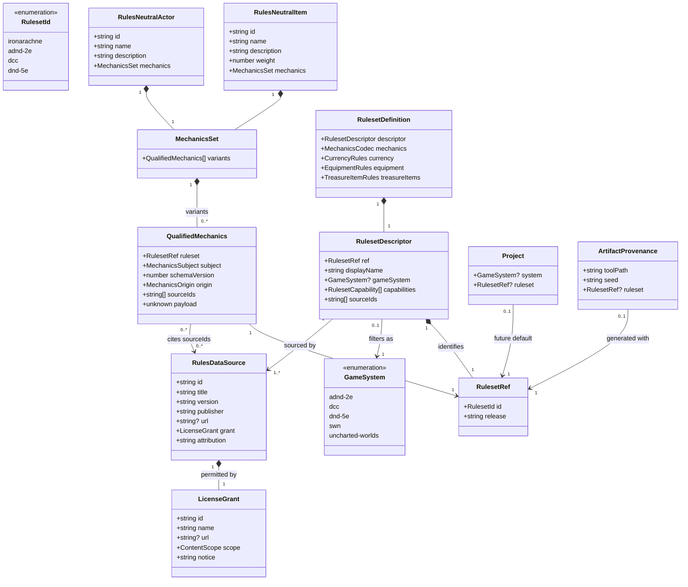
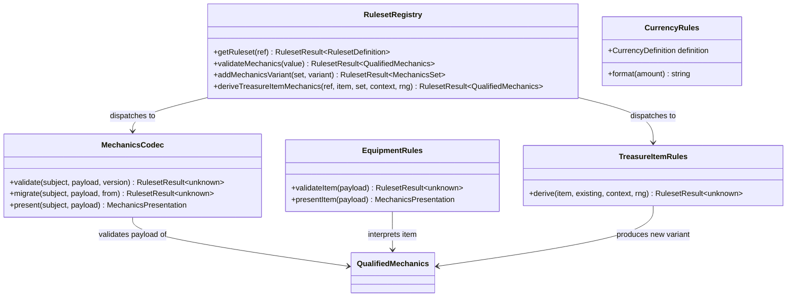
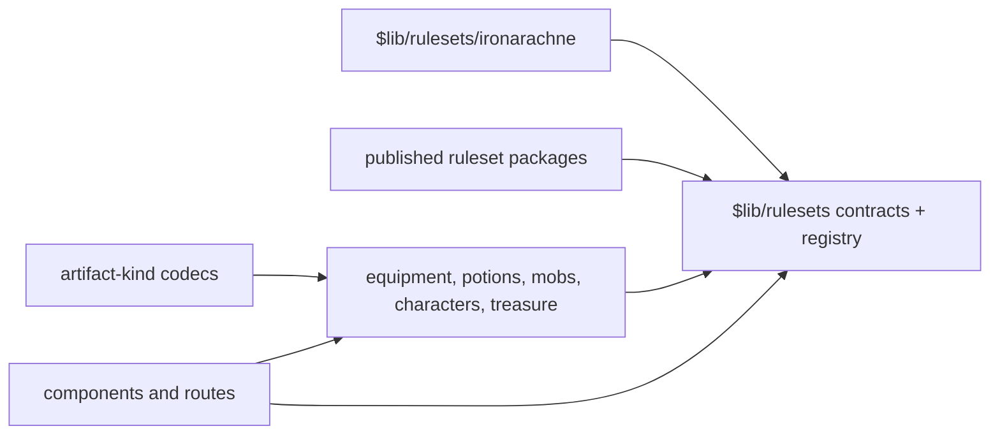

# Rules-system abstraction

This design document defines the contract by which Iron Arachne identifies a tabletop ruleset,
stores mechanics belonging to that ruleset, and asks ruleset-owned code to interpret or derive
combat, magic, currency, equipment, and treasure-facing item mechanics.

It designs [#205](https://github.com/ironarachne/ironarachne/issues/205) and is the prerequisite
for the system-specific treasure work in
[#172](https://github.com/ironarachne/ironarachne/issues/172).

**Status:** accepted; not yet built. The [domain model](#domain-model) was reviewed and approved on
2026-09-04. Implementation may proceed through the [staged plan](#staged-implementation-plan).

## The problem

`$lib/combat_system` and `$lib/magic` describe themselves as common tongues, but their values are
not merely descriptions. A six-number `CombatProfile`, a `CombatAction`, a spell magnitude, and a
spell duration are rules. They are stored in items and potions and consumed by mobs, archetypes,
creatures, and characters. The combat converter then interprets the common profile using D&D 5e
assumptions, while the default fantasy currency is explicitly 5e-shaped.

That makes the current model neither truly generic nor honestly system-specific. Adding an AD&D
2E armour class, a DCC weapon entry, or a 5e potion by converting the current numbers would lose
rules the common model cannot express. Changing a project's system would also risk silently
reinterpreting saved work that a user may already have edited.

The answer is not a larger universal combat profile. No common record can losslessly express
descending armour class, DCC's dice chain, 5e attunement and recharge, and every future system
without becoming an untyped copy of all of them. The common layer owns facts and prose; each
ruleset owns its mechanics.

## Goals

- Give supported rulesets stable, versioned identities.
- Keep descriptive facts usable by system-neutral generators.
- Store system mechanics without forcing them through a lowest-common-denominator schema.
- Let one item or actor retain mechanics for more than one ruleset.
- Make transformation additive and explicit, never an effect of changing a project setting.
- Preserve every existing generic payload as Iron Arachne generic mechanics.
- Record enough source and licence provenance to audit shipped rules data and produce attribution.
- Give #172 one deterministic entry point for adding treasure-facing mechanics to an item.

## Non-goals

- Implementing AD&D 2E, DCC, or 5e rules data in this issue.
- Choosing or transcribing the treasure tables owned by #172.
- Translating arbitrary characters or spells losslessly between published systems.
- Turning project system selection into a migration command.
- Treating a whole rulebook, setting, trademark, or body of flavour text as open merely because
  some mechanics or an SRD are usable.

## Vocabulary

Four names that look similar have different jobs.

- A **game system** is the tool catalog's filtering vocabulary: `adnd-2e`, `dcc`, `dnd-5e`, `swn`,
  or `uncharted-worlds`. It answers which tools belong in a project's browser.
- A **ruleset id** selects executable mechanics: initially `ironarachne`, `adnd-2e`, `dcc`, and
  `dnd-5e`. `ironarachne` names the current generic model and is deliberately not a game-system
  filter.
- A **ruleset release** pins one compatible body of rules data, such as the 5e SRD 5.1 package. It
  is an opaque stable string, not a floating `latest` alias.
- A **mechanics schema version** versions Iron Arachne's stored representation for one ruleset. It
  changes when our TypeScript payload changes; a ruleset release changes when its external rules
  data changes. Neither substitutes for an artifact kind's `payloadVersion`.

Together, `RulesetRef { id, release }` is the durable identity written into projects, provenance,
and mechanics. The authored catalog is closed: code may only create one of the ids and releases it
registers. Stored data is tolerant in the same way artifact kinds are tolerant: an unknown ref is
retained and exportable but quarantined from interpretation rather than coerced to a known system.

## The shape of the solution

### Common facts and qualified mechanics

Items, potions, and actors retain the fields a system-neutral generator can state without applying
a game's rules: identity, name, prose description, physical dimensions, material, appearance,
sensory details, and tags. A rarity label may remain descriptive when it is authored as prose; a
roll-table weight or item tier belongs to mechanics.

Rules values live in a `MechanicsSet`, containing zero or more `QualifiedMechanics` variants. A
variant carries its ruleset ref, our schema version, origin, source references, and an opaque
payload. The payload is opaque at the shared boundary for the same reason artifact payloads are
`unknown`: only the registry entry that owns a shape may validate and interpret it.

There is no central discriminated union of AD&D, DCC, and 5e payload types. Such a union would make
every new system a change to every consumer. A ruleset package exposes its concrete types inside
its own library and erases them only at the registry boundary.

A `MechanicsSet` may contain at most one variant for a `RulesetRef`. This allows an Iron Arachne
generic sword to acquire AD&D 2E and DCC variants without losing the source profile. Attempting to
derive a target variant that already exists returns a conflict. Replacing it is a separate,
explicit editor action.

### Mechanics categories

The shared envelope uses a `subject` discriminator rather than optional combat, magic, currency,
and equipment fields in one bag:

```ts
type MechanicsSubject = 'actor' | 'item' | 'potion' | 'spell' | 'hoard';
```

One ruleset owns the whole mechanically coherent payload for that subject. A 5e weapon's attack,
damage, properties, price, and attunement requirements belong together; splitting them into four
independently replaceable fragments permits combinations that the ruleset never defined. Ruleset
code may use smaller internal combat, magic, currency, and equipment types, but that composition is
private to the package.

Currency definitions are catalog data owned by a ruleset. A price in qualified item mechanics
refers to a denomination id from that definition. Physical coins inside a hoard remain item facts
plus ruleset-qualified denomination/value mechanics; they are not silently converted when displayed
under another system.

### The ruleset registry

`$lib/rulesets` owns only contracts, the catalog, validation, and resolution. Published-system
implementations live in `$lib/rulesets/adnd_2e`, `$lib/rulesets/dcc`, and
`$lib/rulesets/dnd_5e`; the current normalized model moves behind
`$lib/rulesets/ironarachne`. Domain libraries depend on `$lib/rulesets`, never on a published-system
package. Ruleset packages may depend on plain domain snapshot types, but never on components,
routes, projects, artifacts, or the workshop.

The registry entry is an aggregate, so one release cannot accidentally combine 5e currency with
DCC item mechanics:

```ts
type RulesetDefinition<TPayload> = {
  descriptor: RulesetDescriptor;
  mechanics: MechanicsCodec<TPayload>;
  currency: CurrencyRules;
  equipment: EquipmentRules<TPayload>;
  treasureItems: TreasureItemRules<TPayload>;
};
```

`combat` and `magic` are not mandatory top-level services. They are types and helpers within the
mechanically coherent actor, item, potion, and spell payloads. A package may expose them from its
own public API when direct consumers need them. The registry's common operations are validation,
migration, presentation, and treasure-item derivation.

Capabilities on `RulesetDescriptor` state which subjects and services are implemented. Registering
`adnd-2e` before its potion support exists is therefore honest: resolution of the descriptor works,
while requesting its unsupported potion capability returns a typed `unsupported-capability`
failure.

### Additive transformation

Ruleset transformation is a derivation, not mutation. The future public operation is shaped as:

```ts
deriveTreasureItemMechanics(
  target: RulesetRef,
  item: RulesNeutralItem,
  existing: MechanicsSet,
  context: TreasureItemContext,
  rng: RNG,
): RulesetResult<QualifiedMechanics>;
```

It receives a read-only common item and the existing variants, draws only from the supplied `RNG`,
and returns a proposed target variant with warnings and source references. It does not modify the
item, delete source mechanics, rewrite prose, change value, or save an artifact. The caller adds the
variant with `addMechanicsVariant`, which refuses an existing target. Editors and artifact writers
remain responsible for explicit replacement and persistence.

This boundary is what #172 consumes. #172 owns `TreasureItemContext`, table rolls, and when the
operation is invoked; the ruleset owns how an item receives mechanics. A failure to derive mechanics
does not remove the item from a hoard. The hoard keeps the common item and records the warning.

There is intentionally no general `convertMechanics(source, target)` API. A system package may use
generic facts or inspect a known source variant as a hint, but it must return a new target payload.
Calling that a conversion would promise fidelity the model cannot provide.

### Selection and identity in stored data

The same ref appears in three places for three different reasons:

- `Project.ruleset?: RulesetRef` is a changeable default for future generator actions.
- `ArtifactProvenance.ruleset?: RulesetRef` records the default used when the artifact was first
  generated. Like the rest of provenance, it is history rather than a load path.
- Every `QualifiedMechanics.ruleset` says how that exact payload is interpreted and is authoritative
  for it.

Changing a project default changes none of its artifacts. An artifact may contain several refs, so
there is no truthful singular `artifact.ruleset` field on `ArtifactSummary`.

`Project.system` retains its current filtering role. When `ruleset` is set, its descriptor's
`gameSystem` must equal `project.system`; selecting a ruleset sets that filter too. Clearing a
ruleset leaves the filter in place. Changing the filter to a different system clears the default
ruleset after confirmation but never touches artifacts. A project may continue to have a system
filter and no executable ruleset.

`dnd-5e` is added to `SYSTEMS` and its display-name mapping. Tools with that system tag participate
in the existing `system:` tag filter exactly like AD&D 2E and DCC. Ruleset refs never become tags;
release versions are mechanics identity, not catalog discoverability.

## Domain model





The first diagram models durable nouns. The important cardinality is one common entity to one
`MechanicsSet` to many qualified variants. The same item can remain readable as Iron Arachne generic
content and gain a published-system interpretation without either impersonating the other.

The second diagram is behavior, separated to keep opaque payload dispatch out of the persisted
model. It does not imply that every ruleset implements every capability.

## Rules-data provenance and licensing

A ruleset name is not a licence. Every shipped data row or algorithm derived from an external
source cites one or more stable `RulesDataSource.id` values, and every source has a checked-in
manifest recording the exact work, version, publisher, URL when available, licence or other grant,
required attribution/notice, and the scope approved for use.

The source scope is one of:

- `mechanics`: independently expressed procedures and numerical relationships only;
- `open-content`: text or data expressly designated as open by the named licence;
- `permission`: content covered by separate written permission and its conditions;
- `original`: Iron Arachne-authored material with no external rules-data dependency.

No `unknown`, `fair-use`, or “compatible with” scope may pass the rules-data gate. A source can be
registered for research without being `redistributable`; only redistributable sources can back
production data. Required notices are assembled from the source ids actually reachable from a
ruleset release, deduplicated, and included in the application's third-party notices and exported
vault metadata.

The legal baseline for the first three packages is deliberately narrower than their names:

- **AD&D 2E:** this design accepts the project owner's premise, supported by the general rule that
  game procedures and systems are not protected as expression, that the mechanics may be
  independently expressed using appropriately open material. That does **not** designate TSR/Wizards
  rulebook prose, art, setting material, named characters, trade dress, or an entire AD&D book as
  Open Game Content. Each implementation source still needs an OGL/open-content declaration or an
  `original` mechanics-only expression before it ships.
- **Dungeon Crawl Classics:** DCC uses its own third-party publishing permission/compatibility
  programme. It is not treated as if the 5e SRD grant applied to it, nor does compatibility
  permission automatically permit copying core tables. The DCC manifest must record the accepted
  Goodman Games terms and any approval or attribution they require before DCC data is enabled.
- **D&D 5e:** the first release is pinned to SRD 5.1 under CC BY 4.0. Only material actually in that
  SRD is available through that source; non-SRD books, settings, characters, and product identity
  remain out of scope. A later SRD 5.2 release is a separate `RulesetRef`, not an in-place edit.

The distinction follows 17 U.S.C. 102(b) and game-rules cases without pretending those authorities
place protected expression under the OGL. The U.S. Copyright Office publishes
[section 102](https://copyright.gov/title17/92chap1.html), and _DaVinci Editrice v. Ziko Games_
distinguishes unprotected rules and procedures from protected expression in its
[2014 opinion](https://law.justia.com/cases/federal/district-courts/texas/txsdce/4%3A2013cv03415/1134359/44/)
and [2016 opinion](https://law.justia.com/cases/federal/district-courts/texas/txsdce/4%3A2013cv03415/1134359/73/).
Wizards' [SRD 5.1](https://media.wizards.com/2023/downloads/dnd/SRD_CC_v5.1.pdf) carries its CC BY
4.0 notice. Goodman Games describes DCC third-party support as a
[separate licence programme](https://www.goodman-games.com/images/dccrpg.html).

This document is an engineering policy, not a legal opinion. If the source manifest and the data
disagree, the data does not ship until the discrepancy is reviewed; uncertainty never falls back to
an expansive interpretation.

### Test fixtures

Tests follow the same source policy as production. A fixture may be:

- a minimal original construction exercising the mechanic;
- a short open-content record carrying its source id; or
- a deterministic expected result derived from permitted source data.

Fixtures do not copy whole proprietary tables “only for tests.” Golden files record Iron Arachne's
output, not scans or transcriptions. Every ruleset release has registry tests for source existence,
licence metadata, attribution assembly, capability truthfulness, codec round trips, migration, and
fixed-seed derivation.

## Compatibility and migration

### The compatibility rule

Existing generic content becomes `ironarachne` mechanics; it never becomes AD&D, DCC, or 5e by
inference. Migration copies every old mechanical field into the generic package's version-1 payload
before removing it from the common shape. It does not recompute a value, rerun a generator, resolve
a current table row, or rewrite prose.

Artifact migrations remain read-time and non-writing, as they are today. A later explicit save
writes the current shape. Unknown ruleset refs or unsupported mechanics versions quarantine the
containing artifact with its original bytes still exportable.

### Stored shapes

| Stored kind or embedded shape  | Compatibility plan                                                                                                                                                                                                                                                                  |
| ------------------------------ | ----------------------------------------------------------------------------------------------------------------------------------------------------------------------------------------------------------------------------------------------------------------------------------- |
| `item` v1                      | v2 keeps identity, prose, physical/material/refinement/decoration facts and moves `value`, `combatProfile`, `actions`, and `enchantment` unchanged into one `ironarachne` item variant. Missing mechanics produces an empty set.                                                    |
| `potion` v1                    | v2 preserves container, liquid identity/physical facts, display name, canonical name, and sensory profile. Effect, modifications, rules value, and generic magic taxonomy move unchanged into one `ironarachne` potion variant.                                                     |
| `treasure-hoard` v1            | v2 adds the `ironarachne` ruleset ref, retains `targetValue` with its existing meaning, and applies the item v1 migration to every nested item. It does not claim the hoard came from a published treasure table. #172 may add later table-roll provenance in its own payload step. |
| generic `character` v1         | v2 moves the character's `combatProfile`, `actions`, and embedded archetype caster/action mechanics into one `ironarachne` actor variant. Names, applied abilities, equipment, and user prose remain unchanged.                                                                     |
| AD&D `character.adnd-2e` v1    | v2 adds a pinned AD&D ruleset ref to the already system-owned snapshot; its existing body stays in place and no value is converted through the generic profile. Source ids are attached only after the existing data is audited—migration never invents them.                       |
| DCC `character.dcc` v1         | v2 adds a pinned DCC ruleset ref to the already system-owned snapshot; its existing body stays in place and no value is converted through the generic profile. Source ids are attached only after the existing data is audited—migration never invents them.                        |
| `Mob`, `Creature`, `Archetype` | These are live or embedded shapes rather than standalone artifact kinds. Their common contracts gain `MechanicsSet`; existing combat, action, caster, and equipment-rule fields move to the `ironarachne` actor variant.                                                            |
| character-containing artifacts | Settlement, region, organization, family, and encounter payload versions each take a composed migration that applies the generic-character or creature step recursively. Their own fields are otherwise byte-for-byte equivalent.                                                   |
| projects and provenance        | Both new fields are optional. Existing projects keep their current `system` filter and have no ruleset default; existing artifact provenance has no ruleset claim. No published system is inferred.                                                                                 |

The item migration is one exported pure helper used by standalone items, potions, and hoards. The
actor migration is likewise shared by standalone characters and every containing artifact. Copying
either migration into several kind files would guarantee they drift.

System-qualified character kinds stay distinct artifact kinds. `character.adnd-2e` does not become
a generic `character` with a different variant because its entire payload and editor are system
owned. A top-level `RulesetRef` qualifies that payload. `QualifiedMechanics` solves mechanics on
otherwise shared entities; it does not erase useful artifact-kind boundaries.

### User edits and replacement

The migrated generic variant is marked `origin: migrated`; a freshly derived variant is
`origin: generated`; an editor that changes its mechanical payload marks it `origin: user`. Origin
is explanatory, not authority: all three payloads are equally the truth once saved.

Derivation never targets an existing ref. The UI may offer “replace DCC mechanics,” but must show
that the current variant will be replaced and require the same explicit destructive confirmation
used elsewhere. Source variants and common fields are not part of that replacement. This prevents a
second system pass from overwriting a user's mechanical edits merely because the project default
changed.

## Public APIs and dependency boundaries

The future `$lib/rulesets` public surface is limited to:

```ts
RULESET_IDS
type RulesetId
type RulesetRef
type RulesetDescriptor
type RulesDataSource
type QualifiedMechanics
type MechanicsSet
type RulesetResult<T>

allRulesets(): RulesetDescriptor[]
getRuleset(ref: RulesetRef): Promise<RulesetResult<RulesetDefinition>>
validateQualifiedMechanics(value: unknown): RulesetResult<QualifiedMechanics>
migrateQualifiedMechanics(value: QualifiedMechanics): Promise<RulesetResult<QualifiedMechanics>>
addMechanicsVariant(set: MechanicsSet, variant: QualifiedMechanics): RulesetResult<MechanicsSet>
mechanicsFor(set: MechanicsSet, ref: RulesetRef): QualifiedMechanics | undefined
deriveTreasureItemMechanics(...): Promise<RulesetResult<QualifiedMechanics>>
rulesetNotices(refs: RulesetRef[]): RulesetResult<RulesDataSource[]>
```

`RulesetResult` discriminates at least `unknown-ruleset`, `unknown-release`,
`unsupported-capability`, `invalid-mechanics`, `unsupported-version`, `migration-failed`, and
`variant-conflict`. Shared consumers do not throw or cast opaque payloads.

Dependency direction is:



The registry imports definitions using explicit static dynamic imports, following `TOOL_PANELS`,
so selecting one system does not eagerly bundle every rules table. Domain libraries never import a
published package directly. `$lib/tools` keeps `GameSystem`; `$lib/rulesets` may import that type,
but `$lib/tools` must not import rulesets. `$lib/projects` may import both. This preserves the
catalog's current one-way dependency boundary.

## Decisions taken here

### 1. The authored ruleset catalog is closed and versioned

Stable ids make selection exhaustive and testable. Explicit releases prevent an old artifact from
changing meaning when source data is updated. Read tolerance preserves newer or unavailable data
without letting current code interpret it optimistically.

### 2. The tool catalog's game system and an executable ruleset are separate concepts

One filters tools; one interprets mechanics. `ironarachne` proves they cannot be the same enum, and
release versions have no place in a discovery tag.

### 3. Common models keep facts; rulesets own mechanics

There is no faithful universal combat or magic schema. Descriptive identity, prose, physical facts,
and sensory facts remain shareable; numbers whose meaning comes from a game live in a qualified
payload.

### 4. An entity may retain several mechanics variants

This is the information-preserving answer to transformation. Adding DCC mechanics need not destroy
the generic input or a user's AD&D work.

### 5. One ruleset owns a coherent payload per subject

Combat, magic, price, and item constraints interact. Independently swappable fragments would make
invalid hybrids possible and require a universal schema by another name.

### 6. Transformation is additive, explicit, and deterministic

It returns a proposed target variant from a caller-owned RNG. It never saves, replaces, or reacts to
a project-setting change. Existing target mechanics are a conflict, not an overwrite invitation.

### 7. The project stores a future default, provenance stores history, and payloads store truth

The three refs are not duplication. They answer what to use next, what was used first, and what this
value means now. Only the last interprets saved mechanics.

### 8. Legacy generic mechanics remain `ironarachne`

Rebranding old normalized values as 5e because some converters used 5e assumptions would manufacture
provenance and change meaning. The generic ruleset is a first-class compatibility package.

### 9. Licensing attaches to exact data sources, not ruleset names

AD&D rules-mechanics rulings, DCC's separate permission, and the 5e SRD grant have different scopes.
A per-source manifest can express those differences and prevents one open source from laundering
unrelated closed content.

### 10. System character artifact kinds remain system-qualified

An AD&D or DCC character is system-owned throughout, not a neutral character with one detachable
number block. The envelope is for shared/nested mechanics, not for erasing domain boundaries.

## Staged implementation plan

| Step | Work                                                                                                                                                                                                                                                                                                                        |
| ---- | --------------------------------------------------------------------------------------------------------------------------------------------------------------------------------------------------------------------------------------------------------------------------------------------------------------------------- |
| 1    | [#206](https://github.com/ironarachne/ironarachne/issues/206) adds `$lib/rulesets` types, results, source manifests, lazy registry, and contract tests with only the `ironarachne` descriptor.                                                                                                                              |
| 2    | [#210](https://github.com/ironarachne/ironarachne/issues/210) moves current combat, magic, and currency behavior behind `$lib/rulesets/ironarachne`, adding `MechanicsSet` and transitional compatibility exports.                                                                                                          |
| 3    | [#209](https://github.com/ironarachne/ironarachne/issues/209) adds reusable item/potion/actor migrations and bumps standalone plus containing artifact kinds.                                                                                                                                                               |
| 4    | [#212](https://github.com/ironarachne/ironarachne/issues/212) adds `Project.ruleset`, optional artifact-generation provenance, `dnd-5e` to the tool catalog, and selection UI without touching artifacts.                                                                                                                   |
| 5    | [#207](https://github.com/ironarachne/ironarachne/issues/207), [#211](https://github.com/ironarachne/ironarachne/issues/211), and [#208](https://github.com/ironarachne/ironarachne/issues/208) independently audit, register, and implement the AD&D 2E, DCC, and 5e SRD packages and their deterministic item derivation. |
| 6    | [#172](https://github.com/ironarachne/ironarachne/issues/172) consumes `deriveTreasureItemMechanics` and designs table-driven hoards, roll context/provenance, generator controls, and dungeon integration.                                                                                                                 |
| 7    | [#213](https://github.com/ironarachne/ironarachne/issues/213) migrates remaining direct generic-mechanics consumers and deletes compatibility exports only after `rg` finds none.                                                                                                                                           |

Steps 1–4 establish the platform without blocking unrelated system-neutral generators. The three
published packages can then proceed independently, each with its own source and licence review.
#172 may begin design against this approved contract now; its implementation needs only the
specific ruleset capability it is landing, not every combat and spell consumer migrated first.

Every step touching routes, components, or rendering runs `npm run verify:all`; every other step
runs `npm run verify`. Seeded derivation changes also take a before/after golden diff so adding a
ruleset does not silently shift existing generic output.

## Human review checklist

Approval of the domain model specifically settles:

- stable `RulesetRef` identity with separate ruleset-release and mechanics-schema versions;
- the one-common-entity-to-many-qualified-variants relationship;
- opaque, ruleset-owned mechanics rather than a cross-system union;
- source-level licence provenance;
- project default versus artifact provenance versus payload authority;
- additive transformation and explicit replacement; and
- legacy generic data remaining `ironarachne` mechanics.

Approval is recorded above. Implementation work can now be broken into the staged issues; #172 may
proceed to design against this contract, while its implementation remains dependent on the relevant
ruleset registry, persistence, and package capabilities.
