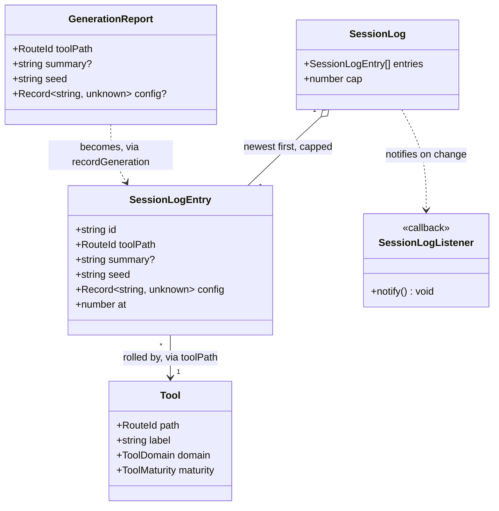
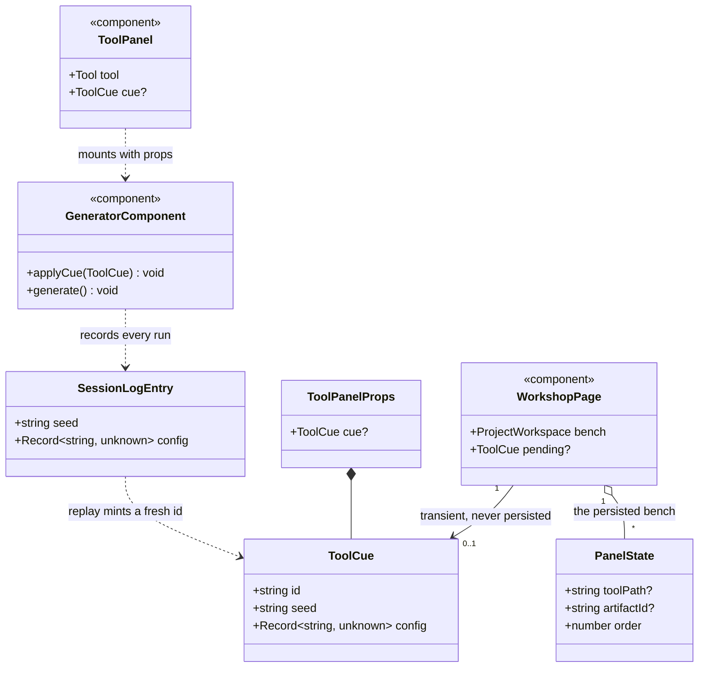

# The session log

This design document covers the **session log**: a third column in the workshop listing what the
tools on the bench have rolled since the page was loaded, so a result the user did not keep is not
lost the moment the next one replaces it. Each entry rolls its result back.

It is a small feature with one hard part, and the hard part is not the list. It is the **replay
contract** — the way a log entry reaches a tool that is already mounted and tells it to roll again
from a particular seed and a particular set of settings. Nothing in the codebase can do that today,
and the one precedent (heraldry's `?blazon=` URL cue) does not compose with panels, because the
workshop is a single route and a query parameter on it cannot say which panel it is addressing.

Designs [#80](https://github.com/ironarachne/ironarachne/issues/80). It sits inside
[the workshop](workshop.md) and uses its bench, its tool catalog, and its RNG contract.

**Status:** accepted; not yet built. The [domain model](#domain-model) was reviewed and approved, so
[the plan](#the-plan) is clear to start. What it is broken into is tracked on GitHub under the
`workshop` label, as sub-issues of #80. Nothing in [Still open](#still-open) blocks it — the three
questions there are presentation and scope, not shape.

## The problem

A generator overwrites itself. Every seeded tool on the bench rolls into the same place: press
Generate and what was on screen is gone. That is the right behaviour — a page that accumulated every
roll would be unusable — but it means the ordinary way to use a generator, rolling until something
is interesting, is also the ordinary way to lose the roll before.

Two escapes exist today and neither covers it:

- **Save it.** Four of the thirty-four tools with panels can save into a project — heraldry, culture,
  religion, settlement. Saving is also a decision made _before_ the user knows whether the next roll
  is better, which is the wrong moment to have to make it.
- **Lock the seed.** `SeedControls` holds the seed in the box across rolls. That is the seed about to
  be used, not the one that produced what is on screen: once Generate has run with a fresh seed, the
  seed behind the thing the user liked is not anywhere.

Meanwhile the RNG contract in CLAUDE.md says a generation run is fully determined by its seed and its
configuration. **Everything needed to get any roll back is small, cheap, and currently discarded.**
The session log stops discarding it.

## What this is not

Three neighbouring things already exist, and the log is deliberately none of them.

- **Not the vault.** `/vault` and the project view list what was _kept_. The log's entire subject is
  what was _not_ kept — a list that duplicated saved artifacts would be a second, worse project view,
  and would say nothing about the twelve settlements rolled and passed over.
- **Not provenance.** `ArtifactProvenance` records how a saved artifact was first made, and
  `Artifact.payload` is explicit that provenance is never a load path: the payload is the truth,
  because a user who renames a deity has made the seed stop reproducing what they have. That stance
  is untouched here, and [decision 4](#4-an-entry-restores-the-settings-and-rolls-again) says why the
  log does not contradict it — a log entry has no payload to be the truth of.
- **Not undo.** There is no editing to undo. The log is a record of runs, and replaying one is a
  fresh run that happens to be identical, not a state restoration.

## The shape of the solution

### A tool reports its runs

At the end of its `generate()`, a participating tool calls one function with the seed it rolled from,
the settings it rolled with, and a one-line name for what came out:

```ts
recordGeneration({
  toolPath: '/fantasy/settlement',
  summary: settlement.name,
  seed,
  config: rolledConfig,
});
```

Those fields already exist in every tool that saves. `SaveArtifactButton` is handed `seed` and
`config` today, and settlement in particular already assembles a `rolledConfig` that resolves "any"
choices to what was actually drawn — precisely because provenance describing settings the tool did
not use is a lie a re-roll would act on. The log wants that same value for the same reason.

`config` is `Record<string, unknown>` and the log does not interpret it. It is a courier.

### An entry on screen

The column is a list, newest first. Each entry is two short lines in a narrow column:

```
Ashvale
Settlement · 2 min ago
```

The first line is the run's `summary`, falling back to the seed when a tool has no name to give. The
second is the tool's label from the catalog and a relative time. The seed and a readable form of the
settings go in the entry's accessible name and its `title`, where they cost no width.

The label is **read from the catalog by path, not stored on the entry.** A stored copy would be a
second name for a tool that can disagree with the first.

Each entry is a `<button>`, not a link. The issue asks for "a link that goes to the tool", and inside
a single-route workshop that action is not navigation: it mounts a panel and signals it. Rendering it
as an anchor to `/fantasy/settlement` would take the user off the bench, which is the opposite of
what the log is for.

### Where it sits, and how wide

A third column, right of the bench:

| Column        | `flex`      | What it is                       |
| ------------- | ----------- | -------------------------------- |
| `__rail`      | `1 1 18rem` | Tools and the project's contents |
| `__bench`     | `3 1 26rem` | The mounted tools                |
| `__log` (new) | `0 1 14rem` | What has been rolled             |

**`flex-grow: 0` is the point of that row.** The log never takes any of the surplus width: at 1280px
the rail lands near 23rem, the bench near 41rem, and the log stays at 14rem — under a fifth of the
row, and narrower than either neighbour. Reading is all it does, and two short lines do not need
more.

Left to right the surface reads: what you can work with, what you are working on, what you have made.
The rail keeps the two lists you work _from_, which is why the log is a new column rather than a
third block underneath them — a third block would squeeze two lists already competing for one
column's height, and the log is not a thing you work from.

The column appears when the log has something in it and is absent when it does not. A fresh session
gets today's layout and the full bench, and the column arrives at the first roll — which is both the
moment it becomes useful and the moment it teaches the user it exists. An always-present empty column
would cost 14rem of bench to say nothing and offer a Clear button with nothing to clear.

**Below the wrap the column goes full width.** `.workshop__layout` wraps, so around 60rem the log
drops to its own row; left at a 14rem basis it would sit there as a stub beside empty space. It takes
`flex-basis: 100%` under that breakpoint and a shorter `--session-log-max-height`, the way the rail's
two lists already do at 48rem. This band is worth an explicit note: the mobile e2e widths are all
430px and below, where everything is stacked and full width, so **nothing in the suite looks at
900px** and the stub would ship unseen. See [the plan](#the-plan).

### Replaying an entry

Pressing an entry:

1. Mounts its tool, if a different tool is on the bench. This goes through the **existing**
   `openTool`, so the confirmation that protects a tool holding something unsaved protects it here
   too. Replay must not become a second, quieter way to throw away work.
2. Hands that panel a **cue**: the seed, the config, and an id.
3. The tool applies what it recognises of the cue and generates.

The cue is the piece that does not exist yet. `ToolPanel` mounts its component with no props and keys
on `tool.path`, so today the only way to say anything to a tool is to mount a different one. The
change is small: `ToolPanel` takes an optional `cue` and passes it down, keyed as it is now. Re-keying
on the cue instead would remount the tool — throwing away everything else in its panel and flickering
— to deliver a message the tool could simply have read.

A tool reads the cue with an effect that fires when the cue's **id** changes, not its contents:
replaying the same entry twice is two distinct requests, and comparing seeds would swallow the second.
The id is minted at replay, not taken from the entry.

The tool applies the keys it knows and ignores the rest. It cannot be handed a config from a build
with a different shape, because the log does not outlive the build — see
[decision 2](#2-the-log-lives-in-memory-and-says-so).

### Which tools participate

Reporting is **opt-in per tool**, and a tool that cannot honour a replay does not report. An entry
that cannot do the one thing the issue asks of it is worse than no entry: it is a list item that looks
like a way back and is not.

The first four are the ones that already build a seed and a settled config for provenance — heraldry,
culture, religion, settlement. The remaining twenty-three seeded generators are a per-tool job each,
and should be assumed to be one until somebody reads them: a tool that never assembled a config has to
grow one, and it has to be the config it _rolled with_ rather than the one in the controls now.

The panel skips an entry whose tool is no longer mountable, the same way the bench drops a panel whose
target is gone.

### Runs made outside the workshop

Generators are mounted both in panels and on their own routes, and the log is module state in one tab,
so a roll made on `/culture` is recorded like any other. It is only ever _shown_ in the workshop: a
tool route has no bench to replay into, and putting the column on twenty-seven generator pages is a
different feature. Client-side navigation from `/culture` to `/workshop` keeps the entries; a reload
does not, and that is the definition of the session.

## Domain model

The types this document implies, stated as types. Field names are TypeScript; `?` marks an optional
field, `[]` an array, and `Record~string, unknown~` is how Mermaid spells the generic. As in
[the workshop's model](workshop.md#domain-model) these are types, not classes.

Two diagrams: the log itself, and the replay contract that carries an entry back to a tool.

### The log



`SessionLogEntry` carries no label, no payload, and no project: the catalog owns the first, there is
no second, and a run is not a thing a project holds until somebody saves it. `at` is epoch
milliseconds, per [decision 2 of the workshop model](workshop.md#decisions-taken-here).

### The replay contract



The one thing to read carefully: `ToolCue` hangs off `WorkshopPage`, **not off `PanelState`**. See
[decision 6](#6-the-cue-is-not-part-of-the-bench).

## Decisions taken here

### 1. The log records generation runs, not saves

The alternative reads better on paper — hook `saveToolArtifact` and get every entry for free — and it
answers the wrong question. Saved work already has two surfaces that list it, and the roll a user
wants back is by definition the one they did not save. It would also cover four tools rather than
however many adopt the contract.

The cost is that every participating tool needs one call added to its `generate()`. That is the honest
price of logging something the codebase does not currently notice at all.

### 2. The log lives in memory, and says so

Not `localStorage`, not `sessionStorage`, not the `ProjectWorkspace` record. Module state, cleared by
a reload.

- It is what the issue says: "this session".
- It adds no persisted shape, so no version field, no migration chain, no change to the export format,
  and nothing new in a vault file.
- **It is what makes replay safe without versioning.** A config recorded by this build can only ever
  be replayed into this build's tool, so a config key that changed shape between releases cannot reach
  a tool that would misread it. A persisted log would have to solve that; an in-memory one cannot have
  the problem.

The obligation that comes with it: **the panel says the log is temporary.** Under
[the storage disclosure](storage-disclosure.md) a user has to be able to see what protects their work,
and a list that looks like saved things but empties on refresh is precisely the trap that rule exists
to prevent. One line under the heading — that nothing here is stored, and Save is what keeps a result
— and it is the only thing in the column that is not an entry.

### 3. A third column, narrower than either neighbour, present only when it has entries

Covered in [Where it sits](#where-it-sits-and-how-wide). The three parts that matter: `flex-grow: 0`
so the bench takes the surplus, `flex-basis: 100%` below the wrap so it is never a stub, and no column
at all until the first run.

### 4. An entry restores the settings and rolls again

It does not restore a payload, because there is no payload to restore. By the RNG contract the same
seed and the same config produce the same output, so rolling again _is_ the restoration, and it costs
the log nothing to carry.

This is worth stating against `Artifact.payload`, which says provenance is never a load path. Both are
true and they are about different things. That rule protects a **saved artifact**: it may have been
renamed, edited, or migrated, so re-rolling it from its seed would silently replace the user's work
with something else. A log entry has never been saved, never been edited, and has no stored copy to be
overwritten — the seed is all there is, so replaying it destroys nothing. What the two share is the
reason: never let a seed overwrite something a user has changed.

The consequence to respect: replay goes through `openTool`'s existing unsaved-edits confirmation. The
thing being protected there is the outgoing tool, not the entry.

### 5. Participation is opt-in, and silence is the correct default

A tool reports when it can hand over a seed and a config that reproduce what it just showed, and when
it can apply a cue. Anything less contributes no entry. Four tools qualify now; the rest are a per-tool
job, and a config that reflects the controls rather than the roll — an "any" that was resolved during
generation, a name set drawn from the seed — is the specific trap to check for in each.

### 6. The cue is not part of the bench

`PanelState` is persisted per project in `ProjectWorkspace`. A cue stored there would be replayed
whenever the project was reopened, so a bench restored a week later would re-roll a settlement over
whatever was there. The cue is transient state on `WorkshopPage`, discarded with the page.

This is the same line the workspace already draws: a bench is an arrangement, not work.

### 7. Identical runs move to the top; the log is capped at 50

Recording a run whose tool, seed, and config match an existing entry **moves that entry to the top**
rather than adding a duplicate. Without this, replaying an entry immediately logs it again — the replay
causes a real generation run, and the tool reports every run it makes — so the list would grow a copy
each time a user pressed the same entry twice. Comparison is over a canonical key built from the path,
the seed, and the config with its keys sorted: a pure function, and one of the few things in this
library genuinely worth a unit test.

The cap is 50, newest kept. It is not a storage limit — nothing is stored — it is a bound on an array
that a user holding down Generate would otherwise grow without limit, and 50 is comfortably more than
"the one three rolls back".

### 8. Clear asks first

The issue asks for a Clear button and it goes in the panel header. It goes through the existing
`showConfirmModal` rather than clearing on the click.

A bench arrangement may be dropped silently because it is not work. This is a step closer to work than
that: the seeds in the log are the only remaining route back to results the user chose not to save,
and the button sits one mis-click from a list of them. The prompt costs one click on an action nobody
performs in a hurry.

## The plan

1. **`src/lib/session_log`.** `SessionLogEntry`, `recordGeneration`, `listSessionLog`,
   `clearSessionLog`, `onSessionLogChanged`, the canonical key, and the cap. Pure, knows nothing about
   Svelte, and mirrors `artifact_events.ts` for the listener set — including the reset the tests need.
   Ids and timestamps are injectable the way `ArtifactMutationOptions` makes them, so tests do not race
   the clock.
2. **The cue contract.** `ToolCue` and `ToolPanelProps` in `$lib/workshop` beside `ToolArtifactDraft`,
   `ToolPanel` passing `cue` through, and `ToolPanelLoader` widened to `Component<ToolPanelProps>`.
   **Confirm first that a tool component declaring no props still satisfies the widened loader type
   under `svelte-check`** — the whole shape of this step depends on the thirty non-participating tools
   needing no edit. If it does not hold, the props go on an explicit opt-in wrapper rather than every
   tool growing a prop it ignores.
3. **`SessionLogPanel.svelte`** in `$components/common`, and its column in `WorkshopPage`: the flex
   row, the wrap breakpoint, `--session-log-max-height`, and the temporary-storage line.
4. **Replay in `WorkshopPage`** — mint the cue, route through `openTool`, clear the pending cue once it
   has been applied.
5. **Adopt the contract in the four tools** that already build provenance, both halves: the report at
   the end of `generate()`, and the cue effect that applies a seed and a config and rolls.
6. **Tests.** Unit coverage for the new library — it is a new directory under `src/lib`, so the 80%
   gate applies at full strength and **no baseline entry is to be added**. Then `npm run verify:all`,
   because this changes the workshop's layout, plus a deliberate look at **900px**, where the column
   wraps and no automated width exists.

Steps 1 and 3 are independent of 2, 4 and 5 and can land first; the panel is readable with an empty log
before anything can replay into it.

## Still open

- **Which of the other twenty-three seeded generators can report a faithful config**, and what that
  costs each. Settlement and heraldry were read; the rest were not, and per-tool work is the safe
  assumption.
- **Whether a replayed entry should say so on screen** — a moment's highlight on the panel, so a user
  who pressed an entry can see which of two similar results they are now looking at. Probably yes;
  deliberately left out of the model, because it is presentation and settles nothing about the types.
- **Whether the log should mark an entry that was subsequently saved.** It would have to watch artifact
  events and match on provenance, and the saved thing is already in the project view one column to the
  left. Left out for now.

The rail conflict [#78](https://github.com/ironarachne/ironarachne/issues/78) was expected to cause is
gone: the genre and system filter has landed, `ToolBrowser` already takes both, and this feature adds a
column beside the rail rather than rearranging it.
