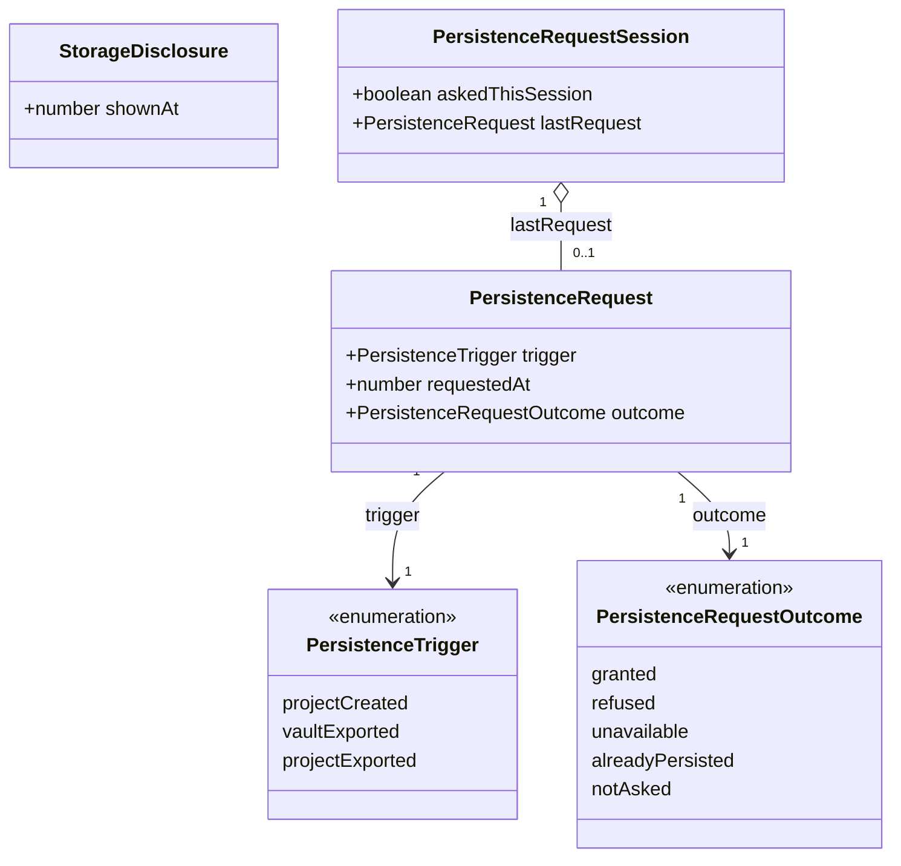
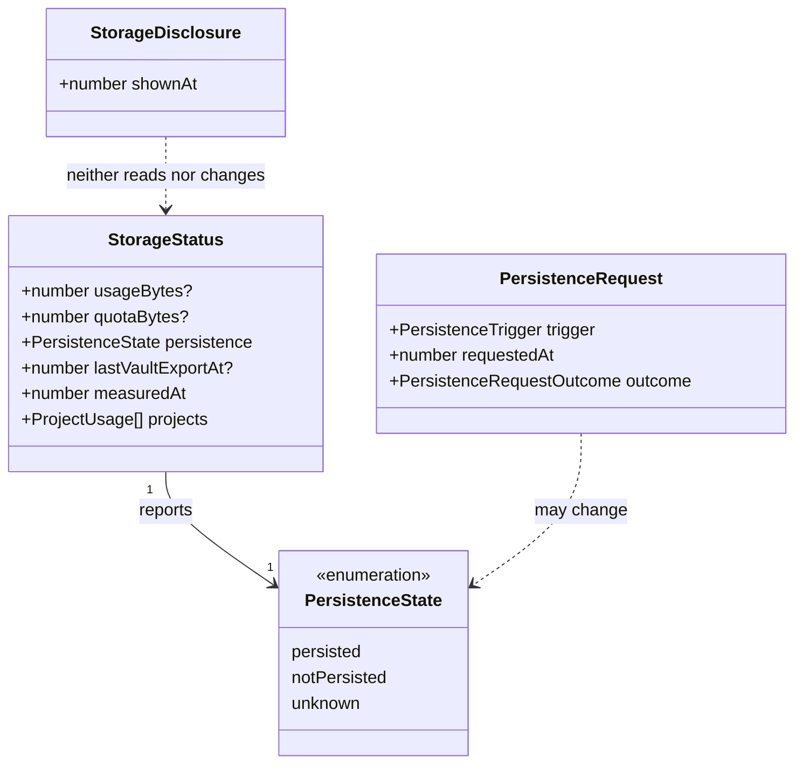

# The storage disclosure and the persistence request

This design document covers the two things Iron Arachne does at the moment a user first makes a
project: it **tells them their work lives in this browser and nowhere else**, and it **asks the
browser not to throw that work away**.

It is one section of [the workshop](workshop.md) — [Eviction and
persistence](workshop.md#eviction-and-persistence) and
[What the user is told about storage](workshop.md#what-the-user-is-told-about-storage) — worked out
far enough to build. `src/lib/storage_status` _reported_ whether the origin is protected long before
anything _asked_ for it; this is the half that asks, and the half that tells the user.

**Status:** accepted and **implemented**. The [domain model](#domain-model) was reviewed and
approved, the three questions it carried were answered — they are now
[decisions 8, 9 and 10](#decisions-taken-here) — and all six steps in [The plan](#the-plan) are
built.

Designs [#26](https://github.com/ironarachne/ironarachne/issues/26). The storage panel
([#27](https://github.com/ironarachne/ironarachne/issues/27)) is the neighbouring piece of the same
surface and is designed separately; this document produces the state that panel will read, and says
where the boundary is.

## The problem

Under [Local only](workshop.md#local-only) the browser holds the only copy of everything a user has
made. That turns storage eviction from a tidiness concern into **silent total loss that arrives
without the user doing anything**:

- Safari's ITP discards script-writable storage for an origin with no user interaction for seven
  days. A campaign built in March and left alone until April is gone, and nothing announced it.
- Every browser may evict an origin it considers "best effort" under storage pressure.

Two separate gaps follow, and they are the two halves of this document:

1. **Nothing asks the browser not to.** `navigator.storage.persist()` exists, is cheap, and is never
   called anywhere in the codebase today.
2. **Nothing tells the user.** There is no account, no server, and no copy anywhere else, and the
   product has never said so. Someone cannot take the one action that protects them — export —
   against a risk nobody described.

`src/lib/storage_status` (#177) reads `persisted()` and reports `persisted | notPersisted |
unknown`. It is a display of a fact nothing in the product has ever tried to change.

## The shape

One moment, two halves, in this order:

```
/projects ─ user types a name, presses Create
             │
             ├─ 1. the project is written                    (createProject)
             │
             ├─ 2. the disclosure is rendered and painted    ┌──────────────────────────────┐
             │                                               │ Your work is saved in this   │
             │                                               │ browser only. There is no    │
             │                                               │ account and no server.       │
             │                                               │ Export is how it leaves.     │
             │                                               │  Back up your work  [Got it] │
             │                                               └──────────────────────────────┘
             │
             └─ 3. persistence is requested                   navigator.storage.persist()
                    (Firefox prompts here; Chromium decides silently)
```

The order is the design. Firefox raises a permission prompt on `persist()`, and a prompt is answered
with whatever is on screen behind it. If the sentence has not painted yet, the user is answering a
question they have not been given a reason for — and **a declined permission is much harder to
recover than one not yet asked**, because Firefox remembers a denial per origin and stops prompting.

This is also why the moment is first project creation rather than first page load. At first load
there is nothing worth protecting and the prompt is noise to dismiss. At first project creation
there is something to lose, and the reason is on screen one line above the prompt.

### Where it appears

Projects are created in exactly one place a user can see. `src/components/layout/ProjectsPage.svelte`
is the only caller of `createProject` a user drives; the workshop's project bar links here rather
than creating one itself, and `/projects` already carries `VaultTransferControls`, so the
disclosure's _Back up your work_ link is a fragment down the same page rather than a navigation.

The notice follows the pattern the legacy-adoption notice already established in
`ProjectContextBar` — inline, dismissible, a **Got it** button, no dialog. It is not a modal: a modal
on the first thing a user ever makes is a toll gate, and this is a sentence.

## What triggers what

Three code paths create projects, and they are not equivalent.

| Path                                     | Disclosure | Persistence request | Why                                                                                    |
| ---------------------------------------- | ---------- | ------------------- | -------------------------------------------------------------------------------------- |
| `ProjectsPage` — the user presses Create | Yes, once  | Yes                 | The moment the issue names: a user gesture, with something newly worth protecting.     |
| `legacy_adoption` — a run on page load   | No         | No                  | Page load with no gesture — exactly the prompt-before-anything-exists case. See below. |
| `vault_file` import — restoring a backup | No         | Yes                 | Not a first project, and an importer already knows about files. But it is real work.   |

**Legacy adoption is the gap in the narrow reading**, and it is worth naming here rather than
discovering later. A user who arrives with pre-workshop saves gets a project created for them on
load and may never press Create, so under the rule above they are never told and never protected.
The proposal is the cheapest thing that closes it: **one sentence added to the adoption notice
copy**, in a notice that is already on screen and already dismissible, saying the same thing. No new
trigger, no new state, no cross-library coupling. Their persistence request then arrives at the next
qualifying moment through the rule below. See [decision 9](#decisions-taken-here).

## Asking at most once per session

The retry rule the issue sets — re-request at most once per session, and only after the user has
done more work — needs no counters. It falls out of restricting **who may call**:

```typescript
requestPersistenceIfWarranted('projectCreated'); // ProjectsPage, after a successful create
requestPersistenceIfWarranted('vaultExported'); // after a successful vault export
requestPersistenceIfWarranted('projectExported'); // after a successful project export
```

Those three call sites _are_ "the user has done more work". Nothing else calls it, so no page load,
no route change, and no idle timer can ask. The function then applies three gates in order:

1. **Already protected?** `persisted()` first. A persisted origin is never asked again — calling
   `persist()` on one is a prompt with nothing behind it.
2. **Asked already this session?** One request per page lifetime, refused or not.
3. Otherwise call `persist()`, record the outcome, and on a grant `invalidateStorageMeasurement()` —
   a granted request changes what the browser will give, which is a case `storage_status`'s README
   already reserves.

**A session is the page's lifetime**, held in module state rather than `sessionStorage`. A reload
therefore permits one more request — but only paired with fresh work, and in the browser where the
distinction matters, Firefox remembers an explicit denial and answers `false` without prompting
again. The gate that actually protects the user from nagging is the call-site restriction, not the
storage the flag lives in. See [decision 10](#decisions-taken-here).

Nothing about this is modal, nothing blocks, and no outcome stops the project from being created.
`persist()` is fire-and-observe: a refusal is recorded and the work carries on.

## What the copy may not say

Two rules, both about not selling a guarantee the product cannot honour.

**Persistence is not a backup.** It resists automatic eviction under storage pressure. It does
nothing about the user clearing site data, a lost laptop, a different browser, or a different profile
on the same laptop. A "Protected" badge presented as safety would be the most expensive lie in the
product, because it would talk someone out of the export that is their actual protection.

**No browser sniffing, and Safari needs none.** `docs/workshop.md` treats Safari as a separate case —
inconsistent `persist()` support, and ITP evicting regardless. The answer here is not to detect it. A
user agent string is a guess, and the honest position it would lead to is one this design takes in
_every_ branch: **export is the protection, whatever the browser said.** So the disclosure's closing
line — export is how your work leaves this browser — is unconditional, and no branch of the UI ever
reads "you are safe". `PersistenceState` keeps reporting the fact, and #27 decides how to phrase a
fact that is true and not reassuring.

## Domain model

Two diagrams. The first is the new state; the second is how it meets what `storage_status` already
has.

### The disclosure and the request



Reading it:

- **`StorageDisclosure` is the only stored thing here**, and it is one timestamp: `shownAt`, in the
  vault's `meta` store under a new `storageDisclosureShownAt` key, beside `localStorageAdoptedAt` —
  the once-ever stamp it most resembles. `meta` is not carried by the export envelope, so the stamp
  cannot travel in a backup and silence a disclosure in a browser that was never told. It is a
  timestamp rather than a boolean because "when were they told" is answerable for free, and #27 may
  want it.
- **A failed stamp write shows the disclosure again next time**, and that is the right failure. The
  alternative — remembering it in memory and stamping optimistically — is a user who was told once,
  during a run where the database was refusing writes, and never again.
- **Everything else is session state and dies with the page.** `askedThisSession` is the whole retry
  policy. Nothing about a refusal is persisted: a stored "they said no" would outlive the reason and
  turn a browser-level decision the user can revisit into a product-level one they cannot.
- **`outcome` is five-valued because the answers are genuinely different.** `refused` is the browser
  saying no; `unavailable` is no `persist()` at all, or one that threw; `alreadyPersisted` means
  nothing was asked because nothing needed to be; `notAsked` is this session's gate declining to ask
  again. Collapsing any pair produces a display or a log that is confidently wrong — the same
  argument that made `PersistenceState` three-valued.
- **`trigger` is recorded, not just consumed.** It is what makes "we only ask after real work"
  checkable in a test rather than a claim in a comment.

### Meeting the existing storage status



- **`StorageStatus` gains no fields.** The request is an action against `navigator.storage`, and its
  effect reaches the status the only way it should: the next `readPersistenceState()` says
  `persisted`. A `lastRequestOutcome` on `StorageStatus` would be a second, staler source of truth
  for a fact the browser answers directly.
- **The disclosure touches neither.** It is about what the user has been told, not about what the
  browser is doing.

## Where the code goes

```
src/lib/storage_status/
  persistence_request.ts     requestPersistenceIfWarranted, the session gate, the outcomes
  storage_disclosure.ts      hasSeenStorageDisclosure, recordStorageDisclosureShown
  storage_status_types.ts    + PersistenceTrigger, PersistenceRequestOutcome, PersistenceRequest
src/lib/vault_db/
  vault_db_types.ts          + VAULT_META_KEYS.storageDisclosureShownAt
src/components/common/
  StorageDisclosureNotice.svelte   the sentence, Got it, and the way to the export controls
src/components/layout/
  ProjectsPage.svelte        shows the notice, then requests, in that order
```

**In `storage_status` rather than a new library.** That library already owns every call into
`navigator.storage`, and already owns the vault-meta stamps that record what the user did
(`recordVaultExport`). A `storage_protection` library would be a second door onto the same two
surfaces, and its README's first job would be explaining why it is not the other one. What that
README claims — "nothing here renders anything" — stays true.

The README's **Not here** list loses its "#178" line and gains a paragraph on the request policy.

## The plan

| Step | Work                                                                                                               | Depends on |
| ---- | ------------------------------------------------------------------------------------------------------------------ | ---------- |
| 1    | `storageDisclosureShownAt` meta key; `storage_disclosure.ts` with its read and its stamp, and tests                | —          |
| 2    | `persistence_request.ts`: outcomes, the session gate, `requestPersistenceIfWarranted`, tests on a fake `navigator` | —          |
| 3    | `StorageDisclosureNotice.svelte`, and `ProjectsPage` showing it once and requesting after it paints                | 1, 2       |
| 4    | The two export paths call `requestPersistenceIfWarranted` on success                                               | 2          |
| 5    | One sentence in the adoption notice copy (decision 9)                                                              | —          |
| 6    | `storage_status/README.md` and the two `docs/workshop.md` sections updated to point here                           | 1–4        |

Steps 1 and 2 are independent and are where the coverage lives. Step 3 is the one that needs
`npm run verify:all`, per `CLAUDE.md` — it touches a component and a route.

### Testing

- **Unit** — the gate: not asked twice in a session, never asked when already persisted, each of the
  five outcomes reachable, and a `persist()` that throws reported as `unavailable` rather than
  rejecting. The stamp: written once, and a refused write leaving no stamp behind.
- **E2e** — the notice appears on a first project creation at `/projects` and does not appear on the
  second. **The test must not assert what the browser decided.** Headless Chromium's answer to
  `persist()` is not ours to pin, and a suite that depends on it fails on a browser upgrade for a
  reason that has nothing to do with this feature.
- **Coverage** — both new files land in `storage_status`, which is not in
  `scripts/library_coverage_baseline.json` and stays out of it.

## Decisions taken here

**1. The disclosure is stamped in the vault's `meta` store, not `localStorage`.** It joins
`localStorageAdoptedAt` as a once-ever fact about this vault. The export envelope does not carry
`meta`, so the stamp cannot ride a backup into a browser that was never told.

**2. Only a user-driven creation triggers it.** Adoption and import create projects without anyone
asking for one at that instant, and adoption in particular happens at page load — the case the whole
"not on first load" argument is about.

**3. The retry policy is enforced by the call sites, not by a counter.** Three functions call
`requestPersistenceIfWarranted`, all three are completions of real work, and one flag stops a second
ask in a session. There is no "qualifying work" tally to keep correct.

**4. Nothing about a refusal is persisted.** A browser-level decision the user can revisit must not
become a product-level one they cannot.

**5. `persisted()` is checked before `persist()` is called.** A protected origin is never
re-prompted.

**6. No user-agent detection.** Safari's ITP is met by the copy rule that already applies everywhere
— export is the protection — rather than by guessing the browser and writing a special case for it.

**7. `StorageStatus` gains no fields.** The request's effect is observable through `persisted()`, and
a cached copy of it would be a second source of truth that can be stale.

**8. The notice links to the backup controls rather than carrying an Export button.** They are on
the same page, so the link is a fragment to `#…-backup` and the sketch above is out of date by one
control. Offering export of a project made ten seconds ago is a strange first act; #27's panel is
where export properly belongs.

**9. The adoption sentence is in scope.** One string in the legacy-adoption notice in
`ProjectContextBar`, which is already on screen and already dismissible. It closes the only path by
which a user can hold work and never be told.

**10. A session is the page's lifetime.** Module state in `persistence_request.ts`. A reload permits
one more request, and only paired with fresh work; Firefox remembers an explicit denial and answers
`false` without prompting again, so the looser reading costs at most one more silent call.
`sessionStorage` would have bought the stricter reading at the price of a mechanism
`persistent_save` does not have.

## Acceptance, against the issue

| #26 asks                                                   | Where it is settled                                                        |
| ---------------------------------------------------------- | -------------------------------------------------------------------------- |
| Disclosure appears exactly once, at first project creation | [What triggers what](#what-triggers-what), and the `meta` stamp            |
| Dismissible                                                | [Where it appears](#where-it-appears) — inline, **Got it**, never a modal  |
| `persist()` requested then, never on first page load       | [The shape](#the-shape); no page-load caller exists, decision 3            |
| A refusal does not repeat in a session, never blocks       | [Asking at most once per session](#asking-at-most-once-per-session)        |
| No copy describes persistence as a backup                  | [What the copy may not say](#what-the-copy-may-not-say), decisions 6 and 7 |
| `npm run verify:all` green                                 | [Testing](#testing) — step 3 is the one that needs it                      |
