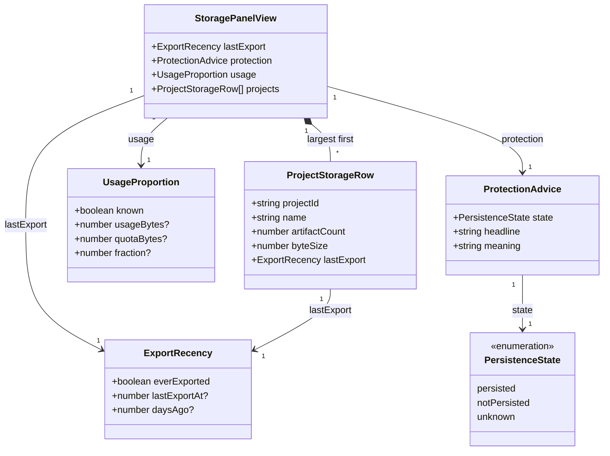
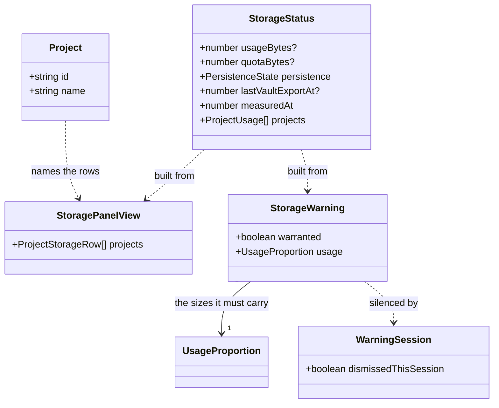
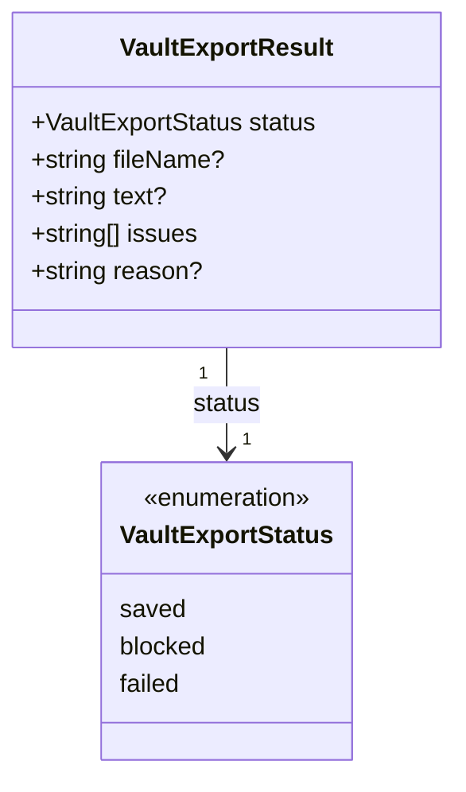

# The storage panel

This design document covers the place in Iron Arachne that answers **"what is in this browser, how
long has it been the only copy, and what should I do about it"** — the storage panel, and the one
banner that escalates when the browser is nearly full.

It is the display half of [_What the user is told about
storage_](workshop.md#what-the-user-is-told-about-storage).
[docs/storage-disclosure.md](storage-disclosure.md) built the other half: the sentence said once at
first project creation, and the request that asks the browser not to evict. `src/lib/storage_status`
has produced every number this panel shows since #177; nothing has ever rendered them.

**Status:** implemented. The [domain model](#domain-model) was reviewed and approved, and the seven
steps below have landed: `storage_presentation.ts` and `vault_export.ts` in the libraries,
`StoragePanel.svelte` and `StorageWarningBanner.svelte` in `$components/common`.

Designs [#27](https://github.com/ironarachne/ironarachne/issues/27).

## The problem

Under [Local only](workshop.md#local-only) the browser holds the only copy, so the user is the only
backup there is — and someone cannot act on a risk nobody described. Today the product says nothing.
`readStorageStatus()` knows how long ago the vault was exported, whether the origin is protected,
roughly how full it is, and which projects account for that, and the only thing in the product that
reads any of it is the modal shown after a write has already failed (`StorageFailureModalContent`).
That is a display that appears only once it is too late to be advice.

Two things are missing:

1. **A standing account.** Always available, never modal, reachable while working.
2. **An escalation.** One banner when the browser is nearly full, said where the user actually is.

## What leads, and why it is not the meter

The order of the panel is the design, not a layout detail:

1. **Last export** — "Last exported 12 days ago", or "Never exported", with _Export everything_ as
   the primary action.
2. **Protection** — one line: protected, not protected, or unknown, and what that means.
3. **Usage** — the total as a proportion, then the projects, largest first.
4. **Actions** — export the vault, export a project, delete a project.

**Fullness predicts inconvenience; export recency predicts loss.** A user at 12% of quota who has
never exported is one cleared browser away from losing everything, and a meter reports them as
comfortable. A user at 85% who exported this morning has a tidying problem, not a loss problem.
Running out of room is now rare — that is what the IndexedDB move bought — while eviction, a cleared
browser and a replaced laptop are not, and none of them announce themselves. Leading with the meter
would put the loudest element on screen on the least likely hazard.

The panel therefore states; it does not alarm. Nothing in sections 1–3 is styled as an error, and
`notPersisted` in particular is a fact rather than a warning — see
[What the copy may not say](#what-the-copy-may-not-say).

## Where it lives

**The panel is a section of `/projects`, with the stable id `storage`, and it absorbs the Backup
region that is already there.** The workshop reaches it by a link.

The issue asks for a panel "reachable from the workshop", and that wording predates the shell. Since
[docs/app-shell.md](app-shell.md) the site's **sidebar is capped**, and project
management — export, import, delete, and how much room each project takes — has already moved to
`/projects`. That leaves three candidate homes, and two of them are worse:

| Candidate                     | Why not                                                                                                                                                                   |
| ----------------------------- | ------------------------------------------------------------------------------------------------------------------------------------------------------------------------- |
| A sixth sidebar destination   | Decision 5 of the shell refuses one. Storage belongs inside a destination, and it is plainly inside Projects.                                                             |
| A panel on the workshop bench | The shell moved administration off the bench deliberately: "a bench cluttered with administration is a bench with less room for panels." Storage is administration.       |
| A section of `/projects`      | Every action the panel needs is already there, one click from anywhere, with no project required — which is exactly the case a user restoring into a fresh browser is in. |

"Reachable from the workshop" is then a link in `ProjectContextBar` — one word, no bench room — plus
the [banner](#the-eighty-per-cent-banner) when there is something to escalate. `/projects` is a
sidebar destination, so the panel is one click from every route on the site, and it is never modal
because it is a page.

**The id must be a literal, not a generated one.** `ProjectsPage` currently gives its backup region
an id built from `$props.id()`, which works only because the disclosure notice builds its link on
the same page from the same value. A fragment arriving from another route cannot know that string,
so the panel's section carries `id="storage"` — a real, stable anchor, and the only hand-written id
on the page. The workshop's link is `` `${resolve('/projects')}#storage` `` so
`svelte/no-navigation-without-resolve` stays satisfied.

### What moves, and what stops being said twice

Absorbing Backup is what keeps the page from saying everything twice. Three small moves:

- **`VaultTransferControls` loses its export button.** Whole-vault export becomes the panel's
  section 1 — the primary action, immediately under the recency figure that motivates it. What
  stays behind is import, restore, and the quarantine list; the section's heading becomes _Restore
  from a backup_.
- **`ProjectTransferControls` is unchanged** and becomes section 4's second half: export the open
  project, or bring one in from a file.
- **The project card's facts line loses its byte size.** The card answers "which project do I work
  in" and is ordered by recency; the table answers "which one is big" and is ordered by size. Both
  are worth having — but one number in two orders on one page is how a reader ends up trusting
  neither. **One number, one place**, and the place is the table.

Deleting a project stays on its card, and the table does not grow its own Delete. Two delete buttons
for the same project on one screen is a worse outcome than a pointer; each table row's name links to
that project's card, and section 4 says so in a line.

### The shape of the page

```
/projects
  ├─ Projects                       h1, lede, create
  ├─ [the cards]                    name, description, artifacts, updated · Open / Rename / Delete
  └─ Storage                        id="storage"  ◄── the workshop links here
       ├─ 1. Last exported 12 days ago            [ Export everything ]
       ├─ 2. This browser has promised to keep your work…  (or has not, or will not say)
       ├─ 3. Using about 240 MB of roughly 2 GB — about 12%
       │        Riverlands   14 artifacts   38.2 MB   exported 3 days ago
       │        Hex crawl     2 artifacts    1.1 MB   never exported
       └─ 4. Export this project · import a file · restore from a backup
```

## What the copy may not say

The rules [docs/storage-disclosure.md](storage-disclosure.md) set apply unchanged here, and two more
are the panel's own.

**Persistence is not a backup.** `persisted` means the browser has agreed to resist automatic
eviction under storage pressure. It does nothing about cleared site data, a lost laptop, a different
browser, or Safari's ITP. A "Protected" badge presented as safety would be the most expensive lie in
the product, because it would talk someone out of the export that is their actual protection. So the
protected line reads as a fact with its limit attached, and the section never ends on reassurance:

| State          | Headline                                              | What it means                                                                                                            |
| -------------- | ----------------------------------------------------- | ------------------------------------------------------------------------------------------------------------------------ |
| `persisted`    | This browser has agreed to keep your work.            | It will not clear this site to make room. It cannot help if you clear it, or if this machine is lost — a file still can. |
| `notPersisted` | This browser has not promised to keep your work.      | It may clear this site to make room for others. Exporting is what makes that survivable.                                 |
| `unknown`      | This browser will not say whether it keeps your work. | Nothing is wrong; it does not answer the question. Exporting is what makes that survivable.                              |

**No browser sniffing.** The honest position is the same in every branch — export is the protection
— so there is nothing a user-agent string would change.

### Two rules about precision

A storage display that overstates its own precision teaches users to ignore it.

- **A quota is never an exact figure.** "about 240 MB of roughly 2 GB", not
  `251658240 / 2147483648`. Browsers fuzz what they report, and rendering a fuzzed number to the
  byte is a claim the code cannot support.
- **A percentage never appears without the sizes underneath it.** A percentage of an estimate is two
  layers of imprecision wearing one number's clothes. This is enforced by returning **one string
  from one function** rather than by a convention a future template can forget.
- **Unknown renders as unknown, never as zero.** A browser with no `navigator.storage` still gets a
  useful panel: last export, protection ("will not say"), and the per-project table are all
  independent of `estimate()`. Only the proportion line drops, replaced by a sentence saying so.

**Exact sums render exactly; estimates render approximately.** `ProjectUsage.byteSize` is a sum of
figures recorded at write time, so a row reads `38.2 MB` through the existing `formatBytes`. The
origin's usage and quota come from `estimate()` and read `about 240 MB` through a new
`formatApproximateBytes`. That formatter deliberately does **not** go in `$lib/format` beside
`formatBytes`: its rule is about `navigator.storage`, and a general-purpose home would invite it
onto exact figures where one decimal place is correct.

## The eighty per cent banner

At 80% of the estimate, a non-modal banner in the workshop, linking to the panel. Dismissible for
the session and back the next one — it states a true fact about a real condition, so it is not
permanently silenceable.

- **It cannot fire on an unknown.** Both `usageBytes` and `quotaBytes` have to be present; a missing
  estimate is not eighty per cent of anything.
- **It carries the sizes, not just the percentage**, by the rule above — it is one sentence from the
  same function the panel's section 3 uses.
- **A session is the page's lifetime**, in module state, exactly as
  [decision 10 of the disclosure](storage-disclosure.md#decisions-taken-here) settled it. A reload
  brings it back, which is correct: the condition is still true, and the cost is one click on a
  statement that has not stopped being accurate. `sessionStorage` would buy a stricter reading at
  the price of a mechanism this codebase does not have.
- **It is the workshop's, not the shell's.** The issue asks for the workshop, and that is where a
  user with a nearly-full browser is about to write more. Putting it in the shell would place a
  storage warning over the release notes.

The blocking dialog on an actually-failed write is not this, is already built
(`StorageFailureModalContent`), and stays where it is.

## Domain model

Three diagrams: what the panel renders, what builds it, and the export action it needs.

### What the panel renders

Every type here is a **view model** — derived on the spot from `StorageStatus` and the project
index, persisted nowhere. `StorageStatus` gains no fields, holding the line
[decision 7 of the disclosure](storage-disclosure.md#decisions-taken-here) drew: a cached copy of a
fact the browser answers directly is a second source of truth that can be stale.



Reading it:

- **`ExportRecency` holds facts, not a sentence.** The same value is phrased two ways — "Last
  exported 12 days ago" in the headline, "12 days ago" in a table cell — and a type that carried one
  rendered string would have the other one written in a template. `everExported` is separate from
  `lastExportAt` for the reason `PersistenceState` is three-valued: never-exported is a different
  answer from exported-long-ago, and both are different from a stamp the vault could not read.
- **`daysAgo` is elapsed days, floored, not calendar days.** A figure that changes at midnight
  because of something nobody did is worse than one that changes when it means something. Under a
  day is "today", one is "yesterday", under thirty is "N days ago", and beyond that the panel gives
  the date through `getShortDate` — a hundred and forty days ago is a number nobody converts.
- **`UsageProportion.known` is the gate on the whole of section 3's first line**, and `fraction` is
  present only when both byte figures are. There is deliberately no `percentage` field: the
  percentage exists only inside the one function that also emits the sizes.
- **`ProjectStorageRow` is `ProjectUsage` joined to the project index for a name.** The join is a
  presentation concern — `ProjectUsage` carries `projectId` alone, and giving the library a name
  field would make it re-derivable state that a rename can falsify.
- **A row for a project with no artifacts still appears, at zero.** `summarizeProjectUsage` already
  guarantees it, and omitting it would make the table disagree with the cards above it.

### What builds it, and what silences the banner



- **`StorageWarning` reuses `UsageProportion` rather than carrying its own numbers**, which is what
  makes "a percentage never appears without the sizes" structural: there is one place both the panel
  and the banner get that sentence from.
- **`WarningSession` is module state and dies with the page**, like the persistence request's
  session flag. Nothing about a dismissal is persisted.
- **`measuredAt` is not displayed.** The README notes the UI _can_ say how stale the reading is; this
  panel declines. `readStorageStatus` re-measures whenever the vault's attributed total moves by a
  megabyte, so a figure on screen cannot be stale in a way that changes what the user should do, and
  a timestamp on it would be noise attached to the least actionable number in the section.

### The export action

Section 1's primary button and `VaultTransferControls` must run the _same_ export, so it stops being
a component's private routine.



- **`blocked` carries `text`.** When the browser refuses the download the file _is_ the product, so
  the caller renders it to be copied out by hand — the fallback `VaultTransferControls` has today.
- **`saved` is the only status that stamps.** `recordVaultExport()` and
  `requestPersistenceIfWarranted('vaultExported')` happen inside, after the browser has taken the
  file and nowhere else. That rule is currently a comment in a Svelte component, where nothing can
  test it; moving it into a library makes "a failed export never becomes a false reassurance" a unit
  test.
- **The stamp's own failure is still dropped.** The backup is on disk; reporting a bookkeeping
  failure as an export failure would be worse than the stale figure it costs.

## Where the code goes

```
src/lib/storage_status/
  storage_presentation.ts       buildStoragePanelView, the recency/protection/usage phrasing,
                                formatApproximateBytes, storageWarning, the session dismissal
  storage_status_types.ts       + StoragePanelView, ExportRecency, ProtectionAdvice,
                                UsageProportion, ProjectStorageRow, StorageWarning
src/lib/vault_file/
  vault_export.ts               exportWholeVault(): build, save, stamp, ask — in that order
src/components/common/
  StoragePanel.svelte           the four sections
  StorageWarningBanner.svelte   the 80% sentence, its dismiss, its link
  VaultTransferControls.svelte  export button out; import, restore and quarantine stay
  ProjectContextBar.svelte      + one link to /projects#storage
src/components/layout/
  ProjectsPage.svelte           mounts the panel at id="storage"; card facts lose the byte size
  WorkshopPage.svelte           mounts the banner
```

**Presentation in `storage_status`, not in a component.** The library's README says nothing there
renders anything, and that stays true: these functions return strings and numbers, they do not draw.
The alternative — phrasing inside the `.svelte` files — puts every rule this document argues for into
the one part of the codebase that has no unit tests, `formatApproximateBytes` and the eighty per cent
threshold included. `src/lib/settlements/settlement_presentation.ts` is the existing precedent for
the shape.

**`exportWholeVault` in `vault_file`.** It builds a vault file, which is that library's whole
subject; it already depends on `$lib/storage_status` from `vault_file_capacity.ts`, and
`$lib/download` is a leaf. A new library for one function would be a second door onto surfaces two
libraries already own.

## The plan

| Step | Work                                                                                                      | Depends on |
| ---- | --------------------------------------------------------------------------------------------------------- | ---------- |
| 1    | `storage_presentation.ts`: the view-model types, the phrasing, `formatApproximateBytes`, and tests        | —          |
| 2    | `storageWarning` and the session dismissal, with tests at, below and above the threshold                  | 1          |
| 3    | `vault_file/vault_export.ts`, with tests over saved / blocked / failed and what each does about the stamp | —          |
| 4    | `StoragePanel.svelte`, mounted at `id="storage"`; `VaultTransferControls` gives up its export button      | 1, 3       |
| 5    | The card facts line loses its byte size; the table's names link to the cards                              | 4          |
| 6    | `StorageWarningBanner.svelte` in the workshop, and the `ProjectContextBar` link                           | 2          |
| 7    | `storage_status/README.md` loses its "#179" lines; `docs/workshop.md` and `docs/app-shell.md` point here  | 1–6        |

Steps 1–3 are where the coverage lives and are independent of each other. Steps 4–6 touch components
and routes, so they are what `npm run verify:all` exists for.

### Testing

- **Unit** — recency at 0, 1, 12, 29, 30 and 400 days and never; the three protection states; a usage
  line with both figures, with one, and with neither; that no function returns a percentage without
  both sizes in the same string; approximate rounding across the KB/MB/GB steps; the threshold at
  exactly 0.8, and unknown never warranting; the dismissal flag; the export result for a save, a
  refused download, and a build that failed.
- **E2e** — `/projects` renders the four sections in order; the table is sorted by size; the panel is
  useful with `navigator.storage` stubbed away (`addInitScript`), showing unknowns rather than zeros.
  **No test asserts what the browser decided** about persistence or quota — headless Chromium's
  answers are not ours to pin, and a suite that depends on them fails on a browser upgrade for a
  reason unrelated to this feature. The banner is exercised by stubbing `estimate()` to a usage above
  the threshold, which is a stub of an API rather than an assertion about one.
- **Mobile** — `e2e/pages.mobile.spec.ts` renders `/projects` at 320px and fails on horizontal
  overflow, so the table is a table at desk widths and a stack of labelled rows on a phone. This is
  the check that keeps that honest; it is not a thing to remember.
- **Coverage** — both new files land in libraries with no baseline entry, and
  `scripts/library_coverage_baseline.json` is empty. It stays empty.

## Decisions taken here

**1. The panel is a section of `/projects` with the id `storage`, not a destination of its own and
not a bench panel.** The sidebar is capped, and administration was moved off the bench on purpose. The
workshop reaches it with a link and, when there is something to escalate, a banner.

**2. The panel absorbs the Backup region rather than sitting beside it.** Whole-vault export moves
into section 1 where the recency figure that motivates it is, and `VaultTransferControls` keeps
import, restore and quarantine.

**3. Two lists, two orders, and each number in one of them.** The cards are ordered by recency and
answer "which project do I work in"; the table is ordered by size and answers "which one is big". The
card's facts line gives up its byte size so the same number is not on screen twice in two orders.

**4. The table carries no Delete.** Deleting stays on the card, one per project per page; the row's
name links to it.

**5. Phrasing lives in the library, not in the templates.** Every rule this document argues for is
then unit-tested, including the threshold and the approximate formatter.

**6. Exact sums render exactly, estimates render approximately**, and `formatApproximateBytes` stays
out of `$lib/format` so it is not reached for on figures that are exact.

**7. A percentage and its sizes come out of one function.** Making it structural is the only version
of that rule that survives the next person editing the template.

**8. `StorageStatus` gains no fields, and the view models are persisted nowhere.** They are derived
per render from the status and the project index.

**9. The banner's session is the page's lifetime, in module state**, consistent with the persistence
request. A reload brings back a statement that is still true.

**10. `measuredAt` is not shown.** The re-measure rule already prevents a materially stale figure, and
a staleness line would attach noise to the least actionable number on the page.

**11. Nothing in the panel is styled as an error.** `notPersisted` is a fact with its limit attached.
The one thing on this surface allowed to raise its voice is the eighty per cent banner, and even that
is non-modal and dismissible.

## Acceptance, against the issue

| #27 asks                                                           | Where it is settled                                                                       |
| ------------------------------------------------------------------ | ----------------------------------------------------------------------------------------- |
| Reachable from the workshop, always available, never modal         | [Where it lives](#where-it-lives) — a link in `ProjectContextBar` to a page, not a dialog |
| All four sections render, in that order                            | [The shape of the page](#the-shape-of-the-page); export is section 1's primary action     |
| A browser with no `navigator.storage` shows unknowns, still useful | [Two rules about precision](#two-rules-about-precision) — only the proportion line drops  |
| The 80% banner appears, dismisses for the session, returns         | [The eighty per cent banner](#the-eighty-per-cent-banner)                                 |
| Quota is never exact; no percentage without sizes                  | Decisions 6 and 7, enforced by one function rather than by convention                     |
| `npm run verify:all` green                                         | [Testing](#testing) — steps 4–6 are the ones that need it                                 |
