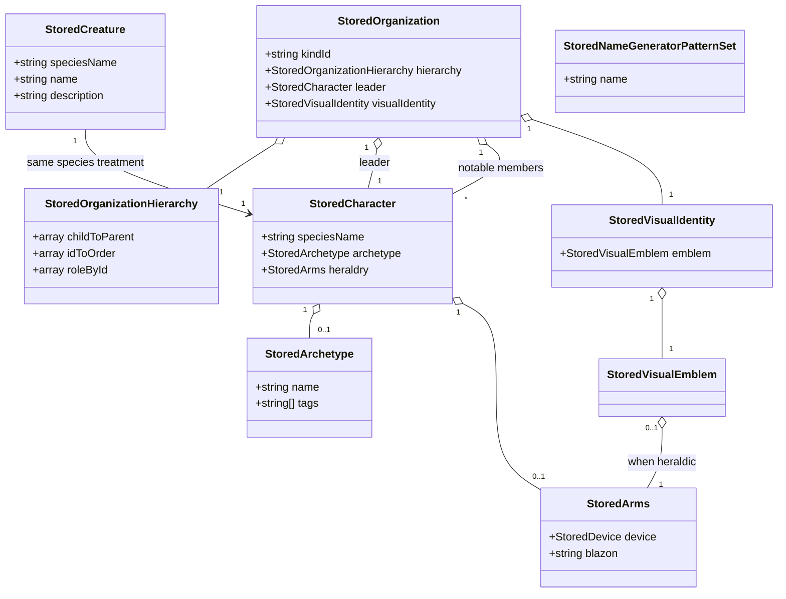
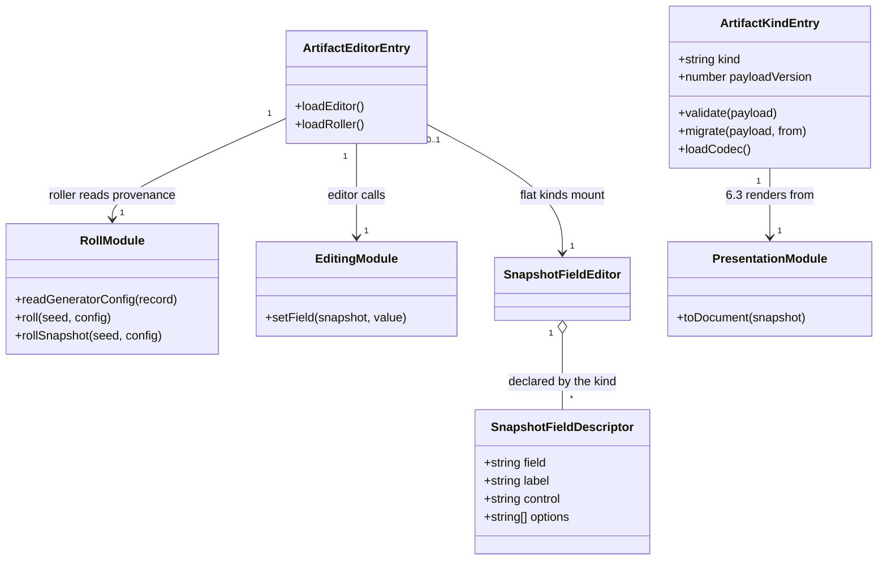
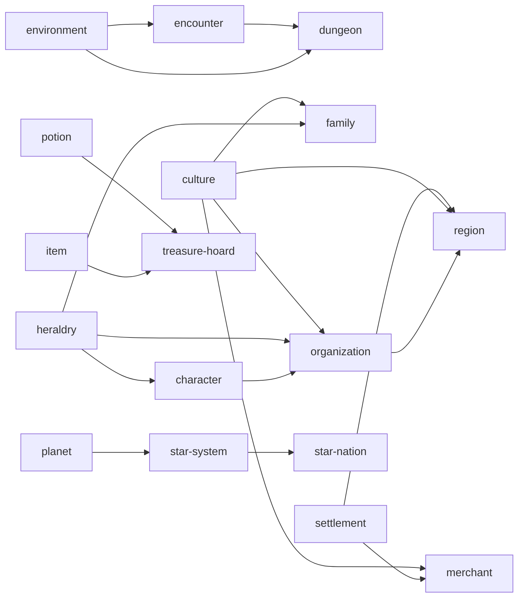

# The readiness pass

The remaining twenty-eight tools, taken to Release-ready as one body of work rather than
twenty-eight unrelated ones.

This is the spine. It settles what every tool in the pass shares — the vocabulary their payloads
are written in, the modules each one grows, the kind ids, the order the work runs in, and the
decisions that would otherwise be taken twenty-eight times and differently. The per-tool designs
live in five documents grouped by catalog domain, because that is how the catalog, the components
and the routes are already grouped:

| Document                              | Tools                                                                                                                                     |
| ------------------------------------- | ----------------------------------------------------------------------------------------------------------------------------------------- |
| [Characters](readiness-characters.md) | #48 DCC, #49 SWN, #50 Uncharted Worlds, #51 heraldry, #52 Velgarth Gifts                                                                  |
| [Factions](readiness-factions.md)     | #53 arms manufacturer, #54 encounter, #55 family, #56 organization, #57 star nation                                                       |
| [Locations](readiness-locations.md)   | #58 chop shop, #59 dungeon, #60 environment, #61 planet, #62 region, #63 star system                                                      |
| [Objects](readiness-objects.md)       | #64 drug, #65 equipment lists, #66 equipment, #67 merchant, #68 potion, #69 weapon, #70 treasure hoard, #71 spooky ship, #72 SWN starship |
| [Utilities](readiness-utilities.md)   | #74 language, #75 species stats, #76 word generator cheat sheet                                                                           |

Measured against [Tool release readiness](workshop.md#tool-release-readiness). The worked examples
are culture (#40), religion (#41), settlement (#20), the AD&D 2E character
([docs/adnd-character.md](adnd-character.md)) and the fantasy character
([docs/fantasy-character.md](fantasy-character.md)); nothing here invents a shape those five
already have.

**Status:** accepted; not yet built. The [domain model](#domain-model) was reviewed and approved,
so the pass is clear to start — beginning with wave 0, because the vocabulary in
[The stored vocabulary](#the-stored-vocabulary) is what every per-tool document is written against.

## What is already true, for all twenty-eight

Assessed against the code rather than taken from the issues, because several of the issues are
stale or wrong and it is cheaper to say so once here than to discover it twenty-eight times:

- **1.1 and 1.3 are met everywhere.** Every one of the twenty-eight has a catalog entry with a
  `kind` and `domain`, and every one is in `TOOL_PANELS` — all thirty-five paths in
  `src/lib/tools/tool_catalog.ts` appear in `src/lib/workshop/tool_panels.ts`.
- **7.1, 8.1 and 8.2 are met everywhere that has a library.** Every directory under `src/lib` has
  a `README.md` and an `index.ts` except `assets` and `styles`, which back no tool, and
  `scripts/library_coverage_baseline.json` now carries **no entries at all**: ninety-nine
  libraries, every one at or above 80%. The pass starts with no coverage debt.
- **1.4 needs no work.** The label collisions the issues describe are already fixed. #68 says the
  potion generator reads "Fantasy Potion Generator"; the catalog reads `Fantasy Potion`
  (`tool_catalog.ts`). Every generator label drops the word already.
- **2.2 fails everywhere.** Every generator in the pass calls `Date.now()` — the arms manufacturer
  three times, the chop shop, drug, DCC, SWN, Uncharted Worlds, Velgarth, star system and star
  nation generators twice each, and the rest once. The same seed does not give the same output,
  which is the defect `adnd_character_roll.ts` fixed for AD&D and `character_roll.ts` fixes for
  `/character`. **It is the single most common finding in this pass**, and it has to be fixed
  before a re-roll from provenance means anything.
- **And the clock is inside the libraries too, which is the half nobody has counted.** Fifteen
  `getDefault*Config` helpers instantiate `new RNG(Date.now())` as their default RNG:
  `astronomical_bodies` in four places (`star_systems.ts:31`, `planets.ts:89`, `stars.ts:52`,
  `moons.ts:95`), `environment` in five, `civilizations` in two, and `culture`, `heraldry`, `adnd`
  and `dice` once each. A component that threads its seed correctly still gets clock-driven
  randomness the moment it calls one of these without passing an RNG. The fix pattern already
  exists and is already commented in `character_generation.ts`: `getDefaultHeraldryGeneratorConfig`
  takes an RNG, and the character generator passes the seeded one in precisely so the charge count
  is reproducible. Every helper in that list grows the same parameter.
- **2.3 fails in three places.** `/arms-manufacturer`, `/chop-shop` and `/language` render no
  `SeedControls` at all, so the seed is neither shown nor settable. Everywhere else it is present.
- **6.1 is watched everywhere already.** `/character` and the rest are in `e2e/page_manifest.ts`,
  so `pages.mobile.spec.ts` renders each at every width in `mobile_viewports.ts` with a pinned
  seed and fails on horizontal overflow. What that suite cannot see is a control it cannot reach,
  which is 6.2's business.

So the pass is not twenty-eight assessments of sections 1, 7.1 and 8.1–8.2. It is one determinism
fix, one vocabulary, twenty-five artifact kinds, twenty-five editors, and the export and test work
that goes with them.

## Corrections to the issues

Four, each verified in the code, and each changing what the work is:

- **#69 names the wrong library.** It says the fantasy weapon generator is backed by
  `src/lib/weapons` and asks whether that library's science-fiction path should change the tool's
  genre tags. `WeaponGenerator.svelte` does not import `$lib/weapons` at all — it imports
  `$lib/equipment` and `domains` from `$lib/religion`. The only importer of `$lib/weapons`
  anywhere is `$lib/arms_manufacturer`, which is #53 and is already tagged `scifi`. So the genre
  question answers itself: nothing science-fictional is reachable from `/fantasy/weapon`, the tag
  is right as it stands, and `scifi.ts` is not dead code but _the arms manufacturer's_ code.
- **#68's label complaint is already fixed**, as above. Nothing is owed on 1.4.
- **#55 asks whether a family diagram is in scope; it is already built.** `getFamilyTreeSVG` in
  `src/lib/families/graph.ts:365` renders a family tree with `xmlbuilder2`, and
  `FamilyGenerator.svelte` never calls it. 6.3 there is a download control over a working function,
  not a rendering pipeline — the cheapest export in the pass rather than the costliest.
- **#75 names #25 as its blocker, and #25 does not touch it.** The species height and weight
  calculator never reads the species list: it takes percentages of a human baseline and derives
  size and age tables from `Sizes.getHumanVariant` and `AgeCategories.getHumanVariant`. The 182
  species carrying placeholder sizes are data this tool is used to _author_, not data it consumes.
  See [Utilities](readiness-utilities.md#75--species-height-and-weight-calculator).

## The shape every tool takes

Five modules and one registration, in the shape culture, religion, settlement and the two
character kinds already have. Named consistently so that a reader who has seen one library has
seen them all:

| Module                     | What it holds                                                                                                                                                                                       |
| -------------------------- | --------------------------------------------------------------------------------------------------------------------------------------------------------------------------------------------------- |
| `<thing>_snapshot.ts`      | `<Thing>Snapshot`, `to<Thing>Snapshot`. The writing half.                                                                                                                                           |
| `<thing>_rehydrate.ts`     | `<thing>FromSnapshot`. Split off **only** when reading pulls a heavy dependency the writing side does not — charge art, species tables, archetype equipment. Otherwise it lives beside its partner. |
| `<thing>_artifact_kind.ts` | `defineArtifactKind` entry: id, display name, icon, `payloadVersion`, `validate`, `migrate`, `nameOf`, deferred `loadCodec`.                                                                        |
| `<thing>_roll.ts`          | `<Thing>GeneratorConfigRecord`, `read<Thing>GeneratorConfig`, `roll<Thing>`, `roll<Thing>Snapshot`. The one path from a seed, taken by the page and by a re-roll.                                   |
| `<thing>_editing.ts`       | Pure snapshot-to-snapshot field edits, one per thing a user can change.                                                                                                                             |
| `<thing>_presentation.ts`  | A `<Thing>Document` of titled sections, empty ones dropped — 6.4 by construction.                                                                                                                   |

Plus, per tool: a `SaveArtifactButton` and any `SavedArtifactPicker`s in the component, an entry in
`ARTIFACT_KINDS` (`artifact_kind_catalog.ts`) and one in `ARTIFACT_EDITORS`
(`artifact_editors.ts`), and the export control that renders the presentation document.

**No tool in this pass gets a `*_saved_state.ts`.** That is the per-generator pattern the store
replaces; the three that exist are legacy, and #51 retires heraldry's.

## The stored vocabulary

Four generators embed characters, three embed organizations, five embed a coat of arms, and two
embed a creature. Written per tool, that is five copies of "an `Arms` carries a `renderSVG`
closure" which drift the first time heraldry changes. So the pass declares the stored form of each
shared concept **once, in the library that owns the concept**, and every payload composes them.

| Stored type                                         | Owner                  | Replaces                                                               | Consumers                                                              |
| --------------------------------------------------- | ---------------------- | ---------------------------------------------------------------------- | ---------------------------------------------------------------------- |
| `StoredArms`                                        | `$lib/heraldry`        | `Arms` — charge groups carry `renderSVG`                               | heraldry, character, organization, merchant, region, arms manufacturer |
| `StoredCharacter`, `StoredArchetype`                | `$lib/characters`      | `Character` — species tables, archetype equipment, arms                | character, family, encounter, organization, settlement, region         |
| `StoredCreature`                                    | `$lib/creatures`       | `Creature` — embeds a whole `Species`                                  | encounter, dungeon                                                     |
| `StoredOrganization`, `StoredOrganizationHierarchy` | `$lib/organizations`   | `Organization` — three `Map`s, a `Character` leader, a visual identity | organization, settlement, region                                       |
| `StoredNameGeneratorPatternSet`                     | `$lib/names`           | `NameGenerator` — closures                                             | culture, family, civilization, region, merchant                        |
| `StoredVisualIdentity`, `StoredVisualEmblem`        | `$lib/visual_identity` | An emblem that may be heraldry                                         | organization, settlement, merchant                                     |

Three of these already existed in the wrong place: `StoredCharacter`, `StoredArchetype`,
`StoredOrganization`, `StoredOrganizationHierarchy`, `StoredVisualIdentity` and
`StoredVisualEmblem` were all declared in `src/lib/settlements/settlement_snapshot.ts`, because a
settlement was the first payload that needed them. #46 moved the character pair and #56 moved the
other four; the settlement kind re-exports every one of them. Moving each to the library that owns the
concept is the first work item of the pass, and
[docs/fantasy-character.md](fantasy-character.md#storedcharacter-moves-to-libcharacters-and-the-settlement-payload-advances-to-version-2)
already designs the character half of that move, including the settlement payload's advance to
version 2 and the migration that comes with it.

**The rest of the move rides on that same version step.** Organization and visual identity change
shape in the same way and in the same payload, so they migrate in the same step rather than
driving a version 3 and a version 4 through everyone's stored settlements. One migration, tested
against one real version 1 payload, is the whole of it.

`StoredCreature` is new: a `Creature` embeds a whole `Species`, exactly as a `Character` does, and
the encounter and dungeon payloads both need it. It is the character treatment applied one type
up the hierarchy — species by name, rebuilt on read, unknown names becoming a placeholder. #54
declared it, in `$lib/creatures`, and moved `placeholderSpecies` there from `$lib/characters`.

## Kind ids

Twenty-five kinds for twenty-eight tools. Three are reference tools and register none; two pairs
share one kind.

| Kind                         | Tools                           | Qualified? |
| ---------------------------- | ------------------------------- | ---------- |
| `character.dcc`              | #48                             | system     |
| `character.swn`              | #49                             | system     |
| `character.uncharted-worlds` | #50                             | system     |
| `heraldry`                   | #51 (registered already)        | —          |
| `velgarth-gifts`             | #52                             | setting    |
| `arms-manufacturer`          | #53                             | —          |
| `encounter`                  | #54                             | —          |
| `family`                     | #55                             | —          |
| `organization`               | #56                             | —          |
| `star-nation`                | #57                             | —          |
| `chop-shop`                  | #58                             | —          |
| `dungeon`                    | #59                             | —          |
| `environment`                | #60                             | —          |
| `planet`                     | #61                             | —          |
| `region`                     | #62                             | —          |
| `star-system`                | #63                             | —          |
| `drug`                       | #64                             | —          |
| `item`                       | #66 **and** #69                 | —          |
| `merchant`                   | #67                             | —          |
| `potion`                     | #68                             | —          |
| `treasure-hoard`             | #70                             | —          |
| `spooky-ship`                | #71                             | —          |
| `starship.swn`               | #72                             | system     |
| `language`                   | #74                             | —          |
| _(none)_                     | #65, #75, #76 — reference tools | —          |

Four are system-qualified because their payloads are numbers that mean something only under one
ruleset, which is the test
[decision 4](workshop.md#4-kinds-are-system-qualified-when-the-payload-is) sets. Concept first,
system as a qualifier, so every character sorts together in a vault listing.

`velgarth-gifts` is the one entry that is neither system-qualified nor generic. A Velgarth gift is
setting-specific fan content rather than a rule, and there is no `setting:` namespace to qualify
with; naming the setting in the concept is the honest reading, and it keeps the kind from claiming
to be the generic notion of a psychic gift.

## Decisions taken here

### 1. Every generator in the pass grows a `*_roll.ts`, and the clock leaves it

Twenty-five generators seed from `Date.now()`. The fix is the one `adnd_character_roll.ts` made:
pressing **Generate** draws a _new seed_ from the page's RNG, and the roll itself is a pure
function of seed and config. Anything drawn from a second stream — a name, a mark — derives that
stream from the seed rather than the clock.

It is listed first because everything else in section 3 and section 4 rests on it. Provenance
records a seed and a config so that a re-roll can reproduce what was rolled; against a
clock-seeded generator, that record is a lie the moment it is written.

**The fix reaches into the libraries, not just the components.** Every `getDefault*Config` helper
that defaults its RNG to `new RNG(Date.now())` takes a required `rng` parameter instead. That is
fifteen call sites across six libraries, it is a one-line change at each, and it is the difference
between a generator that looks seeded and one that is. A tool's own work item covers the helpers it
calls; nothing is centralised, because a shared "fix the clock" item would touch six libraries at
once and block every tool behind one review.

**Audited after the locations domain finished, and the count was low.** Fifteen was what a grep for
`getDefault*Config` found; the defect is not confined to helpers with that name. The real total is
**twenty sites across ten libraries**, plus one of a different kind:

| Library               | Sites | State                                                                                        |
| --------------------- | ----- | -------------------------------------------------------------------------------------------- |
| `environment`         | 5     | Fixed by [#60](https://github.com/ironarachne/ironarachne/issues/60)                         |
| `astronomical_bodies` | 4     | Fixed by #57 (three) and [#61](https://github.com/ironarachne/ironarachne/issues/61) (moons) |
| `civilizations`       | 2     | Fixed by #57                                                                                 |
| `regions`             | 2     | **Not counted.** Fixed by [#62](https://github.com/ironarachne/ironarachne/issues/62)        |
| `culture`             | 1     | Outstanding                                                                                  |
| `heraldry`            | 1     | Outstanding                                                                                  |
| `adnd`                | 1     | Outstanding                                                                                  |
| `dice`                | 1     | Outstanding                                                                                  |
| `realms`              | 1     | **Not counted.** Outstanding                                                                 |
| `religion`            | 1     | **Not counted.** Outstanding                                                                 |
| `settlements`         | 1     | **Not counted.** Outstanding                                                                 |

Thirteen are fixed and seven remain. **Every one of the seven is latent**: traced call site by call
site, each in-app caller either passes an RNG or overwrites the field before anything is drawn from
it, so the clock reaches no generated output today. That is the same finding #60 recorded for
`environment` and it is what the decision already says the defect is — a helper that _looks_ like a
source of randomness a caller can safely forget about.

**Two shapes, and the second is the one that bites.** A bare `rng` field is easy to overwrite and
easy to see. `realms`, `religion`, `settlements` and the old `regions` helper instead use the clock
RNG _inside the helper_ to build a derived value — a name generator set, or in `settlements` an
entire generated environment — so a caller that overwrites `.rng` and nothing else still gets a
clock-driven name set. That is exactly what #62 found in `regions`, and it is why the grep that
produced "fifteen" was the wrong instrument: the tell is `new RNG(Date.now())` anywhere in a
library, not a function name.

`settlements.getDefaultConfig` is also the pass's only performance instance: it generates a whole
`Environment` that its single caller discards on the next line.

**One defect of a different kind, in dead code.** `treasure_hoard.ts` builds container ids as
`` `container-${n}-${Date.now()}` `` — a clock value inside a _payload field_ rather than an RNG
seed, so two hoards rolled from one seed would differ. It sits in `getTreasureHoardForValue`, which
is exported and has no callers; the path the dungeon actually uses,
`generateRandomContainersForCapacity`, is seeded correctly.
[#70](https://github.com/ironarachne/ironarachne/issues/70) should fix or delete it before reaching
for that function.

### 2. The stored vocabulary is declared once, by the library that owns the concept

Stated above. The alternative is five spellings of `StoredArms`, and the failure mode is silent:
each copy keeps working until heraldry adds a field, and then four payloads quietly lose it.

### 3. The equipment generator and the weapon generator share the kind `item`

Both produce an `Item` from `$lib/equipment` — the weapon generator is the same generator with the
major type fixed and a religion domain steering the enchantment. Two kinds for one payload shape
would split a user's gear across two vault entries, each openable by only one of the two tools
that made it. This is the argument [decision 4](adnd-character.md#1-the-kind-is-characteradnd-2e)
made for the AD&D builder and generator, and it applies here for the same reason.

The provenance's `toolPath` still says which tool made it, which is what a re-roll reads to know
whether it is rolling a weapon or anything at all.

### 4. Prose generators get a kind, and it holds the prose

`/chop-shop` and `/spooky-ship` each return a single string — `generate(rng)` in their `index.ts`
is a paragraph assembled from phrase tables. Their payload is `{ text: string }` and nothing else.

That is a real artifact rather than a joke: the thing a user wants to keep is the paragraph, the
editing view is a textarea, and the re-roll is the whole tool. Giving them a kind each rather than
one shared `vignette` kind keeps two unrelated tools' output apart in a vault listing, which is
what a user browsing a project actually needs; the cost is one extra registration.

These two are also the pass's cheapest complete tools, and
[Locations](readiness-locations.md) and [Objects](readiness-objects.md) put them first for that
reason: they exercise the whole spec end to end in an afternoon and find the awkward corners of the
process rather than of a tool.

### 5. Flat payloads get a declared field editor, not twenty-five bespoke components

Section 4 is the expensive half of this pass. Written the obvious way it is twenty-five Svelte
components, most of which are the same component: a list of labelled inputs bound to the fields of
a flat object, each edit producing a new snapshot.

So the pass adds one component, `SnapshotFieldEditor`, driven by a **field descriptor** a kind
declares beside its editing module:

```ts
type SnapshotFieldDescriptor = {
  field: string; // key on the snapshot
  label: string; // what the user sees
  control: 'text' | 'textarea' | 'number' | 'select' | 'string-list';
  options?: string[]; // for 'select'
};
```

It takes `ArtifactEditorProps` like any other editor and calls `onChange` with a new snapshot. The
kind supplies the descriptors; nothing in the framework learns what a drug or a star nation is.

**Which tools it serves:** the arms manufacturer, chop shop, spooky ship, drug, environment,
planet, star nation, star system, potion, item, treasure hoard and merchant — twelve of
twenty-five, and every one of them a flat record of strings and numbers with at most a list.

Velgarth gifts was the thirteenth until #52 built it and found it was not one: a set of Gifts is a
list of _records_ — a name, a description and a strength each — and no descriptor in the language
above says "repeat these three fields per row". It took a bespoke editor, per the guard at the end
of this decision. The arms manufacturer (#53) then went the same way for the same reason: its
"list of models" is a list of `Weapon` records, not a `string-list`. **`SnapshotFieldEditor` is
still unbuilt**: the first of the remaining eleven above to be taken to Release-ready should write
it, on a payload that is actually flat — and should check that it is, since two "flat" payloads
have now turned out to carry a list of records.

**Which tools it does not:** the three system characters, heraldry, organization, family, encounter,
dungeon, region and language. Each of those is a structure — a hierarchy, a graph, a device, a
grid, a lexicon — and a flat list of inputs would be a worse editor than none. They get bespoke
components, and that is where the section 4 effort in this pass actually goes.

The risk in this decision is the usual one for a declarative layer: a descriptor language that
grows a case for every kind until it is a framework nobody can read. The guard is the `control`
union above — four controls and a list. **A kind that needs a fifth control does not get one; it
gets a bespoke editor.**

### 5a. The re-derive: none of the twelve was a customer

Six of the twelve have now been built — the arms manufacturer (#53), chop shop (#58), star nation
(#57), environment (#60), planet (#61) and star system (#63) — and every one took a bespoke editor.
That prompted an audit of the remaining six against their actual payload types rather than against
this list. The result is that **the list was wrong when it was written**, and the check this
decision asks for ("should check that it is, since two 'flat' payloads have now turned out to carry
a list of records") should have been run before the list existed.

| Tool              | Payload                                                                     | Flat?   |
| ----------------- | --------------------------------------------------------------------------- | ------- |
| Chop shop         | `{ text }`                                                                  | Yes     |
| Spooky ship       | `{ text }` — `generate(rng)` returns a string, same as the chop shop        | Yes     |
| Drug              | 11 strings — both table rows stored by name (#64)                           | **Yes** |
| Arms manufacturer | a list of `Weapon` records                                                  | No      |
| Star nation       | three records, `regionsOfControl[]`, an embedded star system                | No      |
| Environment       | four nested records, two string lists, a list of `Season` records           | No      |
| Planet            | a body, `moons: AstronomicalBody[]`, a nested civilization                  | No      |
| Star system       | two lists of `AstronomicalBody`                                             | No      |
| Potion            | `container`, `liquid`, `sensory`, `effect` records, `modifications[]`       | No      |
| Item              | ~18 fields with nested material, enchantment, decoration and combat profile | No      |
| Treasure hoard    | `Item[]` — a list of the above                                              | No      |
| Merchant          | `proprietor`, `shop`, `mark` records, `stock[]`                             | No      |

Nine of the twelve are structures. Two of the other three are the _same_ case — the prose payload
[decision 4](#4-prose-generators-get-a-kind-and-it-holds-the-prose) describes, whose editing view is
one textarea and which needs no descriptor framework to produce one. The chop shop's is fourteen
lines.

Drug was recorded here as the only borderline entry, failing the guard because `drugType` and
`effectType` are table rows. **That was wrong, and #64 proved it by building the tool.** The
judgement was made against the _live_ `Drug` type rather than against the payload, and the payload
stores both rows by name — so it is eleven strings, and the two named rows are exactly the `select`
with `options` that the control union already has. Drug is the one tool on this list the descriptor
language would have served.

It changes the recommendation not at all. One customer does not pay for a declarative layer: the
bespoke editor #64 shipped is shorter than the descriptor list that would have configured it, and
the eleven other entries above still need components of their own. But the row is corrected here
rather than left standing, because a reader checking this table against the code would find it
does not match.

**So `SnapshotFieldEditor` has no customers, and the recommendation is to retire it from this
document rather than defer it again.** Six tools have been asked to write it and none could use it;
of the six unbuilt, at most one is a candidate and it is one the guard excludes. What the pass
actually produced is six bespoke editors that share a shape — a `validate`-narrowed snapshot, an
`edit()` funnel calling `onChange` once, `{@render}` snippets for the repeated row types — and that
shared shape is worth more as a convention than as a component, because it costs nothing to follow
and imposes nothing on the kinds that differ.

The estimate this decision rests on ("section 4 is the expensive half of this pass") still holds.
What was wrong is the belief that half of it could be avoided by a declared layer.

### 6. Composition follows the kinds that exist, so the order of the work is part of the design

5.1 binds "where an artifact kind exists for that input", which makes it a function of what has
already landed. The references this pass creates:

| Consumer         | References                                                           |
| ---------------- | -------------------------------------------------------------------- |
| `encounter`      | `environment` (where it happens)                                     |
| `family`         | `culture` (naming), `heraldry` (arms)                                |
| `organization`   | `heraldry` (arms), `character` (leader, members), `culture` (naming) |
| `merchant`       | `culture` (naming), `settlement` (where the shop is)                 |
| `dungeon`        | `encounter` (room encounters), `environment`                         |
| `region`         | `settlement`, `culture`, `organization`, `character`, `heraldry`     |
| `star-system`    | `planet`                                                             |
| `star-nation`    | `star-system`, `planet`                                              |
| `treasure-hoard` | `potion`, `item`                                                     |
| `character.*`    | `culture` (naming), `heraldry` (arms)                                |

Two consequences. **A referenced kind lands before its consumer**, which is what the sequencing
below is built from. And **5.4 — tolerate reference cycles — is tested once, in whatever walks
references**, not twenty-five times: a region references settlements which may reference the same
culture the region does, and the walker is the only thing that can loop.

### 7. Payload size is a design input for exactly three tools

Most payloads here are kilobytes. Three are not, and each gets a stated position rather than a
discovery in a user's quota warning:

- **The language lexicon** (#74) — the largest payload any tool would store. Stored whole
  regardless, because a user edits a lexicon and an edited word is not reproducible from a seed.
  What #74 asks — check it against the quota reporting first — is a measurement in that issue.
- **The dungeon** (#59) — grid, rooms, doors, keys and encounters. Stored whole; the WebGL scene is
  not part of it.
- **The region map** (#62) — `RegionMap` is a plain graph of nodes, edges and corners, so it is
  storable as it stands, and it is stored. What is _not_ stored is a rendered SVG.

The rule under all three, and the one the per-tool documents apply: **store what a user could have
edited; regenerate only what is purely derived — and prove the determinism with a test before
relying on it.** A rendered image is never stored. #56 puts it best: a stored SVG is a fossil,
because it cannot be re-themed, re-rendered at another size, or re-read by anything but the
renderer that produced it.

### 8. A reference tool with no logic still gets a library

#76 asks the question directly: `WordGeneratorCheatSheet.svelte` imports nothing from `$lib`, so
does 8.1/8.2 apply to a tool with no library?

It gets one — `src/lib/word_patterns`, holding the pattern table the page renders as data. Three
reasons, and none of them is consistency for its own sake: the content is a table rather than
prose, so it is data sitting in a component; the same table is what the word generators elsewhere
document, so it has a second reader; and a library is what gives 7.1 something to test, where a
component full of literals has nothing.

The alternative — a sentence in the spec exempting logic-free reference tools — is worse
specifically because it would be _used_. The next reference page would keep its content in the
component too, and the exemption would become the pattern.

### 9. The three reference tools do not queue behind the generators

#65, #75 and #76 need sections 1, 2.1, 2.5, 6, 7.1 and 8 only. No kind, no snapshot, no editor, no
migration. They are days of work in total, they are independent of everything above, and the two
table-shaped ones (#65 and #76) are the site's most likely 6.1 failures — wide tables at 320px.
They run in parallel with the rest of the pass rather than after it.

**All three are done, and all three correct the prediction above the same way.** Each was expected
to fail 6.1 and none did; each failed **6.4**, and in each the reason was
[decision 8](#8-a-reference-tool-with-no-logic-still-gets-a-library) — content or logic sitting in a
component where no unit test could reach it. The prediction that the wide tables were the risk was
wrong three times out of three, and it was wrong for an instructive reason: a table that overflows
is visible to anyone who looks, and `pages.mobile.spec.ts` had been looking. What nobody was
looking at was the text inside it.

**#65 in particular.** 6.1 was already met: the price lists have
used `DataTable` since #154, so the tables flip on a phone rather than pushing the page sideways,
and `e2e/tables.spec.ts` was already holding them to it. What the pass found instead was 6.4 —
free items printing an empty cost, and a key naming coins no price was quoted in — and the reason
it found it late is exactly [decision 8](#8-a-reference-tool-with-no-logic-still-gets-a-library):
the conversion lived in the component, where no unit test could reach it. The two remaining
reference tools should expect the same shape of finding.

**#75 found two bugs outside itself**, which is the other thing a reference tool's pass turns up:
`$lib/age`'s `getVariant` rewrote the age categories it was handed rather than returning new ones —
so `averageAgeCategories` in `species/common.ts` permanently aged a species by averaging it — and it
could emit a category whose maximum age was below its minimum. No shipped species scales small
enough to hit the second; a calculator where the user types the lifespan does. The tool's own
failure, rows reading "2 to 1 years" from a cleared field, was that bug seen from the page.

**#76 settles the spec question this pass raised**, and settles it where decision 8 already put it:
`src/lib/word_patterns` holds the element table and the pattern syntax as data, where the component
held them as a concatenated HTML string rendered with `{@html}`. No sentence is added to
`docs/workshop.md` exempting a logic-free reference tool from 8.1 and 8.2, because there turned out
to be no such tool — the "no logic" one had a Generate button, an undocumented pattern syntax, and
two 6.4 failures, one of which (the clicks element set being made of Markdown table separators) only
appeared once there was an export to write.
**#75 carries a caveat the other two do not.** The species height and weight calculator returns
confident numbers from placeholder data: #25 records that 182 of 239 species carry placeholder
human sizes. Section 6 polish does not fix that, and this document does not pretend otherwise —
[Utilities](readiness-utilities.md) says what the tool should do about it in the meantime.

## Domain model

### The vocabulary, and who composes it



### What each library contributes



### What references what



Read as "lands before": an arrow from `environment` to `encounter` says the environment kind has to
exist before the encounter generator can offer a saved environment as an input.

## The order of the work

Four waves. The boundaries are dependency boundaries, and within a wave nothing blocks anything.

**Wave 0 — the vocabulary.** The stored types move to the libraries that own them, and the
settlement payload advances to version 2 with one migration covering all of it. Everything else in
the pass composes what this wave declares, so it is the only strictly serial step.

**Wave 1 — the cheap and the unblocking.** `arms-manufacturer`, `chop-shop`, `spooky-ship`, `drug`,
`velgarth-gifts`, `environment`, `potion`, `item`, and the three reference tools. Small flat
payloads, no composition, and between them they prove the `SnapshotFieldEditor` decision before
thirteen tools depend on it. `environment` is here because two other tools reference it.

`velgarth-gifts` came out of this wave first, with the characters domain rather than with its
neighbours, and it did **not** prove the decision: its payload turned out to be a list of records
rather than a flat one, so it took a bespoke editor (see decision 5). `arms-manufacturer` came out
second and did not prove it either — a catalogue of `Weapon`s is a list of records too. The
component is still owed by whichever of the others lands first.

**Wave 2 — the structured.** `character.dcc`, `character.swn`, `character.uncharted-worlds`,
`starship.swn`, `heraldry`'s editor, `encounter`, `family`, `organization`, `merchant`,
`treasure-hoard`, `planet`, `star-system`, `star-nation`, `language`. Each has either a real
structure to edit or a composition to offer.

**Wave 3 — the heavy.** `dungeon` and `region`. Both compose most of the kinds above, both are
payload-size cases, and both touch rendering hard enough to want `verify:all` more than once.
Region in particular was the reason settlement went first: it is built from saved settlements.

Heraldry's editor is in wave 2 rather than wave 1 despite being described as the shortest run on
the site, because it is the kind most referenced by others and its editing view is a structured
device rather than a form — see [Characters](readiness-characters.md).

## What this pass does not do

- **It does not change the readiness spec**, with one exception recorded in decision 8: nothing in
  `workshop.md` section 8 changes, because the answer to #76 is a library rather than an exemption.
- **It does not touch the four open issues that overlap it.** #11 (reframe civilizations), #14
  (Convention Special DCC), #16 and #17 (stellar imagery), #19 and #25 (species sizes) each land on
  a tool in this pass; each per-tool document says what it assumes and what it defers, and none of
  them is folded in silently.
- **It does not raise any tool's `maturity` field until that tool's own work is merged.** The
  catalog records assessments, not intentions.
