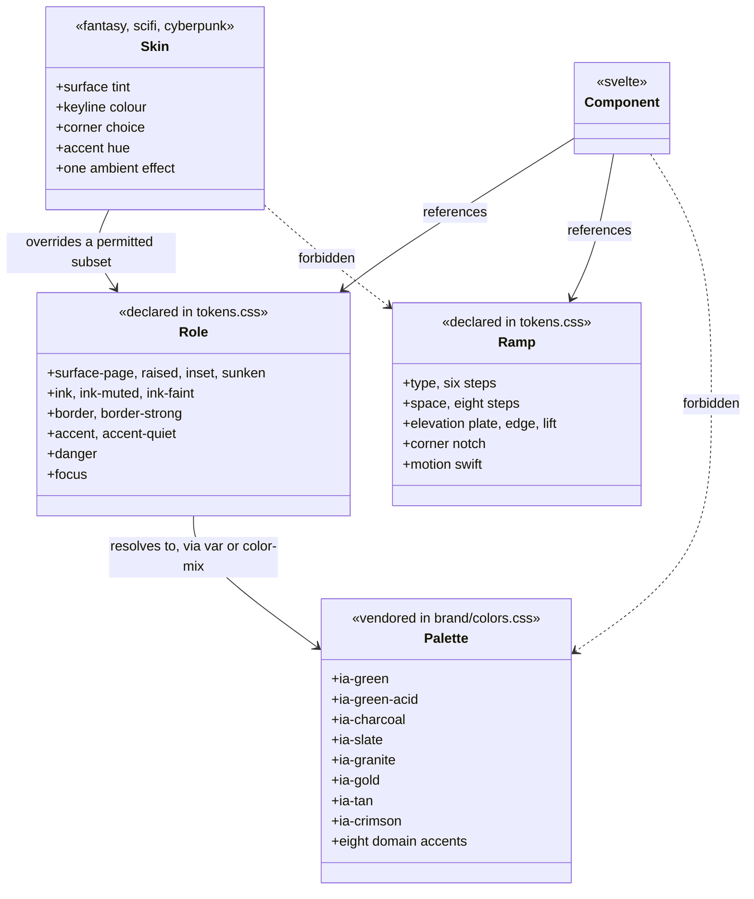

# The visual design system

This design document settles what Iron Arachne _looks like_: the tokens every component builds
from, the rules those tokens are held to, and the decisions that would otherwise be made one
component at a time.

It is the third of the three documents that describe the application. [The workshop](workshop.md)
settled what a user's work **is** — projects, artifacts, tools. [The application
shell](app-shell.md) settled where a user **stands** while they do it — a top bar, six
destinations, a measure-capped page region. Neither settled how any of it **looks**, and that
omission is the whole of [#77](https://github.com/ironarachne/ironarachne/issues/77): the site
works and does not look finished, because spacing, type and colour are decided per component and
so nothing lines up between two pages.

**Status:** accepted. The [token taxonomy](#token-taxonomy) was reviewed and approved on
2026-08-26, which is the gate CLAUDE.md puts in front of implementation: the tokens issue can be
built from it without further design work. Nothing here is built yet — see [What this
changes](#what-this-changes) for what the implementation covers.

**Amended 2026-08-26 by [#114](https://github.com/ironarachne/ironarachne/issues/114)**, which
adds [The shell](#the-shell). That section settles the top bar, sidebar and drawer at all three
widths — detail the [control vocabulary](#control-vocabulary) left to one paragraph — and it
changes the taxonomy in one place: it names a third corner treatment, `--corner-nav`, which
[#113](https://github.com/ironarachne/ironarachne/issues/113) delivers with the rest of the corner
vocabulary. Nothing else in the approved taxonomy moves.

**Amended 2026-08-28 by [#115](https://github.com/ironarachne/ironarachne/issues/115)**, which
grows the [control vocabulary](#control-vocabulary) from four paragraphs of geometry into the
settled recipe for every control: the button's six variants and four states, the input, the
select, the checkbox, the field around them, and the classes they are reached by. The geometry
does not move. It amends one decision and narrows another: [focus](#3-focus-and-contrast-are-targets-not-assumptions)
is a 2px `--focus` ring on every interactive element, drawn _inside_ a control whose corner is
clipped because a `clip-path` leaves an outline nothing to paint on; and the 44px touch target
grows the control itself wherever controls sit beside one another, rather than the invisible
overlay the top bar's lone icon button can afford.

**Amended 2026-08-28 during implementation**, with [a button's two layers](#a-button-draws-its-own-edge-and-needs-a-liner-to-do-it).
A cut corner and a border cannot both survive on one element, so a button is a `<button>` painting
its edge and a liner painting its fill — which is what `BaseButton` is for, and why the variants
are two custom properties rather than two rule sets. The plate also becomes a corner-lit radial
rather than a top-down linear gradient; what the system holds is that there is one gradient, in one
place, mixed from the palette.

Written against the rough-cut mockup published from the [design
canvas](https://claude.ai/code/artifact/c2f18fd6-1a76-46bd-9044-c8cfc888befb) — five artboards:
the workshop at 1440, the phone at 390 with its drawer, genre skins, the token taxonomy, and the
control vocabulary. Where this document and the mockup disagree, this document is right: it
corrects three of the mockup's stated contrast ratios and raises one token that failed its own
target. Those corrections are noted where they occur.

## What this is not

Not a rebrand. The palette, the two typefaces and the icons are **vendored** from
`ironarachne/ironarachne_branding`, pinned in `brand-assets.json` and copied by
`scripts/sync_brand_assets.sh`. `src/lib/styles/brand/colors.css` and everything in
`src/lib/assets/fonts/` are never edited in place — a colour change is made in the brand repo and
synced. See [brand assets](brand-assets.md).

The design here is what the app _does_ with the brand. Every colour this document names is an
existing `--ia-*` entry or a stated mix of two, and there is no third place a colour value can be
written down.

## The problem

`src/lib/styles/tokens.css` is 47 lines. It aliases thirteen palette entries, maps three modal
roles, and declares `--measure`. That is a vocabulary for colour and nothing else, so:

- **Type has no scale.** `main.css` sets `h1` through `h5` with per-element sizes and a global
  `line-height: 1.75`, and every component that wants something in between picks a number. The
  workshop, the vault and a generator page do not agree on what a heading is.
- **Spacing is invented per component.** There is no ramp to be off, so nothing is off, so
  nothing lines up.
- **Controls are copied, not shared.** The literal `rgb(92, 86, 73)` button gradient is written
  out three times — in `main.css`, in `fantasy.css` and again in `modal.css` for the danger
  variant. Changing what a button looks like means finding all three.
- **There is no elevation or density language**, which is why panelled surfaces read as boxes on
  a page rather than as plates on a bench.
- **The genre skins' relationship to the base is undeclared.** `fantasy.css`, `scifi.css` and
  `cyberpunk.css` each restyle headings and re-declare the whole button. Are they a skin over one
  system or three separate looks? Today it is somewhere between, which is the answer that costs
  the most to maintain.

## Token taxonomy

A visual system persists no types, so the domain-model step lands here instead: **every token the
system defines, its role, and which tokens a component is allowed to reach for.**

Three layers, and the direction is strictly one-way:



This is the one place a diagram earns its keep, because the forbidden edges are the whole point
and prose states them less clearly than a crossed arrow does. The ramps below are tables rather
than diagrams; a class diagram of a list of sizes would be drawing for form's sake.

Read the diagram as four rules:

1. A **role** resolves to a palette entry, or to a `color-mix()` of two. It never holds a hex.
2. A **component** references a role or a ramp step. It never references `--ia-*` and never a hex.
3. A **skin** overrides a permitted subset of roles. It never touches a ramp.
4. Nothing reaches past a layer. `tokens.test.ts` already enforces rule 1 and half of rule 2; see
   [Enforcement](#enforcement).

### Type ramp

Six steps. Cinzel Decorative carries headings, controls and labels; Inclusive Sans carries
anything read as a sentence.

| Token         |   Size | Line height | Face                                  | Used for                         |
| ------------- | -----: | ----------: | ------------------------------------- | -------------------------------- |
| `--t-display` |   26px |        1.05 | Cinzel Decorative 700                 | Page title, one per page         |
| `--t-title`   |   20px |        1.10 | Cinzel Decorative 700                 | Generated name, bench heading    |
| `--t-heading` |   16px |        1.20 | Cinzel Decorative 700                 | Panel heading                    |
| `--t-body`    |   14px |        1.45 | Inclusive Sans                        | Prose and generated output       |
| `--t-small`   | 12.5px |        1.40 | Inclusive Sans                        | Lists, sublines, field values    |
| `--t-micro`   |   11px |        1.40 | Cinzel Decorative, +0.08em, uppercase | Labels, kickers, badges, buttons |

Two numbers do most of the work. Line height falls from today's global 1.75 to **1.45**, and the
largest step falls from 40px to **26px**. The ramp is what makes the site read tighter — not
per-component trimming, which is what produced the current state.

The ramp has to look right inside `--measure` (70ch), which is what caps prose on `section.main`.
At `--t-body` that measure is roughly 640px, which is a comfortable column; the ramp is designed
at that width, not at the full bench width.

`h1`–`h6` map onto the ramp rather than carrying sizes of their own: `h1` → `--t-display`, `h2` →
`--t-title`, `h3`/`h4` → `--t-heading`, `h5`/`h6` → `--t-micro`. Today's decorative `h3::after`
rule and `h5` bottom border go; a heading that needs separating from what follows gets a `.rule`,
which is a token-driven 1px `--border` line, not a pseudo-element that only some headings have.

### Space ramp

Eight steps, and a component may not invent a value outside them.

| Token  | Value | Typical use                         |
| ------ | ----: | ----------------------------------- |
| `--s1` |   2px | Hairline gaps, label-to-field       |
| `--s2` |   4px | Badge padding                       |
| `--s3` |   6px | Icon-to-text, chip gaps             |
| `--s4` |   8px | Gap inside a control group          |
| `--s5` |  12px | Panel padding, gap between panels   |
| `--s6` |  16px | Section spacing inside a panel body |
| `--s7` |  24px | Page padding, gap between sections  |
| `--s8` |  32px | Page-level separation, hero spacing |

Nothing above `--s8` exists. A gap that wants 48px is a layout that wants rethinking, and making
that awkward is the point.

The ramp is deliberately dense at the bottom: the difference between 2px and 8px is where a
control either reads as one object or as three, and that is exactly the range the current site has
no vocabulary for.

### Colour roles

Twelve roles. The middle column is the expression that goes in `tokens.css` — never a hex, so
`tokens.test.ts` keeps holding. The ratio is measured against `--surface-page`.

| Role               | Resolves to                                      | Contrast | Used for                                  |
| ------------------ | ------------------------------------------------ | -------: | ----------------------------------------- |
| `--surface-page`   | `var(--charcoal)`                                |        — | The page behind everything                |
| `--surface-raised` | `var(--slate)`                                   |        — | Panels, top bar, sidebar                  |
| `--surface-inset`  | `color-mix(in srgb, var(--charcoal) 80%, black)` |        — | Inputs, seed fields, wells, log rows      |
| `--surface-sunken` | `color-mix(in srgb, var(--charcoal) 60%, black)` |        — | Scroll wells behind an inset run          |
| `--border`         | `var(--granite)`                                 |        — | Every neutral keyline                     |
| `--border-strong`  | `var(--tan)`                                     |        — | Control edges, base skin keyline          |
| `--ink`            | `color-mix(in srgb, white 95%, var(--charcoal))` |   15.2:1 | Body text, headings, control labels       |
| `--ink-muted`      | `color-mix(in srgb, white 60%, var(--charcoal))` |    6.8:1 | Sublines, list detail, secondary values   |
| `--ink-faint`      | `color-mix(in srgb, white 48%, var(--charcoal))` |    4.8:1 | Labels and kickers only, never a sentence |
| `--accent`         | `var(--iron-arachne-green)`                      |   10.6:1 | Links, the active nav marker              |
| `--accent-quiet`   | `var(--gold)`                                    |    7.1:1 | Kickers, primary control edge             |
| `--danger`         | `var(--crimson)`                                 |    2.2:1 | Fills and edges — **never text**          |
| `--focus`          | `var(--acid-green)`                              |   13.4:1 | The focus ring, and nothing else          |

Three corrections to the mockup, all of them in this table:

- **`--ink-faint` was `#7b7f88`, which measures 4.16:1** — below the 4.5:1 it is held to, despite
  the mockup labelling it 4.6. It is raised to a 48% mix, measuring **4.8:1**. This is the one
  token where the mockup would have shipped a failure.
- `--ink-muted` measures **6.8:1**, not 7.1.
- `--accent-quiet` measures **7.1:1**, not 8.0.

`--danger` is listed with its ratio precisely so nobody uses it as a text colour later: crimson on
charcoal is 2.2:1 and is not readable. Destructive intent is carried by a crimson **edge and
fill** under `--ink`-coloured text.

The eight remaining palette entries — emerald, amethyst, cyan, plasma blue, magenta, and tan
outside `--border-strong` — are reached only through a genre skin or a domain marker. A component
never names one directly. `--modal-border-message` / `-error` / `-success` stay as they are; they
already follow this pattern, mapping a role onto a palette entry in one place.

### Elevation

Three levels, and depth is carried by a keyline plus a one-pixel top highlight rather than by
blur. The result reads as pressed metal at 100% zoom instead of as a floating card, which is the
difference between a bench and a web page.

| Level      | Recipe                                                                | Used for                                        |
| ---------- | --------------------------------------------------------------------- | ----------------------------------------------- |
| **Page**   | Flat `--surface-page`, no border, no shadow                           | The page region; the bench; the main tool panel |
| **Raised** | `--surface-raised` + 1px `--border` + `--edge` + `--lift` + `--notch` | Every panel: rail, log, vault card, modal       |
| **Inset**  | `--surface-inset` + 1px `--border` + inward shadow                    | Inputs, seed fields, scroll wells, log rows     |

Supporting tokens:

- `--plate` — the control gradient: a highlight off the top-right corner of a slate box, mixed a
  little toward the brand green and falling to a 26%-black mix. This replaces the three copies of
  `rgb(92, 86, 73)`. What the system holds is that it is one gradient in one place, mixed from the
  palette; where the light falls is a look to tune, not a rule. `--plate-primary` and
  `--plate-danger` are the two variant fills, mixed from the same slate toward gold and toward
  crimson; a variant sets a fill, a keyline and a label colour and inherits the geometry.
- `--sink` — `inset 0 1px 2px rgb(0 0 0 / 45%)`, the inward shadow every input, select and
  textarea carries. A control is either raised off the surface by `--edge` or sunk into it by
  this.
- `--edge` — `inset 0 1px 0 rgb(255 255 255 / 7%)`, the top highlight that makes a plate a plate.
- `--lift` — `0 1px 0 rgb(0 0 0 / 60%), 0 6px 14px rgb(0 0 0 / 35%)`, the one shadow in the system.
- `--notch` — the corner vocabulary: a 9px cut on the top-right and bottom-left, as a `clip-path`
  polygon. Controls use a 7px cut of the same shape (`--corner-control`), and a nav item a 7px cut
  of both corners on one edge (`--corner-nav`, added by [the shell](#the-nav-corner-is-a-third-treatment)).
  **These are the only three corner treatments**; a skin picks between cut, bevelled and square
  from this vocabulary rather than inventing one.

**Density.** A panel differs from the page by surface, keyline and notch — not by padding, which
is `--s5` everywhere. The bench differs from a panel by having no surface at all: it is the page,
and the panels sit on it. The main tool panel likewise has no surface of its own, which is why a
genre skin reaches it only through the output it holds.

**Border or shadow?** The **border carries it.** `--lift` exists so a raised plate does not float
against the page, but a panel is identified by its keyline and its notch. This matters for the
skins: a border colour is something a skin can change safely, where a shadow that changed per
genre would make panels sit at different heights beside each other.

### Motion

- `--motion-swift` — 120ms. Every hover and press transition uses it; nothing in the interface
  animates for longer.
- Ambient genre motion is capped at **one effect per skin** and is disabled entirely under
  `prefers-reduced-motion: reduce`.

Today's shimmer, pulse and glitch live on headings, which means the type moves while it is being
read. They move to the panel surface instead. See [decision 2](#2-genre-skins-are-a-permitted-subset-not-a-second-look).

## Decisions taken here

These are the items [#77](https://github.com/ironarachne/ironarachne/issues/77) and
[#112](https://github.com/ironarachne/ironarachne/issues/112) ask to be settled rather than left
open. Each is stated either way, with the reason, because an undecided item is how a second system
gets built later.

### 1. Dark mode is the only mode

**The app is dark-only.** There is no light theme and no toggle.

The brand green is a dark-surface colour: `brand/colors.css` measures it at 1.57:1 on white and
records "never set green text on white". `--ia-green-acid` is worse at 1.24:1. The palette carries
no light-surface pair for either, so a light mode could not use the brand's own accent — it would
need a second accent, a second focus colour and a second set of role mappings, which is a second
design system wearing the same logo.

Note that `brand/colors.css` does contain a `prefers-color-scheme: dark` block that flips
`--ia-surface` and `--ia-ink`. That block is the **brand file's** business and is vendored; the app
does not read `--ia-surface`, and the roles above pin `--surface-page` to charcoal unconditionally.
The app is dark on a light-preference device, which is correct and deliberate.

### 2. Genre skins are a permitted subset, not a second look

`fantasy.css`, `scifi.css` and `cyberpunk.css` **remain skins over the base system**, and the
subset they may touch is now explicit. A skin follows the open project's genre and reaches every
panel; the shell — top bar and sidebar — is genre-neutral by rule, so the frame never changes
shape underneath the user.

**A skin may set:**

|                |                                                              |
| -------------- | ------------------------------------------------------------ |
| **Surface**    | Panel background fill, tint and texture                      |
| **Keyline**    | Border colour, weight, and which edges carry it              |
| **Corner**     | Cut, bevelled or square, from the one shared clip vocabulary |
| **Accent hue** | The panel's chip, kicker and figure colour                   |
| **Motion**     | At most one ambient effect, off under reduced motion         |

**A skin may never touch:**

|                            |                                                           |
| -------------------------- | --------------------------------------------------------- |
| **Typeface**               | Cinzel Decorative and Inclusive Sans, in every genre      |
| **Type scale and spacing** | One ramp, so two panels stay the same height side by side |
| **Control geometry**       | Button and input size, hit target, focus ring             |
| **The shell**              | Top bar and sidebar are genre-neutral                     |
| **Contrast floor**         | A skin that cannot hit its target ratio does not ship     |

This settles the three concrete things wrong with the skins today. Each re-declares the whole
button — that goes; a skin sets an accent and a keyline and inherits the rest. Each restyles
`h1`–`h6` — that goes; the type scale is not a skin's to change. And each puts its ambient effect
on heading text — the shimmer, the pulse, the glitch — where it animates words while they are
being read; the effect moves to the panel surface.

### 3. Focus and contrast are targets, not assumptions

- **Focus:** a 2px `--focus` ring on every interactive element. Never removed, never colour-only,
  and never replaced by a border change alone — a border change is invisible to someone who cannot
  distinguish the two colours. It is an outline at 2px offset on an unclipped control and an inset
  shadow on a clipped one, because a `clip-path` clips everything the element paints and an
  outline at a positive offset then paints nothing at all; see [the control
  vocabulary](#focus-on-a-clipped-control-is-drawn-inside-it).
- **Contrast:** every text role clears **4.5:1** against the surface it sits on. `--ink` is
  15.2:1, `--ink-muted` 6.8:1, `--ink-faint` 4.8:1 at its 11px uppercase size. `--danger` is a
  fill and an edge, not a text colour.
- **Hit target:** 28px is the visual height of a control; the tap area is **44px** under
  `(pointer: coarse)`. This is what keeps `e2e/pages.mobile.spec.ts` honest at 320px rather than
  merely passing. A control standing alone can hold its 28px body and grow an invisible target
  around it; one standing in a row of controls grows itself, because two overlapping targets are a
  mis-tap. See [hit targets](#hit-targets-grow-the-control-not-an-overlay).

### 4. Sound on press does not ship

The mockup draws a per-device sound toggle beside the ambient-motion one, defaulted off. **It does
not ship**, and the toggle comes out of the control sheet.

A UI sound bed defaulted to off is a feature nobody encounters, carried by an audio asset that has
to be vendored, a preference that has to be stored per device, and a mute state that has to be
respected everywhere a button exists. Defaulted to on, it is a generator site that makes noise when
you click Generate. Neither is worth the surface area in a first pass, and nothing about the token
system forecloses adding it later — a press is already a distinct state with a distinct token.

### 5. The icon set is SunGraphica's, and the credit is a licence term

**Settled.** The pack is bought: SunGraphica's _600 Minimal Icons_, licensed for commercial use,
split into 455 individual SVGs in `src/lib/assets/icons/`. The mockup's placeholder glyphs are
replaced by it.

Three consequences the token system has to absorb:

- **The credit ships.** The licence requires SunGraphica be credited, so the footer carries it on
  every page. It is a licence term, not a courtesy, and it is not a candidate for tidying away.
- **They are not brand assets.** The pack was bought for this app, so it is not vendored through
  `brand-assets.json` and there is no upstream to sync from. It is the one class of asset here
  that may be edited in place.
- **They are filled, not stroked.** The mockup drew a 1.5px stroked house style; these are solid
  glyphs with knockouts. The stroke weight in that mockup is therefore not a rule the system
  holds anything to — it described placeholders. What the system does hold is that an icon is
  painted with `currentColor` through a mask, so it takes its colour from the role around it and
  the surface shows through its holes, on any surface and in any genre skin.

## Control vocabulary

Every control in the app, settled: the button and its six variants, the input, the select, the
checkbox, the field around them, and what focus looks like on each. This is what
[#115](https://github.com/ironarachne/ironarachne/issues/115) builds.

The section used to be four paragraphs stating the geometry so that the tokens issue would know
what the tokens were for. The geometry below is unchanged from those paragraphs — what follows
settles the states, the classes and the two questions the paragraphs left open: how a focus ring
survives a clipped corner, and how a 28px control becomes a 44px tap target without eating its
neighbour's.

Out of it: **badges** and **panels**, which are
[#116](https://github.com/ironarachne/ironarachne/issues/116)'s; **modals and banners**, which are
[#117](https://github.com/ironarachne/ironarachne/issues/117)'s beyond the one danger action
described below; and **sound on press**, which
[decision 4](#4-sound-on-press-does-not-ship) settled as not shipping.

### A button is a stamped plate

One recipe, and every `button` on the site gets it from the element selector rather than from a
class. There are about 120 of them across `src/components` and `src/routes`; a system that only
reached the ones somebody remembered to annotate would leave most of the app on the old gradient,
which is the state this issue exists to end.

| Property   | Value                                                      |
| ---------- | ---------------------------------------------------------- |
| Height     | 28px, as `min-height` — a label that wraps grows the plate |
| Padding    | `--s3` block, `--s5` inline                                |
| Type       | `--t-micro`, `--t-micro-tracking`, uppercase, `--ink`      |
| Fill       | `--plate`                                                  |
| Keyline    | 1px `--border-strong`                                      |
| Highlight  | `--edge`                                                   |
| Corner     | `--corner-control`                                         |
| Transition | `--motion-swift` on border colour, colour and box shadow   |

Four states, and the press is the one that has to feel like a press:

| State        | Recipe                                                                                                                                                    |
| ------------ | --------------------------------------------------------------------------------------------------------------------------------------------------------- |
| **Rest**     | The plate above.                                                                                                                                          |
| **Hover**    | Keyline to `--focus`, a faint glow — `0 0 6px color-mix(in srgb, var(--focus) 30%, transparent)` beside `--edge` — the plate 8% brighter, and a 1px lift. |
| **Press**    | `translateY(1px)`, `--edge` swapped for an inward shadow, label `--accent`.                                                                               |
| **Disabled** | Flat `--surface-inset`, 1px `--border`, no highlight and no shadow, label `--ink-faint`, `cursor: not-allowed`.                                           |

The movement is the 1px lift and the 1px drop, and that is all of it. Both run at
`--motion-swift` like every other state change, and both go under `prefers-reduced-motion: reduce`
while the state itself stays: hover still lights the keyline and press still drops the highlight
and turns the label, they simply arrive rather than travel. The plate brightens under `filter`
rather than by swapping gradients, because a gradient cannot be transitioned as a colour and two
gradients cross-fading is a repaint rather than a transition.

The disabled state is the one that drops the plate entirely. A greyed gradient still reads as a
raised object, and a raised object reads as pressable; a flat inset one does not.

### A button draws its own edge, and needs a liner to do it

`clip-path` clips everything the element paints, and a `border` is something the element paints.
On the two diagonal edges of a cut-cornered button the border is therefore sliced off: the plate
meets the page with no keyline exactly where the shape is most visible. A single element cannot
draw this, whatever is written on it — `background-clip: padding-box` under a border-box layer
fails the same way, because the clip cuts both layers along the same diagonal.

**So a button is two elements.** The `<button>` paints the edge colour across its whole box; a
liner one pixel inside it paints the fill over all of that except a one-pixel band. The band _is_
the border, and it follows the diagonal because both shapes are cut. `BaseButton` is that markup,
and it is the reason the component exists — not styling convenience, which the element selector
already had.

| Layer                         | Paints                                             | Clip                     |
| ----------------------------- | -------------------------------------------------- | ------------------------ |
| `<button>`                    | `--btn-edge`, across the whole box, `padding: 1px` | `--corner-control`       |
| `<span class="…inner-field">` | `--btn-fill`, one pixel inside                     | `--corner-control-inner` |

`--corner-control-inner` cuts at 6px where the plate cuts at 7px. The liner is 2px smaller in each
direction, so an equal cut would converge on the outer diagonal at one end and diverge at the
other; a pixel shallower keeps the two parallel. **It is not a fourth corner treatment** — it is
the control's own treatment, drawn a pixel in, and the cap in [Elevation](#elevation) counts
treatments rather than polygons.

**The variants are two custom properties, not two rule sets.** Everything in `main.css` is written
against `--btn-edge` and `--btn-fill`, so a variant, a hover and a disabled state each set two
colours and neither markup is mentioned. That is what lets a plain `<button>` — the six wrapper
buttons around images, and any that has not been converted — read the same system from the element
selector, differing only in the one thing it cannot draw.

Two variants stay single-layer on purpose. An **icon** button is square and unclipped, so it has no
diagonal to rescue. A **quiet** button has no fill, and a band is only visible against one: a
transparent liner would show the whole edge colour rather than a pixel of it, so quiet keeps the
ordinary border and the clip shaves its diagonals. A control with nothing to paint over cannot
have a painted edge.

### Focus on a clipped control is drawn inside it

[Decision 3](#3-focus-and-contrast-are-targets-not-assumptions) asks for a 2px `--focus` outline
at 2px offset on every interactive element. That is right for every control the app has except
the one it has most of: **`clip-path` clips everything the element paints, and an outline at a
positive offset lies entirely outside the clip region**, so a cut-cornered button declaring one
paints no ring at all. This is the same property that makes the sidebar's current-item marker an
inset shadow rather than a border — [the nav item](#a-nav-item) states it — and it lands harder
here, because a marker that gets shaved is cosmetic and a focus ring that never paints is an
accessibility failure.

**The rule, restated so it holds for both:** every interactive element shows a 2px `--focus` ring,
and whether the ring is drawn outside or inside the control follows from whether the control is
clipped.

| Control                                                  | Ring                                                       |
| -------------------------------------------------------- | ---------------------------------------------------------- |
| Clipped — any button carrying `--corner-control`         | `inset 0 0 0 2px var(--focus)`, beside `--edge`            |
| Unclipped — inputs, selects, checkboxes, the icon button | `outline: 2px solid var(--focus)` at `outline-offset: 2px` |

Checked rather than assumed: a Chromium render of two identical buttons, one clipped and one not,
each declaring the same `outline: 2px solid` at `outline-offset: 2px`, paints the ring on the
unclipped one and nothing at all on the clipped one.

Neither is traded away for a fill, a border change or a colour change, at any state — including
on a control that is already hovered or pressed, which is exactly when a keyboard user is most
likely to be looking for it.

### Variants

Six, and each is a single class on the element that already carries the base. Nothing here is a
second button implementation; a variant sets a fill, a keyline and a label colour, and inherits
the geometry — which is what makes "a skin may not touch control geometry"
([decision 2](#2-genre-skins-are-a-permitted-subset-not-a-second-look)) a rule with something
behind it.

| Variant         | Class              | Recipe                                                                                                                    |
| --------------- | ------------------ | ------------------------------------------------------------------------------------------------------------------------- |
| **Secondary**   | none               | The base plate. The default, and the reason an unannotated `button` is already correct.                                   |
| **Primary**     | `.btn-primary`     | `--accent-quiet` keyline over `--plate-primary`, the base plate warmed toward gold. One per surface.                      |
| **Quiet**       | `.btn-quiet`       | No fill, 1px `--border`, label `--ink-muted`. Hover fills `--surface-inset` and lifts to `--ink`.                         |
| **Destructive** | `.btn-destructive` | `--danger` keyline over `--plate-danger`, the base plate mixed toward crimson, label `--ink`. Never crimson text — 2.2:1. |
| **Icon**        | `.btn-icon`        | 28×28, square, no clip, no inline padding. A 7px cut on a 28px square eats the glyph.                                     |
| **Small**       | `.btn-sm`          | 24px, `--s2` block and `--s4` inline padding. Type does not change: `--t-micro` is the floor.                             |

`.btn-sm` composes with any of the others; the rest are mutually exclusive, and a button wearing
two of them gets whichever the stylesheet lists last, which is a bug rather than a feature. The
`btn-` prefix is deliberate — these are global classes in `main.css`, so they sit in the same
namespace as every component's own class names, and a bare `.primary` would collide with one
eventually.

**Primary is a claim about the page, not about the button.** A surface with two primaries has
none, and a generator whose Generate is primary should not also promote Save.

### Inputs, selects and checkboxes

An input is the inverse of a button: sunk into the surface rather than raised off it.

| Property | Value                                                                |
| -------- | -------------------------------------------------------------------- |
| Height   | 28px, as `min-height`                                                |
| Padding  | `--s2` block, `--s4` inline                                          |
| Type     | `--t-small`, `--ink`                                                 |
| Fill     | `--surface-inset`                                                    |
| Keyline  | 1px `--border`                                                       |
| Shadow   | `--sink`, the one inward shadow — `inset 0 1px 2px rgb(0 0 0 / 45%)` |
| Corner   | None. Square, and see below                                          |

Focus takes the `--focus` keyline **and** the ring; hover lightens the keyline to
`--border-strong`. Disabled matches the button's: `--ink-faint` on a flat surface.

**An input is not clipped, and that is the decision.** A cut corner on a text field puts the
diagonal exactly where the caret sits at the end of a long value, and the clip would then cost
the outside focus ring as well — two prices for a shape nobody reads as meaningful on a field.
The button carries the corner vocabulary; the input carries the inset.

A **select** is the same box. Its arrow stays the native one: a custom arrow is a background image
per state per genre, and the native control is the one thing on the page that already renders its
own options correctly on every platform. `box-sizing: border-box` and `max-width: 100%` stay
exactly as `main.css` has them, because a select is as wide as its longest option and that is
wider than a 320px phone.

A **checkbox** keeps its native box and takes `accent-color: var(--accent)`. It is the one control
where the native rendering is already the right size and shape, and restyling it means rebuilding
the indeterminate and checked states by hand for nothing.

The **seed field** is an input in a monospace face. `main.css` styles it by `#seed`, which is an
id selector doing a component's job; it becomes a class on the field so that a second seed on a
page is not a second element with the same id.

### The field around a control

`.input-group` is the wrapper every generator's controls already use, so it is where the label
belongs rather than in a new component:

| Property | Value                                            |
| -------- | ------------------------------------------------ |
| Layout   | Flex column                                      |
| Gap      | `--s1` — the label belongs to the field it names |
| Margin   | `--s6` block-end                                 |
| Label    | `--t-micro`, tracking, uppercase, `--ink-faint`  |

The global `label { font-weight: 700; margin-right: 1rem }` goes. It was written for a label
beside its field and is wrong for one above it, and 1rem of the fluid root is not a ramp step.

A checkbox reads the other way round — box first, then label — so `.input-group--inline` lays the
group out as a row with `--s3` between the two and the label's `--ink` weight, since there it is
the thing being clicked. `CheckboxField` and `SeedControls`' lock take that modifier; nothing
else does.

### Hit targets grow the control, not an overlay

Under `(pointer: coarse)`, every button, input, select and inline label reaches `min-height: 44px`
directly. The condition is the pointer and not the width, for the reason
[the drawer](#the-drawer-below-768px) gives: a touch laptop at 1280px wants the same target and a
phone plugged into a mouse does not.

**This is deliberately not the `::after` overlay the top bar's icon button uses.** That trick
keeps a 28px plate at a 44px target by painting an invisible box 8px past the control on each
side, and it is right there because the bar holds one button in a 44px row with nothing above or
below it to collide with. A generator's controls are a wrapping flex row with `--s5` between
rows: two overlays 8px deep on either side of a 12px gap overlap in the middle, and an overlap
between two tap targets is a mis-tap that the user reads as the site being broken. Where controls
sit next to each other, the target has to be the control.

The visual height therefore grows on touch. That is the correct trade: the 28px body is a density
decision for a pointer that can hit it, and a phone is not that.

### What this leaves to the skins

The three skin files each re-declare `button` today, with their own gradients, borders, sizes and
`:disabled` greys — which is precisely what
[decision 2](#2-genre-skins-are-a-permitted-subset-not-a-second-look) says a skin may never do.
**Those `& button` blocks come out as part of this issue**, because a skin's copy of the old
gradient outranks the new system wherever a genre is applied, and a redesign that only shows up
on ungenre'd pages is not a redesign.

Their heading effects stay where they are. Moving the shimmer, the pulse and the glitch off type
and onto the panel is [#119](https://github.com/ironarachne/ironarachne/issues/119),
[#120](https://github.com/ironarachne/ironarachne/issues/120) and
[#121](https://github.com/ironarachne/ironarachne/issues/121), one skin at a time, and pulling
that forward here would put four genres' worth of untested surface in a controls change.

### A round icon button

Five controls are round: **move left**, **move right** and **close** on a workshop panel's header,
and **export** and **delete** on a row in the project listing. `RoundIconButton` is what they
share; the five named components over it each carry a glyph and a default accessible name.

**Round says what they act on.** A plate acts on the content in front of you — generate it, save
it, download it. These act on a thing as an object: which slot a panel occupies and whether it is
there at all; whether a saved artifact leaves as a file or stops existing. They carry no label to
say so, so the shape says it. It is the one shape in the system that is not a cut rectangle, and
a new one has to be the same kind of thing — a verb applied to a whole object, with no room for a
word — or it is a plate.

| Property | Value                                                                      |
| -------- | -------------------------------------------------------------------------- |
| Size     | 28px circle, 44px under `(pointer: coarse)`                                |
| Fill     | `--btn-fill`, the plate                                                    |
| Keyline  | 1px `--btn-edge`                                                           |
| Glyph    | 14px, `currentColor` — `--ink`, `--accent` pressed, `--ink-faint` disabled |
| Focus    | The ordinary outline at 2px offset                                         |

Two things follow from being round rather than cut. There is **no liner**: a `border-radius` does
not clip a border the way a `clip-path` does, so the edge survives on its own and there is nothing
to paint a band with. And the **focus ring is an outline again**, at the offset
[decision 3](#3-focus-and-contrast-are-targets-not-assumptions) asks for, because an outline
follows the circle instead of being shaved by a clip region.

Hover, press and disabled are not restated in the component: it reads `--btn-edge` and
`--btn-fill` like every other control, so the states come from `main.css` and a round button
lights its keyline exactly when a plate does.

**Delete is the one with a tone.** `tone="danger"` sets those same two properties to `--danger`
and `--plate-danger`, so a destructive round button is crimson-edged at rest and still lights,
sinks and dims from the rules every other control uses. Crimson is 2.2:1 on charcoal and is never
the glyph — the edge and the fill carry it, under an `--ink`-coloured mark, which is what
[the colour roles](#colour-roles) say destructive intent is.

**The glyphs are the first use of the icon set.** `triangle-left`, `triangle-right`, `cross`,
`download` and `delete`,
inlined with `?raw` rather than loaded through an `` — each file paints one `currentColor`
rect through a mask, so inlined it takes the colour of the button around it and the plate shows
through its holes, which is what [decision 5](#5-the-icon-set-is-sungraphicas-and-the-credit-is-a-licence-term)
says an icon is. `cross` is `set1`'s plain X rather than `controller`'s circled one: the button is
already a circle, and a disc inside a disc reads as a mistake.

### A list row

A row in a list of choices — the tool browser's tools, the vault's artifacts, a project's
contents, the session log's runs. Four lists had hand-rolled one of these each, with four sets of
literals and three different corner radii between them; `ListButton` is the one of them.

It is a button and takes none of the plate: no gradient, no 28px body, and **no uppercase**. Type
is `--t-small` in the body face, sentence case, because a row is a name someone reads rather than
a label they scan — a generated name in caps stops being the name.

| Property | Value                                                              |
| -------- | ------------------------------------------------------------------ |
| Width    | Full, with the content laid out name-left, detail-right            |
| Type     | `--t-small`, sentence case, `--ink`                                |
| Padding  | `--s2` block, `--s4` inline                                        |
| Corner   | `--corner-control`, with the same liner a button uses for its edge |
| Gap      | `--s1` between rows                                                |

| State        | Recipe                                                                                           |
| ------------ | ------------------------------------------------------------------------------------------------ |
| **Rest**     | No edge and no fill. The row shows the surface it sits on.                                       |
| **Hover**    | `--accent` edge over an 18% accent fill.                                                         |
| **Selected** | `--accent-quiet` edge over a 22% fill, and `--s3` block padding — the current row stands taller. |
| **Focus**    | The inset ring, as on every clipped control.                                                     |

**The selected row is taller on purpose.** Gold against green says which one the list is on rather
than which one the pointer is over, and the extra two pixels a side make it findable down a long
list without reading it — the same job the sidebar's current destination does with a marker. It is
the one place in the system where a state changes a control's size, so it transitions at
`--motion-swift` like everything else.

**The fills are opaque**, mixed into `--surface-inset` rather than into `transparent`. That is
forced by the two-layer edge: a translucent liner lets the edge colour through across the whole
row, and the row reads as solid green instead of edged. It also makes a row look the same on the
page as it does on a panel, which the four translucent versions did not.

Selected plus hover is selected, for the reason [a nav item](#a-nav-item) gives.

### Navigation, badges and modals

**Navigation** is the one shape that breaks the button rule on purpose: flush to the left edge,
square on that side, notched on the other, with the current destination taking the plate, the
`--accent` left marker and the notch. Nothing else in the app is notched on that side, so the eye
finds the current destination without reading it. [The shell](#the-shell) states the geometry,
the four states and the three widths, and #114 built it.

**Badges** are pill-shaped, `--t-micro`, bordered in `currentColor` over `--surface-inset`.
`ToolMaturityBadge` shows experimental in `--accent-quiet` and beta in cyan; release-ready shows
nothing, which is already how it behaves. That is #116's, with the panels.

**Modals** keep `modal.css`'s structure and lose its literals, which is #117's — with one
exception taken here, because it is a button and not a modal: `.modal-dialog-action--danger`
writes out a second `rgb(92, 86, 73)` gradient of its own, and it becomes `.btn-destructive`.
Deleting a copy of the gradient this issue exists to replace is this issue's job; the dialog
around it can wait for #117.

### What is enforced

`tokens.test.ts` grows by three assertions, all of them cheap regex sweeps of the kind it already
does:

- `main.css` and `modal.css` declare no hex and no legacy `rgb(r, g, b)` literal. Both are
  hex-free once this lands, and asserting it is what keeps the next hand-mixed grey out. The
  three skin files are not held to this yet — their heading effects are full of hexes and belong
  to #119–#121.
- No skin file declares a `button` rule. This is [decision
  2](#2-genre-skins-are-a-permitted-subset-not-a-second-look)'s "a skin may never touch control
  geometry", stated as a test rather than as a paragraph nobody re-reads.
- The five control components in `src/components/common` declare no `font-size`, `padding`,
  `margin` or `gap` outside the ramps. `BaseButton` is held to the same rule, with the one
  exception of the `1px` that is the border's own width.

The last one is the general rule from [Enforcement](#enforcement) applied to the files this issue
touches, rather than to the whole of `src/components` — which does not pass it yet, and making it
pass everywhere is #116 and #117's work, not a precondition for this.

## The shell

The top bar and the sidebar are the one part of the app a genre skin may never touch
([decision 2](#2-genre-skins-are-a-permitted-subset-not-a-second-look)), so the frame never
changes shape underneath the user. That makes the shell the right place to state the system
plainly: it is the same at every width and in every genre, and everything below is a recipe in
tokens with no per-genre branch.

[The application shell](app-shell.md) settled the shell's _structure_ — six destinations, three
breakpoints, what drops and in what order. None of that is reopened here. What follows is its
_look_, and it is what [#114](https://github.com/ironarachne/ironarachne/issues/114) builds.

No class diagram. The shell persists nothing and introduces no types; the model that would be
drawn is the destination list, which `NAV_DESTINATIONS` already is. Drawing it would be
[form's sake](#token-taxonomy).

### Widths are stated in pixels

`main.css` sets `html { font-size: clamp(1em, 0.909em + 0.45vmin, 1.25em) }`, a fluid root that
scales the base from roughly 14.5px to 20px with the viewport. Every `rem` in the shell is
relative to that moving target, which is why the sidebar is a different fraction of a 1280px
screen than of a 1920px one despite `width: 12rem` being one number.

The shell's widths and heights are therefore stated in `px` and applied directly. The type ramp is
already in `px`; this makes the frame agree with it. The fluid root itself is not this issue's to
remove — it affects every page, and `--measure` is in `ch`, which the root scales too — but the
shell stops depending on it.

### Top bar

44px tall at every width. That is the [hit target](#3-focus-and-contrast-are-targets-not-assumptions)
floor, and a bar that is exactly one target tall needs no separate rule to be tappable.

| Property  | Value                                                                  |
| --------- | ---------------------------------------------------------------------- |
| Height    | 44px, fixed                                                            |
| Surface   | `--surface-raised`                                                     |
| Keyline   | 1px `--border`, bottom edge only                                       |
| Highlight | `--edge`                                                               |
| Shadow    | None — see below                                                       |
| Corner    | None — see below                                                       |
| Padding   | `--s5` inline, block padding is whatever centres a 28px lockup in 44px |
| Gap       | `--s6` at ≥768px, `--s4` below it                                      |

**No `--lift`, and this is not an omission.** The bar is a grid row, not an overlay: scrolling
happens inside the page region, so nothing ever passes underneath the bar. A shadow exists to
say "this is above that", and here there is no that. The keyline carries the separation, which
is [what the elevation model says it should](#elevation).

**No notch.** `--notch` cuts a corner off a plate that sits _on_ a surface. The bar runs to both
viewport edges, and a cut corner on an edge that has nothing beyond it reads as damage rather
than as a cut. Same for the sidebar's outer edge.

Contents map onto the ramp, replacing four hand-mixed values:

| Element             | Type        | Colour        | Replaces                            |
| ------------------- | ----------- | ------------- | ----------------------------------- |
| Lockup              | —           | —             | 28px tall (24px below 768px)        |
| Stat label (`dt`)   | `--t-micro` | `--ink-faint` | `color-mix(… --tan 55%, white 45%)` |
| Stat value (`dd`)   | `--t-small` | `--ink`       | `color: white`                      |
| Project name (link) | `--t-small` | `--accent`    | `color: white`                      |
| Date                | `--t-micro` | `--ink-faint` | `color-mix(… --tan 55%, white 45%)` |

The stat label already sets `letter-spacing: 0.04em` and `text-transform: uppercase` by hand;
`--t-micro` carries both, at `0.08em`, so the local rules go.

The drawer button is the **icon button** from the [control vocabulary](#control-vocabulary):
28×28, square, `--plate`, 1px `--border-strong`, hover lights the keyline to `--focus`. It keeps
its `☰` glyph for now — see [icons](#icons-are-not-reopened-here).

### Sidebar

Flush to the left edge of the screen, square on that side, and cut on the inner edge. Nothing
else in the app is cut on that side, so the eye finds the current destination without reading it.

| Property | ≥1200px                  | 768–1199px               | <768px (drawer)          |
| -------- | ------------------------ | ------------------------ | ------------------------ |
| Width    | 176px                    | 128px                    | `min(272px, 80vw)`       |
| Padding  | `--s5` block, `0` inline | `--s5` block, `0` inline | `--s5` block, `0` inline |
| Item gap | `--s1`                   | `--s1`                   | `--s1`                   |

Inline padding is zero at every width, because "flush to the left edge" is the whole idea: the
items themselves run edge to edge and carry their own inset padding. The surface is
`--surface-raised` with a 1px `--border` right keyline and `--edge`; no notch on the outer edge,
for the reason the bar has none.

#### A nav item

One size, at every width. Today the 768–1199px band overrides `font-size` and `padding` to fit
narrower labels; `--t-micro` is 11px uppercase Cinzel, and `RELEASE NOTES` — the longest label —
measures about 95px with its tracking, which clears the 128px column's usable width. **The ramp
deletes the mid-band override rather than restating it**, which is the ramp doing the job it
exists for.

| Property | Value                                                     |
| -------- | --------------------------------------------------------- |
| Height   | 32px (`--s3` block padding around a `--t-micro` line)     |
| Padding  | `--s5` inline-start, `--s3` inline-end, `--s3` block      |
| Type     | `--t-micro`                                               |
| Corner   | Square on the inline-start edge; `--corner-nav` otherwise |

Four states, and only one of them draws a plate:

| State       | Recipe                                                                                                                                                                    |
| ----------- | ------------------------------------------------------------------------------------------------------------------------------------------------------------------------- |
| **Rest**    | No fill, no keyline, no clip. Label `--ink-muted`.                                                                                                                        |
| **Hover**   | `--surface-inset` fill, label `--ink`, over `--motion-swift`. No keyline — one would compete with the marker.                                                             |
| **Focus**   | 2px `--focus` outline at 2px offset, on top of whatever else the item is showing. Never traded away for a fill.                                                           |
| **Current** | `--plate` fill, `--edge`, 1px `--border-strong` on the top, right and bottom edges, `--corner-nav` clip, a 3px `--accent` marker on the inline-start edge, label `--ink`. |

Current + hover is the same as current. The destination you are already on is not a target worth
lighting, and a hover state there is how a user learns that clicking it does nothing.

This replaces `linear-gradient(0deg, var(--granite) 0%, var(--tan) 100%)` with `color: black`,
which is the single element in the shell that most reads as unfinished — black ink on a tan
gradient belongs to a different system than everything around it.

**The marker is an inset shadow, not a border or a pseudo-element.** `--corner-nav` is a
`clip-path`, and a clip cuts _everything_ the element paints, borders included — so a
`border-inline-start` would be shaved at both ends by the very corners it needs to survive. An
`inset 3px 0 0 var(--accent)` is painted inside the clip on an edge the clip does not touch, and
stays a clean 3px bar for the item's full height. A pseudo-element would work too and costs a
node per destination for the same result.

#### The nav corner is a third treatment

[Elevation](#elevation) says `--notch` and `--corner-control` are the only two corner treatments.
That was written before this section, and it is now wrong by one: the nav item is _square on one
side and cut on the other_, which is neither of them. `--notch` cuts diagonally opposite corners
(top-right, bottom-left); the nav item needs both corners of one edge.

```css
--corner-nav: polygon(
  0 0,
  calc(100% - 7px) 0,
  100% 7px,
  100% calc(100% - 7px),
  calc(100% - 7px) 100%,
  0 100%
);
```

7px, matching `--corner-control` rather than `--notch`'s 9px, because a nav item is the size of a
control and not the size of a panel.

**Three is the cap, and the same rule applies:** a component picks from `--notch`,
`--corner-control` and `--corner-nav`, and a skin picks between cut, bevelled and square from
that vocabulary. Inventing a fourth is what this rule exists to make awkward.

This is a change to what [#113](https://github.com/ironarachne/ironarachne/issues/113) delivers —
that issue lands `tokens.css` and its scope predates this token. `--corner-nav` goes in there with
the rest of the corner vocabulary, not into `Sidebar.svelte`.

### The drawer, below 768px

The same sidebar, in a different position. The item recipe does not change; four things around it
do.

- **It is the one place in the shell that gets `--lift`.** The drawer is `position: fixed` over
  the page — this is the one spot where something genuinely overlaps content, which is the
  condition [Elevation](#elevation) states for a shadow. The keyline still identifies it; the
  shadow says which of the two layers is in front.
- **The scrim is `--modal-backdrop`.** `+layout.svelte` writes `rgb(0 0 0 / 50%)` by hand today,
  and `tokens.css` already declares that exact value as a role for the modal system. The shell
  and the modals dim the page for the same reason, so they dim it by the same amount from the
  same place — and it takes a literal out of a component, which is what
  [Enforcement](#enforcement) is about.
- **The slide uses `--motion-swift`.** It runs at 200ms today, and the motion rule is that nothing
  animates for longer than 120ms. The `visibility` delay that keeps the drawer out of the tab
  order must read the same token, or the two fall out of step and the drawer disappears mid-slide:

  ```css
  transition:
    transform var(--motion-swift) ease,
    visibility 0s linear var(--motion-swift);
  ```

- **Hit targets grow to 44px**, as `min-height` under `(pointer: coarse)` rather than under
  `(max-width: 767px)`. The condition is the pointer, not the width — a touch laptop at 1280px
  wants the same target, and a phone plugged into a mouse does not.

Behaviour is untouched: the page region stays `inert` behind the open drawer, Escape and a scrim
tap still close it, and crossing the breakpoint still closes it from the media query rather than
from a resize handler. Those are `docs/app-shell.md`'s, and this section restyles them without
reopening them.

### The page region

`--s7` padding at ≥768px, `--s5` below it. It is `--surface-page` with no border and no shadow —
the **Page** level of [Elevation](#elevation) — and `--measure` on `section.main` is exactly as it
is. Nothing here changes which pages opt out of the measure.

### Icons are not reopened here

`docs/app-shell.md` [decision 6](app-shell.md#decisions-taken-here) dropped icons from the shell
because the brand repo had no icon set. It now has one — 455 SunGraphica glyphs, per
[decision 5](#5-the-icon-set-is-sungraphicas-and-the-credit-is-a-licence-term) — so the reason the
decision gave has expired, and the decision is still kept.

The 768–1199px band was the case for an icon rail, and the ramp removes it: one type size fits
every label in a 128px column, so the rail no longer has a problem an icon would solve. Six
glyphs chosen to sit beside a carefully drawn wordmark is work with a real chance of looking
improvised, and it would need an accessible-name story that a `title` attribute does not provide.
Nav labels are words.

This narrows [open question 1](#open-questions) rather than answering it: the six destinations
need no icons, and the control set and the tool catalog's domains still might.

## Enforcement

The rule is that no component declares a hex and no component declares a size outside these ramps.
That is the whole enforcement story, and it is testable — which is the reason it is stated this
way rather than as a style guide nobody reads.

`src/lib/styles/tokens.test.ts` already sweeps every global stylesheet and every `<style>` block
in `src/components/**`. It already asserts that `tokens.css` holds no hex and that every `--ia-*`
reference resolves. It grows with the system:

- No component declares a hex or an `rgb()`/`hsl()` literal, with `rgb(… / …%)` overlays on the
  shadow tokens the only exemption.
- No component declares a `font-size` outside the type ramp.
- No component declares a `padding`, `margin` or `gap` outside the space ramp.
- Every skin file touches only the permitted role subset from [decision
  2](#2-genre-skins-are-a-permitted-subset-not-a-second-look).

The current test asserts `aliases.length >= 16`; that number moves as roles are added, and the
assertion is worth rewriting as "every role resolves" rather than a count.

## What this changes

For the implementation issues that follow this one:

- `tokens.css` becomes the single source of the ramps and roles — it grows from 47 lines to the
  taxonomy above. `--measure` stays exactly as it is.
- `main.css` loses its per-element type sizes, its `line-height: 1.75`, its three literal button
  gradients and its decorative `h3::after` / `h5` border rules, and maps elements onto ramp steps
  instead.
- `modal.css` loses its literals and its duplicate danger gradient.
- The three skin files shrink to a permitted subset each, and their ambient effects move off type
  and onto the panel.
- Component styles reference roles and ramp steps. Every route in the page manifest is walked
  before and after: a redesign that improves five pages and breaks two is not an improvement.
- `npm run verify:all` stays green, mobile projects included — no horizontal overflow and no
  off-screen controls at any width in `MOBILE_VIEWPORTS`.
- `scripts/sync_brand_assets.sh --check` reports no drift, because nothing vendored is touched.

## Open questions

1. **Which icons the app actually uses.** The pack is in (see [decision
   5](#5-the-icon-set-is-sungraphicas-and-the-credit-is-a-licence-term)) and all 455 icons are
   split and named, but nothing maps them to the control set or the tool catalog's domains yet.
   That mapping is the tokens issue's business, not this document's.

   **Narrowed by [the shell](#icons-are-not-reopened-here):** the six nav destinations are out of
   it. They carry words, `docs/app-shell.md` decision 6 stands, and the question is now about the
   control set and the domains only.

   **Narrowed again by [the round icon button](#a-round-icon-button):** five of the control set are
   answered — `triangle-left`, `triangle-right` and `cross` on the panel header, `download` and
   `delete` on an artifact row. They are the controls that had no room for a label, which is also
   the rule the rest of the answer should follow: a glyph replaces a label there is no space for,
   not one that already works.

2. **Whether `--surface-sunken` earns its place.** It is declared for scroll wells behind an inset
   run, and if the implementation finds one use for it, it should be dropped rather than kept for
   symmetry. Four surface levels is one more than the elevation model claims.
3. **Domain accent markers.** The eight unused palette entries are described as reachable "through
   a genre skin or a domain marker", but no domain marker is designed here. The tool catalog has a
   `domain` field and the mockup does not use it. Either a later document designs that, or the
   eight entries are simply unused by the app, which is also a fine answer.
