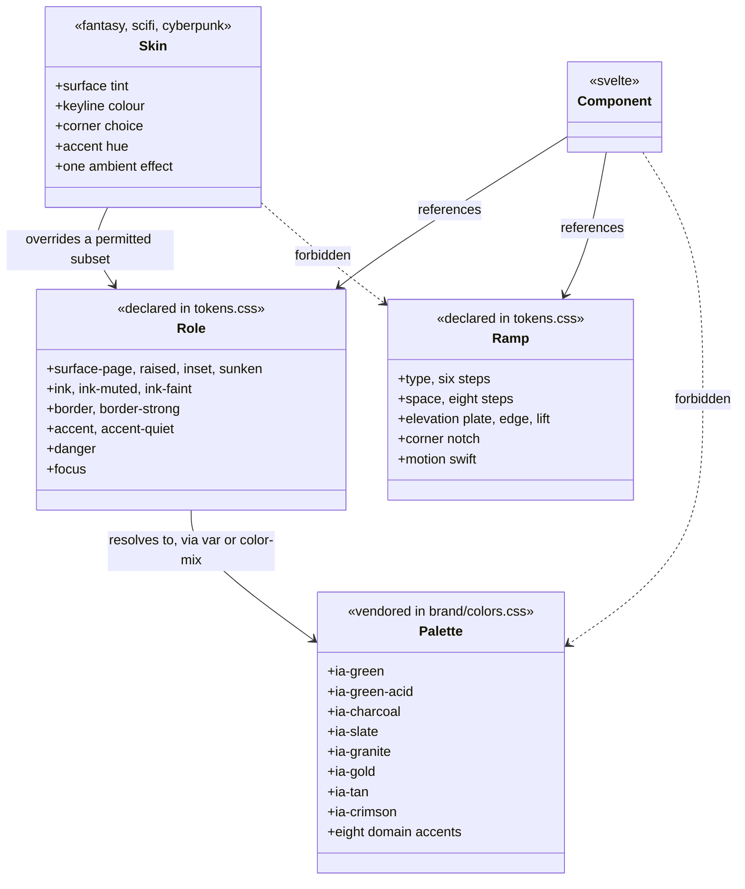
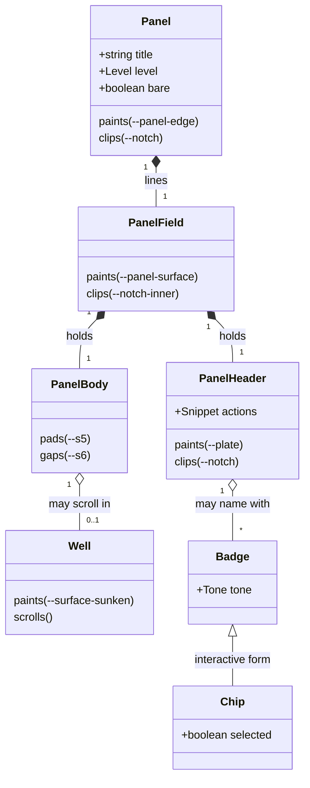
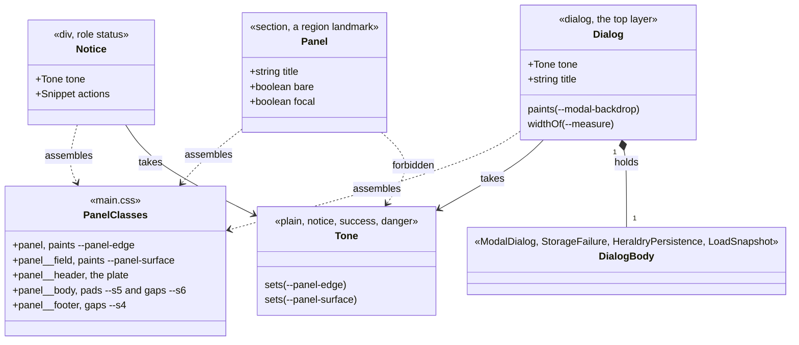
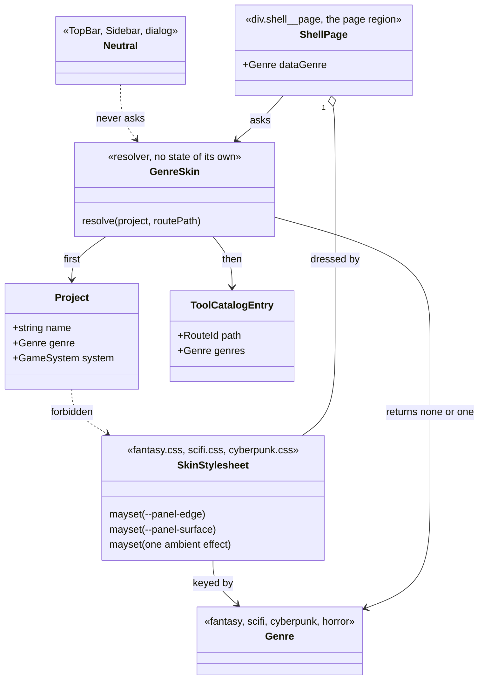
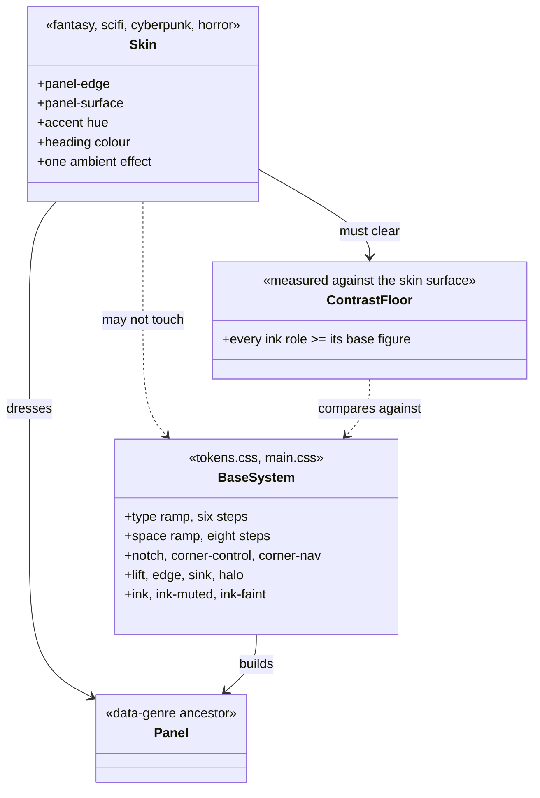
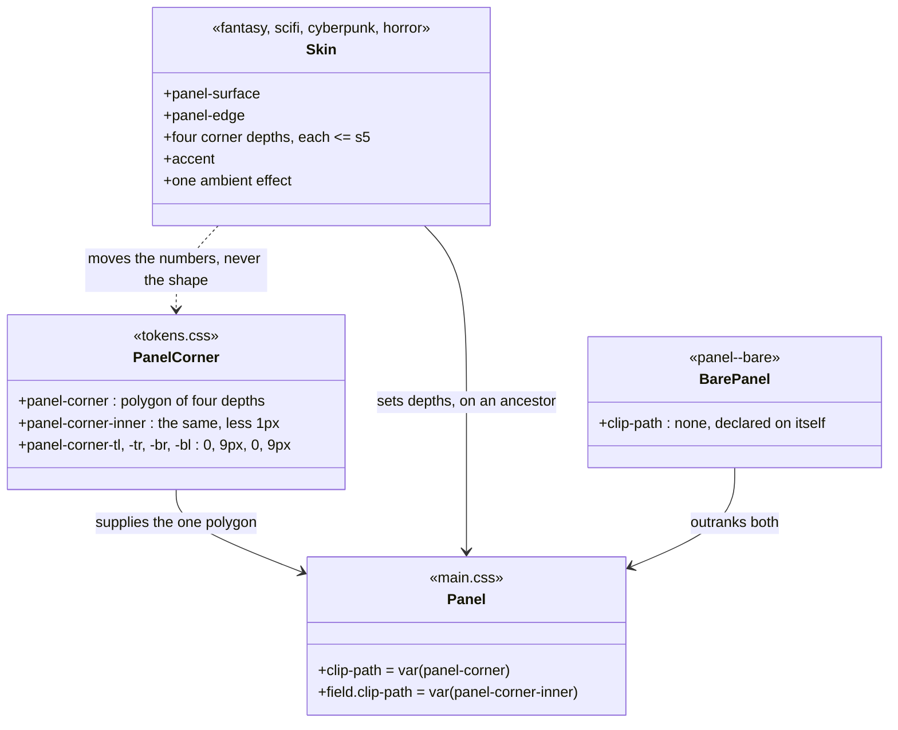

# The visual design system

This design document settles what Iron Arachne _looks like_: the tokens every component builds
from, the rules those tokens are held to, and the decisions that would otherwise be made one
component at a time.

It is the third of the three documents that describe the application. [The workshop](workshop.md)
settled what a user's work **is** — projects, artifacts, tools. [The application
shell](app-shell.md) settled where a user **stands** while they do it — a top bar, six
destinations, a measure-capped page region. Neither settled how any of it **looks**, and that
omission is the whole of [#77](https://github.com/ironarachne/ironarachne/issues/77): the site
works and does not look finished, because spacing, type and colour are decided per component and
so nothing lines up between two pages.

**Status:** accepted. The [token taxonomy](#token-taxonomy) was reviewed and approved on
2026-08-26, which is the gate CLAUDE.md puts in front of implementation: the tokens issue can be
built from it without further design work. Nothing here is built yet — see [What this
changes](#what-this-changes) for what the implementation covers.

**Amended 2026-08-26 by [#114](https://github.com/ironarachne/ironarachne/issues/114)**, which
adds [The shell](#the-shell). That section settles the top bar, sidebar and drawer at all three
widths — detail the [control vocabulary](#control-vocabulary) left to one paragraph — and it
changes the taxonomy in one place: it names a third corner treatment, `--corner-nav`, which
[#113](https://github.com/ironarachne/ironarachne/issues/113) delivers with the rest of the corner
vocabulary. Nothing else in the approved taxonomy moves.

**Amended 2026-08-28 by [#115](https://github.com/ironarachne/ironarachne/issues/115)**, which
grows the [control vocabulary](#control-vocabulary) from four paragraphs of geometry into the
settled recipe for every control: the button's six variants and four states, the input, the
select, the checkbox, the field around them, and the classes they are reached by. The geometry
does not move. It amends one decision and narrows another: [focus](#3-focus-and-contrast-are-targets-not-assumptions)
is a 2px `--focus` ring on every interactive element, drawn _inside_ a control whose corner is
clipped because a `clip-path` leaves an outline nothing to paint on; and the 44px touch target
grows the control itself wherever controls sit beside one another, rather than the invisible
overlay the top bar's lone icon button can afford.

**Amended 2026-08-28, again during implementation:** `--t-micro` moves to the body face. Cinzel
Decorative at 11px uppercase is not quickly readable, and a button label that is not quickly
readable is not doing its job — so every control, label, badge, kicker and nav item is Inclusive
Sans, and the five larger steps are untouched.

**Amended 2026-08-28 during implementation**, with [a button's two layers](#a-button-draws-its-own-edge-and-needs-a-liner-to-do-it).
A cut corner and a border cannot both survive on one element, so a button is a `<button>` painting
its edge and a liner painting its fill — which is what `BaseButton` is for, and why the variants
are two custom properties rather than two rule sets. The plate also becomes a corner-lit radial
rather than a top-down linear gradient; what the system holds is that there is one gradient, in one
place, mixed from the palette.

**Amended 2026-08-28 by [#116](https://github.com/ironarachne/ironarachne/issues/116)**, which
adds [the panel language](#panel-language). It settles the surfaces the way the controls section
settled the controls, and it changes the taxonomy in two places: a panel needs a liner to keep its
keyline through the notch, so `--notch-inner` joins `--corner-control-inner` as a polygon rather
than a treatment; and `--halo` becomes the second shadow in the system, as a focus _state_ that no
skin may touch, where `--lift` stays the only _elevation_ shadow. It also answers [open question
2](#open-questions): `--surface-sunken` stays, as the well inside a scrolling panel.

**Amended 2026-08-29 by [#117](https://github.com/ironarachne/ironarachne/issues/117)**, which
adds [the message family](#the-message-family). Modals and banners are the last surfaces outside the
system, and the section settles them as one thing rather than two: a notice and a dialog are the
same toned panel at two levels of interruption. It changes the taxonomy in one place, and reverses a
sentence in [colour roles](#colour-roles): the three `--modal-border-*` aliases do **not** stay. A
role named after a component is the thing the taxonomy exists to prevent, so they go, `--success`
joins `--danger` as a thirteenth role, and a tone is carried by the panel's own two custom
properties rather than by a fourth border colour.

**Amended 2026-08-29 by [#118](https://github.com/ironarachne/ironarachne/issues/118)**, which adds
[applying a skin](#applying-a-skin). [Decision 2](#2-genre-skins-are-a-permitted-subset-not-a-second-look)
already said a skin follows the open project's genre and that the shell is neutral; this settles
how, which is the piece every skin issue after it is written against. It changes nothing in the
taxonomy. It does replace a mechanism: a skin is selected by `data-genre` on the page region rather
than by a class, written in one place instead of thirty, and `GeneratorPage`'s free-string `theme`
prop is deleted rather than joined.

**Amended 2026-08-29 by [#119](https://github.com/ironarachne/ironarachne/issues/119)**, which adds
[the skin contract, and the fantasy skin](#the-skin-contract-and-the-fantasy-skin). All three skin
files do the same wrong thing, so the section settles the shape of a skin file once — for #119 to
build and #120–#122 to copy — and then works fantasy out in full. It adds one rule: a skin's surface
may shift hue freely but its luminance may not rise above `--surface-raised`'s, which is what keeps
every ink role at least as readable on a skinned panel as on a base one without measuring four skins
separately.

It also found a failure in the approved taxonomy. **`--ink-faint` did not meet its 4.5:1 target on
any panel** — 3.9:1 on `--surface-raised`, because the figure in [colour roles](#colour-roles) was
measured against the page and a label lives on a panel. Fixed in
[#149](https://github.com/ironarachne/ironarachne/issues/149), which moved both `--ink-faint` and
`--ink-muted` and restated the whole table against `--surface-raised`.

**Amended 2026-08-30 by [#120](https://github.com/ironarachne/ironarachne/issues/120)**, which adds
[the sci-fi skin, and the corner every genre gets](#the-sci-fi-skin-and-the-corner-every-genre-gets).
The skin itself is the contract filled in a second time; the corner is not. Decision 2 has always let
a skin set one and [elevation](#elevation) has always named three treatments, but only the cut exists
as a polygon and no skin has a way to ask for another — fantasy could decline the question and #120
and #121 cannot. So the panel's polygon is written once with a depth at each corner, a skin sets the
four depths, and the "three treatments" cap is replaced by a bound with a reason behind it: one shape
per genre, capped at `--s5`, no two alike. The formula sits on the clipping elements rather than on
`:root`, because a `var()` inside a custom property resolves where it is declared — a correction this
document earned in a browser rather than reasoned out. It adds one measured band — a skin's keyline
between 1.3:1 and 2.2:1 on its own surface — and settles that a skin setting `--accent` moves the
halo's hue with it, which is permitted because the halo's geometry, its opacity and the `--focus`
ring are all untouched.

Approved and built. One claim in it was wrong and is corrected where it stands: the formula was
put on `:root`, where a `var()` inside a custom property resolves against `:root` rather than against
the panel, and the browser suite caught a sci-fi panel wearing the right surface and the base's
corner.

**Amended 2026-08-30 by [#121](https://github.com/ironarachne/ironarachne/issues/121)**, which adds
[the cyberpunk skin, and what a keyline is measured against](#the-cyberpunk-skin-and-what-a-keyline-is-measured-against).
Two things in it are not another skin. The **flicker does not survive**: `cyberpunk.css` runs two
animations at once on type, with hard cuts 40ms apart, and it is the only thing in the app that goes
near WCAG 2.3.1's three flashes per second — so the genre keeps the idea at 0.04Hz on a hairline, and
the document gains a floor on how fast a skin may animate at all. And the **keyline band is
corrected**: #120 measured one surface and stated the rule as a ratio against a surface the skin
itself sets, which asks a near-black genre to wear a grey keyline. It is a register in the keyline's
own luminance now, 0.055 to 0.111, and every existing skin is already inside it — with one exception
the same section adds, on area rather than taste: a **corner mark** covering under a fifth of the
perimeter may go to full brightness, which is what lets this genre wear undiluted acid and magenta
without putting a bright wire around every panel on the bench.

Drawn against [Cyberpunk 2077's screen language](https://designbycurio.com/learn/cyberpunk-2077-screen),
which supplies the L-bracket corner mark, the near-black ground and the knife-edge corner — and three
techniques the contract refuses, listed where they are refused rather than dropped silently. It also
revises #120's reserved shape for this genre from a 12px slash to four square corners: a cut corner
truncates the bracket that is meant to sit in it.

Approved and built.

**Amended 2026-08-30 by [#158](https://github.com/ironarachne/ironarachne/issues/158)**, which is a
correction rather than a section: the surface rule governed `--panel-surface` and said nothing about
the layers painted on it, and every layer that existed lightened — taking `--ink-faint` to 4.18:1,
4.02:1 and 4.29:1 against its 4.5:1 floor. Anything a skin paints where text can sit may only darken
now, which is stated in [the surface rule](#a-skins-surface-is-never-lighter-than-the-bases) and
swept. No surface moved.

**Amended 2026-08-30 by [#122](https://github.com/ironarachne/ironarachne/issues/122)**, which adds
[the horror skin, and the discipline of not startling anyone](#the-horror-skin-and-the-discipline-of-not-startling-anyone)
— the fourth genre, the only one with no file to rewrite, and the first written under the whole
contract rather than converted into it. It adds one rule: **a skin may not paint a tone's colour as
its keyline**, because neat crimson is `--danger`, and a genre wearing it would make a horror project
look like a page of failed writes and hide the one panel that had really failed. The rest is the
contract used as intended: an institutional green surface with room under the readability ceiling, a
blood stain that darkens, and the slowest ambient effect in the app at 60s.

Awaiting approval, unlike the amendments above it, which are built: #122 is `needs-design`, and the
tone rule, the surface and the 60s breath are what CLAUDE.md's review gate asks a human to approve
before implementation starts.

**Amended 2026-08-30, in review of the above:** every genre gets a panel shape of its own, which
replaces the "three corner treatments" cap rather than extending it. The panel's polygon is written
once with a depth at each corner, a skin sets the four depths, and the bound is `GENRES` — one shape
per genre, none deeper than `--s5`, no two alike. Fantasy's "corner: unchanged" is reversed by it:
the base's cut goes back to being the app's own neutral plate and fantasy takes a shield's foot,
which is two lines in a file #119 already shipped.

Written against the rough-cut mockup published from the [design
canvas](https://claude.ai/code/artifact/c2f18fd6-1a76-46bd-9044-c8cfc888befb) — five artboards:
the workshop at 1440, the phone at 390 with its drawer, genre skins, the token taxonomy, and the
control vocabulary. Where this document and the mockup disagree, this document is right: it
corrects three of the mockup's stated contrast ratios and raises one token that failed its own
target. Those corrections are noted where they occur.

## What this is not

Not a rebrand. The palette, the two typefaces and the icons are **vendored** from
`ironarachne/ironarachne_branding`, pinned in `brand-assets.json` and copied by
`scripts/sync_brand_assets.sh`. `src/lib/styles/brand/colors.css` and everything in
`src/lib/assets/fonts/` are never edited in place — a colour change is made in the brand repo and
synced. See [brand assets](brand-assets.md).

The design here is what the app _does_ with the brand. Every colour this document names is an
existing `--ia-*` entry or a stated mix of two, and there is no third place a colour value can be
written down.

## The problem

`src/lib/styles/tokens.css` is 47 lines. It aliases thirteen palette entries, maps three modal
roles, and declares `--measure`. That is a vocabulary for colour and nothing else, so:

- **Type has no scale.** `main.css` sets `h1` through `h5` with per-element sizes and a global
  `line-height: 1.75`, and every component that wants something in between picks a number. The
  workshop, the vault and a generator page do not agree on what a heading is.
- **Spacing is invented per component.** There is no ramp to be off, so nothing is off, so
  nothing lines up.
- **Controls are copied, not shared.** The literal `rgb(92, 86, 73)` button gradient is written
  out three times — in `main.css`, in `fantasy.css` and again in `modal.css` for the danger
  variant. Changing what a button looks like means finding all three.
- **There is no elevation or density language**, which is why panelled surfaces read as boxes on
  a page rather than as plates on a bench.
- **The genre skins' relationship to the base is undeclared.** `fantasy.css`, `scifi.css` and
  `cyberpunk.css` each restyle headings and re-declare the whole button. Are they a skin over one
  system or three separate looks? Today it is somewhere between, which is the answer that costs
  the most to maintain.

## Token taxonomy

A visual system persists no types, so the domain-model step lands here instead: **every token the
system defines, its role, and which tokens a component is allowed to reach for.**

Three layers, and the direction is strictly one-way:



This is the one place a diagram earns its keep, because the forbidden edges are the whole point
and prose states them less clearly than a crossed arrow does. The ramps below are tables rather
than diagrams; a class diagram of a list of sizes would be drawing for form's sake.

Read the diagram as four rules:

1. A **role** resolves to a palette entry, or to a `color-mix()` of two. It never holds a hex.
2. A **component** references a role or a ramp step. It never references `--ia-*` and never a hex.
3. A **skin** overrides a permitted subset of roles. It never touches a ramp.
4. Nothing reaches past a layer. `tokens.test.ts` already enforces rule 1 and half of rule 2; see
   [Enforcement](#enforcement).

### Type ramp

Six steps. Cinzel Decorative carries headings; Inclusive Sans carries anything read as a sentence,
and the smallest step — the one controls and labels are set in.

| Token         |   Size | Line height | Face                               | Used for                         |
| ------------- | -----: | ----------: | ---------------------------------- | -------------------------------- |
| `--t-display` |   26px |        1.05 | Cinzel Decorative 700              | Page title, one per page         |
| `--t-title`   |   20px |        1.10 | Cinzel Decorative 700              | Generated name, bench heading    |
| `--t-heading` |   16px |        1.20 | Cinzel Decorative 700              | Panel heading                    |
| `--t-body`    |   14px |        1.45 | Inclusive Sans                     | Prose and generated output       |
| `--t-small`   | 12.5px |        1.40 | Inclusive Sans                     | Lists, sublines, field values    |
| `--t-micro`   |   11px |        1.40 | Inclusive Sans, +0.08em, uppercase | Labels, kickers, badges, buttons |

**`--t-micro` is the body face, and it is the one step where the display face would have been the
obvious choice.** Cinzel Decorative is a display face with a great deal of modulation in its
strokes; at 11px, uppercased, that detail falls between pixels and a button label stops being
quickly readable, which is the whole job of a button label. It reaches further than buttons —
every nav item, badge, kicker and field label is this step — and that is the point: two 11px steps
in two faces is exactly the split the ramp exists to prevent. Headings are unaffected, so the
brand's face still carries every line that is read as a title.

Two numbers do most of the work. Line height falls from today's global 1.75 to **1.45**, and the
largest step falls from 40px to **26px**. The ramp is what makes the site read tighter — not
per-component trimming, which is what produced the current state.

The ramp has to look right inside `--measure` (70ch), which is what caps prose on `section.main`.
At `--t-body` that measure is roughly 640px, which is a comfortable column; the ramp is designed
at that width, not at the full bench width.

`h1`–`h6` map onto the ramp rather than carrying sizes of their own: `h1` → `--t-display`, `h2` →
`--t-title`, `h3`/`h4` → `--t-heading`, `h5`/`h6` → `--t-micro`. Today's decorative `h3::after`
rule and `h5` bottom border go; a heading that needs separating from what follows gets a `.rule`,
which is a token-driven 1px `--border` line, not a pseudo-element that only some headings have.

### Space ramp

Eight steps, and a component may not invent a value outside them.

| Token  | Value | Typical use                         |
| ------ | ----: | ----------------------------------- |
| `--s1` |   2px | Hairline gaps, label-to-field       |
| `--s2` |   4px | Badge padding                       |
| `--s3` |   6px | Icon-to-text, chip gaps             |
| `--s4` |   8px | Gap inside a control group          |
| `--s5` |  12px | Panel padding, gap between panels   |
| `--s6` |  16px | Section spacing inside a panel body |
| `--s7` |  24px | Page padding, gap between sections  |
| `--s8` |  32px | Page-level separation, hero spacing |

Nothing above `--s8` exists. A gap that wants 48px is a layout that wants rethinking, and making
that awkward is the point.

The ramp is deliberately dense at the bottom: the difference between 2px and 8px is where a
control either reads as one object or as three, and that is exactly the range the current site has
no vocabulary for.

### Colour roles

Thirteen roles. The middle column is the expression that goes in `tokens.css` — never a hex, so
`tokens.test.ts` keeps holding.

**The ratio is measured against `--surface-raised`, not against the page**, and that choice is
load-bearing. A panel is the lightest surface any text in this app sits on, and
[the skin contract](#a-skins-surface-is-never-lighter-than-the-bases) holds it there — a skin may
shift its surface's hue but never raise its luminance above this one. So `--surface-raised` is the
worst case for every ink role, in every present and future genre, and a role that clears its floor
here clears it everywhere.

This table measured against the page until [#149](https://github.com/ironarachne/ironarachne/issues/149),
and that is precisely how `--ink-faint` came to sit below its own floor for as long as it did: it
read 4.8:1 against the page, 3.9:1 against a panel, and a label is never on the page.

| Role               | Resolves to                                      | Contrast | Used for                                  |
| ------------------ | ------------------------------------------------ | -------: | ----------------------------------------- |
| `--surface-page`   | `var(--charcoal)`                                |        — | The page behind everything                |
| `--surface-raised` | `var(--slate)`                                   |        — | Panels, top bar, sidebar                  |
| `--surface-inset`  | `color-mix(in srgb, var(--charcoal) 80%, black)` |        — | Inputs, seed fields, wells, log rows      |
| `--surface-sunken` | `color-mix(in srgb, var(--charcoal) 60%, black)` |        — | Scroll wells behind an inset run          |
| `--border`         | `var(--granite)`                                 |        — | Every neutral keyline                     |
| `--border-strong`  | `var(--tan)`                                     |        — | Control edges, base skin keyline          |
| `--ink`            | `color-mix(in srgb, white 95%, var(--charcoal))` |   12.2:1 | Body text, headings, control labels       |
| `--ink-muted`      | `color-mix(in srgb, white 66%, var(--charcoal))` |    6.3:1 | Sublines, list detail, secondary values   |
| `--ink-faint`      | `color-mix(in srgb, white 54%, var(--charcoal))` |    4.6:1 | Labels and kickers only, never a sentence |
| `--accent`         | `var(--iron-arachne-green)`                      |    8.6:1 | Links, the active nav marker              |
| `--accent-quiet`   | `var(--gold)`                                    |    5.8:1 | Kickers, primary control edge             |
| `--danger`         | `var(--crimson)`                                 |    1.8:1 | Fills and edges — **never text**          |
| `--success`        | `var(--emerald)`                                 |    2.1:1 | Fills and edges — **never text**          |
| `--focus`          | `var(--acid-green)`                              |   10.8:1 | The focus ring, and nothing else          |

This table has been corrected twice, and both times for the same reason: a ratio that was
believed rather than measured.

**Against the mockup**, which mislabelled three values. `--ink-faint` was `#7b7f88` at 4.16:1
against the page, below the 4.5:1 it is held to, despite the mockup labelling it 4.6; `--ink-muted`
measured 6.8:1 against the page and not 7.1; `--accent-quiet` 7.1:1 and not 8.0.

**Against the wrong surface**, which is [#149](https://github.com/ironarachne/ironarachne/issues/149)
and is the more instructive of the two. The first correction moved `--ink-faint` to a 48% mix and
recorded 4.8:1 — a true number about `--surface-page`, and the wrong question, because a label is
never on the page. On a panel that same token measured **3.9:1**, so the role went on failing its
floor while the table said it passed. Both ink roles moved to fix it: `--ink-faint` to 54% and
`--ink-muted` to 66%, together, because raising the first alone would have left the two 1.17:1
apart and a three-step ink ramp reading as two.

The lesson is in the reference surface rather than in either number. A ratio is a fact about a
foreground **and a background**, and half of it was missing here.

`--danger` and `--success` are listed with their ratios precisely so nobody uses either as a text
colour later: crimson is 1.8:1 on a panel and emerald 2.1:1, and neither is readable anywhere —
2.2:1 and 2.65:1 even against the page, which is the most forgiving surface in the app.
Destructive intent is carried by a crimson **edge and fill** under `--ink`-coloured text, and a
successful outcome by an emerald one. **This is the single fact the [message
family](#the-message-family) is built on** — two of the three tones a message can take cannot be
said in words at all, so a tone is always the surface and never the sentence.

`--success` is added by [#117](https://github.com/ironarachne/ironarachne/issues/117) and pulls
emerald out of the unused eight. The seven remaining palette entries — amethyst, cyan, plasma blue,
magenta, and tan outside `--border-strong` — are reached only through a genre skin or a domain
marker, and a component never names one directly.

**`--modal-border-message` / `-error` / `-success` do not survive**, and the sentence that said they
would is reversed here rather than quietly dropped. They map a role onto a palette entry in one
place, which is the right shape — but they are named after the one component that happened to need
them first, and the same three meanings are wanted by a banner, an inline notice, and anything later
that has to say how something went. A role named for a component is how an app grows a second
vocabulary for an idea it already has a word for. All three meanings are already roles:
`--accent-quiet`, `--success` and `--danger`. `--modal-backdrop` stays, because it is genuinely the
top layer's and nothing else's.

### Elevation

Three levels, and depth is carried by a keyline plus a one-pixel top highlight rather than by
blur. The result reads as pressed metal at 100% zoom instead of as a floating card, which is the
difference between a bench and a web page.

| Level      | Recipe                                                                | Used for                                        |
| ---------- | --------------------------------------------------------------------- | ----------------------------------------------- |
| **Page**   | Flat `--surface-page`, no border, no shadow                           | The page region; the bench; the main tool panel |
| **Raised** | `--surface-raised` + 1px `--border` + `--edge` + `--lift` + `--notch` | Every panel: rail, log, vault card, modal       |
| **Inset**  | `--surface-inset` + 1px `--border` + inward shadow                    | Inputs, seed fields, scroll wells, log rows     |

Supporting tokens:

- `--plate` — the control gradient: a highlight off the top-right corner of a slate box, mixed a
  little toward the brand green and falling to a 26%-black mix. This replaces the three copies of
  `rgb(92, 86, 73)`. What the system holds is that it is one gradient in one place, mixed from the
  palette; where the light falls is a look to tune, not a rule. `--plate-primary` and
  `--plate-danger` are the two variant fills, mixed from the same slate toward gold and toward
  crimson; a variant sets a fill, a keyline and a label colour and inherits the geometry.
- `--sink` — `inset 0 1px 2px rgb(0 0 0 / 45%)`, the inward shadow every input, select and
  textarea carries. A control is either raised off the surface by `--edge` or sunk into it by
  this.
- `--edge` — `inset 0 1px 0 rgb(255 255 255 / 7%)`, the top highlight that makes a plate a plate.
- `--lift` — `0 1px 0 rgb(0 0 0 / 60%), 0 6px 14px rgb(0 0 0 / 35%)`, the one shadow in the system.
- `--panel-corner` — the panel's clip, a polygon with a depth at each of its four corners,
  defaulting to a 9px cut on the top-right and bottom-left. Controls use a 7px cut of that shape
  (`--corner-control`), and a nav item a 7px cut of both corners on one edge (`--corner-nav`, added
  by [the shell](#the-nav-corner-is-a-third-treatment)). Those two are fixed. The panel's four
  depths are the one piece of geometry a genre may move, capped at `--s5` and unique per genre —
  see [a skin sets four depths](#a-skin-sets-four-depths-and-the-polygon-stays-in-the-base), which
  replaces the "three treatments" cap this section carried until #120. It was named `--notch`, and
  still is the notch on any panel no skin has reached.

**Density.** A panel differs from the page by surface, keyline and notch — not by padding, which
is `--s5` everywhere. The bench differs from a panel by having no surface at all: it is the page,
and the panels sit on it. The main tool panel likewise has no surface of its own, which is why a
genre skin reaches it only through the output it holds.

**Border or shadow?** The **border carries it.** `--lift` exists so a raised plate does not float
against the page, but a panel is identified by its keyline and its notch. This matters for the
skins: a border colour is something a skin can change safely, where a shadow that changed per
genre would make panels sit at different heights beside each other.

### Motion

- `--motion-swift` — 120ms. Every hover and press transition uses it; nothing in the interface
  animates for longer.
- Ambient genre motion is capped at **one effect per skin** and is disabled entirely under
  `prefers-reduced-motion: reduce`.

Today's shimmer, pulse and glitch live on headings, which means the type moves while it is being
read. They move to the panel surface instead. See [decision 2](#2-genre-skins-are-a-permitted-subset-not-a-second-look).

## Decisions taken here

These are the items [#77](https://github.com/ironarachne/ironarachne/issues/77) and
[#112](https://github.com/ironarachne/ironarachne/issues/112) ask to be settled rather than left
open. Each is stated either way, with the reason, because an undecided item is how a second system
gets built later.

### 1. Dark mode is the only mode

**The app is dark-only.** There is no light theme and no toggle.

The brand green is a dark-surface colour: `brand/colors.css` measures it at 1.57:1 on white and
records "never set green text on white". `--ia-green-acid` is worse at 1.24:1. The palette carries
no light-surface pair for either, so a light mode could not use the brand's own accent — it would
need a second accent, a second focus colour and a second set of role mappings, which is a second
design system wearing the same logo.

Note that `brand/colors.css` does contain a `prefers-color-scheme: dark` block that flips
`--ia-surface` and `--ia-ink`. That block is the **brand file's** business and is vendored; the app
does not read `--ia-surface`, and the roles above pin `--surface-page` to charcoal unconditionally.
The app is dark on a light-preference device, which is correct and deliberate.

### 2. Genre skins are a permitted subset, not a second look

`fantasy.css`, `scifi.css` and `cyberpunk.css` **remain skins over the base system**, and the
subset they may touch is now explicit. A skin follows the open project's genre and reaches every
panel; the shell — top bar and sidebar — is genre-neutral by rule, so the frame never changes
shape underneath the user. [Applying a skin](#applying-a-skin) settles the mechanism, and adds a
third neutral surface for the same reason as the other two: a dialog is the app speaking in its own
voice, and a skin dresses the user's work rather than the app.

**A skin may set:**

|                |                                                              |
| -------------- | ------------------------------------------------------------ |
| **Surface**    | Panel background fill, tint and texture                      |
| **Keyline**    | Border colour, weight, and which edges carry it              |
| **Corner**     | Cut, bevelled or square, from the one shared clip vocabulary |
| **Accent hue** | The panel's chip, kicker and figure colour                   |
| **Motion**     | At most one ambient effect, off under reduced motion         |

**A skin may never touch:**

|                            |                                                           |
| -------------------------- | --------------------------------------------------------- |
| **Typeface**               | Cinzel Decorative and Inclusive Sans, in every genre      |
| **Type scale and spacing** | One ramp, so two panels stay the same height side by side |
| **Control geometry**       | Button and input size, hit target, focus ring             |
| **The shell**              | Top bar, sidebar and dialogs are genre-neutral            |
| **Contrast floor**         | A skin that cannot hit its target ratio does not ship     |

This settles the three concrete things wrong with the skins today. Each re-declares the whole
button — that goes; a skin sets an accent and a keyline and inherits the rest. Each restyles
`h1`–`h6` — that goes; the type scale is not a skin's to change. And each puts its ambient effect
on heading text — the shimmer, the pulse, the glitch — where it animates words while they are
being read; the effect moves to the panel surface.

### 3. Focus and contrast are targets, not assumptions

- **Focus:** a 2px `--focus` ring on every interactive element. Never removed, never colour-only,
  and never replaced by a border change alone — a border change is invisible to someone who cannot
  distinguish the two colours. It is an outline at 2px offset on an unclipped control and an inset
  shadow on a clipped one, because a `clip-path` clips everything the element paints and an
  outline at a positive offset then paints nothing at all; see [the control
  vocabulary](#focus-on-a-clipped-control-is-drawn-inside-it).
- **Contrast:** every text role clears **4.5:1** against the surface it sits on. `--ink` is
  15.2:1, `--ink-muted` 6.8:1, `--ink-faint` 4.8:1 at its 11px uppercase size. `--danger` is a
  fill and an edge, not a text colour.
- **Hit target:** 28px is the visual height of a control; the tap area is **44px** under
  `(pointer: coarse)`. This is what keeps `e2e/pages.mobile.spec.ts` honest at 320px rather than
  merely passing. A control standing alone can hold its 28px body and grow an invisible target
  around it; one standing in a row of controls grows itself, because two overlapping targets are a
  mis-tap. See [hit targets](#hit-targets-grow-the-control-not-an-overlay).

### 4. Sound on press does not ship

The mockup draws a per-device sound toggle beside the ambient-motion one, defaulted off. **It does
not ship**, and the toggle comes out of the control sheet.

A UI sound bed defaulted to off is a feature nobody encounters, carried by an audio asset that has
to be vendored, a preference that has to be stored per device, and a mute state that has to be
respected everywhere a button exists. Defaulted to on, it is a generator site that makes noise when
you click Generate. Neither is worth the surface area in a first pass, and nothing about the token
system forecloses adding it later — a press is already a distinct state with a distinct token.

### 5. The icon set is SunGraphica's, and the credit is a licence term

**Settled.** The pack is bought: SunGraphica's _600 Minimal Icons_, licensed for commercial use,
split into 455 individual SVGs in `src/lib/assets/icons/`. The mockup's placeholder glyphs are
replaced by it.

Three consequences the token system has to absorb:

- **The credit ships.** The licence requires SunGraphica be credited, so the footer carries it on
  every page. It is a licence term, not a courtesy, and it is not a candidate for tidying away.
- **They are not brand assets.** The pack was bought for this app, so it is not vendored through
  `brand-assets.json` and there is no upstream to sync from. It is the one class of asset here
  that may be edited in place.
- **They are filled, not stroked.** The mockup drew a 1.5px stroked house style; these are solid
  glyphs with knockouts. The stroke weight in that mockup is therefore not a rule the system
  holds anything to — it described placeholders. What the system does hold is that an icon is
  painted with `currentColor` through a mask, so it takes its colour from the role around it and
  the surface shows through its holes, on any surface and in any genre skin.

## Control vocabulary

Every control in the app, settled: the button and its six variants, the input, the select, the
checkbox, the field around them, and what focus looks like on each. This is what
[#115](https://github.com/ironarachne/ironarachne/issues/115) builds.

The section used to be four paragraphs stating the geometry so that the tokens issue would know
what the tokens were for. The geometry below is unchanged from those paragraphs — what follows
settles the states, the classes and the two questions the paragraphs left open: how a focus ring
survives a clipped corner, and how a 28px control becomes a 44px tap target without eating its
neighbour's.

Out of it: **badges** and **panels**, which are
[#116](https://github.com/ironarachne/ironarachne/issues/116)'s; **modals and banners**, which are
[#117](https://github.com/ironarachne/ironarachne/issues/117)'s beyond the one danger action
described below; and **sound on press**, which
[decision 4](#4-sound-on-press-does-not-ship) settled as not shipping.

### A button is a stamped plate

One recipe, and every `button` on the site gets it from the element selector rather than from a
class. There are about 120 of them across `src/components` and `src/routes`; a system that only
reached the ones somebody remembered to annotate would leave most of the app on the old gradient,
which is the state this issue exists to end.

| Property   | Value                                                                  |
| ---------- | ---------------------------------------------------------------------- |
| Height     | 28px, as `min-height` — a label that wraps grows the plate             |
| Padding    | `--s3` block, `--s5` inline                                            |
| Type       | `--t-micro`, `--t-micro-tracking`, uppercase, `--ink` — Inclusive Sans |
| Fill       | `--plate`                                                              |
| Keyline    | 1px `--border-strong`                                                  |
| Highlight  | `--edge`                                                               |
| Corner     | `--corner-control`                                                     |
| Transition | `--motion-swift` on border colour, colour and box shadow               |

Four states, and the press is the one that has to feel like a press:

| State        | Recipe                                                                                                                                                    |
| ------------ | --------------------------------------------------------------------------------------------------------------------------------------------------------- |
| **Rest**     | The plate above.                                                                                                                                          |
| **Hover**    | Keyline to `--focus`, a faint glow — `0 0 6px color-mix(in srgb, var(--focus) 30%, transparent)` beside `--edge` — the plate 8% brighter, and a 1px lift. |
| **Press**    | `translateY(1px)`, `--edge` swapped for an inward shadow, label `--accent`.                                                                               |
| **Disabled** | Flat `--surface-inset`, 1px `--border`, no highlight and no shadow, label `--ink-faint`, `cursor: not-allowed`.                                           |

The movement is the 1px lift and the 1px drop, and that is all of it. Both run at
`--motion-swift` like every other state change, and both go under `prefers-reduced-motion: reduce`
while the state itself stays: hover still lights the keyline and press still drops the highlight
and turns the label, they simply arrive rather than travel. The plate brightens under `filter`
rather than by swapping gradients, because a gradient cannot be transitioned as a colour and two
gradients cross-fading is a repaint rather than a transition.

The disabled state is the one that drops the plate entirely. A greyed gradient still reads as a
raised object, and a raised object reads as pressable; a flat inset one does not.

### A button draws its own edge, and needs a liner to do it

`clip-path` clips everything the element paints, and a `border` is something the element paints.
On the two diagonal edges of a cut-cornered button the border is therefore sliced off: the plate
meets the page with no keyline exactly where the shape is most visible. A single element cannot
draw this, whatever is written on it — `background-clip: padding-box` under a border-box layer
fails the same way, because the clip cuts both layers along the same diagonal.

**So a button is two elements.** The `<button>` paints the edge colour across its whole box; a
liner one pixel inside it paints the fill over all of that except a one-pixel band. The band _is_
the border, and it follows the diagonal because both shapes are cut. `BaseButton` is that markup,
and it is the reason the component exists — not styling convenience, which the element selector
already had.

| Layer                         | Paints                                             | Clip                     |
| ----------------------------- | -------------------------------------------------- | ------------------------ |
| `<button>`                    | `--btn-edge`, across the whole box, `padding: 1px` | `--corner-control`       |
| `<span class="…inner-field">` | `--btn-fill`, one pixel inside                     | `--corner-control-inner` |

`--corner-control-inner` cuts at 6px where the plate cuts at 7px. The liner is 2px smaller in each
direction, so an equal cut would converge on the outer diagonal at one end and diverge at the
other; a pixel shallower keeps the two parallel. **It is not a fourth corner treatment** — it is
the control's own treatment, drawn a pixel in, and the cap in [Elevation](#elevation) counts
treatments rather than polygons.

**The variants are two custom properties, not two rule sets.** Everything in `main.css` is written
against `--btn-edge` and `--btn-fill`, so a variant, a hover and a disabled state each set two
colours and neither markup is mentioned. That is what lets a plain `<button>` — the six wrapper
buttons around images, and any that has not been converted — read the same system from the element
selector, differing only in the one thing it cannot draw.

Two variants stay single-layer on purpose. An **icon** button is square and unclipped, so it has no
diagonal to rescue. A **quiet** button has no fill, and a band is only visible against one: a
transparent liner would show the whole edge colour rather than a pixel of it. So quiet is square
too — a control with nothing to paint over cannot have a painted edge, and a shaved one reads as a
rendering fault rather than as a shape.

### Focus on a clipped control is drawn inside it

[Decision 3](#3-focus-and-contrast-are-targets-not-assumptions) asks for a 2px `--focus` outline
at 2px offset on every interactive element. That is right for every control the app has except
the one it has most of: **`clip-path` clips everything the element paints, and an outline at a
positive offset lies entirely outside the clip region**, so a cut-cornered button declaring one
paints no ring at all. This is the same property that makes the sidebar's current-item marker an
inset shadow rather than a border — [the nav item](#a-nav-item) states it — and it lands harder
here, because a marker that gets shaved is cosmetic and a focus ring that never paints is an
accessibility failure.

**The rule, restated so it holds for both:** every interactive element shows a 2px `--focus` ring,
and whether the ring is drawn outside or inside the control follows from whether the control is
clipped.

| Control                                                  | Ring                                                       |
| -------------------------------------------------------- | ---------------------------------------------------------- |
| Clipped — any button carrying `--corner-control`         | `inset 0 0 0 2px var(--focus)`, beside `--edge`            |
| Unclipped — inputs, selects, checkboxes, the icon button | `outline: 2px solid var(--focus)` at `outline-offset: 2px` |

Checked rather than assumed: a Chromium render of two identical buttons, one clipped and one not,
each declaring the same `outline: 2px solid` at `outline-offset: 2px`, paints the ring on the
unclipped one and nothing at all on the clipped one.

Neither is traded away for a fill, a border change or a colour change, at any state — including
on a control that is already hovered or pressed, which is exactly when a keyboard user is most
likely to be looking for it.

### Variants

Six, and each is a single class on the element that already carries the base. Nothing here is a
second button implementation; a variant sets a fill, a keyline and a label colour, and inherits
the geometry — which is what makes "a skin may not touch control geometry"
([decision 2](#2-genre-skins-are-a-permitted-subset-not-a-second-look)) a rule with something
behind it.

| Variant         | Class              | Recipe                                                                                                                                                                                                       |
| --------------- | ------------------ | ------------------------------------------------------------------------------------------------------------------------------------------------------------------------------------------------------------ |
| **Secondary**   | none               | The base plate. The default, and the reason an unannotated `button` is already correct.                                                                                                                      |
| **Primary**     | `.btn-primary`     | `--accent-quiet` keyline over `--plate-primary`, the base plate warmed toward gold. One per surface.                                                                                                         |
| **Quiet**       | `.btn-quiet`       | No fill, 1px `--border`, label `--ink-muted`, and **square**: there is no fill to paint a band against, and a clipped border is shaved at the diagonals. Hover fills `--surface-inset` and lifts to `--ink`. |
| **Destructive** | `.btn-destructive` | `--danger` keyline over `--plate-danger`, the base plate mixed toward crimson, label `--ink`. Never crimson text — 2.2:1.                                                                                    |
| **Icon**        | `.btn-icon`        | 28×28, square, no clip, no inline padding. A 7px cut on a 28px square eats the glyph.                                                                                                                        |
| **Small**       | `.btn-sm`          | 24px, `--s2` block and `--s4` inline padding. Type does not change: `--t-micro` is the floor.                                                                                                                |

`.btn-sm` composes with any of the others; the rest are mutually exclusive, and a button wearing
two of them gets whichever the stylesheet lists last, which is a bug rather than a feature. The
`btn-` prefix is deliberate — these are global classes in `main.css`, so they sit in the same
namespace as every component's own class names, and a bare `.primary` would collide with one
eventually.

**Primary is a claim about the page, not about the button.** A surface with two primaries has
none, and a generator whose Generate is primary should not also promote Save.

### Inputs, selects and checkboxes

An input is the inverse of a button: sunk into the surface rather than raised off it.

| Property | Value                                                                |
| -------- | -------------------------------------------------------------------- |
| Height   | 28px, as `min-height`                                                |
| Padding  | `--s2` block, `--s4` inline                                          |
| Type     | `--t-small`, `--ink`                                                 |
| Fill     | `--surface-inset`                                                    |
| Keyline  | 1px `--border`                                                       |
| Shadow   | `--sink`, the one inward shadow — `inset 0 1px 2px rgb(0 0 0 / 45%)` |
| Corner   | None. Square, and see below                                          |

Focus takes the `--focus` keyline **and** the ring; hover lightens the keyline to
`--border-strong`. Disabled matches the button's: `--ink-faint` on a flat surface.

**An input is not clipped, and that is the decision.** A cut corner on a text field puts the
diagonal exactly where the caret sits at the end of a long value, and the clip would then cost
the outside focus ring as well — two prices for a shape nobody reads as meaningful on a field.
The button carries the corner vocabulary; the input carries the inset.

A **select** is the same box. Its arrow stays the native one: a custom arrow is a background image
per state per genre, and the native control is the one thing on the page that already renders its
own options correctly on every platform. `box-sizing: border-box` and `max-width: 100%` stay
exactly as `main.css` has them, because a select is as wide as its longest option and that is
wider than a 320px phone.

A **checkbox** keeps its native box and takes `accent-color: var(--accent)`. It is the one control
where the native rendering is already the right size and shape, and restyling it means rebuilding
the indeterminate and checked states by hand for nothing.

The **seed field** is an input in a monospace face. `main.css` styles it by `#seed`, which is an
id selector doing a component's job; it becomes a class on the field so that a second seed on a
page is not a second element with the same id.

### The field around a control

`.input-group` is the wrapper every generator's controls already use, so it is where the label
belongs rather than in a new component:

| Property | Value                                            |
| -------- | ------------------------------------------------ |
| Layout   | Flex column                                      |
| Gap      | `--s1` — the label belongs to the field it names |
| Margin   | `--s6` block-end                                 |
| Label    | `--t-micro`, tracking, uppercase, `--ink-faint`  |

The global `label { font-weight: 700; margin-right: 1rem }` goes. It was written for a label
beside its field and is wrong for one above it, and 1rem of the fluid root is not a ramp step.

A checkbox reads the other way round — box first, then label — so `.input-group--inline` lays the
group out as a row with `--s3` between the two and the label's `--ink` weight, since there it is
the thing being clicked. `CheckboxField` and `SeedControls`' lock take that modifier; nothing
else does.

### Hit targets grow the control, not an overlay

Under `(pointer: coarse)`, every button, input, select and inline label reaches `min-height: 44px`
directly. The condition is the pointer and not the width, for the reason
[the drawer](#the-drawer-below-768px) gives: a touch laptop at 1280px wants the same target and a
phone plugged into a mouse does not.

**This is deliberately not the `::after` overlay the top bar's icon button uses.** That trick
keeps a 28px plate at a 44px target by painting an invisible box 8px past the control on each
side, and it is right there because the bar holds one button in a 44px row with nothing above or
below it to collide with. A generator's controls are a wrapping flex row with `--s5` between
rows: two overlays 8px deep on either side of a 12px gap overlap in the middle, and an overlap
between two tap targets is a mis-tap that the user reads as the site being broken. Where controls
sit next to each other, the target has to be the control.

The visual height therefore grows on touch. That is the correct trade: the 28px body is a density
decision for a pointer that can hit it, and a phone is not that.

### What this leaves to the skins

The three skin files each re-declare `button` today, with their own gradients, borders, sizes and
`:disabled` greys — which is precisely what
[decision 2](#2-genre-skins-are-a-permitted-subset-not-a-second-look) says a skin may never do.
**Those `& button` blocks come out as part of this issue**, because a skin's copy of the old
gradient outranks the new system wherever a genre is applied, and a redesign that only shows up
on ungenre'd pages is not a redesign.

Their heading effects stay where they are. Moving the shimmer, the pulse and the glitch off type
and onto the panel is [#119](https://github.com/ironarachne/ironarachne/issues/119),
[#120](https://github.com/ironarachne/ironarachne/issues/120) and
[#121](https://github.com/ironarachne/ironarachne/issues/121), one skin at a time, and pulling
that forward here would put four genres' worth of untested surface in a controls change.

### A round icon button

Five controls are round: **move left**, **move right** and **close** on a workshop panel's header,
and **export** and **delete** on a row in the project listing. `RoundIconButton` is what they
share; the five named components over it each carry a glyph and a default accessible name.

**Round says what they act on.** A plate acts on the content in front of you — generate it, save
it, download it. These act on a thing as an object: which slot a panel occupies and whether it is
there at all; whether a saved artifact leaves as a file or stops existing. They carry no label to
say so, so the shape says it. It is the one shape in the system that is not a cut rectangle, and
a new one has to be the same kind of thing — a verb applied to a whole object, with no room for a
word — or it is a plate.

| Property | Value                                                                      |
| -------- | -------------------------------------------------------------------------- |
| Size     | 28px circle, 44px under `(pointer: coarse)`                                |
| Fill     | `--btn-fill`, the plate                                                    |
| Keyline  | 1px `--btn-edge`                                                           |
| Glyph    | 14px, `currentColor` — `--ink`, `--accent` pressed, `--ink-faint` disabled |
| Focus    | The ordinary outline at 2px offset                                         |

Two things follow from being round rather than cut. There is **no liner**: a `border-radius` does
not clip a border the way a `clip-path` does, so the edge survives on its own and there is nothing
to paint a band with. And the **focus ring is an outline again**, at the offset
[decision 3](#3-focus-and-contrast-are-targets-not-assumptions) asks for, because an outline
follows the circle instead of being shaved by a clip region.

Hover, press and disabled are not restated in the component: it reads `--btn-edge` and
`--btn-fill` like every other control, so the states come from `main.css` and a round button
lights its keyline exactly when a plate does.

**Delete is the one with a tone.** `tone="danger"` sets those same two properties to `--danger`
and `--plate-danger`, so a destructive round button is crimson-edged at rest and still lights,
sinks and dims from the rules every other control uses. Crimson is 2.2:1 on charcoal and is never
the glyph — the edge and the fill carry it, under an `--ink`-coloured mark, which is what
[the colour roles](#colour-roles) say destructive intent is.

**The glyphs are the first use of the icon set.** `triangle-left`, `triangle-right`, `cross`,
`download` and `delete`,
inlined with `?raw` rather than loaded through an `` — each file paints one `currentColor`
rect through a mask, so inlined it takes the colour of the button around it and the plate shows
through its holes, which is what [decision 5](#5-the-icon-set-is-sungraphicas-and-the-credit-is-a-licence-term)
says an icon is. `cross` is `set1`'s plain X rather than `controller`'s circled one: the button is
already a circle, and a disc inside a disc reads as a mistake.

### A list row

A row in a list of choices — the tool browser's tools, the vault's artifacts, a project's
contents, the session log's runs. Four lists had hand-rolled one of these each, with four sets of
literals and three different corner radii between them; `ListButton` is the one of them.

It is a button and takes none of the plate: no gradient, no 28px body, and **no uppercase**. Type
is `--t-small` in the body face, sentence case, because a row is a name someone reads rather than
a label they scan — a generated name in caps stops being the name.

| Property | Value                                                              |
| -------- | ------------------------------------------------------------------ |
| Width    | Full, with the content laid out name-left, detail-right            |
| Type     | `--t-small`, sentence case, `--ink`                                |
| Padding  | `--s2` block, `--s4` inline                                        |
| Corner   | `--corner-control`, with the same liner a button uses for its edge |
| Gap      | `--s1` between rows                                                |

| State        | Recipe                                                                                           |
| ------------ | ------------------------------------------------------------------------------------------------ |
| **Rest**     | No edge and no fill. The row shows the surface it sits on.                                       |
| **Hover**    | `--accent` edge over an 18% accent fill.                                                         |
| **Selected** | `--accent-quiet` edge over a 22% fill, and `--s3` block padding — the current row stands taller. |
| **Focus**    | The inset ring, as on every clipped control.                                                     |

**The selected row is taller on purpose.** Gold against green says which one the list is on rather
than which one the pointer is over, and the extra two pixels a side make it findable down a long
list without reading it — the same job the sidebar's current destination does with a marker. It is
the one place in the system where a state changes a control's size, so it transitions at
`--motion-swift` like everything else.

**The fills are opaque**, mixed into `--surface-inset` rather than into `transparent`. That is
forced by the two-layer edge: a translucent liner lets the edge colour through across the whole
row, and the row reads as solid green instead of edged. It also makes a row look the same on the
page as it does on a panel, which the four translucent versions did not.

Selected plus hover is selected, for the reason [a nav item](#a-nav-item) gives.

### Navigation, badges and modals

**Navigation** is the one shape that breaks the button rule on purpose: flush to the left edge,
square on that side, notched on the other, with the current destination taking the plate, the
`--accent` left marker and the notch. Nothing else in the app is notched on that side, so the eye
finds the current destination without reading it. [The shell](#the-shell) states the geometry,
the four states and the three widths, and #114 built it.

**Badges** are pill-shaped, `--t-micro`, bordered in `currentColor` over `--surface-inset`.
`ToolMaturityBadge` shows experimental in `--accent-quiet` and beta in cyan; release-ready shows
nothing, which is already how it behaves. That is #116's, with the panels.

**Modals** keep `modal.css`'s structure and lose its literals, which is #117's. Their actions are
plates: a dialog exists to ask which of two things you meant, and a tertiary treatment on one of a
pair reads as the pair being unequal, so cancel is the base plate rather than `quiet`. One further
exception is taken here, because it is a button and not a modal: `.modal-dialog-action--danger`
writes out a second `rgb(92, 86, 73)` gradient of its own, and it becomes `.btn-destructive`.
Deleting a copy of the gradient this issue exists to replace is this issue's job; the dialog
around it can wait for #117.

### What is enforced

`tokens.test.ts` grows by three assertions, all of them cheap regex sweeps of the kind it already
does:

- `main.css` and `modal.css` declare no hex and no legacy `rgb(r, g, b)` literal. Both are
  hex-free once this lands, and asserting it is what keeps the next hand-mixed grey out. The
  three skin files are not held to this yet — their heading effects are full of hexes and belong
  to #119–#121.
- No skin file declares a `button` rule. This is [decision
  2](#2-genre-skins-are-a-permitted-subset-not-a-second-look)'s "a skin may never touch control
  geometry", stated as a test rather than as a paragraph nobody re-reads.
- The five control components in `src/components/common` declare no `font-size`, `padding`,
  `margin` or `gap` outside the ramps. `BaseButton` is held to the same rule, with the one
  exception of the `1px` that is the border's own width.

The last one is the general rule from [Enforcement](#enforcement) applied to the files this issue
touches, rather than to the whole of `src/components` — which does not pass it yet, and making it
pass everywhere is #116 and #117's work, not a precondition for this.

## Panel language

Every surface in the app, settled: what a panel is, how it draws the corner the corner vocabulary
gives it, what a card is (it is a panel), what a badge and a chip are, and what happens to the one
panel that is not allowed to look like a panel. This is what
[#116](https://github.com/ironarachne/ironarachne/issues/116) builds.

[Elevation](#elevation) named three levels and one paragraph of density. That was enough for the
tokens issue to declare the tokens and not enough to build from: it does not say how a keyline
survives a `clip-path`, which of the nineteen files carrying `border-radius: 4px` over
`1px solid var(--tan)` becomes what, or how the main tool panel is identifiable at all once it has
given up its border and its background. Those are the questions below.

Out of it: **modals and banners**, which are
[#117](https://github.com/ironarachne/ironarachne/issues/117)'s, though a modal is a panel and
takes the recipe here; **genre skinning**, which is #119–#121's and hooks into
[what this leaves to the skins](#what-this-leaves-to-the-skins-1); and **controls**, which are
[#115](https://github.com/ironarachne/ironarachne/issues/115)'s and already built.

### The problem is nineteen copies of a box

Counted rather than asserted: nineteen components declare `1px solid var(--tan)` today, twenty-nine
declare `border-radius: 4px`, and ten declare `background: var(--slate)`. Those three lines
together are the whole of the current panel language, and because each file writes them out, a
panel and a fieldset and an error message and a disclosure notice are all the same box at the same
height. Nothing in the app is _emphasised_ by being a panel, because everything is one.

The direction on [#77](https://github.com/ironarachne/ironarachne/issues/77) — panelled surfaces
"read as boxes rather than as a bench" — is that observation. A bench is a work surface with
things lying on it at different heights, and the way you know which thing is being worked on is
that it is the one with room around it.

### A panel draws its own edge, and needs a liner to do it

The same fact that gave [a button two layers](#a-button-draws-its-own-edge-and-needs-a-liner-to-do-it)
holds for a panel, and it has been hidden so far only because panels are still on a 4px radius.
`--notch` is a `clip-path`, a `clip-path` cuts everything the element paints, and a `border` is
something the element paints — so the moment a panel takes the corner treatment the taxonomy gives
it, its keyline is sliced off along both diagonals, at the two corners the treatment exists to make
visible.

**So a panel is two elements, exactly as a button is.** The outer element paints the edge colour
across its whole box; a liner one pixel inside paints the surface over all of that except a
one-pixel band. The band _is_ the keyline, and it follows the diagonal because both shapes are cut.

| Layer                        | Paints                                               | Clip            |
| ---------------------------- | ---------------------------------------------------- | --------------- |
| `<section class="panel">`    | `--panel-edge`, across the whole box, `padding: 1px` | `--notch`       |
| `<div class="panel__field">` | `--panel-surface`, one pixel inside                  | `--notch-inner` |

`--notch-inner` cuts at **8px** where `--notch` cuts at 9px, by the same arithmetic that put
`--corner-control-inner` at 6px against the control's 7px: the liner is 2px smaller in each
direction, so an equal cut converges on the outer diagonal at one end and diverges at the other,
and a pixel shallower keeps the two parallel. **It is not a fourth corner treatment** — it is the
panel's own treatment, drawn a pixel in, and the cap in [Elevation](#elevation) counts treatments
rather than polygons. The vocabulary is still cut, round and square.

`Panel` is that markup, in `src/components/common`, and it exists for the same reason `BaseButton`
does: not styling convenience, which a class in `main.css` already had, but a shape a single
element cannot draw. It takes a `title`, an optional `actions` snippet for the header's right-hand
end, and its children as the body.

**The variants are two custom properties, not two rule sets.** Everything is written against
`--panel-edge` and `--panel-surface`, so a level, a state and a genre skin each set two colours and
none of them mentions the markup. That is what lets the surfaces this issue does not convert by
hand keep reading the same system from a class, differing only in the one thing they cannot draw.

### Three levels, and the well makes four

The levels are [Elevation](#elevation)'s, restated as recipes a component can be built from, with
the fourth surface the taxonomy declared and left unclaimed now given its one job.

| Level      | `--panel-edge` | `--panel-surface`  | Also                              | Used for                                              |
| ---------- | -------------- | ------------------ | --------------------------------- | ----------------------------------------------------- |
| **Page**   | none           | none               | no clip, no shadow                | The page region, the bench, the main tool panel       |
| **Raised** | `--border`     | `--surface-raised` | `--edge` inside, `--lift` outside | Every panel: rail, log, vault card, storage, modal    |
| **Inset**  | `--border`     | `--surface-inset`  | `--sink` inside                   | A fieldset, a meta block, an error message on a panel |
| **Well**   | `--border`     | `--surface-sunken` | `--sink` inside, no lift          | The scrolling region inside a panel                   |

**The well settles [open question 2](#open-questions).** `--surface-sunken` earns its place: four
panels scroll their contents internally — the tool browser's list, the project view's list, the
session log's list and the vault's — and each of those is a run of rows that has to read as _held
by_ the panel rather than as continuing past its edge. A well is the darkest surface in the app and
the only one that is allowed to be cut off mid-row, which is precisely what tells a reader there is
more of it. Without it the fourth level would have been dropped, as that question asked.

A well takes no clip of its own: it is inside the panel's liner already, and clipping it again
would put a diagonal in the middle of a panel where nothing is cut.

### Density is padding, and focus is the space around it

A panel differs from the page by surface, keyline and notch — not by padding, which
[Elevation](#elevation) fixes at `--s5` everywhere. That rule stands for the panel's own box. What
this section adds is the ramp for everything _between_ boxes, because that is where emphasis
actually comes from: the way a bench says which panel is being worked on is that it has room
around it, not that it is drawn more loudly.

| Gap                                     | Step   | Why                                                          |
| --------------------------------------- | ------ | ------------------------------------------------------------ |
| Panel padding, header and body alike    | `--s5` | Elevation's rule, unchanged                                  |
| Between blocks inside a panel body      | `--s6` | A panel holds sections, and `--s5` twice reads as one column |
| Between panels stacked in one column    | `--s5` | The rail's two lists are one apparatus                       |
| Between the rail, the bench and the log | `--s7` | Three regions, not three panels                              |
| Between panels on the bench             | `--s7` | The bench's panels have no edges of their own — see below    |
| Header plate to body content            | `--s6` | The one deliberate piece of negative space in the panel      |

The last two are the whole of "grant focus with negative space". `--s7` is 24px and `--s5` is 12px,
and the doubling is what separates a region from a component. Nothing above `--s8` exists, so a
layout that wants more space than this is a layout that wants rethinking, which is the ramp working
as designed.

### The main tool panel has no surface, so its header carries it

Per the direction on #77, the panel holding the thing being worked on gets **no border and no
background of its own**. The rail's two lists and the session log are furniture and stay raised.

**Only the tool panel, and that is a correction.** This section first said the bench's two panel
kinds were both the work, so an `ArtifactPanel` went bare alongside a `ToolPanel`. Built and looked
at, that was wrong twice over: two surfaceless panels side by side have nothing at all to say where
one ends and the next begins — the header plate marks the top of each, and everything below the
headers is one continuous page — and it loses the contrast that made a saved artifact legible as an
object. An artifact panel is _reference for_ the work rather than the work: you read it while you
build, and a thing you read beside the bench is furniture in the sense this section means. So it
keeps the raised surface, and only the tool panel gives one up.

That leaves a real problem, and it is the reason this issue is not one line of CSS: a panel with no
edge and no fill, sitting on a bench beside another panel with no edge and no fill, has nothing to
say where one ends and the next begins. Two answers, and the design takes both:

1. **The header is a plate.** It keeps `--plate`, `--edge` and a 1px `--border-strong` keyline —
   the control recipe, at panel width — and it is clipped to `--notch` with a liner, exactly as
   [a panel](#a-panel-draws-its-own-edge-and-needs-a-liner-to-do-it) and
   [a button](#a-button-draws-its-own-edge-and-needs-a-liner-to-do-it) are. A label plate lying on
   a work surface is the bench metaphor stated in one object, and it means the thing that
   identifies a panel is the thing that names it.
2. **The bench's gap goes to `--s7`.** Twenty-four pixels between two surfaceless panels is what an
   edge was doing, and it is doing it with space rather than with more chrome.

**The tool panel is capped, so the bench can hold a third column.** A panel with `flex-grow` and no
maximum takes the whole bench, and an artifact opened beside it then wraps underneath — which is
the one arrangement the bench must not produce, because reference below the fold is reference
nobody reads. The tool caps at 34rem and the artifact panel takes what is left on a 18rem basis, so
a wide window reads rail | tool | artifact | log and a narrow one stacks them in that order. The
tool panel also has no scroller of its own: it capped at 40rem of height once, and a scrollbar down
the middle of a panel that is meant to read as the page contradicts the whole of this section.

**The header plate never touches the panel's edge.** In a framed panel it sits inside the panel's
own `--s5` padding rather than running full-bleed to the keyline; in a bare one there is no keyline
to touch. One offset, one implementation, and the acceptance criterion that "the same panel
furniture looks the same wherever it appears" is satisfied by construction rather than by a second
rule set. The alternative — a full-bleed header whose top edge coincides with the panel's — needs
the header to suppress three of its four edges in the framed case only, which is two shapes
pretending to be one.

The rejected alternative for the whole section is worth recording: give the bare panel a keyline
and no fill. It was rejected because an empty frame is louder than a filled one, not quieter — an
outline with nothing in it is the most conspicuous thing on a dark page — and because a skin could
then reach the work through the frame, which
[decision 2](#2-genre-skins-are-a-permitted-subset-not-a-second-look) says it may do only through
the output.

### The halo, and the second shadow in the system

[Elevation](#elevation) says `--lift` is the one shadow in the system, and the reason is stated
there: a shadow that changed per genre would sit panels at different heights beside each other.
**This amends that to two**, under a rule that keeps the reason intact.

`--halo` is a state, not an elevation. It does not move a panel, it is not a skin's to change, and
it is spent in one place:

```css
--halo:
  0 0 0 1px color-mix(in srgb, var(--accent) 35%, transparent),
  0 0 20px color-mix(in srgb, var(--accent) 14%, transparent);
```

A bench panel takes it on `:focus-within` — the panel you are working in glows faintly, arriving at
`--motion-swift` like every other state change. That is the whole of its use, and three rules hold
it there:

- **At most one halo on screen.** `:focus-within` gives that for free, and it is the same claim
  `.btn-primary` makes about a page: a surface with two focal points has none.
- **It never carries meaning alone.** The focused control inside the panel still has its own 2px
  `--focus` ring, per [decision 3](#3-focus-and-contrast-are-targets-not-assumptions). The halo
  says which panel; the ring says which control. Remove the halo and nothing is lost but the
  reading distance.
- **A skin may not touch it.** It is `--accent`, in every genre, for the reason `--lift` is fixed.

`--accent` and not `--accent-quiet`: gold is what the [list row](#a-list-row) uses for the current
choice, and a panel that merely has focus is not a selection.

### Cards are panels

There is no card recipe, and that is a decision rather than an omission. The vault's listing, the
projects page's rows and the storage panel each hand-rolled a box that differs from a panel only in
being in a grid — and being in a grid is layout, not elevation. **A card is a raised panel**, with
the panel's padding, keyline, notch and liner, and the grid it sits in owns nothing but its gaps.

The consequence is worth stating because it is the point of the whole issue: after this there are
_three_ things that can look like a container in this app — a panel, an inset, and a well — and a
component that wants a fourth is a component that has misread the hierarchy.

### Badges and chips

A **badge** is non-interactive furniture: a pill, `--t-micro` with its tracking and uppercase, 1px
`currentColor` over `--surface-inset`, `--s2` block and `--s3` inline padding. `Badge` is the one
component, and it takes a `tone`:

| Tone      | Colour           | Used for                                      |
| --------- | ---------------- | --------------------------------------------- |
| `notice`  | `--accent-quiet` | Experimental maturity; "featured"             |
| `info`    | `--cyan`         | Beta maturity                                 |
| `neutral` | `--ink-faint`    | A count, a kind, a genre                      |
| `danger`  | `--danger`       | A broken reference — the edge, never the text |

Three hand-rolled copies of this pill exist today — `ToolMaturityBadge`'s, `ToolBrowser`'s and
`ProjectView`'s — with the same six declarations written out three times and `--gold` hard-coded in
two of them. They become one component with a tone.

The pill is **not a fourth corner treatment**. `border-radius: 999px` on a 16px-tall object is what
happens when there is no straight edge long enough to cut: a 7px diagonal on a badge eats the first
letter. [Elevation](#elevation) already said badges are pill-shaped, and the round icon button
already broke the rectangle; the cap counts the treatments a _rectangular_ surface may take.

`ToolMaturityBadge` keeps its two forms, and both are stated here rather than left to the
component: the **pill** for a page, and the **plain** form — `--t-small`, sentence case, the tone's
colour, no border and no fill — for a list, where thirty bordered pills stop annotating the names
and start shouting over them. `detailed` appends the sentence in `--t-small` italic at `--ink-muted`
beside the pill. A release-ready tool still renders nothing at all.

A **chip** is a badge you can click: the tag filters in `ProjectView`, and anything that filters a
list later. It is a badge wrapping a visually-hidden checkbox, and its states are the
[list row](#a-list-row)'s, so the two filtering surfaces in the app agree:

| State        | Recipe                                                                       |
| ------------ | ---------------------------------------------------------------------------- |
| **Rest**     | The badge above, `--ink-muted`                                               |
| **Hover**    | `--accent` edge over an 18% accent mix into `--surface-inset`                |
| **Selected** | `--accent-quiet` edge over a 22% mix, label `--ink`                          |
| **Focus**    | The ordinary 2px outline at 2px offset — a pill is not clipped, so it paints |

The fills are opaque, mixed into `--surface-inset` rather than into `transparent`, for the reason
[a list row](#a-list-row) gives: a chip has to look the same on a panel as it does on the page.

### Panel anatomy

The markup, since it is the part a reader has to hold in their head to follow the rest:



`bare` is the tool panel's form, and only its form: `--panel-edge` and `--panel-surface` both
`none`, no clip on the outer element, no `--lift`, and the header plate unchanged. `WorkshopPanel`
picks it from what the panel `holds` — a tool is bare, an artifact is raised.

### What this converts

The nineteen files carrying the box recipe are not all panels, and sorting them is most of the
implementation:

- **Panels** — `WorkshopPanel` (bare on the bench), `ToolBrowser`, `ProjectView`,
  `SessionLogPanel`, `StoragePanel`, `ProjectContextBar`, and the listing surfaces in
  `ProjectsPage` and `VaultPage`.
- **Insets** — `ProjectView`'s tag fieldset and error message, `ArtifactPanel`'s meta block,
  `ArtifactInspector` and `ArtifactReferences`.
- **Wells** — the four scrolling lists.
- **Left alone by this issue** — `StorageFailureModalContent` and `StorageDisclosureNotice` are
  #117's banners; the three artifact editors and `HeraldryArtifactView` hold generated output and
  are the skins' business.

`ToolPanel` itself needs no change: it already declares no surface. What is removed is the frame
around it.

### What this leaves to the skins

A skin may set `--panel-edge` and `--panel-surface`, and it may put its one ambient effect on the
panel surface — which is where [decision 2](#2-genre-skins-are-a-permitted-subset-not-a-second-look)
moves the shimmer, the pulse and the glitch off type, and is why this issue precedes #119–#121
rather than following them.

A skin may not touch the notch geometry, the liner, the padding ramp, the halo, or a badge's shape.
Those are the same class of thing as control geometry, and the rule is the same one.

### What the panel language enforces

`tokens.test.ts` grows by four assertions, in the same style as the three
[the controls](#what-is-enforced) added:

- No component declares `border-radius` outside the vocabulary. The only permitted values are
  `999px` (a pill) and `50%` (the round icon button); a `4px` anywhere is a box that has not been
  converted.
- No component declares `1px solid var(--tan)`, and none declares `background: var(--slate)`. Both
  are the old recipe by name, and both are now `--panel-edge` and `--panel-surface`.
- The six components named in #116's scope declare no `font-size`, `padding`, `margin` or `gap`
  outside the ramps, and no hex — the rule [the controls](#what-is-enforced) applied to their five,
  extended to these six. `Panel` takes the same `1px` exception `BaseButton` has, for the same
  reason: it is the keyline's own width.
- No skin file declares a `.panel`, `.panel__field` or badge rule, which is decision 2 as a test
  rather than as a paragraph.

Two details of that, settled in the implementation. The first three sweeps carry a **deferred
list**: the banners and the dialog (#117's) and the surfaces that hold generated output (#119–#121's)
are named in `tokens.test.ts` rather than swept, because this issue's own inventory says it does not
convert them. A fourth assertion checks that every deferred file still exists, so the list cannot
outlive the files it exempts, and it is meant only to shrink.

The second is checked in the browser rather than by a source sweep, because it is a computed style:
`e2e/workshop.spec.ts` mounts a tool and asserts that both of the bench panel's layers compute to
`rgba(0, 0, 0, 0)` and that its border width is `0`, with the rail's list beside it as the control
that still has a surface. Transparent rather than "the same colour as the page": a panel painting
the page's own colour would pass a colour comparison while still being a surface, and what the
design asks for is that it paints nothing. "The main tool panel has no border and no background" is
#116's second acceptance criterion, and it is the one a future refactor is most likely to undo by
accident.

## The shell

The top bar and the sidebar are the one part of the app a genre skin may never touch
([decision 2](#2-genre-skins-are-a-permitted-subset-not-a-second-look)), so the frame never
changes shape underneath the user. That makes the shell the right place to state the system
plainly: it is the same at every width and in every genre, and everything below is a recipe in
tokens with no per-genre branch.

[The application shell](app-shell.md) settled the shell's _structure_ — six destinations, three
breakpoints, what drops and in what order. None of that is reopened here. What follows is its
_look_, and it is what [#114](https://github.com/ironarachne/ironarachne/issues/114) builds.

No class diagram. The shell persists nothing and introduces no types; the model that would be
drawn is the destination list, which `NAV_DESTINATIONS` already is. Drawing it would be
[form's sake](#token-taxonomy).

### Widths are stated in pixels

`main.css` sets `html { font-size: clamp(1em, 0.909em + 0.45vmin, 1.25em) }`, a fluid root that
scales the base from roughly 14.5px to 20px with the viewport. Every `rem` in the shell is
relative to that moving target, which is why the sidebar is a different fraction of a 1280px
screen than of a 1920px one despite `width: 12rem` being one number.

The shell's widths and heights are therefore stated in `px` and applied directly. The type ramp is
already in `px`; this makes the frame agree with it. The fluid root itself is not this issue's to
remove — it affects every page, and `--measure` is in `ch`, which the root scales too — but the
shell stops depending on it.

### Top bar

44px tall at every width. That is the [hit target](#3-focus-and-contrast-are-targets-not-assumptions)
floor, and a bar that is exactly one target tall needs no separate rule to be tappable.

| Property  | Value                                                                  |
| --------- | ---------------------------------------------------------------------- |
| Height    | 44px, fixed                                                            |
| Surface   | `--surface-raised`                                                     |
| Keyline   | 1px `--border`, bottom edge only                                       |
| Highlight | `--edge`                                                               |
| Shadow    | None — see below                                                       |
| Corner    | None — see below                                                       |
| Padding   | `--s5` inline, block padding is whatever centres a 28px lockup in 44px |
| Gap       | `--s6` at ≥768px, `--s4` below it                                      |

**No `--lift`, and this is not an omission.** The bar is a grid row, not an overlay: scrolling
happens inside the page region, so nothing ever passes underneath the bar. A shadow exists to
say "this is above that", and here there is no that. The keyline carries the separation, which
is [what the elevation model says it should](#elevation).

**No notch.** `--notch` cuts a corner off a plate that sits _on_ a surface. The bar runs to both
viewport edges, and a cut corner on an edge that has nothing beyond it reads as damage rather
than as a cut. Same for the sidebar's outer edge.

Contents map onto the ramp, replacing four hand-mixed values:

| Element             | Type        | Colour        | Replaces                            |
| ------------------- | ----------- | ------------- | ----------------------------------- |
| Lockup              | —           | —             | 28px tall (24px below 768px)        |
| Stat label (`dt`)   | `--t-micro` | `--ink-faint` | `color-mix(… --tan 55%, white 45%)` |
| Stat value (`dd`)   | `--t-small` | `--ink`       | `color: white`                      |
| Project name (link) | `--t-small` | `--accent`    | `color: white`                      |
| Date                | `--t-micro` | `--ink-faint` | `color-mix(… --tan 55%, white 45%)` |

The stat label already sets `letter-spacing: 0.04em` and `text-transform: uppercase` by hand;
`--t-micro` carries both, at `0.08em`, so the local rules go.

The drawer button is the **icon button** from the [control vocabulary](#control-vocabulary):
28×28, square, `--plate`, 1px `--border-strong`, hover lights the keyline to `--focus`. It keeps
its `☰` glyph for now — see [icons](#icons-are-not-reopened-here).

### Sidebar

Flush to the left edge of the screen, square on that side, and cut on the inner edge. Nothing
else in the app is cut on that side, so the eye finds the current destination without reading it.

| Property | ≥1200px                  | 768–1199px               | <768px (drawer)          |
| -------- | ------------------------ | ------------------------ | ------------------------ |
| Width    | 176px                    | 128px                    | `min(272px, 80vw)`       |
| Padding  | `--s5` block, `0` inline | `--s5` block, `0` inline | `--s5` block, `0` inline |
| Item gap | `--s1`                   | `--s1`                   | `--s1`                   |

Inline padding is zero at every width, because "flush to the left edge" is the whole idea: the
items themselves run edge to edge and carry their own inset padding. The surface is
`--surface-raised` with a 1px `--border` right keyline and `--edge`; no notch on the outer edge,
for the reason the bar has none.

#### A nav item

One size, at every width. Today the 768–1199px band overrides `font-size` and `padding` to fit
narrower labels; `--t-micro` is 11px uppercase Cinzel, and `RELEASE NOTES` — the longest label —
measures about 95px with its tracking, which clears the 128px column's usable width. **The ramp
deletes the mid-band override rather than restating it**, which is the ramp doing the job it
exists for.

| Property | Value                                                     |
| -------- | --------------------------------------------------------- |
| Height   | 32px (`--s3` block padding around a `--t-micro` line)     |
| Padding  | `--s5` inline-start, `--s3` inline-end, `--s3` block      |
| Type     | `--t-micro`                                               |
| Corner   | Square on the inline-start edge; `--corner-nav` otherwise |

Four states, and only one of them draws a plate:

| State       | Recipe                                                                                                                                                                    |
| ----------- | ------------------------------------------------------------------------------------------------------------------------------------------------------------------------- |
| **Rest**    | No fill, no keyline, no clip. Label `--ink-muted`.                                                                                                                        |
| **Hover**   | `--surface-inset` fill, label `--ink`, over `--motion-swift`. No keyline — one would compete with the marker.                                                             |
| **Focus**   | 2px `--focus` outline at 2px offset, on top of whatever else the item is showing. Never traded away for a fill.                                                           |
| **Current** | `--plate` fill, `--edge`, 1px `--border-strong` on the top, right and bottom edges, `--corner-nav` clip, a 3px `--accent` marker on the inline-start edge, label `--ink`. |

Current + hover is the same as current. The destination you are already on is not a target worth
lighting, and a hover state there is how a user learns that clicking it does nothing.

This replaces `linear-gradient(0deg, var(--granite) 0%, var(--tan) 100%)` with `color: black`,
which is the single element in the shell that most reads as unfinished — black ink on a tan
gradient belongs to a different system than everything around it.

**The marker is an inset shadow, not a border or a pseudo-element.** `--corner-nav` is a
`clip-path`, and a clip cuts _everything_ the element paints, borders included — so a
`border-inline-start` would be shaved at both ends by the very corners it needs to survive. An
`inset 3px 0 0 var(--accent)` is painted inside the clip on an edge the clip does not touch, and
stays a clean 3px bar for the item's full height. A pseudo-element would work too and costs a
node per destination for the same result.

#### The nav corner is a third treatment

[Elevation](#elevation) says `--notch` and `--corner-control` are the only two corner treatments.
That was written before this section, and it is now wrong by one: the nav item is _square on one
side and cut on the other_, which is neither of them. `--notch` cuts diagonally opposite corners
(top-right, bottom-left); the nav item needs both corners of one edge.

```css
--corner-nav: polygon(
  0 0,
  calc(100% - 7px) 0,
  100% 7px,
  100% calc(100% - 7px),
  calc(100% - 7px) 100%,
  0 100%
);
```

7px, matching `--corner-control` rather than `--notch`'s 9px, because a nav item is the size of a
control and not the size of a panel.

**Three is the cap, and the same rule applies:** a component picks from `--notch`,
`--corner-control` and `--corner-nav`, and a skin picks between cut, bevelled and square from
that vocabulary. Inventing a fourth is what this rule exists to make awkward.

This is a change to what [#113](https://github.com/ironarachne/ironarachne/issues/113) delivers —
that issue lands `tokens.css` and its scope predates this token. `--corner-nav` goes in there with
the rest of the corner vocabulary, not into `Sidebar.svelte`.

### The drawer, below 768px

The same sidebar, in a different position. The item recipe does not change; four things around it
do.

- **It is the one place in the shell that gets `--lift`.** The drawer is `position: fixed` over
  the page — this is the one spot where something genuinely overlaps content, which is the
  condition [Elevation](#elevation) states for a shadow. The keyline still identifies it; the
  shadow says which of the two layers is in front.
- **The scrim is `--modal-backdrop`.** `+layout.svelte` writes `rgb(0 0 0 / 50%)` by hand today,
  and `tokens.css` already declares that exact value as a role for the modal system. The shell
  and the modals dim the page for the same reason, so they dim it by the same amount from the
  same place — and it takes a literal out of a component, which is what
  [Enforcement](#enforcement) is about.
- **The slide uses `--motion-swift`.** It runs at 200ms today, and the motion rule is that nothing
  animates for longer than 120ms. The `visibility` delay that keeps the drawer out of the tab
  order must read the same token, or the two fall out of step and the drawer disappears mid-slide:

  ```css
  transition:
    transform var(--motion-swift) ease,
    visibility 0s linear var(--motion-swift);
  ```

- **Hit targets grow to 44px**, as `min-height` under `(pointer: coarse)` rather than under
  `(max-width: 767px)`. The condition is the pointer, not the width — a touch laptop at 1280px
  wants the same target, and a phone plugged into a mouse does not.

Behaviour is untouched: the page region stays `inert` behind the open drawer, Escape and a scrim
tap still close it, and crossing the breakpoint still closes it from the media query rather than
from a resize handler. Those are `docs/app-shell.md`'s, and this section restyles them without
reopening them.

### The page region

`--s7` padding at ≥768px, `--s5` below it. It is `--surface-page` with no border and no shadow —
the **Page** level of [Elevation](#elevation) — and `--measure` on `section.main` is exactly as it
is. Nothing here changes which pages opt out of the measure.

### Icons are not reopened here

`docs/app-shell.md` [decision 6](app-shell.md#decisions-taken-here) dropped icons from the shell
because the brand repo had no icon set. It now has one — 455 SunGraphica glyphs, per
[decision 5](#5-the-icon-set-is-sungraphicas-and-the-credit-is-a-licence-term) — so the reason the
decision gave has expired, and the decision is still kept.

The 768–1199px band was the case for an icon rail, and the ramp removes it: one type size fits
every label in a 128px column, so the rail no longer has a problem an icon would solve. Six
glyphs chosen to sit beside a carefully drawn wordmark is work with a real chance of looking
improvised, and it would need an accessible-name story that a `title` attribute does not provide.
Nav labels are words.

This narrows [open question 1](#open-questions) rather than answering it: the six destinations
need no icons, and the control set and the tool catalog's domains still might.

## The message family

Every surface the app uses to say something to the person using it, settled: the dialog it puts in
front of them, the notice it leaves beside their work, the four tones both are allowed to take, and
the reason a tone is never a word. This is what
[#117](https://github.com/ironarachne/ironarachne/issues/117) builds, and it is the last group of
surfaces outside the system — after it, [#124](https://github.com/ironarachne/ironarachne/issues/124)
walks a site with no hand-rolled boxes left in it.

### The problem is two systems for one sentence

`modal.css` is 128 lines and a system of its own. It sets its own keyline colours, its own 4px
radius, its own `1rem 1.25rem` padding, its own 1.5rem title, and its own backdrop, none of which
agrees with anything the last three issues settled. Beside it, `StorageWarningBanner` and
`StorageDisclosureNotice` each write out `background: var(--slate)` over `border: 1px solid` over
`border-radius: 4px` — the box [the panel language](#panel-language) exists to abolish, in the two
files it deferred rather than converted.

And there is a second dialog. `LoadSnapshotDialog` carries its own `<dialog>`, its own `::backdrop`
and its own frame, written as `border: 1px solid var(--gold, #c9a227)` over
`background: var(--background, #1a1a1a)`. **`--background` is declared nowhere in the app**, so that
fallback is not a fallback: the snapshot dialog paints `#1a1a1a`, a grey that is in no palette and
is not `--charcoal`'s `#1b1e24`. It has been slightly the wrong colour for as long as it has
existed, and nothing catches it because the sweeps that would have run on a component's `<style>`
block treat a hex behind `var(…, …)` as a fallback somebody meant.

That is three implementations of one idea. The idea is: **the app has something to say, and it is
saying it on a surface.** Everything below follows from treating it as one thing.

### A message is a toned panel

A dialog and a notice differ in exactly one respect — how much they interrupt — and in nothing else.
Both are [raised panels](#three-levels-and-the-well-makes-four): the panel's liner, keyline, notch,
padding ramp and `--lift`, with no new box and no second recipe.

|                | **Dialog**                                  | **Notice**                                   |
| -------------- | ------------------------------------------- | -------------------------------------------- |
| Interruption   | Top layer, over a scrim, holding focus      | In the page flow, beside the work            |
| Element        | `<dialog>`                                  | `<div role="status">`                        |
| Frame          | `.panel` + `.panel__field`                  | `.panel` + `.panel__field`                   |
| Head           | `.panel__header` plate, when it has a title | None — a notice is a sentence, not a section |
| Body           | `.panel__body`                              | `.panel__body`                               |
| Actions        | `.panel__footer` — right-aligned, `--s4`    | In the body flow, left-aligned, `--s4`       |
| Width          | `min(var(--measure), 100% - var(--s8))`     | Whatever it is placed in                     |
| Tone           | `--panel-edge` and `--panel-surface`        | `--panel-edge` and `--panel-surface`         |
| Takes `--halo` | No                                          | No                                           |

**The actions are aligned differently on purpose, and it is the one place the two shapes disagree.**
A dialog is a question, and a question's answers belong where the eye finishes — at the bottom
right, in the order the [modal dialog](#navigation-badges-and-modals) already puts them. A notice is
a sentence, and its actions are what you may do about the sentence, so they follow the text from the
left. Both use `--s4`, which is the ramp's gap inside a control group, because in both cases the
buttons are one group.

**Neither takes the halo.** `--halo` says which panel on the bench has focus, and a dialog is the
only thing on screen that can have focus while a notice is not the thing being worked in. Adding it
here would put a second focal claim on a screen that already has exactly one, which is the rule
[the halo](#the-halo-and-the-second-shadow-in-the-system) is held to.

**Neither animates.** `--motion-swift` is for a state change on a control, and a dialog arriving is
not a state change on anything — it is a different thing being on screen. The scrim and the plate
appear.

### Four tones, and two of them cannot be said in words

A tone sets the panel's two custom properties and nothing else, which is what makes it a variant
rather than a second panel — the same claim [the panel language](#a-panel-draws-its-own-edge-and-needs-a-liner-to-do-it)
makes about a level and a skin.

| Tone        | Class             | `--panel-edge`   | `--panel-surface`                                      | Says                                 |
| ----------- | ----------------- | ---------------- | ------------------------------------------------------ | ------------------------------------ |
| **Plain**   | none              | `--border`       | `--surface-raised`                                     | A statement of fact                  |
| **Notice**  | `.panel--notice`  | `--accent-quiet` | `color-mix(in srgb, var(--accent-quiet) 12%, …raised)` | Something wants attention            |
| **Success** | `.panel--success` | `--success`      | `color-mix(in srgb, var(--success) 12%, …raised)`      | It worked                            |
| **Danger**  | `.panel--danger`  | `--danger`       | `color-mix(in srgb, var(--danger) 12%, …raised)`       | It failed, or it is about to destroy |

One mix ratio for all three, for the reason there is one `--plate`: a per-tone number is three
things to keep in step and nobody can say what the right difference between them would be. Twelve
per cent is what `modal.css` already used; where the light falls is a look to tune, not a rule.

**Two of the three colours are unreadable as text.** [Colour roles](#colour-roles) measures crimson
at 2.2:1 on charcoal and emerald at 2.65:1, and gold at 7.1:1 is the only one that passes. So a rule
that holds for all three rather than for two: **the tone is the edge and the wash, and the words are
always `--ink`.** No message ever colours its own sentence, no matter which tone it takes. Meaning
that is carried only by a hue is meaning a colour-blind reader does not get, and here it would be
meaning that two thirds of readers cannot see at any acuity.

**The default dialog is plain, and this reverses today's behaviour.** Every dialog is currently
gold-edged, because `--modal-border-message` is the fallback and `confirm` maps onto it. That makes
gold the colour of "a dialog" rather than the colour of "attention", and a tone every instance wears
is not a tone. A dialog is already the most interruptive thing the app does — top layer, scrim,
focus taken — and it does not need a coloured edge to be noticed on top of that. So colour is spent
on the three cases that differ from the ordinary one, and `AlertModalStyle`'s three names map on
without changing: `message` → plain, `error` → danger, `success` → success. The type keeps its
spelling; only what it paints moves.

**A tone is only ever carried by a raised surface.** An [inset](#three-levels-and-the-well-makes-four)
is the level for a message that lives on a panel, and #116 settled that it is untoned — a red box
inside a red box is two edges saying one thing, and the inner one wins on proximity while the outer
one wins on size. There are therefore no `.inset--danger` or `.well--danger` classes to reach for,
which is enforcement by construction rather than by a sweep.

**A tone may not be used to soften what a message says.** The storage disclosure is plain because it
is a statement of fact, not because it matters less; `docs/storage-disclosure.md` owns its copy and
this document owns none of it. Choosing a quieter tone to make a data-risk sentence read as less
alarming would be a design decision about disclosure, which is not a decision this document is
allowed to take.

### A dialog is a panel in the top layer, and `[open]` is the trap

A `<dialog>` is `display: none` until it is opened; the user agent's `dialog:not([open])` rule is
what closes it, and it is a rule about `display`. `.panel` declares `display: flex`. **A dialog
wearing `.panel` is therefore a dialog that is always on screen**, and the failure is not subtle —
every modal in the app renders inline, in the page flow, permanently.

`modal.css` restates the rule it overrode, and that is one of the three things left in the file:

```css
dialog.panel:not([open]) {
  display: none;
}
```

This is the same class of fact as [the clipped focus ring](#focus-on-a-clipped-control-is-drawn-inside-it)
and [the sliced keyline](#a-panel-draws-its-own-edge-and-needs-a-liner-to-do-it): a browser rule
that a system rule silently defeats. It is written down here so the implementation does not discover
it as a bug.

What remains of `modal.css` after this is the top layer's own business and nothing else — the rule
above, `::backdrop { background: var(--modal-backdrop) }`, and the dialog's width. The 128 lines
become roughly a dozen. `--modal-backdrop` is the one token that keeps its name, because a scrim
really is the modal system's and no other surface wants one.

**The width is `--measure`, not 40rem.** Today's `max-width: 40rem` is 640px, which is what
`--measure` resolves to at `--t-body` — the width [the type ramp](#type-ramp) is designed at. Naming
the token instead of the number means a dialog is a column of prose the same width as every other
column of prose in the app, and stays that way if the measure ever moves.

### `Panel`, `Notice` and the dialog are three assemblies of one set of classes

`Panel.svelte` is not the panel. The panel is `.panel`, `.panel__field`, `.panel__header`,
`.panel__title` and `.panel__body` in `main.css`; `Panel.svelte` is the assembly of those into a
`<section>` with a region landmark, and [the panel language](#a-panel-draws-its-own-edge-and-needs-a-liner-to-do-it)
already relies on that split when it says an unconverted surface "keeps reading the same system from
a class".

This section spends that split twice, and both times for the same reason: **the right element is not
a styling question.**

- **A dialog is not a `Panel`.** A `<dialog>` is already a labelled thing in the top layer with its
  own `aria-labelledby`. Rendering a `<section aria-label>` inside it gives one object two
  accessible names and two landmarks, and a screen reader reads the wrapper before it reaches the
  message. `ModalHost`'s `<dialog>` wears the classes directly and its content root is the
  `.panel__field` liner.
- **A `Notice` is not a `Panel` either.** A notice is a live region — `role="status"` — and a
  landmark is not a live region. It is also titleless, and `Panel`'s title is required because a
  panel without a heading is a box. `Notice.svelte` is its own small component: the liner, no header
  plate, a `tone`, an `actions` snippet, and its children.

So there is one set of classes and three assemblies of it, and a fourth assembly later is a fourth
`<element>` that needed one — never a fourth look.

`Notice` takes the two banners and nothing else for now. Its props are `tone`, `actions` and
`children`; it does not take a title, and giving it one later is how it becomes a second panel.

### Message anatomy

The markup, and the one type the family adds:



`Panel ..> Tone` is forbidden and is the edge worth reading twice. A tone says how something went; a
panel is furniture and nothing went any way at all inside it. A toned panel would be a panel that is
also a message, which is the merge that produced three implementations in the first place — and the
bench is where it would happen, because a generator that failed would tint the panel it ran in
rather than say a sentence inside it.

### What this converts

- **The dialog frame** — `ModalHost`'s `<dialog>` takes the panel classes and the tone; `modal.css`
  shrinks to the scrim, the `[open]` rule and the width.
- **The dialog bodies** — `ModalDialog`, `StorageFailureModalContent` and
  `HeraldryPersistenceModalContent` each become a `.panel__field` liner holding a header plate, a
  `.panel__body` and a `.panel__footer`. `StorageFailureModalContent`'s `__problem` box is a plain
  [inset](#three-levels-and-the-well-makes-four), untoned, inside a danger-toned dialog.
- **The second dialog** — `LoadSnapshotDialog` stops declaring a `<dialog>` frame of its own and
  wears the same classes. Its `#c9a227` and `#1a1a1a` go with it. Folding it into `modalState` so
  the app has literally one `<dialog>` is behaviour, and behaviour is out of this issue's scope; the
  look is not.
- **The two banners** — `StorageWarningBanner` and `StorageDisclosureNotice` become `Notice`. The
  warning is `notice`-toned, because a browser that is nearly full is a thing wanting attention. The
  disclosure is plain.
- **The lists inside dialogs** — the heraldry modal's saved arms and the snapshot dialog's snapshots
  are both a run of rows in a scrolling box, which is a [well](#three-levels-and-the-well-makes-four)
  of [list rows](#a-list-row). Their `rgb(255 255 255 / 10%)` separators and hand-set
  `max-height: 16rem` go.
- **The stowaway** — the fourteen `.heraldry-persistence-*` rules in `modal.css` are one component's
  styles living in a global sheet, which is why no sweep has ever reached them. They move into
  `HeraldryPersistenceModalContent.svelte`, and the sweep reaches them there.

Left alone: the inline `role="alert"` and `role="status"` paragraphs on panels. #116 already made
those insets and untoned text, and the rule above says they stay that way.

### What this leaves to the skins

Nothing new. A skin may set `--panel-edge` and `--panel-surface`, which it already may, and a toned
message is a panel that has set them itself — so a skin's panel colours apply to a plain notice and
a plain dialog, and a tone outranks the skin wherever there is one. That is the right precedence: a
genre is decoration and a failed write is not.

A skin may not touch the scrim, the tones, the footer alignment or the `[open]` rule.

### What the message family enforces

`tokens.test.ts` grows by three assertions, and one existing list shrinks:

- **No component declares a `dialog` rule.** The frame is `main.css`'s and `modal.css`'s, and a
  component's own `<style>` block reaching for `dialog` is the second implementation starting again.
  This is the same shape as "no skin file declares a `button` rule".
- **`--modal-border-message`, `-error` and `-success` appear nowhere in the tree**, and `--success`
  resolves. The alias list in the existing token test loses three names and gains one.
- **No `var(--token, <literal>)` fallback anywhere in `src`.** This is the sweep that would have
  caught `#1a1a1a`, and it generalises: a fallback is a hex the linter cannot see, and a token that
  might not be declared is a token whose name is wrong. Every `--ia-*` and every role is declared in
  a stylesheet the app always loads, so there is nothing a fallback is protecting against.
- **The `DEFERRED` list loses its four #117 entries**, leaving the nine that belong to #119–#121.
  The list is meant only to shrink, and this is the first time it does.

One check is a computed style rather than a source sweep, for the same reason [the bare
panel](#what-the-panel-language-enforces) needed one: `e2e/projects.spec.ts` already opens a confirm
dialog, and it gains an assertion that **before** it opens, the `<dialog>` is not visible. That is
the `[open]` trap, it is invisible to a source sweep, and a stylesheet edit is exactly what would
reintroduce it.

## Applying a skin

[Decision 2](#2-genre-skins-are-a-permitted-subset-not-a-second-look) says a skin follows the open
project's genre and reaches every panel, and that the shell is genre-neutral by rule. It does not
say how, and "how" is the whole of
[#118](https://github.com/ironarachne/ironarachne/issues/118): where the genre is written into the
DOM, what resolves it, what happens when nothing answers, and what the four skin issues after it
can rely on being there.

This lands the mechanism and the base case. The looks are #119–#122's.

### The premise is half wrong, and the half that is wrong is the useful half

#118 says the `.fantasy` / `.scifi` / `.cyberpunk` classes are applied in exactly one place. They
are applied in **thirty**. `GeneratorPage` takes a free-string `theme` prop and writes it straight
onto `section.main`; twenty-seven tool routes pass a real genre through it, three pass `"default"`,
and `AdndCharacterBuilder` writes `class="fantasy main"` by hand, bypassing the prop entirely.

So the app already skins itself. It just never does it from the project, and never from one place —
and a second mechanism added beside this one would make two wrong answers instead of one. Four of
the thirty already disagree with the tool catalog:

| Route            | Declares    | Catalog says      | Effect                                         |
| ---------------- | ----------- | ----------------- | ---------------------------------------------- |
| `/species-stats` | `"default"` | `fantasy`         | Renders unskinned, against its own entry       |
| `/spooky-ship`   | `"scifi"`   | `scifi`, `horror` | Narrowed by hand, to whichever was typed first |
| `/environment`   | `"default"` | none              | Agrees, but `"default"` names no stylesheet    |
| `/language`      | `"default"` | none              | Agrees, but `"default"` names no stylesheet    |

`"default"` is the tell. It is a class no stylesheet in the app defines, written in three places to
mean "no skin" — which is what an absent class already means. A prop whose most-used value is a
no-op is a prop nobody can read correctly, and it is duplicated data besides: **the tool catalog
already knows every tool's genre.** Thirty-one of its thirty-five entries carry `genres`, and the
four that do not are exactly the four genre-neutral tools `docs/workshop.md` names —
`/environment`, `/language`, `/workshop` and `/word-generator-cheat-sheet`.

So `theme` is deleted rather than joined. The genre comes from the catalog, which is where it is
already written down, and `GeneratorPage` is already holding the `toolPath` that reaches it — it
reads the tool's maturity from that same entry today.

### A skin dresses the user's work, never the app's own voice

The rule the rest of this section falls out of.

Three surfaces are genre-neutral, and they are the three places the app speaks for itself rather
than showing the user theirs: **the top bar**, **the sidebar**, and **a dialog**. A genre is
something the user's project is; it is not something the application is. When the app says "this
browser is nearly full" or "are you sure", it says it in its own voice, in every genre, because a
warning that dresses up as fantasy is a warning that reads as decoration.

Everything else — the bench, the rail, the log, the vault, a tool's output, every panel — is the
user's work or the furniture holding it, and takes the skin.

### The class goes on the page region, and the opt-out is structural

The genre is written in **one place**: the page region, `.shell__page` in `+layout.svelte`.

This is chosen over `<body>` and over `.shell` for a reason that is worth more than it looks. The
top bar and the sidebar are the page region's **siblings** in the shell grid, not its descendants.
So they are genre-neutral _by position_, and there is no opt-out list for anyone to maintain,
forget, or get wrong. It is the same mechanism [the app shell](app-shell.md) uses for the measure:
a page opts out of `--measure` by not being `section.main`, and that is the whole of the opt-out.

| Surface                           | Skinned    | Why                                                                |
| --------------------------------- | ---------- | ------------------------------------------------------------------ |
| Top bar, sidebar, drawer          | No         | Siblings of the page region, not inside it                         |
| A `<dialog>`                      | No         | In the top layer — see below                                       |
| The bench, the rail, the log      | Yes        | Inside the page region                                             |
| A panel, a card, a well, an inset | Yes        | Inside the page region                                             |
| The main tool panel               | Indirectly | It has no surface; the skin reaches it through the output it holds |

**A dialog is neutral for free, and that is not a bug to fix later.** `ModalHost` is a sibling of
`.shell` entirely, and a dialog opened with `showModal()` renders in the top layer, so the page
region's genre cannot reach it however the selector is written. That is the correct outcome
arriving by construction: a dialog is the app talking, per [the message
family](#the-message-family), and a skinned dialog floating over a skinned page is the second focal
claim [the halo](#the-halo-and-the-second-shadow-in-the-system) exists to prevent. Someone will
eventually notice the modal does not match and try to make it match. It should not.

### It is an attribute, not a class

`data-genre="fantasy"` on the page region, and the skin files key off `[data-genre='fantasy']`
rather than `.fantasy`.

An element has exactly one `data-genre`, where classes stack — so "there is one genre on screen" is
structurally true rather than a rule someone has to keep. It cannot collide with a component's own
class name, which is the worry that gave the button variants their `btn-` prefix; a bare `.fantasy`
sits in the same global namespace as every component's class names, and "fantasy" is a word an
app about fantasy games will want again. And it reads as state in a DOM inspector, which is what
it is.

Renaming the three selectors is the only edit this makes to `fantasy.css`, `scifi.css` and
`cyberpunk.css`. Their contents are #119–#121's, and those issues rewrite them anyway.

### One genre on screen, resolved in one place

```
data-genre = the open project's genre
           ?? the route's own genre, when the catalog gives exactly one
           ?? nothing
```

**The project wins.** It is the user's own answer to what they are working on, and it is the more
specific of the two: a fantasy tool opened inside a science-fiction project is being used _for_
that science-fiction project. The route's genre is a statement about the page; the project's is a
statement about the work, and the work is what a skin dresses.

**A tool with more than one genre gets no route skin.** `/spooky-ship` is `scifi` and `horror`, and
picking the first entry is a coin toss dressed as a rule — ambiguity is not a look. This is only
ever reachable with no project open, since a project's genre outranks it.

The resolver is one function over two inputs, and it holds no state of its own. It is worth
insisting on that: a genre that were stored anywhere would be a second copy of a field
`docs/workshop.md` decision 7 promises is free to change.

### The two empty cases are the same case, and it is not a fallback

No project open, and a project with no genre, both resolve to **no `data-genre` at all** — the base
appearance, exactly as the last four issues built it.

Stated plainly because the phrasing matters to what gets built: the base is not a degraded mode
that nobody looked at. It is the design. The tokens, the controls, the panels and the message
family are all specified without reference to any genre, and a skin is a permitted variation on
top. A user who never sets a genre sees a finished application, not an unpainted one.

This is also the common case by some distance. `getActiveProject()` falls back to the
most-recently-touched project rather than to nothing, so "no project open" happens only in an empty
vault — but a project with no genre is ordinary, because genre is optional on create and
`docs/workshop.md` is explicit that a project may be "a box of tools" that is neither a genre nor a
system.

### It follows the change live, because it is derived and never stored

`onProjectsChanged` already announces created, changed, deleted and opened, and it is already how
`ProjectContextBar` keeps up. The layout subscribes to the same event and recomputes. Nothing
polls, nothing waits for a navigation, and nothing reloads.

That the skin is **derived on every read** is what makes decision 7 of `docs/workshop.md` hold.
That decision promises changing a project's genre invalidates nothing — no artifact records the
genre it was saved under, no payload changes shape. A skin that were persisted, cached, or written
into an artifact would quietly turn that promise into a lie, and it would do it in the one place
nobody would look for it.

### Skin anatomy



`Project ..> SkinStylesheet : forbidden` is the edge to read twice, and it is the same shape as
`Panel ..> Tone` in [the message family](#message-anatomy). A project names a genre; it never names
a look. Nothing about a stylesheet reaches back into stored data, so a skin cannot be a thing a
project _has_ — only a thing the page is currently wearing on its behalf. That is what keeps
"changing a genre invalidates nothing" true.

`Neutral ..> GenreSkin : never asks` is the second. The top bar, the sidebar and the dialog do not
consult the resolver and opt out; they are never in a position to ask.

### What this converts

- **`GeneratorPage`'s `theme` prop is deleted**, along with its thirty call sites. The three
  `"default"` values go with it, naming as they do a stylesheet that does not exist.
- **`AdndCharacterBuilder`'s hand-written `class="fantasy main"`** becomes an ordinary
  `section.main`. It is the one file that bypassed the prop, and it is why the sweep below is a
  sweep rather than a code review.
- **`+layout.svelte` gains the attribute and the subscription**, and is the only file that writes
  `data-genre`.
- **A resolver**, beside the projects library rather than inside it: it reads a project and the
  tool catalog, and `$lib/projects` must not learn about `$lib/tools`' catalog for this — the
  dependency `project_types.ts` already documents runs the other way.
- **The three skin files change selector**, `.fantasy` to `[data-genre='fantasy']`, and nothing
  else. Their contents are #119–#121's.

### What this leaves to the skins

Everything in [decision 2](#2-genre-skins-are-a-permitted-subset-not-a-second-look)'s permitted
column, unchanged, and one new guarantee they can be written against: **the attribute is on an
ancestor of every panel and of nothing else.** A skin never needs a selector that reaches upward,
and it never needs to exclude the shell by hand.

`horror` is in `GENRES` and has no stylesheet until #122. That resolves to `data-genre="horror"`
with nothing keyed to it, which renders as base — the correct behaviour, and the reason the
resolver returns a genre rather than a stylesheet.

### What applying a skin enforces

`tokens.test.ts` grows by three:

- **No component writes `data-genre`** except `+layout.svelte`. One genre, one writer; this is the
  "thirty places" problem stated as a test so it cannot come back.
- **No stylesheet outside the three skin files declares a `[data-genre=…]` rule**, and no skin file
  declares a bare `.fantasy` / `.scifi` / `.cyberpunk` selector. The first keeps skins in skin
  files; the second is what stops the old class name surviving beside the new attribute.
- **Every genre a skin file keys off is in `GENRES`.** A stylesheet keyed to a genre that does not
  exist is dead CSS that looks live, and it is the failure mode a typo produces.

And one in the browser, because it is a computed relationship rather than a source fact:
`e2e/workshop.spec.ts` opens a project with a genre and asserts the page region carries the
attribute while the top bar and the sidebar do not — then changes the project's genre and asserts
the attribute follows **without a reload**, which is #118's second acceptance criterion and the one
a future refactor is most likely to break by moving the subscription.

## The skin contract, and the fantasy skin

[Decision 2](#2-genre-skins-are-a-permitted-subset-not-a-second-look) says what a skin may touch,
and [applying a skin](#applying-a-skin) settled how one is selected. Neither says what a skin file
actually contains, and all three that exist do the same wrong thing — so this settles the shape
once, for [#119](https://github.com/ironarachne/ironarachne/issues/119) to build and
#120–#122 to copy, and then works fantasy out in full.

### All three skins are the same file with different colours in it

`fantasy.css`, `scifi.css` and `cyberpunk.css` each style `h1`–`h6` and nothing else. A shimmering
gold foil, a cyan pulse, a neon flicker with dead spots — all of them animated, all of them on the
type, and all of them written in hexes that no token names. They are the reason
[decision 2](#2-genre-skins-are-a-permitted-subset-not-a-second-look) says the ambient effect moves
off type and onto the panel: **a heading that shimmers is a heading being animated while it is being
read**, and the display face already carries the brand.

The button rules they used to carry are already gone, removed by #115. What is left to remove is the
type.

### What a skin file contains

Six declarations and one keyframe. That is the whole shape, and a skin file that wants one the table
does not list is asking for something the system has not agreed to give it. (The corner row is
[#120](https://github.com/ironarachne/ironarachne/issues/120)'s, which is where a genre gets a shape
of its own; it counts as one line however many of the four depths a genre moves.)

| Line                                    | Sets                                                |
| --------------------------------------- | --------------------------------------------------- |
| `--panel-edge`                          | The keyline colour on every panel                   |
| `--panel-surface`                       | The fill inside the liner                           |
| `--accent` / `--accent-quiet`           | The hue for chips, kickers and figures              |
| Four corner depths                      | How deep the panel's clip is cut at each corner     |
| A heading colour, scoped to the panel   | The display ink, and nothing about its size or face |
| A background layer on the panel surface | The one ambient effect                              |
| A `prefers-reduced-motion` block        | Which turns that effect off                         |

Everything else is inherited, and the list of what a skin may not touch is
[decision 2](#2-genre-skins-are-a-permitted-subset-not-a-second-look)'s plus
[the panel language](#what-this-leaves-to-the-skins-1)': the typeface, the type scale, the space ramp,
control geometry, the notch, the liner, the halo, `--lift`, and a badge's shape.



`Skin ..> BaseSystem : may not touch` is the edge that has been broken in every skin file the app
has: three of them restyle the type ramp's own elements today. `Skin --> ContrastFloor` is the one
this section adds, and it is the rest of the section.

### A skin changes the background, so it changes every ratio in this document

Every contrast figure in [colour roles](#colour-roles) is measured against `--surface-page`. Panels
are not the page — they are `--surface-raised` — and a skinned panel is not that either. **No issue
in #77 says a skin must re-measure, and until this one none of them would have.**

Measured, rather than assumed:

| Surface                            | `--ink` | `--ink-muted` | `--ink-faint` | Gold heading |
| ---------------------------------- | ------: | ------------: | ------------: | -----------: |
| `--surface-page`                   |  15.2:1 |         7.9:1 |         5.8:1 |        7.1:1 |
| `--surface-raised` — **any panel** |  12.2:1 |         6.3:1 |         4.6:1 |        5.8:1 |
| Slate warmed 8% toward gold        |  10.7:1 |         5.5:1 |         4.1:1 |        5.0:1 |
| Charcoal warmed 12% toward gold    |  12.3:1 |         6.4:1 |         4.7:1 |        5.8:1 |

Two things fall out of that table, and they are the substance of this design.

### `--ink-faint` did not meet its own target on any panel, and now does

Designing this skin is what measured it. `--ink-faint` was 3.9:1 on `--surface-raised` against a
4.5:1 floor — the 4.8:1 the document recorded was a true number about `--surface-page`, and a label
is never on the page, so the role had been failing on the surface it is actually used on since it
was defined.

Fixed in [#149](https://github.com/ironarachne/ironarachne/issues/149) rather than here, and it took
**two** roles rather than one: `--ink-faint` to 54% and `--ink-muted` to 66%, together, because
raising the first alone would have left the pair 1.17:1 apart and a three-step ink ramp reading as
two. [Colour roles](#colour-roles) now states its ratios against `--surface-raised` for the same
reason this section exists — that is the surface the text is on.

**What #119 owed here was only that it did not make things worse**, which the rule below
guarantees; the base failure was never a skin's to carry.

### A skin's surface is never lighter than the base's

The rule this section adds, and the one that makes four skins safe to write without measuring each
one:

> Every ink role, measured against a skin's `--panel-surface`, is at least as readable as it is
> against `--surface-raised`.

Because ink is light and surfaces are dark, that reduces to a check anyone can make: **a skin's
surface may shift hue freely, but its luminance may not rise above `--surface-raised`'s.** A skin
that only re-hues cannot make text less readable, and it never has to argue about a floor.

**Amended by [#158](https://github.com/ironarachne/ironarachne/issues/158), which found the hole in
it.** The rule says `--panel-surface` and says nothing about what a skin paints _on top_ of that
surface — and both skins that painted anything did so by lightening. `--ink-faint`'s 4.5:1 floor
puts the ceiling for any pixel under text at luminance 0.0303; the fantasy sheen peaked at 0.0365
and measured 4.18:1, the sci-fi scan at 0.0399 and 4.02:1, and the sci-fi scanlines — static, and on
every panel — at 0.0343 and 4.29:1. Both surfaces sit at 0.0277 and 0.0276, so they hold 0.0026 of
headroom and **no** lightening layer fits in it. A 2% gold sheen measures 4.49:1.

The same shape as [`--ink-faint`'s first failure](#ink-faint-did-not-meet-its-own-target-on-any-panel-and-now-does),
one layer up: a true figure about the wrong surface. So the rule gains a second half, and it is
stated as a place rather than as a number:

> **Anything a skin paints where text can sit may only darken.**

The keyline is not that place. The corner marks in [#121](#the-keyline-is-four-corner-marks-not-a-hairline)
and [#156](#the-fantasy-skin) live in the 1px ring, which is exactly where no text goes, and they
answer to the luminance register and its area exemption instead. This half is about the layers on
`.panel__field`, which is where a label sits.

Darkening on a dark ground cannot cost contrast, so this is satisfiable forever rather than a figure
every future skin re-measures — and it is the more accurate description of both effects anyway. A
CRT scanline **is** the dark gap between phosphor rows, and a rolling bar is dark. What a plate does
under a moving light is show a shadow crossing it.

This has a consequence worth stating plainly, because it is the opposite of the obvious approach.
**A warm panel is charcoal warmed toward gold, not slate warmed toward gold.** Warming slate
lightens it, and every ink role pays; warming charcoal by the same amount lands at the same
luminance as slate while reading warm. Searching the space of gold-into-slate mixes for one that is
both visibly warm and no lighter than slate returns exactly one recipe, and it is charcoal-based.

### The fantasy skin

| Property          | Value                                                             | Measured                                                                            |
| ----------------- | ----------------------------------------------------------------- | ----------------------------------------------------------------------------------- |
| `--panel-surface` | `color-mix(in srgb, var(--gold) 12%, var(--charcoal))`            | Warm; no lighter than slate                                                         |
| `--panel-edge`    | `var(--border-strong)` — the tan keyline                          | luminance 0.0823, in the register                                                   |
| Gilt              | Gold corner pieces on the two cut corners, 24px arms              | Added by #156; 4%–7.5% of the perimeter, so a corner mark                           |
| Heading colour    | `var(--accent-quiet)`, scoped to headings inside a panel          | 5.8:1, clears 4.5                                                                   |
| `--accent-quiet`  | Unchanged. Gold is already the base's quiet accent                | —                                                                                   |
| Corner            | A shield's foot — both bottom corners at `--s5`, square shoulders | Amended by #120; see [the four shapes](#the-four-shapes-and-why-each-is-its-genres) |
| Ambient effect    | A slow shadow crossing the panel surface, `black 14%`             | 0.0211; `--ink-faint` 5.08:1                                                        |

The corner line read **"unchanged"** until #120, and the reasoning was sound as far as it went: the
9px cut in [elevation](#elevation) was drawn for this genre, so fantasy's contribution was to leave
it alone and let the skins that wanted a different corner pay for it. What that missed is that every
genre wants one — so the base's shape stops being fantasy's by inheritance and fantasy takes a
shield's foot instead, leaving the cut as the app's own neutral plate. The mechanism and the two
lines that do it are #120's.

**The gilt is the device, and it is on the foot.** Added by
[#156](https://github.com/ironarachne/ironarachne/issues/156), which closed the gap the four skin
issues left: fantasy was converted first and so was written before either of the ideas that made the
other two skins legible — sci-fi's texture and cyberpunk's corner marks — and it stayed a surface, a
flat keyline and a sheen while they gained a device each.

It uses the mechanism [#121 proved](#the-keyline-is-four-corner-marks-not-a-hairline) rather than a
new one: `--panel-edge` is the background of the 1px ring, so a gold block placed at a corner is
visible only where that ring is. **Placed at the two _cut_ corners**, which is what separates it from
cyberpunk's brackets and is the whole point of the choice: the clip runs a diagonal through that
corner, the liner covers everything but a pixel of it, and what is left of a 24px block is the mitre
itself with a short run of gilt flanking it on each edge. A bound book's metal corners, and the one
place this skin's shape and its keyline say the same thing — where cyberpunk marks the four corners
its shape leaves square, fantasy gilds the two its shape cuts.

Gold is luminance 0.40, which the register forbids on a keyline that runs the whole perimeter and
[#121's area exemption](#a-corner-mark-is-not-a-keyline-and-the-register-knows-the-difference)
permits on a mark: 24px arms at two corners are 4% of a wide panel's perimeter and 7.5% of a small
one's, against a fifth. **No rule moves for this** — it is the first thing built on that exemption
rather than the reason for it, which is the test of whether the exemption was drawn at the right
size.

The tan hairline stays continuous around the rest at 0.0823. The gilt is not a second keyline
replacing it; it is the same edge, richer at the two corners the eye already goes to because the
shape changes there.

**The sheen is the shimmer, moved.** A gold gradient band crossing the panel surface on a long
cycle, painted as a background layer on the liner rather than as an element, so it touches nothing
the skin is forbidden to touch. Three constraints on it:

- **Slow and low-contrast.** A bench holds several panels and they all wear the skin; the effect has
  to survive being on screen five times at once without becoming a strobe. The heading shimmer it
  replaces ran on an 8s cycle over text — this runs slower still, over a surface nobody is reading.
- **Not on a bare panel.** The main tool panel has `--panel-surface: none`, so a sheen there would be
  a gradient floating on the page. It is scoped to `.panel:not(.panel--bare)`.
- **Off under `prefers-reduced-motion: reduce`**, with the surface still reading correctly static —
  the effect is a moving shadow on a fill, not the fill itself.
- **It darkens.** Until #158 it was a gold gleam at 6%, which took `--ink-faint` to 4.18:1 against a
  4.5:1 floor wherever the band crossed a label. It is `black 14%` now — luminance 0.0211 and
  `--ink-faint` at 5.08:1 — and reads as the shadow of something passing over the plate rather than
  a highlight on it. The surface is untouched.

### What the fantasy skin enforces

`tokens.test.ts` grows, and one exemption ends:

- **`fantasy.css` joins the hex sweep.** The three skin files were exempted when the controls landed
  — "their heading effects are full of hexes and belong to #119–#121" — and this is the first of the
  three to come off that list. `scifi.css` and `cyberpunk.css` stay exempt until their own issues.
- **No skin file declares a heading rule.** `h1`–`h6` belong to the type ramp. This is the same
  shape as the existing "no skin file declares a `button` rule", and it is what stops the shimmer
  coming back.
- **A skin declares at most one `@keyframes` and one `animation`**, and declares a
  `prefers-reduced-motion` block if it declares either. One effect per skin, stated as a test.
- **No skin file mentions `--notch`, `--halo`, `--lift`, a `font-` property, or a spacing step.**
  The "may not touch" list, swept. (`--notch` is `--panel-corner` after #120's rename, and the
  four depth properties it reads are the one exception — see [what the sci-fi skin
  enforces](#what-the-sci-fi-skin-enforces).)

And two in the browser, because neither can be read off the source: an e2e check that a fantasy
panel's computed surface is **no lighter** than a base panel's — the rule above, and what a future
skin or a future tweak to this one would otherwise break silently — and, since #156, that its gilt
is a corner mark by the same measurement cyberpunk's marks answer to. Gold at luminance 0.40 is only
allowed on a panel while it stays under a fifth of the perimeter, and a panel's perimeter is a thing
only the browser knows.

## The sci-fi skin, and the corner every genre gets

[The skin contract](#the-skin-contract-and-the-fantasy-skin) settled the shape of a skin file and
fantasy filled it in. This settles [#120](https://github.com/ironarachne/ironarachne/issues/120),
and it has to settle one thing fantasy was able to walk past: **the corner**. Decision 2 lists a
corner among the five things a skin may set, [elevation](#elevation) says a skin picks between cut,
bevelled and square "from this vocabulary", and the vocabulary contains no bevel, no square, and no
way for a skin to name one. Fantasy's contribution was to leave the corner alone, which was an
answer for the genre the cut was drawn for and no answer at all for the three genres after it —
#120 wants a bevel and #121 wants hard corners. **Every genre gets a shape**, which is a firmer
answer than the document had, and it is why the section below replaces a cap rather than filling a
gap in one.

### A skin sets four depths, and the polygon stays in the base

Two sentences of the approved document point in opposite directions. Decision 2 says a skin may set
the corner; [what the panel language leaves to the skins](#what-this-leaves-to-the-skins-1) says a
skin may not touch the notch geometry. Both survive, because the thing a genre needs to move is not
the geometry:

> The panel's polygon is written once, in the base, with a depth at each of its four corners. A skin
> sets **the four depths**. It never writes a `polygon()`, and there is no shape it can make that is
> not a panel.

`--notch` and `--notch-inner` are renamed `--panel-corner` and `--panel-corner-inner` and become that
one formula, read at each corner from `--panel-corner-tl` / `-tr` / `-br` / `-bl`, which default to
`0` / `9px` / `0` / `9px` — the cut the app has today, unchanged on an unskinned panel. The liner's
polygon is the same four depths a pixel shallower, `max(0px, d - 1px)`, so the two outlines stay
parallel at whatever depth a genre picks — which is what `--notch-inner` was hand-written to do at
one depth.

**The formula is declared on `.panel` and `.panel__header`, not on `:root`, and that is not a
stylistic choice.** A `var()` inside a custom property is substituted where that property is
_declared_, not where it is used: a `--panel-corner` on `:root` resolves its four depths against
`:root` and hands every panel the base cut however a skin sets them. This document said the opposite
until it was measured — the first implementation put the formula on `:root`, and
`e2e/genre_skin.spec.ts` failed with a sci-fi panel wearing the base's corner and the right surface,
which is exactly the shape of the #119 bug that put `--panel-surface` on `.panel` and made the skin
inert. Declared on the elements that clip, the depths resolve against what those elements inherited,
and the liners inherit the finished polygon from their own parent. It is still written once each.
`.panel--bare`'s own `clip-path: none` still outranks all of it, and `.panel__header` sets the four
depths back to the base cut on itself: a genre shapes the plate, not the furniture inside it, and a
fantasy header would otherwise carry the shield's deep bottom cuts halfway up the panel's own face.
Every other `--notch` in this
document — [panel anatomy](#panel-anatomy), the two-layer table, the shell's nav-corner argument — is
this same token under its old name, and the rename is the only thing that happens to them: a
component still picks one of `--panel-corner`, `--corner-control` and `--corner-nav`, and three is
still the cap on what a **component** may pick from. What #120 opens is the panel's depths, and only
to a skin.

Two rules bound what a skin can do with the four numbers:

- **No depth exceeds `--s5`.** 12px is the panel's padding, and a corner cut deeper than the padding
  stops shaping the plate and starts eating the first character of the first line inside it.
- **No two genres wear the same four.** A shape is a genre's, or it is furniture.

This replaces the cap in [elevation](#elevation), which said three treatments and named cut,
bevelled and square. That cap was the right instinct pointed at the wrong quantity: it bounded the
number of _shapes_, when what needs bounding is who may make one. **One shape per genre, plus the
base's, and `GENRES` is what closes the list** — four genres, four shapes, and a fifth arrives only
when a fifth genre does. A component still picks nothing: the corner belongs to the panel language
and to the skin above it, and the control and nav treatments are untouched by any of this.

### The four shapes, and why each is its genre's

| Genre         | tl  | tr   | br   | bl   | Reads as                                                                                        |
| ------------- | --- | ---- | ---- | ---- | ----------------------------------------------------------------------------------------------- |
| _Base_        | 0   | 9px  | 0    | 9px  | The app's own plate. Neutral, and what a projectless page keeps                                 |
| **Fantasy**   | 0   | 0    | 12px | 12px | A shield's foot: square shoulders, both bottom corners taken deep                               |
| **Sci-fi**    | 9px | 9px  | 9px  | 9px  | A machined plate, chamfered on every edge by the same amount                                    |
| **Cyberpunk** | 0   | 0    | 0    | 0    | Four knife edges. Revised from a 12px slash by #121; its corner marks sit where the cut was     |
| **Horror**    | 3px | 11px | 5px  | 8px  | Nothing agrees with anything. Wrong in a way the eye catches and cannot name. Confirmed by #122 |

Sci-fi's is the one this issue builds, and it is the plainest of the four on purpose: the genre's
argument is made by a cool plate, a plasma keyline and a scan, and a corner that shouted over them
would be a second statement of the same thing.

The other three are **reserved rather than settled**. #121 and #122 own their skins and may move
their own four numbers, and the shapes above are what those issues start from rather than what they
inherit. What they may not do is take a shape another genre is already wearing, or go past `--s5`.

Fantasy's row is a reversal, and worth naming as one. [The fantasy skin](#the-fantasy-skin) says the
corner is "unchanged" because the 9px cut was drawn for that genre — true, and beside the point once
every genre has a shape: a fantasy panel that keeps the base's corner is the one skinned panel
shaped like an unskinned one. The shield foot is two lines in `fantasy.css` and ships with this
issue rather than reopening #119, because the mechanism it needs does not exist until now.



Nothing about this changes a panel's box. A `clip-path` paints; it does not lay out. A bevelled panel
and a base panel beside each other are the same height, the same width and the same padding, which is
the property [decision 2](#2-genre-skins-are-a-permitted-subset-not-a-second-look) actually protects
when it forbids a skin the geometry — and the depth cap is what keeps the clip off the content the
padding is holding.

### The surface is charcoal cooled, for the same reason fantasy's is charcoal warmed

The rule from #119 — a skin's surface may shift hue freely but never rise above `--surface-raised`'s
luminance — settles the recipe before any taste is involved. Cooling slate lightens it and every ink
role pays; cooling charcoal by more lands at the same luminance and reads cool.

| Surface                                                  | `--ink` | `--ink-muted` | `--ink-faint` |  Cyan |
| -------------------------------------------------------- | ------: | ------------: | ------------: | ----: |
| `--surface-raised`, the floor every ratio is measured to |  12.2:1 |         6.3:1 |         4.6:1 | 7.5:1 |
| **Charcoal cooled 16% toward plasma blue** — sci-fi      |  12.3:1 |         6.4:1 |         4.7:1 | 7.5:1 |
| Slate cooled 16% toward plasma blue                      |  11.5:1 |         6.0:1 |         4.4:1 | 7.1:1 |

`color-mix(in srgb, var(--plasma-blue) 16%, var(--charcoal))` computes to `rgb(33 47 69)` at a
relative luminance of 0.0276, against slate's 0.0281. Every ink role is a tenth of a point _better_
than it is on a base panel, which is what the rule promises and is why no skin after this one has to
re-measure the table.

**Plasma blue is the fill and cyan is the ink**, and that split is forced rather than chosen. Plasma
blue measures 3.8:1 on the surface it makes — the same class of colour as crimson and emerald in
[colour roles](#colour-roles), which are an edge and a fill and never a sentence. Cyan measures
7.5:1 there. So the genre's two hues divide by what they can legibly do: the darker one is the plate
and the keyline, the brighter one is every word the skin colours.

### The keyline is louder than the base's, and stays in the same register

A panel is identified by its keyline, so a genre's keyline is the loudest thing it can honestly
change — and the temptation is to make it a glow. Measured against the surface it sits on:

| Keyline                                         |  Ratio |
| ----------------------------------------------- | -----: |
| Base — `--border`, granite on slate             | 1.35:1 |
| Fantasy — `--border-strong`, tan on its surface | 1.70:1 |
| **Sci-fi — plasma blue 40% into granite**       | 2.07:1 |
| Plasma blue undiluted on the same surface       | 3.83:1 |

The last row is what "plasma keyline" reads like as an instruction and it is the wrong answer: at
2.8× the base's contrast the keyline stops identifying a plate and starts outlining a box, and a
bench of six panels becomes a wireframe. `color-mix(in srgb, var(--plasma-blue) 40%, var(--granite))`
is unmistakably a blue keyline in the register the other panels on the page are drawn in.

That gives the skins a band rather than a taste: **a skin's keyline measures between 1.3:1 and
2.2:1 against its own surface.** #121's "acid keyline with a magenta edge" now has a number to hit
instead of an argument to have.

**Corrected by [#121](#the-band-was-measured-on-one-surface-and-it-does-not-generalise):** that band
is measured against a surface the skin itself sets, so it punishes a dark genre for being dark. The
rule is now a register in the keyline's own luminance — 0.055 to 0.111, `--border`'s to roughly twice
it — and 1.3:1 to 2.2:1 is what that register produces _on a slate-luminance surface_, which is what
made it look like the rule. Sci-fi's keyline is unchanged either way: 0.1107, at the top of the
register.

### The accent moves, and the halo follows it

Sci-fi is the first skin to set `--accent`, which fantasy did not need to: gold was already the
base's quiet accent, and green is not a science-fiction hue. `--accent: var(--cyan)` colours the
chips, the kickers, the figures and the selected list row inside the page region, and it is the
heading colour on a panel at 7.5:1.

It has one consequence the document should own rather than discover: **`--halo` is mixed from
`--accent`, so under this skin the focus halo is cyan.** That is permitted, and the rule it looks
like it breaks is intact. A skin may not touch `--halo` — its spread, its opacity, its two layers
and the fact that there is exactly one on screen are all unchanged, and the ring that carries the
meaning is `--focus`, which is acid green in every genre. What moved is a hue the skin is entitled
to move. The alternative — pinning the halo to green while everything it surrounds is cyan — would
be a skin leaking _out_ of the accent role rather than staying inside it.

`--accent-quiet` is deliberately not set. It is the message tone's gold ([the message
family](#the-message-family)), and a notice inside a science-fiction project is still the app
saying something went a certain way. A tone outranks a genre; leaving the quiet accent alone is
what makes that true rather than merely stated.

### One effect, and a texture that survives without it

Two layers on the liner's `background-image`, and only one of them moves:

- **The texture is static, and it is dark.** Horizontal scanlines — a `repeating-linear-gradient` of
  `black 15%`, one pixel on a five-pixel pitch. It was cyan at 4% until
  [#158](https://github.com/ironarachne/ironarachne/issues/158), which is a _lightening_ layer on
  every sci-fi panel at all times and took `--ink-faint` to 4.29:1 under every label. Dark is both
  the fix and the better description: a scanline is the gap between phosphor rows, not a row. Decision 2 lists texture under _surface_, not under _motion_, and
  this is the whole reason to spend it here: it says "screen" without animating, so the sci-fi panel
  is still visibly sci-fi when everything that moves is switched off. Pitch and mix are stated
  because a tighter, stronger grid moirés against a scrolling panel, which is a shimmer nobody asked
  for and the one failure mode this layer has.
- **The motion is a single scan.** A `black 12%` band drifting down the surface on a 45s cycle — the
  vertical counterpart of fantasy's sheen, one `@keyframes`, one `animation`, slower than fantasy's
  40s because a band that crosses the short axis of a panel is on screen more of the time. Dark for
  #158's reason, and a rolling bar on a CRT is dark in any case.
- **Reduced motion drops the band and keeps the lines.** This is a better reduced-motion state than
  fantasy's rather than a different one: fantasy's surface falls back to a flat warm fill because
  its effect _is_ the highlight, where sci-fi keeps its texture and loses only the travel.

`.panel:not(.panel--bare) > .panel__field`, exactly as fantasy scopes it: the main tool panel has no
surface, and a scanline grid floating on the page is what a wider selector would produce.

### The sci-fi skin

| Property          | Value                                                         | Measured                               |
| ----------------- | ------------------------------------------------------------- | -------------------------------------- |
| `--panel-surface` | `color-mix(in srgb, var(--plasma-blue) 16%, var(--charcoal))` | `rgb(33 47 69)`; no lighter than slate |
| `--panel-edge`    | `color-mix(in srgb, var(--plasma-blue) 40%, var(--granite))`  | luminance 0.1107, top of the register  |
| Corner depths     | `9px` at all four corners                                     | A machined plate; none past `--s5`     |
| `--accent`        | `var(--cyan)`                                                 | 7.5:1; the halo follows the hue        |
| `--accent-quiet`  | **Unchanged.** Gold is the message tone, not the genre's      | —                                      |
| Heading colour    | `var(--accent)`, scoped to headings inside a panel            | 7.5:1, clears 4.5                      |
| Texture           | `black 15%`, 1px on a 5px pitch, static                       | 0.0206; `--ink-faint` 5.12:1           |
| Ambient effect    | A `black 12%` scan band drifting down the surface, 45s        | 0.0219; `--ink-faint` 5.03:1           |

Seven declarations and one keyframe. The contract's table said six, and the seventh is the corner —
which was always in [decision 2](#2-genre-skins-are-a-permitted-subset-not-a-second-look)'s list of
what a skin may set and was missing from the file shape only because the mechanism did not exist yet.
The table in [what a skin file contains](#what-a-skin-file-contains) gains a corner-depths row, and
every skin file now carries it, fantasy's included.

### What the sci-fi skin enforces

`tokens.test.ts` grows, and the deferred list shrinks again:

- **`scifi.css` joins `CONVERTED_SKINS`**, which is the hex sweep, the type-ramp sweep and the
  one-effect cap in one move. `cyberpunk.css` is the last file left on the exemption.
- **A skin's corner is four numbers, not a polygon.** A skin file may set
  `--panel-corner-tl` / `-tr` / `-br` / `-bl`; it may not contain `polygon(` or `clip-path`, and it
  may not declare `--panel-corner` or `--panel-corner-inner` themselves. That is the line between
  moving the depths and redrawing the panel, and without it the geometry sweep would pass on a skin
  that redrew it.
- **No depth exceeds `--s5`**, swept as a number across every skin file. 12px is the padding, and
  past the padding the clip is taking the content.
- **No two skins declare the same four depths**, and none matches the base's `0 / 9px / 0 / 9px`.
  "A shape is a genre's, or it is furniture" is a rule a test can hold, and it is the one that would
  otherwise erode a genre at a time as skins are tuned. It reads the skin files rather than a list,
  so a fifth genre is covered on the day its file appears.
- **A skin declares at most one `@keyframes`**, unchanged — the texture is a second background
  layer, not a second effect, and the test measures effects.

And two in the browser, because both are computed relationships:

- `e2e/genre_skin.spec.ts` gains a sci-fi case beside the fantasy one — the skin reaches the panel,
  the surface reads **cool** (more blue than red, the mirror of fantasy's warmth assertion), and its
  luminance is no higher than a base panel's.
- **A bevelled panel and a base panel are the same size.** Computed `clip-path` differs; the
  bounding box does not. That is the corner rule's whole claim, it is invisible to a source sweep,
  and it is what a future skin reaching for geometry would break. The same assertion covers the
  fantasy shield, since both are the same two lines of mechanism.

## The cyberpunk skin, and what a keyline is measured against

[#121](https://github.com/ironarachne/ironarachne/issues/121) is the third skin and the last file on
the hex exemption, so it should be the cheap one: the contract is settled, the corner mechanism
exists, and two skins have filled the shape in. It is not, for two reasons. Its ambient effect is the
one animation in this app that could plausibly hurt somebody, and its stated look — an inset black
surface under an acid keyline — is the case that breaks the keyline rule #120 wrote after measuring
exactly one surface.

### The flicker does not survive, and that is the point

`cyberpunk.css` runs **two** animations at once on `h1`–`h6`: `rapid-pulse-neon`, a 1.5s neon
drop-shadow pulse, and `defective-led`, a 4s background jump with hard cuts at 10%, 11%, 40%, 41%,
43% of the cycle. Both are on type. Decision 2 caps a skin at one ambient effect, so at least one of
them was always going; what the numbers say is that neither survives in that form.

The hard cuts in `defective-led` land in pairs 40ms apart — four transitions inside one 4s loop,
with two of them separated by a single percent of the cycle. That is a **strobe on text somebody is
reading**, and it is the only thing in the app that goes anywhere near
[WCAG 2.3.1](https://www.w3.org/WAI/WCAG22/Understanding/three-flashes-or-below-threshold)'s three
flashes per second. Removing it is a fix rather than a loss, and it is worth saying plainly in the
document that this genre's charm was implemented as an accessibility hazard.

**The idea survives; the rate does not.** A sign with a failing ballast is a legitimate thing for
this genre to say, and it can be said once every twenty-four seconds instead of twice a second:

- **One dip per 24s cycle**, lasting about 250ms — 0.04Hz where the threshold is 3Hz, and the
  document states the figure so the next person changing it knows what the number is for.
- **On a hairline, not on a field.** The thing that dips is a 1px lit edge on the panel surface, far
  under the 25%-of-viewport area the general flash threshold is about, and nowhere near the type.
- **Off under `prefers-reduced-motion: reduce`,** where the lit edge stays and only the dip goes —
  the standard sci-fi set, and the reason the genre survives the switch.

### The surface gives up its separation, and the keyline takes it over

"Inset black" is the instruction, and taken literally it is measurable. The skin's surface is the
app's own sunken fill given a violet cast — `color-mix(in srgb, var(--amethyst) 10%, var(--surface-inset))`,
`rgb(30 26 45)`:

| Measured against the cyberpunk surface | Figure | On a base panel |
| -------------------------------------- | ------ | --------------- |
| `--ink`                                | 15.3:1 | 12.2:1          |
| `--ink-muted`                          | 8.0:1  | 6.3:1           |
| `--ink-faint`                          | 5.8:1  | 4.6:1           |
| `--magenta`, the accent                | 5.9:1  | —               |

Every ink role is better here than anywhere else in the app, which is what going dark buys. What it
costs is separation, and the cost is specific rather than vague:

- **Against the page.** The surface is luminance 0.0121 where `--surface-page` is 0.0129 — 1.01:1.
  A cyberpunk panel is not a plate raised off the page; it is a rectangle cut into it, told apart by
  hue, by `--lift` and by its keyline rather than by being lighter.
- **Against a control.** `--surface-inset` is 0.0091, so a text field's fill is 1.05:1 against the
  panel it sits on where on a base panel it is 1.32:1. The fill stops doing the work.

Neither is a reason to refuse the look, because neither was ever the mechanism. [The control
vocabulary](#inputs-selects-and-checkboxes) says a control is raised off its surface by `--edge` or
sunk into it by `--sink`, and both are shadows a skin may not touch; a panel is identified by its
keyline and its corner, not by its fill. **What this genre does is spend those affordances rather
than duplicate them** — which is exactly why its keyline has to be allowed to be louder than the
one the other two skins wear.

### The band was measured on one surface, and it does not generalise

[#120](#the-keyline-is-louder-than-the-bases-and-stays-in-the-same-register) states the rule as
**1.3:1 to 2.2:1 against a skin's own surface**. That was measured on a surface at slate's
luminance, where it is correct and where it says the right thing. On this surface it says something
absurd: to hit 2.2:1 against `rgb(30 26 45)`, an "acid" keyline has to be diluted to
`rgb(70 86 81)` — a grey with a hint of green in it, no brighter than the base's granite, on the one
genre whose entire visual argument is a lit edge.

The rule was right about the thing it was protecting and wrong about the quantity, for the second
time in this document — the same shape as [`--ink-faint`](#ink-faint-did-not-meet-its-own-target-on-any-panel-and-now-does),
which was a true figure about the wrong surface. **A ratio against the skin's own surface is a
measurement a skin can move by changing the surface**, so it punishes a dark genre for being dark
and lets a light one off. Restated against something a skin does not control:

> A keyline's own relative luminance sits between `--border`'s and roughly twice it — **0.055 to
> 0.111** — which is the register every keyline in the app already occupies.

| Keyline                                  | Luminance | On its own surface |
| ---------------------------------------- | --------- | ------------------ |
| Base — `--border`, granite               | 0.0555    | 1.35:1 on slate    |
| Fantasy — `--border-strong`, tan         | 0.0823    | 1.70:1             |
| Sci-fi — plasma blue 40% into granite    | 0.1107    | 2.07:1             |
| **Cyberpunk — acid 15% into granite**    | 0.1031    | 2.46:1             |
| **Cyberpunk — magenta 35% into granite** | 0.1067    | 2.52:1             |
| Acid green, undiluted                    | 0.7954    | 13.6:1             |

The 1.3–2.2:1 band becomes what it always was: the figure this register produces _on a
slate-luminance surface_, useful as a sanity check and not as the rule. Cyberpunk's keyline is
2.5:1 on its own surface and is **no brighter than sci-fi's** — it looks louder because the thing
behind it is darker, which is the genre working as designed rather than a skin overreaching.

Undiluted acid green stays out, and the register is why: at 0.795 it is fourteen times its own
panel, on every panel on the bench at once. A neon hairline at that contrast is halation, not
signage.

### The keyline is four corner marks, not a hairline

"Acid keyline with a magenta edge" reads like two keylines. It is neither, and the reference this
skin was drawn against ([Cyberpunk 2077's screen
language](https://designbycurio.com/learn/cyberpunk-2077-screen)) is what settles the shape: its
signature compositional device is the **L-bracket corner mark** — partial borders at the corners
rather than a continuous rectangle, borrowed from targeting reticles and satellite overlays, so a
panel reads as monitored rather than merely framed. A full rectangle is reserved there for inputs and
table cells, which is the app's own division stated in someone else's words: `--sink` and a border
say "control", a keyline says "plate".

The panel language already built the mechanism without meaning to. `--panel-edge` is painted as the
**background** of the box the liner sits a pixel inside, so it takes layered gradients exactly as
well as it takes a colour, and that 1px ring is where they land. Eight no-repeat layers — two arms at
each corner, 18px along and 1px thick — leave the runs between them unpainted, and what shows through
is the page.

**Each mark is one acid arm and one magenta arm**: horizontals acid green, verticals magenta. That is
the issue's "acid keyline with a magenta edge" as one device rather than two, and it fixes the two
hues in a relationship instead of blending them into a third that is neither.

### A corner mark is not a keyline, and the register knows the difference

Undiluted acid green is luminance 0.795 — fourteen times its own panel — and the register above
exists to keep exactly that off a panel. It is on this one, and the rule bends on area rather than on
taste:

> A keyline that runs the **whole perimeter** stays in the register, 0.055 to 0.111. A **corner
> mark**, covering no more than a fifth of it, may go to full palette brightness.

Both halves come from the same reasoning. Halation is a property of a long bright line and a
wireframe is a property of a closed one; eight 18px arms are neither, and what the register protects
is not at risk from them. On a 400px panel the marks total about 12% of the perimeter, and the fifth
is a cap rather than a target.

**Anything that declares `--panel-edge` on itself opts out of the marks**, and that is the existing
precedence rather than a new rule: a tone, a `.panel--bare`, and the open project's own
`.project-card--active` all set that property on the element, which beats a genre's inherited value.
What is new is how visible it is. Under fantasy or sci-fi being outranked changed a keyline's
colour; here it changes the device, so a toned notice and the open project's card wear a continuous
edge among bracketed panels. Checked on the page rather than assumed, and it reads as the right
answer: the one card that is not decoration is the one that is not bracketed.

It is also what pays for the surface giving up its separation. A panel at 1.01:1 against the page has
to state its boundary somewhere, and stating it brightly at four corners is a stronger signal than
stating it dimly all the way round — the trade this genre is making, rather than the same rule being
bent twice in the same direction.

### Acid green is spoken for, so the accent is magenta

The obvious accent for this genre is acid green, and it is the one hue the skin may not take.
`--focus` **is** acid green — [decision 3](#3-focus-and-contrast-are-targets-not-assumptions) gives
it to the focus ring and to nothing else — and `--halo` is mixed from `--accent`. A skin setting
`--accent: var(--acid-green)` would produce a panel whose focus halo, focus ring and chips are all
the same colour, which is the one place in the system where telling two things apart carries meaning.

So `--accent: var(--magenta)`, at 5.9:1 on this surface, for the chips, the kickers, the figures and
the panel headings; the halo follows the hue as [sci-fi settled](#the-accent-moves-and-the-halo-follows-it)
that it may; and acid green appears in the keyline gradient and in the focus ring, where it means
"the app is speaking" rather than "this is a cyberpunk project".

`--accent-quiet` is unchanged, for the third time and the same reason: gold is the message tone, and
a tone outranks a genre.

### Three things in the reference a skin may not take

The reference is a whole interface and this is a skin over somebody else's, so most of what makes
that screen work is out of reach here — and naming which parts is more useful than quietly dropping
them.

- **Glow-based elevation.** It replaces the shadow ladder with emitted light: brighter means nearer.
  The app's ladder is `--lift` and `--halo`, both fixed across genres precisely so two panels beside
  each other sit at the same height, and a skin may touch neither. The genre gets its light in the
  corner marks instead, which are a keyline and not an elevation.
- **The typography.** A condensed all-caps display face over monospace data, uppercase by default and
  tracked out. That is the type ramp, which is the first thing on the list a skin may never touch —
  and it is the same instinct that put a shimmer on `h1`–`h6` in the first place.
- **Density-first layout.** "Cyberpunk interfaces do not breathe." This one breathes: the space ramp
  is one ramp so that two panels are the same height side by side, and a genre that tightened its
  gutters would be a genre that changed the app's shape under the user.

What survives the filter is exactly the three things decision 2 hands a skin — a surface, a keyline
and one effect — which is a reasonable check that the contract is drawn in the right place. The
genre is still legible without the other three, because the surface is nearly black, the marks are
bright, and the corners are square.

### The cyberpunk skin

| Property          | Value                                                                   | Measured                             |
| ----------------- | ----------------------------------------------------------------------- | ------------------------------------ |
| `--panel-surface` | `color-mix(in srgb, var(--amethyst) 10%, var(--surface-inset))`         | `rgb(30 26 45)`, luminance 0.0121    |
| `--panel-edge`    | Eight corner-mark arms: horizontals acid, verticals magenta, 18px × 1px | ~12% of the perimeter, so unmixed    |
| Corner depths     | `0` / `0` / `0` / `0`                                                   | Four knife edges; the marks carry it |
| `--accent`        | `var(--magenta)`                                                        | 5.9:1; acid is `--focus`'s           |
| `--accent-quiet`  | **Unchanged.** Gold is the message tone                                 | —                                    |
| Heading colour    | `var(--accent)`, scoped to headings inside a panel                      | 5.9:1, clears 4.5                    |
| Ambient effect    | The marks dip for 250ms, once every 24s                                 | 0.04Hz against a 3Hz threshold       |

**The corner revises what [#120 reserved](#the-four-shapes-and-why-each-is-its-genres)**, which was a
single 12px slash at the top-left. The reference is unambiguous — "zero border radius throughout,
every corner is a knife edge" — and a cut corner truncates the bracket that is meant to sit in it, so
the two devices were fighting. Four square corners is still nobody else's shape, the base being
`0/9/0/9`, and this is the one genre whose shape is an _absence_ of the app's cut: the marks say
where the panel ends, so the corner does not have to.

The ambient effect moves onto the marks with it, which is better than the lit edge it replaces — the
thing that dips is the genre's signature element rather than a line invented to have something to
dim. A bad ballast in the sign, once every twenty-four seconds.

### What the cyberpunk skin enforces

- **`cyberpunk.css` joins `CONVERTED_SKINS`, and the exemption list empties.** The hex sweep, the
  type-ramp sweep, the one-effect cap, the depth cap and the distinctness rule all apply to every
  skin file the app has, with nothing carried. That list was created to shrink and this is the last
  entry.
- **No skin animates faster than 20s.** This is the assertion #121 exists to leave behind: the cap on
  the _number_ of effects never said anything about their rate, and a single 1.5s strobe would have
  passed every check in this document. A genre's ambient motion is ambient — measured in tens of
  seconds, like fantasy's 40s and sci-fi's 45s — and anything quicker is a state change, which is
  `--motion-swift`'s business and not a skin's.
- **`--focus`'s hue is not an accent.** No skin sets `--accent` to `var(--acid-green)`, swept across
  the skin files. The focus ring and the thing being focused inside cannot be the same colour. Acid
  in a corner mark is not that: a mark is at the panel's corner and a ring is around the control, so
  the two are never the same object.

And two in the browser, because both are computed:

- **Every continuous keyline's luminance is inside the register**, read off the rendered panel for
  each genre in turn — the only place a `color-mix()` resolves — replacing a rule that could
  otherwise only be checked by hand. Cyberpunk answers the other half of it: its keyline layers are
  `no-repeat` and their arms total under a fifth of the rendered perimeter, which is what earns them
  full brightness. A skin that painted a bright edge all the way round would fail one test or the
  other, whichever way it was written.
- **An input on a cyberpunk panel still reads as sunken.** Its `--sink` shadow and its border are
  present and non-zero. The fill separation is gone by design; this is the assertion that says what
  is carrying the affordance instead, and it is the one thing about this skin a later change could
  quietly break.

## The horror skin, and the discipline of not startling anyone

[#122](https://github.com/ironarachne/ironarachne/issues/122) is the fourth genre and the only one
with nothing to rewrite: `GENRES` has held `horror` since before this document existed, two tools are
tagged with it, and a project set to horror gets the base appearance by omission rather than by
decision. It is also the first skin written under the whole contract rather than converted into it,
and the first with three finished siblings to be distinct **from** — a surface, a keyline, a shape, a
device and an effect each have to miss three occupied positions.

Drawn against [horror aesthetics in
UX](https://medium.com/@yfxpdbw/designing-for-nightmares-the-role-of-horror-aesthetics-in-user-experience-1499b307de8a)
and the genre's own reference points — Resident Evil's institutional corridors, Diablo's near-black
grounds and dried blood.

### What horror may not do in a tool somebody keeps open

The reference's devices are mostly events: "a bright flash of red in an otherwise dark environment
can create a sudden shock", glitch displacement, sudden visual change. **None of them ships**, and
the reason is the same one that killed the cyberpunk flicker in
[#121](#the-flicker-does-not-survive-and-that-is-the-point): a generator is open for an afternoon,
and a thing that startles you at minute ninety is a thing you turn off — taking the genre with it.

The reference is direct about that limit itself, warning against designs that "cross ethical
boundaries", and it names its most-emphasised technique as sound. **Sound was already refused
here**, by [decision 4](#4-sound-on-press-does-not-ship), for a different reason and before any of
this was written. That the horror reference's first tool is the one the design had already declined
is worth noting rather than quietly working around.

What is left is the half that works in software people use: **dread rather than shock**. The genre
comes from the surface being wrong — the wrong green, a stain that was there when you arrived, a
shape whose corners do not agree — and never from something happening. The one moving thing in this
skin is slower than anything else in the app.

### The surface is the morgue, not the blood

Red is the obvious horror colour and it is the wrong one for the plate: everything a panel holds
sits on this, and a red field under a page of generated text is a page nobody reads. The
institutional green-grey of a room designed to be hosed down is the horror surface, and the blood
goes on it.

`color-mix(in srgb, var(--emerald) 14%, var(--charcoal))` — `rgb(30 41 42)`, luminance 0.0201:

| Measured against the horror surface | Figure | On a base panel |
| ----------------------------------- | ------ | --------------- |
| `--ink`                             | 13.6:1 | 12.2:1          |
| `--ink-muted`                       | 7.1:1  | 6.3:1           |
| `--ink-faint`                       | 5.15:1 | 4.65:1          |

It is also **the first surface designed after [#158](#a-skins-surface-is-never-lighter-than-the-bases)**,
and it shows: at 0.0201 it holds 0.0102 of headroom under the readability ceiling where fantasy and
sci-fi hold 0.0026. Those two were drawn as close to the ceiling as the old rule allowed, which is
what left them no room for the layers they went on to paint. This one is drawn with the layers in
mind.

### The keyline is old blood, and deliberately not `--danger`

Neat crimson is luminance 0.0882, comfortably inside the register — so the rule would allow it, and
it must not be used, because **crimson _is_ `--danger`**. [A toned
panel](#four-tones-and-two-of-them-cannot-be-said-in-words) sets `--panel-edge: var(--danger)` to say
a write failed, and a genre painting that same edge on every panel would make a horror project look
like a page of failures — and would make the one panel that really had failed indistinguishable from
its neighbours.

> **A skin may not paint a tone's colour as its keyline.** `--danger` and `--success` mean something
> the app says about an event; a genre means nothing about any event at all.

So `color-mix(in srgb, var(--crimson) 50%, var(--granite))` — `rgb(100 63 69)`, luminance 0.0661,
inside the register and a step off the tone. Old blood rather than fresh, which is the more horror
answer in any case.

### The stain, and the fourth device

Three device positions are taken: sci-fi rules the surface with lines, fantasy gilds two corners of
the ring, cyberpunk marks four. Horror takes the one shape none of them is — **a blot** — and puts
it on the surface rather than in the ring: a bloom of dried blood in the bottom-right corner, soaked
into the plate, there before you arrived and never explained.

`color-mix(in srgb, var(--crimson) 45%, black)` laid over the surface at 35% — `rgb(41 36 36)`,
luminance 0.0185, `--ink-faint` 5.28:1 across it. It **darkens**, which is #158's rule and which is
also what a stain does: blood on a green floor is a dark patch, not a bright one. This is the first
device built under that rule rather than corrected into it.

Bottom-right because it is the corner a reader reaches last, and because the panel's own furniture —
the header plate, the first line of text — all live at the top left. The stain is in the part of the
panel you see without looking at.

### The effect is a breath, and it is the slowest thing in the app

One effect, and it is the article's tension-and-relief cycle rather than its shocks: a **vignette
that closes and recedes on a 60s cycle**, darkening the surface toward its edges and easing back.
Something in the room is breathing, and it is never doing anything else.

| Skin       | Cycle   |
| ---------- | ------- |
| Cyberpunk  | 24s     |
| Fantasy    | 40s     |
| Sci-fi     | 45s     |
| **Horror** | **60s** |

Sixty seconds is three times [#121's floor](#what-the-cyberpunk-skin-enforces) and slow enough that a
reader never catches it moving — they notice only that the panel is not quite as it was. That is the
uncanny the reference asks for, at a rate that cannot startle anyone. It darkens in both directions,
so it can never cost contrast, and under `prefers-reduced-motion: reduce` the vignette holds at its
open state with the stain untouched: the genre survives the switch, as it does in the other three.

### The shape nothing agrees with

`3px / 11px / 5px / 8px`, reserved by [#120](#the-four-shapes-and-why-each-is-its-genres) and
confirmed here. Every other genre's shape states a rule — the base cuts a diagonal pair, sci-fi
chamfers all four, fantasy takes its foot, cyberpunk refuses to cut at all. This one states no rule:
four different depths, none matching another, in a system whose whole argument is that the ramps
agree with each other.

**It is the one genre that can carry that**, which is why it was reserved rather than assigned. An
uneven shape reads as a mistake anywhere else; here the mistake is the point, and it is legible only
because three siblings are regular. Every depth is inside `--s5`, so it costs nothing but the
disagreement.

### The horror skin

| Property          | Value                                                     | Measured                              |
| ----------------- | --------------------------------------------------------- | ------------------------------------- |
| `--panel-surface` | `color-mix(in srgb, var(--emerald) 14%, var(--charcoal))` | `rgb(30 41 42)`, luminance 0.0201     |
| `--panel-edge`    | `color-mix(in srgb, var(--crimson) 50%, var(--granite))`  | 0.0661, in the register, off the tone |
| Corner depths     | `3px` / `11px` / `5px` / `8px`                            | Nothing agrees; all inside `--s5`     |
| `--accent`        | `color-mix(in srgb, var(--crimson) 45%, var(--ink))`      | `rgb(197 160 160)`, 6.35:1            |
| `--accent-quiet`  | **Unchanged.** Gold is the message tone                   | —                                     |
| Heading colour    | `var(--accent)`, scoped to headings inside a panel        | 6.35:1, clears 4.5                    |
| Static device     | A crimson-into-black bloom in the bottom-right corner     | 0.0185; `--ink-faint` 5.28:1          |
| Ambient effect    | A vignette breathing on a 60s cycle, darkening only       | The slowest cycle in the app          |

**The accent is blood on bone, because crimson cannot be text.** Crimson is 2.2:1 on charcoal and is
never a text colour — [colour roles](#colour-roles) has said so since it was written — so a genre
whose colour is blood has to lighten it to say anything in words. Crimson 45% into `--ink` is
`rgb(197 160 160)` at 6.35:1: a blanched, drained red that is legible at label size and reads as
old rather than fresh. It is the fourth distinct accent, after gold, cyan and magenta, and the halo
follows it as [sci-fi settled](#the-accent-moves-and-the-halo-follows-it) that it may.

### What the horror skin enforces

- **`horror.css` joins `CONVERTED_SKINS`, and the set is complete.** Four genres, four skin files,
  every sweep applying to all of them: the hex sweep, the type-ramp sweep, the one-effect cap, the
  20s motion floor, the depth cap, the darkening rule and the distinctness rule. `GENRES` and the
  skin directory finally hold the same four names.
- **No skin paints a tone's colour as its keyline.** `--panel-edge` in a skin file resolves to
  neither `var(--danger)` nor `var(--success)`. This is the rule this issue adds, and it is the one
  a future genre reaching for red would break first — the check costs nothing and the failure it
  prevents is a horror project that looks like a page of failed writes.
- **The distinctness sweep covers four shapes**, which is the number it was written for and the
  first time it has had them.

And in the browser: the surface is no lighter than a base panel's and reads **green** — more green
than red, the third of the four hue assertions after fantasy's warmth and sci-fi's cool — the breath
runs no faster than the floor, and under reduced motion the stain is still there while the vignette
holds still.

## Enforcement

The rule is that no component declares a hex and no component declares a size outside these ramps.
That is the whole enforcement story, and it is testable — which is the reason it is stated this
way rather than as a style guide nobody reads.

`src/lib/styles/tokens.test.ts` already sweeps every global stylesheet and every `<style>` block
in `src/components/**`. It already asserts that `tokens.css` holds no hex and that every `--ia-*`
reference resolves. It grows with the system:

- No component declares a hex or an `rgb()`/`hsl()` literal, with `rgb(… / …%)` overlays on the
  shadow tokens the only exemption.
- No component declares a `font-size` outside the type ramp.
- No component declares a `padding`, `margin` or `gap` outside the space ramp.
- Every skin file touches only the permitted role subset from [decision
  2](#2-genre-skins-are-a-permitted-subset-not-a-second-look).

The current test asserts `aliases.length >= 16`; that number moves as roles are added, and the
assertion is worth rewriting as "every role resolves" rather than a count.

## What this changes

For the implementation issues that follow this one:

- `tokens.css` becomes the single source of the ramps and roles — it grows from 47 lines to the
  taxonomy above. `--measure` stays exactly as it is.
- `main.css` loses its per-element type sizes, its `line-height: 1.75`, its three literal button
  gradients and its decorative `h3::after` / `h5` border rules, and maps elements onto ramp steps
  instead.
- `modal.css` loses its literals and its duplicate danger gradient.
- The three skin files shrink to a permitted subset each, and their ambient effects move off type
  and onto the panel.
- Component styles reference roles and ramp steps. Every route in the page manifest is walked
  before and after: a redesign that improves five pages and breaks two is not an improvement.
- `npm run verify:all` stays green, mobile projects included — no horizontal overflow and no
  off-screen controls at any width in `MOBILE_VIEWPORTS`.
- `scripts/sync_brand_assets.sh --check` reports no drift, because nothing vendored is touched.

## Open questions

1. **Which icons the app actually uses.** The pack is in (see [decision
   5](#5-the-icon-set-is-sungraphicas-and-the-credit-is-a-licence-term)) and all 455 icons are
   split and named, but nothing maps them to the control set or the tool catalog's domains yet.
   That mapping is the tokens issue's business, not this document's.

   **Narrowed by [the shell](#icons-are-not-reopened-here):** the six nav destinations are out of
   it. They carry words, `docs/app-shell.md` decision 6 stands, and the question is now about the
   control set and the domains only.

   **Narrowed again by [the round icon button](#a-round-icon-button):** five of the control set are
   answered — `triangle-left`, `triangle-right` and `cross` on the panel header, `download` and
   `delete` on an artifact row. They are the controls that had no room for a label, which is also
   the rule the rest of the answer should follow: a glyph replaces a label there is no space for,
   not one that already works.

2. ~~**Whether `--surface-sunken` earns its place.**~~ **Answered by [the panel
   language](#three-levels-and-the-well-makes-four):** it stays. Four panels scroll their contents
   internally, and the well is the surface that says a run of rows is held by the panel rather than
   continuing past its edge. Four surface levels is one more than the elevation model claimed, and
   the model gains the fourth rather than the token being dropped.
3. **Domain accent markers.** The eight unused palette entries are described as reachable "through
   a genre skin or a domain marker", but no domain marker is designed here. The tool catalog has a
   `domain` field and the mockup does not use it. Either a later document designs that, or the
   eight entries are simply unused by the app, which is also a fine answer.
