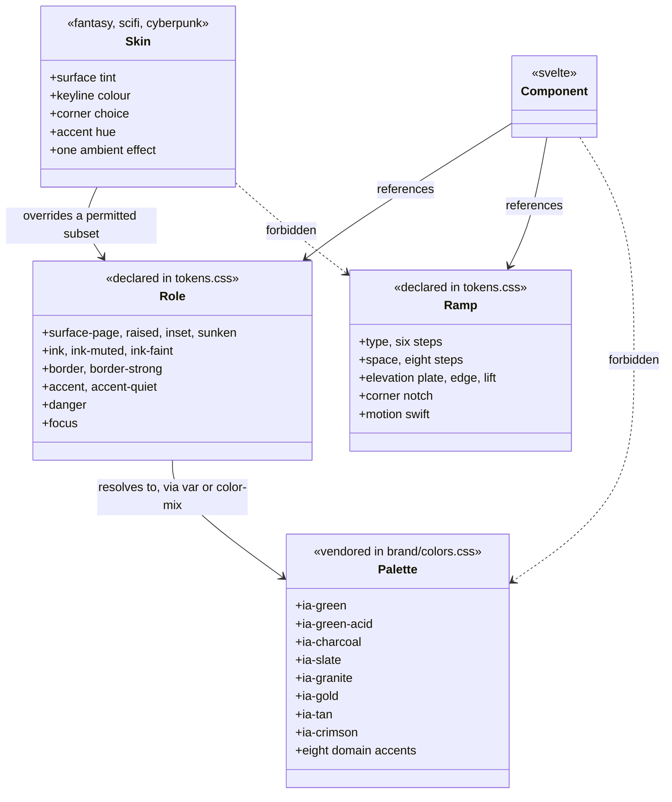

# The visual design system

This design document settles what Iron Arachne _looks like_: the tokens every component builds
from, the rules those tokens are held to, and the decisions that would otherwise be made one
component at a time.

It is the third of the three documents that describe the application. [The workshop](workshop.md)
settled what a user's work **is** — projects, artifacts, tools. [The application
shell](app-shell.md) settled where a user **stands** while they do it — a top bar, six
destinations, a measure-capped page region. Neither settled how any of it **looks**, and that
omission is the whole of [#77](https://github.com/ironarachne/ironarachne/issues/77): the site
works and does not look finished, because spacing, type and colour are decided per component and
so nothing lines up between two pages.

**Status:** accepted. The token taxonomy below is the basis for implementation; the status was
moved from "proposal" once the [fluid root](#the-fluid-root-is-dropped), [exact elevation
tokens](#elevation) and [migration mapping](#migration-mapping) were added to close the gaps
that would have left implementers guessing.

Written against the rough-cut mockup published from the [design
canvas](https://claude.ai/code/artifact/c2f18fd6-1a76-46bd-9044-c8cfc888befb) — five artboards:
the workshop at 1440, the phone at 390 with its drawer, genre skins, the token taxonomy, and the
control vocabulary. Where this document and the mockup disagree, this document is right: it
corrects three of the mockup's stated contrast ratios and raises one token that failed its own
target. Those corrections are noted where they occur.

## What this is not

Not a rebrand. The palette, the two typefaces and the icons are **vendored** from
`ironarachne/ironarachne_branding`, pinned in `brand-assets.json` and copied by
`scripts/sync_brand_assets.sh`. `src/lib/styles/brand/colors.css` and everything in
`src/lib/assets/fonts/` are never edited in place — a colour change is made in the brand repo and
synced. See [brand assets](brand-assets.md).

The design here is what the app _does_ with the brand. Every colour this document names is an
existing `--ia-*` entry or a stated mix of two, and there is no third place a colour value can be
written down.

## The problem

`src/lib/styles/tokens.css` is 47 lines. It aliases thirteen palette entries, maps three modal
roles, and declares `--measure`. That is a vocabulary for colour and nothing else, so:

- **Type has no scale.** `main.css` sets `h1` through `h5` with per-element sizes and a global
  `line-height: 1.75`, and every component that wants something in between picks a number. The
  workshop, the vault and a generator page do not agree on what a heading is.
- **Spacing is invented per component.** There is no ramp to be off, so nothing is off, so
  nothing lines up.
- **Controls are copied, not shared.** The literal `rgb(92, 86, 73)` button gradient is written
  out three times — in `main.css`, in `fantasy.css` and again in `modal.css` for the danger
  variant. Changing what a button looks like means finding all three.
- **There is no elevation or density language**, which is why panelled surfaces read as boxes on
  a page rather than as plates on a bench.
- **The genre skins' relationship to the base is undeclared.** `fantasy.css`, `scifi.css` and
  `cyberpunk.css` each restyle headings and re-declare the whole button. Are they a skin over one
  system or three separate looks? Today it is somewhere between, which is the answer that costs
  the most to maintain.

## Token taxonomy

A visual system persists no types, so the domain-model step lands here instead: **every token the
system defines, its role, and which tokens a component is allowed to reach for.**

Three layers, and the direction is strictly one-way:



This is the one place a diagram earns its keep, because the forbidden edges are the whole point
and prose states them less clearly than a crossed arrow does. The ramps below are tables rather
than diagrams; a class diagram of a list of sizes would be drawing for form's sake.

Read the diagram as four rules:

1. A **role** resolves to a palette entry, or to a `color-mix()` of two. It never holds a hex.
2. A **component** references a role or a ramp step. It never references `--ia-*` and never a hex.
3. A **skin** overrides a permitted subset of roles. It never touches a ramp.
4. Nothing reaches past a layer. `tokens.test.ts` already enforces rule 1 and half of rule 2; see
   [Enforcement](#enforcement).

### Type ramp

Six steps. Cinzel Decorative carries headings, controls and labels; Inclusive Sans carries
anything read as a sentence.

| Token         |   Size | Line height | Face                                  | Used for                         |
| ------------- | -----: | ----------: | ------------------------------------- | -------------------------------- |
| `--t-display` |   26px |        1.05 | Cinzel Decorative 700                 | Page title, one per page         |
| `--t-title`   |   20px |        1.10 | Cinzel Decorative 700                 | Generated name, bench heading    |
| `--t-heading` |   16px |        1.20 | Cinzel Decorative 700                 | Panel heading                    |
| `--t-body`    |   14px |        1.45 | Inclusive Sans                        | Prose and generated output       |
| `--t-small`   | 12.5px |        1.40 | Inclusive Sans                        | Lists, sublines, field values    |
| `--t-micro`   |   11px |        1.40 | Cinzel Decorative, +0.08em, uppercase | Labels, kickers, badges, buttons |

Two numbers do most of the work. Line height falls from today's global 1.75 to **1.45**, and the
largest step falls from 40px to **26px**. The ramp is what makes the site read tighter — not
per-component trimming, which is what produced the current state.

The ramp has to look right inside `--measure` (70ch), which is what caps prose on `section.main`.
At `--t-body` that measure is roughly 640px, which is a comfortable column; the ramp is designed
at that width, not at the full bench width.

`h1`–`h6` map onto the ramp rather than carrying sizes of their own: `h1` → `--t-display`, `h2` →
`--t-title`, `h3`/`h4` → `--t-heading`, `h5`/`h6` → `--t-micro`. Today's decorative `h3::after`
rule and `h5` bottom border go; a heading that needs separating from what follows gets a `.rule`,
which is a token-driven 1px `--border` line, not a pseudo-element that only some headings have.

#### The fluid root is dropped

`main.css` today sets `html { font-size: clamp(1em, 0.909em + 0.45vmin, 1.25em) }`, a fluid base
that scales from roughly 14.5px to 20px depending on viewport width. Every `rem` on the site is
relative to that moving target, which is why a `1rem` gap looks different on a phone and a
desktop.

The ramp drops it. The root `font-size` returns to the browser default (16px) and the ramp tokens
are stated in `px`, applied directly. A proper type ramp designed for the measure does the job the
fluid root was compensating for — making text look right at different widths — but does it
predictably. A component that wants to scale with the root can use `rem`; the ramp itself does not.

### Space ramp

Eight steps, and a component may not invent a value outside them.

| Token  | Value | Typical use                         |
| ------ | ----: | ----------------------------------- |
| `--s1` |   2px | Hairline gaps, label-to-field       |
| `--s2` |   4px | Badge padding                       |
| `--s3` |   6px | Icon-to-text, chip gaps             |
| `--s4` |   8px | Gap inside a control group          |
| `--s5` |  12px | Panel padding, gap between panels   |
| `--s6` |  16px | Section spacing inside a panel body |
| `--s7` |  24px | Page padding, gap between sections  |
| `--s8` |  32px | Page-level separation, hero spacing |

Nothing above `--s8` exists. A gap that wants 48px is a layout that wants rethinking, and making
that awkward is the point.

The ramp is deliberately dense at the bottom: the difference between 2px and 8px is where a
control either reads as one object or as three, and that is exactly the range the current site has
no vocabulary for.

### Colour roles

Twelve roles. The middle column is the expression that goes in `tokens.css` — never a hex, so
`tokens.test.ts` keeps holding. The ratio is measured against `--surface-page`.

| Role               | Resolves to                                      | Contrast | Used for                                  |
| ------------------ | ------------------------------------------------ | -------: | ----------------------------------------- |
| `--surface-page`   | `var(--charcoal)`                                |        — | The page behind everything                |
| `--surface-raised` | `var(--slate)`                                   |        — | Panels, top bar, sidebar                  |
| `--surface-inset`  | `color-mix(in srgb, var(--charcoal) 80%, black)` |        — | Inputs, seed fields, wells, log rows      |
| `--surface-sunken` | `color-mix(in srgb, var(--charcoal) 60%, black)` |        — | Scroll wells behind an inset run          |
| `--border`         | `var(--granite)`                                 |        — | Every neutral keyline                     |
| `--border-strong`  | `var(--tan)`                                     |        — | Control edges, base skin keyline          |
| `--ink`            | `color-mix(in srgb, white 95%, var(--charcoal))` |   15.2:1 | Body text, headings, control labels       |
| `--ink-muted`      | `color-mix(in srgb, white 60%, var(--charcoal))` |    6.8:1 | Sublines, list detail, secondary values   |
| `--ink-faint`      | `color-mix(in srgb, white 48%, var(--charcoal))` |    4.8:1 | Labels and kickers only, never a sentence |
| `--accent`         | `var(--iron-arachne-green)`                      |   10.6:1 | Links, the active nav marker              |
| `--accent-quiet`   | `var(--gold)`                                    |    7.1:1 | Kickers, primary control edge             |
| `--danger`         | `var(--crimson)`                                 |    2.2:1 | Fills and edges — **never text**          |
| `--focus`          | `var(--acid-green)`                              |   13.4:1 | The focus ring, and nothing else          |

Three corrections to the mockup, all of them in this table:

- **`--ink-faint` was `#7b7f88`, which measures 4.16:1** — below the 4.5:1 it is held to, despite
  the mockup labelling it 4.6. It is raised to a 48% mix, measuring **4.8:1**. This is the one
  token where the mockup would have shipped a failure.
- `--ink-muted` measures **6.8:1**, not 7.1.
- `--accent-quiet` measures **7.1:1**, not 8.0.

`--danger` is listed with its ratio precisely so nobody uses it as a text colour later: crimson on
charcoal is 2.2:1 and is not readable. Destructive intent is carried by a crimson **edge and
fill** under `--ink`-coloured text.

The eight remaining palette entries — emerald, amethyst, cyan, plasma blue, magenta, and tan
outside `--border-strong` — are reached only through a genre skin or a domain marker. A component
never names one directly. `--modal-border-message` / `-error` / `-success` stay as they are; they
already follow this pattern, mapping a role onto a palette entry in one place.

### Elevation

Three levels, and depth is carried by a keyline plus a one-pixel top highlight rather than by
blur. The result reads as pressed metal at 100% zoom instead of as a floating card, which is the
difference between a bench and a web page.

| Level      | Recipe                                                                | Used for                                        |
| ---------- | --------------------------------------------------------------------- | ----------------------------------------------- |
| **Page**   | Flat `--surface-page`, no border, no shadow                           | The page region; the bench; the main tool panel |
| **Raised** | `--surface-raised` + 1px `--border` + `--edge` + `--lift` + `--notch` | Every panel: rail, log, vault card, modal       |
| **Inset**  | `--surface-inset` + 1px `--border` + inward shadow                    | Inputs, seed fields, scroll wells, log rows     |

Supporting tokens, stated as the exact CSS that goes in `tokens.css`:

- **`--plate`** — the control gradient. Replaces the three copies of `rgb(92, 86, 73)`:
  ```css
  --plate: linear-gradient(
    180deg,
    color-mix(in srgb, var(--slate) 96%, white) 0%,
    color-mix(in srgb, var(--slate) 94%, black) 100%
  );
  ```
- **`--edge`** — the top highlight that makes a plate a plate:
  ```css
  --edge: inset 0 1px 0 rgb(255 255 255 / 7%);
  ```
- **`--lift`** — the one shadow in the system:
  ```css
  --lift: 0 1px 0 rgb(0 0 0 / 60%), 0 6px 14px rgb(0 0 0 / 35%);
  ```
- **`--notch`** — a 9px cut on the top-right and bottom-left corners, as a `clip-path` polygon:
  ```css
  --notch: polygon(
    0 0,
    calc(100% - 9px) 0,
    100% 9px,
    100% 100%,
    9px 100%,
    0 calc(100% - 9px)
  );
  ```
- **`--corner-control`** — the same cut at 7px, for buttons and inputs:
  ```css
  --corner-control: polygon(
    0 0,
    calc(100% - 7px) 0,
    100% 7px,
    100% 100%,
    7px 100%,
    0 calc(100% - 7px)
  );
  ```

These two corner values are the **only** corner treatments in the system. A skin picks between
cut (`--notch` / `--corner-control`), bevelled (`border-radius: 4px`) and square (`border-radius: 0`)
rather than inventing one.

**Density.** A panel differs from the page by surface, keyline and notch — not by padding, which
is `--s5` everywhere. The bench differs from a panel by having no surface at all: it is the page,
and the panels sit on it. The main tool panel likewise has no surface of its own, which is why a
genre skin reaches it only through the output it holds.

**Border or shadow?** The **border carries it.** `--lift` exists so a raised plate does not float
against the page, but a panel is identified by its keyline and its notch. This matters for the
skins: a border colour is something a skin can change safely, where a shadow that changed per
genre would make panels sit at different heights beside each other.

### Motion

- `--motion-swift` — 120ms. Every hover and press transition uses it; nothing in the interface
  animates for longer.
- Ambient genre motion is capped at **one effect per skin** and is disabled entirely under
  `prefers-reduced-motion: reduce`.

Today's shimmer, pulse and glitch live on headings, which means the type moves while it is being
read. They move to the panel surface instead. See [decision 2](#2-genre-skins-are-a-permitted-subset-not-a-second-look).

## Decisions taken here

These are the items [#77](https://github.com/ironarachne/ironarachne/issues/77) and
[#112](https://github.com/ironarachne/ironarachne/issues/112) ask to be settled rather than left
open. Each is stated either way, with the reason, because an undecided item is how a second system
gets built later.

### 1. Dark mode is the only mode

**The app is dark-only.** There is no light theme and no toggle.

The brand green is a dark-surface colour: `brand/colors.css` measures it at 1.57:1 on white and
records "never set green text on white". `--ia-green-acid` is worse at 1.24:1. The palette carries
no light-surface pair for either, so a light mode could not use the brand's own accent — it would
need a second accent, a second focus colour and a second set of role mappings, which is a second
design system wearing the same logo.

Note that `brand/colors.css` does contain a `prefers-color-scheme: dark` block that flips
`--ia-surface` and `--ia-ink`. That block is the **brand file's** business and is vendored; the app
does not read `--ia-surface`, and the roles above pin `--surface-page` to charcoal unconditionally.
The app is dark on a light-preference device, which is correct and deliberate.

### 2. Genre skins are a permitted subset, not a second look

`fantasy.css`, `scifi.css` and `cyberpunk.css` **remain skins over the base system**, and the
subset they may touch is now explicit. A skin follows the open project's genre and reaches every
panel; the shell — top bar and sidebar — is genre-neutral by rule, so the frame never changes
shape underneath the user.

**A skin may set:**

|                |                                                              |
| -------------- | ------------------------------------------------------------ |
| **Surface**    | Panel background fill, tint and texture                      |
| **Keyline**    | Border colour, weight, and which edges carry it              |
| **Corner**     | Cut, bevelled or square, from the one shared clip vocabulary |
| **Accent hue** | The panel's chip, kicker and figure colour                   |
| **Motion**     | At most one ambient effect, off under reduced motion         |

**A skin may never touch:**

|                            |                                                           |
| -------------------------- | --------------------------------------------------------- |
| **Typeface**               | Cinzel Decorative and Inclusive Sans, in every genre      |
| **Type scale and spacing** | One ramp, so two panels stay the same height side by side |
| **Control geometry**       | Button and input size, hit target, focus ring             |
| **The shell**              | Top bar and sidebar are genre-neutral                     |
| **Contrast floor**         | A skin that cannot hit its target ratio does not ship     |

This settles the three concrete things wrong with the skins today. Each re-declares the whole
button — that goes; a skin sets an accent and a keyline and inherits the rest. Each restyles
`h1`–`h6` — that goes; the type scale is not a skin's to change. And each puts its ambient effect
on heading text — the shimmer, the pulse, the glitch — where it animates words while they are
being read; the effect moves to the panel surface.

### 3. Focus and contrast are targets, not assumptions

- **Focus:** a 2px `--focus` outline at 2px offset on every interactive element. Never removed,
  never colour-only, and never replaced by a border change alone — a border change is invisible to
  someone who cannot distinguish the two colours.
- **Contrast:** every text role clears **4.5:1** against the surface it sits on. `--ink` is
  15.2:1, `--ink-muted` 6.8:1, `--ink-faint` 4.8:1 at its 11px uppercase size. `--danger` is a
  fill and an edge, not a text colour.
- **Hit target:** 28px is the visual height of a control; the tap area is padded to **44px** under
  `(pointer: coarse)`. This is what keeps `e2e/pages.mobile.spec.ts` honest at 320px rather than
  merely passing.

### 4. Sound on press does not ship

The mockup draws a per-device sound toggle beside the ambient-motion one, defaulted off. **It does
not ship**, and the toggle comes out of the control sheet.

A UI sound bed defaulted to off is a feature nobody encounters, carried by an audio asset that has
to be vendored, a preference that has to be stored per device, and a mute state that has to be
respected everywhere a button exists. Defaulted to on, it is a generator site that makes noise when
you click Generate. Neither is worth the surface area in a first pass, and nothing about the token
system forecloses adding it later — a press is already a distinct state with a distinct token.

### 5. The icon set is SunGraphica's, and the credit is a licence term

**Settled.** The pack is bought: SunGraphica's _600 Minimal Icons_, licensed for commercial use,
split into 455 individual SVGs in `src/lib/assets/icons/`. The mockup's placeholder glyphs are
replaced by it.

Three consequences the token system has to absorb:

- **The credit ships.** The licence requires SunGraphica be credited, so the footer carries it on
  every page. It is a licence term, not a courtesy, and it is not a candidate for tidying away.
- **They are not brand assets.** The pack was bought for this app, so it is not vendored through
  `brand-assets.json` and there is no upstream to sync from. It is the one class of asset here
  that may be edited in place.
- **They are filled, not stroked.** The mockup drew a 1.5px stroked house style; these are solid
  glyphs with knockouts. The stroke weight in that mockup is therefore not a rule the system
  holds anything to — it described placeholders. What the system does hold is that an icon is
  painted with `currentColor` through a mask, so it takes its colour from the role around it and
  the surface shows through its holes, on any surface and in any genre skin.

## Control vocabulary

Stated here so the tokens issue knows what the tokens are for; the geometry is settled, the markup
is not.

A **button** is a stamped plate: 28px body, `--plate` fill, 1px `--border-strong` edge, a 7px
corner cut, and Cinzel Decorative at `--t-micro` uppercase. Hover lights the keyline to `--focus`
with a faint glow; press drops it 1px into its own inset shadow and turns the label `--accent`.
Variants are **primary** (gold edge, warmer plate), **secondary** (the base plate), **quiet** (no
fill, `--border` edge, `--ink-muted` label), **destructive** (crimson edge and fill) and
**disabled** (flat, no shadow, `--ink-faint`). Sizes are the 28px default and a 24px `--sm`; an
icon button is 28×28 and square, because a cut corner on a 28px square eats the glyph.

An **input** is inset: `--surface-inset`, 1px `--border`, inward shadow, `--t-small`. Focus takes
the `--focus` keyline plus the ring. A seed field is the same control in a monospace face.

**Navigation** is the one shape that breaks the button rule on purpose: flush to the left edge,
square on that side, notched on the other, with the current destination taking the plate, the
`--accent` left marker and the notch. Nothing else in the app is notched on that side, so the eye
finds the current destination without reading it.

**Badges** are pill-shaped, `--t-micro`, bordered in `currentColor` over `--surface-inset`.
`ToolMaturityBadge` shows experimental in `--accent-quiet` and beta in cyan; release-ready shows
nothing, which is already how it behaves.

**Modals** keep `modal.css`'s structure and lose its literals: the dialog is a raised plate, and
the danger action becomes the destructive button variant rather than a second hand-written
gradient.

## Enforcement

The rule is that no component declares a hex and no component declares a size outside these ramps.
That is the whole enforcement story, and it is testable — which is the reason it is stated this
way rather than as a style guide nobody reads.

`src/lib/styles/tokens.test.ts` already sweeps every global stylesheet and every `<style>` block
in `src/components/**`. It already asserts that `tokens.css` holds no hex and that every `--ia-*`
reference resolves. It grows with the system:

- No component declares a hex or an `rgb()`/`hsl()` literal, with `rgb(… / …%)` overlays on the
  shadow tokens the only exemption.
- No component declares a `font-size` outside the type ramp.
- No component declares a `padding`, `margin` or `gap` outside the space ramp.
- Every skin file touches only the permitted role subset from [decision
  2](#2-genre-skins-are-a-permitted-subset-not-a-second-look).

The current test asserts `aliases.length >= 16`; that number moves as roles are added, and the
assertion is worth rewriting as "every role resolves" rather than a count.

## What this changes

For the implementation issues that follow this one:

- `tokens.css` becomes the single source of the ramps and roles — it grows from 47 lines to the
  taxonomy above. `--measure` stays exactly as it is.
- `main.css` loses its per-element type sizes, its `line-height: 1.75`, its three literal button
  gradients and its decorative `h3::after` / `h5` border rules, and maps elements onto ramp steps
  instead.
- `modal.css` loses its literals and its duplicate danger gradient.
- The three skin files shrink to a permitted subset each, and their ambient effects move off type
  and onto the panel.
- Component styles reference roles and ramp steps. Every route in the page manifest is walked
  before and after: a redesign that improves five pages and breaks two is not an improvement.
- `npm run verify:all` stays green, mobile projects included — no horizontal overflow and no
  off-screen controls at any width in `MOBILE_VIEWPORTS`.
- `scripts/sync_brand_assets.sh --check` reports no drift, because nothing vendored is touched.

## Migration mapping

The codebase has 28 unique `font-size` values and 95+ unique spacing values. The tables below map
the most common ones onto the ramp steps they become. An implementer who encounters a value not
listed here should pick the nearest step rather than invent a new one — if two steps feel equally
near, the ramp is too coarse and the answer is to add a step, not to split the difference.

### Type

| Current value | Occurrences | Becomes       |
| ------------- | ----------: | ------------- |
| `2.25rem`     |           1 | `--t-display` |
| `2rem`        |           2 | `--t-display` |
| `1.5rem`      |           2 | `--t-title`   |
| `1.3rem`      |           6 | `--t-heading` |
| `1.25rem`     |           1 | `--t-heading` |
| `1.2rem`      |           2 | `--t-heading` |
| `1.15rem`     |           1 | `--t-heading` |
| `1.125rem`    |           1 | `--t-heading` |
| `1.1rem`      |           4 | `--t-body`    |
| `1rem`        |           7 | `--t-body`    |
| `0.95rem`     |           6 | `--t-body`    |
| `0.9375rem`   |           1 | `--t-body`    |
| `0.9rem`      |          25 | `--t-small`   |
| `0.875rem`    |           3 | `--t-small`   |
| `0.85rem`     |          22 | `--t-small`   |
| `0.8rem`      |           8 | `--t-micro`   |
| `0.75rem`     |          15 | `--t-micro`   |
| `0.7rem`      |           7 | `--t-micro`   |
| `0.6rem`      |           1 | `--t-micro`   |

The clamp values (`clamp(1.9rem, 6vw + 0.5rem, 2.5rem)` on `h1`, `clamp(1rem, …)` on some
components) are replaced by the fixed ramp step. The fluid root that made them viewport-relative
is dropped ([see above](#the-fluid-root-is-dropped)).

### Spacing

The space ramp is in `px`; the current codebase is mostly in `rem` (based on a 16px root before
the fluid clamp, so `0.5rem` ≈ 8px). The mapping:

| Current value | Approx px | Becomes | Typical current use                        |
| ------------- | --------: | ------- | ------------------------------------------ |
| `0.05rem`     |       ~1px | —       | Drop; use `--s1` (2px) or `0`              |
| `0.1rem`      |       ~2px | `--s1`  | Label-to-field, hairline gaps              |
| `0.125rem`    |       ~2px | `--s1`  | Same                                       |
| `0.15rem`     |       ~2px | `--s1`  | Same                                       |
| `0.2rem`      |       ~3px | `--s2`  | Badge padding                              |
| `0.25rem`     |        4px | `--s2`  | Badge padding, small gaps                  |
| `0.3rem`      |       ~5px | `--s3`  | Icon-to-text                               |
| `0.35rem`     |       ~6px | `--s3`  | Icon-to-text, chip gaps                    |
| `0.4rem`      |       ~6px | `--s3`  | Same                                       |
| `0.45rem`     |       ~7px | `--s4`  | Control group gap                          |
| `0.5rem`      |        8px | `--s4`  | Gap inside a control group                 |
| `0.6rem`      |       ~10px | `--s5`  | Panel padding                              |
| `0.625rem`    |       10px | `--s5`  | Panel padding                              |
| `0.75rem`     |       12px | `--s5`  | Panel padding, gap between panels          |
| `1rem`        |       16px | `--s6`  | Section spacing inside a panel body        |
| `1.25rem`     |       20px | `--s7`  | Page padding                               |
| `1.5rem`      |       24px | `--s7`  | Page padding, gap between sections         |
| `2rem`        |       32px | `--s8`  | Page-level separation, hero spacing        |

Values above `--s8` (e.g. `2.5rem`, `5rem` in the landing page hero) are reviewed case by case;
the ramp says a gap that wants more than 32px is a layout that wants rethinking.

### Border-radius

| Current value | Occurrences | Becomes                    |
| ------------- | ----------: | -------------------------- |
| `4px`         |          31 | `border-radius: 4px` (bevelled corner) |
| `3px`         |          10 | `--corner-control` (7px cut) |
| `6px`         |           3 | `border-radius: 4px` (nearest step) |
| `8px`         |           2 | `border-radius: 4px` (nearest step) |
| `2px`         |           2 | `border-radius: 0` (square) |
| `999px`       |           4 | Pill shape (badges)        |
| `0.25rem`     |           2 | `border-radius: 4px`       |
| `0.5rem`      |           1 | `border-radius: 4px`       |

The three corner treatments — cut, bevelled, square — replace the eight current values. `999px`
stays as-is for pills.

## Open questions

1. **Which icons the app actually uses.** The pack is in (see [decision
   5](#5-the-icon-set-is-sungraphicas-and-the-credit-is-a-licence-term)) and all 455 icons are
   split and named, but nothing maps them to the six nav destinations, the control set, or the
   tool catalog's domains yet. That mapping is the tokens issue's business, not this document's.
2. **Whether `--surface-sunken` earns its place.** It is declared for scroll wells behind an inset
   run, and if the implementation finds one use for it, it should be dropped rather than kept for
   symmetry. Four surface levels is one more than the elevation model claims.
3. **Domain accent markers.** The eight unused palette entries are described as reachable "through
   a genre skin or a domain marker", but no domain marker is designed here. The tool catalog has a
   `domain` field and the mockup does not use it. Either a later document designs that, or the
   eight entries are simply unused by the app, which is also a fine answer.
