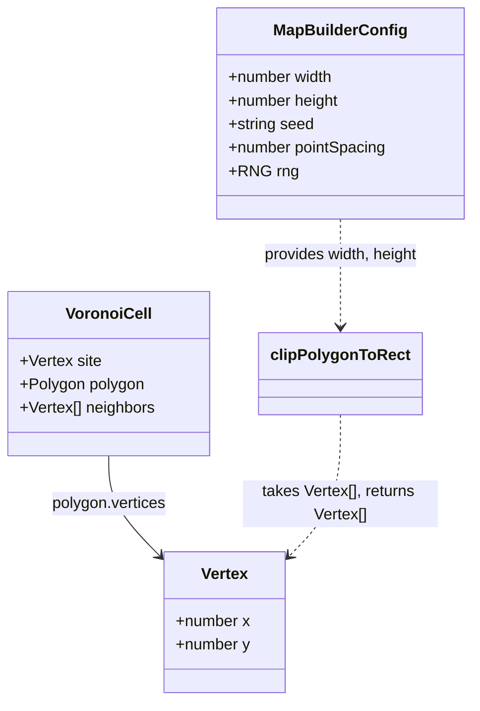

# Voronoi Clipping to the Map Rectangle

This design document describes the fix for [#252](https://github.com/ironarachne/ironarachne/issues/252):
Voronoi circumcenters that land far outside the map rectangle and become river outlets.

**Status:** proposal.

## Problem

`computeVoronoi` in `$lib/geometry/voronoi.ts` produces circumcenters from Delaunay triangles with no
regard for the map's bounding rectangle. A near-collinear Delaunay triangle produces a circumcenter
that shoots off to near-infinity. The eight boundary seed points in `builder.ts` keep the outermost
cells from running to infinity in the ordinary case, but they do not prevent the rare near-collinear
triangle from producing an extreme circumcenter.

Measured across five seeds at 60x35 (the `scripts/render_region_map.ts` default):

| seed    | corners outside rect | max excursion |
| ------- | -------------------- | ------------- |
| charlie | 44 / 316             | 1520.4        |
| alpha   | 45 / 309             | 392.7         |
| golf    | 45 / 306             | 3510.0        |
| india   | 43 / 307             | 795.2         |
| juliet  | 44 / 310             | 1767.4        |

These are worse than the original report (which measured 69/685 corners, max 556.7 on `charlie`).
The point counts differ because the interner merges close vertices; the excursions are the same
kind of defect.

The visible consequence is rivers. `atMapEdge` in `$lib/map/river_paths.ts` tests
`point.x <= 0 || point.y <= 0 || point.x >= map.width || point.y >= map.height`. A corner at
`(22.9, 85.9)` on a 35-high map satisfies "at the map edge" and is accepted as a river outlet.
`connectedRiverReaches` retains the branch, and the renderer draws a straight channel from an
in-frame corner toward a point tens of units off-canvas. The SVG's render-time `clipPath` hides
the overshoot, so it reads as a river running off the edge — the right picture drawn from wrong
geometry.

## Solution

Clip each Voronoi cell's polygon to the map rectangle when the graph is built. After clipping, no
corner exists outside the rectangle, and `atMapEdge` means what it says.

### Algorithm

Sutherland-Hodgman polygon clipping against the four edges of the rectangle. This is a standard
algorithm: for each edge of the clipping rectangle, walk the polygon's vertices and emit a new
vertex list that is on the inside of that edge. The four passes (left, right, top, bottom) produce
a polygon that is inside all four edges — i.e., inside the rectangle.

The algorithm handles all cases:

- A vertex inside the rectangle is emitted.
- A vertex outside is dropped.
- An edge crossing the rectangle boundary produces a new vertex at the intersection.
- A polygon entirely outside produces an empty vertex list (which becomes a node with no corners).

### Where it goes

The clipping happens in `addNodeForCell` in `$lib/map/builder.ts`, applied to the cell's polygon
vertices before they are interned by `getOrCreateCorner`. This is the right place because:

1. The interner merges corners within tolerance (0.1). Two adjacent cells that share an edge
   crossing the rectangle boundary will both compute the same intersection point (since they share
   the original edge), and the interner will merge them. The graph topology is preserved without
   special casing.

2. The clipping is a pure function of the polygon and the rectangle. It does not depend on the
   graph state, the RNG, or any other cell. It can be tested in isolation.

3. It does not change the Voronoi computation itself. `computeVoronoi` remains a pure dual-graph
   construction from Delaunay circumcenters. The clipping is a post-processing step applied when
   the graph is built, not when the diagram is computed.

### The clipping function

A new function in `$lib/geometry`:

```ts
/**
 * Clips a polygon to a rectangle using Sutherland-Hodgman.
 *
 * Returns the clipped vertex list. An empty list means the polygon was entirely outside the
 * rectangle. The input polygon is assumed to be closed (the first and last vertices are connected
 * by an implicit edge); the output is the same.
 */
export function clipPolygonToRect(
  vertices: Vertex[],
  rect: { x: number; y: number; width: number; height: number },
): Vertex[];
```

The implementation clips against each of the four edges in sequence. For each edge, it walks the
input vertices and emits output vertices according to the four Sutherland-Hodgman cases:

1. Inside → Inside: emit the second vertex.
2. Inside → Outside: emit the intersection.
3. Outside → Outside: emit nothing.
4. Outside → Inside: emit the intersection, then the second vertex.

The intersection of a line segment with a horizontal or vertical edge is a simple linear
interpolation.

### What changes in `builder.ts`

In `addNodeForCell`, before interning the cell's corners:

```ts
const clippedVertices = clipPolygonToRect(cell.polygon.vertices, {
  x: 0,
  y: 0,
  width: config.width,
  height: config.height,
});
if (clippedVertices.length === 0) {
  // The cell is entirely outside the rectangle. This can happen for a boundary seed whose
  // Voronoi cell extends to infinity in one direction and is clipped to nothing by the rectangle.
  // Skip it: no node, no corners, no edges.
  return;
}
const nodeCorners = [...new Set(clippedVertices.map((v) => accumulator.getOrCreateCorner(v)))];
```

The rest of the function (linking corners, building edges, creating the node) is unchanged.

### What does not change

- `computeVoronoi` is unchanged. It remains a pure dual-graph construction.
- `atMapEdge` is unchanged. After clipping, no corner exists outside the rectangle, so the
  existing `<=` / `>=` tests are correct.
- The eight boundary seed points are unchanged. They still serve their purpose: keeping the
  outermost cells from extending to infinity in the ordinary case, and flagging rim cells as
  `isOcean`.
- The SVG's render-time `clipPath` is unchanged. It still clips the drawing to the viewBox, which
  is correct. The geometric clipping ensures the graph is correct; the render-time clipping ensures
  the drawing is correct.

## Domain model

No new types. The fix is a function and a call site.



## Testing

### Unit tests for `clipPolygonToRect`

- A polygon entirely inside the rectangle is returned unchanged.
- A polygon entirely outside the rectangle returns an empty list.
- A polygon partially inside returns the clipped polygon with correct intersection vertices.
- A polygon with a vertex exactly on the rectangle boundary is handled correctly (no duplicate
  vertices, no missing vertices).
- A polygon with an edge parallel to and coincident with a rectangle edge is handled correctly.

### Unit tests for the graph after clipping

Parameterized over the five reference seeds (`charlie`, `alpha`, `golf`, `india`, `juliet`) at
60x35:

- Every corner's point is inside the rectangle (0 <= x <= width, 0 <= y <= height).
- The graph invariants still hold: no self-adjacent corners, no self-neighboring nodes, symmetric
  neighbor/adjacent links, no self-loop edges.
- The boundary cells are still flagged as `isOcean`.

### Regression test for river outlets

Parameterized over the five reference seeds:

- No river reach's downstream corner lies more than a small epsilon (e.g., 0.01) outside the
  rectangle. This is the belt-and-suspenders assertion: even if a future change reintroduces the
  defect, the test catches it.

## Decisions taken

**1. Clip at graph build time, not at Voronoi computation time.** The Voronoi diagram is a pure
dual-graph construction. Clipping it would couple it to the map's bounding rectangle, which is a
concern of the map builder, not the geometry library. The clipping is a post-processing step
applied when the graph is built.

**2. Clip each cell independently, relying on the interner to merge shared vertices.** The
alternative is to clip the entire diagram at once, tracking shared edges explicitly. This is more
complex and not necessary: the interner already merges corners within tolerance, and two adjacent
cells that share an edge crossing the rectangle boundary will both compute the same intersection
point. The tolerance (0.1) is large enough to absorb floating-point rounding in the intersection
computation.

**3. Do not tighten `atMapEdge`.** After clipping, no corner exists outside the rectangle, so the
existing tests are correct. Tightening `atMapEdge` to a band would be a belt-and-suspenders
approach, but it would also hide future defects: a corner that lies outside the rectangle is a
symptom of a geometric problem, and `atMapEdge` should report it rather than absorb it.

**4. Skip cells that clip to empty.** A boundary seed's Voronoi cell can extend to infinity in one
direction and be clipped to nothing by the rectangle. This is an ordinary case, not an error. The
cell is skipped: no node, no corners, no edges. The remaining cells still cover the rectangle, and
the boundary seeds that do produce non-empty cells still flag the rim as `isOcean`.

## Work items

1. Implement `clipPolygonToRect` in `$lib/geometry` with unit tests.
2. Apply it in `addNodeForCell` in `$lib/map/builder.ts`.
3. Add the regression tests (corner bounds, graph invariants, river outlets) parameterized over
   the five reference seeds.
4. Run `npm run verify` and `npm run verify:all` to confirm no regressions.
