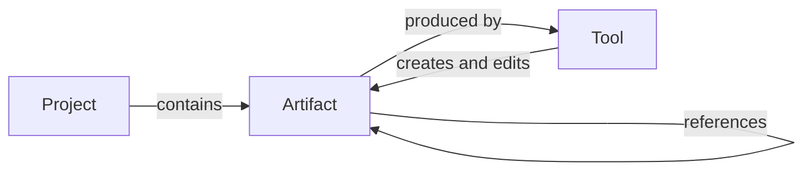

# The Workshop

This design document describes the next version of Iron Arachne: a **workshop** for building
campaigns and worlds, rather than a collection of independent generator pages.

It covers the model the site is built on, how the pieces fit together, and — in
[Tool release readiness](#tool-release-readiness) — the specification a tool must meet before it
is considered finished.

**Status:** proposal. A prototype of the workshop shell exists at `/workshop`
(`src/routes/workshop/+page.svelte`), unlinked from navigation. Nothing else described here is
built yet.

## The shift

Today the site is a set of self-contained pages. You visit `/culture`, roll a culture, and read
it. If you leave, it is gone — unless it happens to be one of the three generators that can save
(heraldry, culture, religion). Each of those saves into its own global bucket, and nothing that
is saved can be used as an input anywhere else.

That shape has a ceiling. The value of Iron Arachne is not any single generator; it is that a
culture, a religion, a settlement, and a region are pieces of the _same world_, and a world is
built by making pieces and fitting them together. The current site can make the pieces but has
nowhere to put them and no way to join them.

The workshop is that missing structure:

- A user's work lives in a **project** — one campaign, one setting, one world.
- Tools produce **artifacts**: named, saved, editable objects that belong to a project.
- Artifacts **reference each other**, so a settlement can follow a religion you made earlier and
  a region can be built from settlements you have already curated.
- **Tools** are the instruments for making and editing artifacts, mounted inside the workshop
  rather than each living on its own island.

The generators do not go away and neither do their routes. What changes is that their output
stops evaporating and starts accumulating into something.

## Local only

Iron Arachne runs entirely in the browser. **No accounts, no back end, no reliance on remote
services.** This is a core principle of the application, not a consequence of the current stack,
and it is not up for revision as the workshop is built.

Everything in this document is designed within that constraint:

- **Persistence is browser storage**, with explicit file export and import as the way work leaves
  the machine it was made on.
- **Projects are local.** There is no sync, no cross-device continuity, and no server-side copy.
  A user's worlds live on the device they built them on until they export them.
- **Sharing is a file.** Handing a project to a player means giving them a file they import, not
  a link they visit.
- **Collaboration is out of scope.** Two people editing one project is a server-shaped problem
  and this application does not have a server.

The consequences are real and worth naming rather than discovering later. Clearing browser
storage destroys a user's work, so export must be obvious, cheap, and complete — not buried
behind a menu. There is no server-side migration either, which means every `payloadVersion` step
has to be handled in the client, on data that may be arbitrarily old, by a user who has not
opened the site in a year.

Where a feature seems to want a server, it is either solved with files or it is not built.

## Core model

Three concepts. Everything else is detail.

### Project

The top-level container and the unit a user thinks in: "my Dolmenwood campaign", "the
Ashfall setting". A project owns artifacts, and artifacts belong to exactly one project.

A project carries a name, an optional description, free-form tags, and timestamps. It is
deliberately thin — it is a namespace and a workspace, not a document with its own content. What
makes a project meaningful is what is inside it.

Users may have several projects, and the workshop always operates in the context of exactly one
at a time. There is no cross-project referencing: an artifact cannot point at something in a
different project, because a world that depends on another world is not a world.

Copying an artifact between projects is a supported operation, but it copies — the two diverge
afterwards.

### Artifact

A saved, named, editable object produced by a tool. A generated culture that the user kept. A
settlement they then renamed and rewrote half of. The region those settlements sit in.

An artifact has:

| Field                     | Purpose                                                                     |
| ------------------------- | --------------------------------------------------------------------------- |
| `id`                      | Stable identity. Referenced by other artifacts; never reused.               |
| `kind`                    | What it is (`culture`, `religion`, `settlement`). Determines payload shape. |
| `name`                    | User-facing, user-editable, not required to be unique.                      |
| `payload`                 | The content itself, serialisable, versioned by `payloadVersion`.            |
| `provenance`              | How it was first made: tool path, seed, generator config.                   |
| `references`              | Links to other artifacts (see [Composition](#composition)).                 |
| `tags`                    | Free-form, using the existing `$lib/tags` filtering.                        |
| `createdAt` / `updatedAt` | Timestamps.                                                                 |

**The payload is the truth.** Once an artifact exists, its payload is what it is — not a seed to
be re-rolled. This matters because artifacts are editable: as soon as a user renames a deity or
rewrites a settlement's trade blurb, the original seed no longer reproduces what they have. The
seed is kept as provenance so the user can see where a thing came from and can deliberately
re-roll it, but re-rolling is a destructive action that replaces the payload, not a load path.

This is already how the existing saved generators behave —
`src/lib/culture/culture_snapshot.ts` stores the culture and uses an RNG only to rehydrate the
name generators, not to regenerate the culture. The workshop generalises that pattern rather
than inventing one.

#### Artifact kinds

A `kind` identifies a payload shape, and is owned by the library that defines the type. Kinds are
stable strings; renaming one is a migration.

Where the same concept differs by game system, those are **distinct kinds** —
`character.swn` and `character.adnd-2e` are not interchangeable, and pretending otherwise would
push system-specific fields into a shared type or force lossy conversion. System-neutral content
(`culture`, `religion`, `language`, `region`) has one kind covering all uses.

### Tool

A tool is an instrument, and the catalog in `src/lib/tools` already describes them: a path, a
label, a `kind` (`generator`, `editor`, `reference`), a domain, and genre/system tags. The
workshop adds a second half — `src/lib/workshop/tool_panels.ts` maps a catalog path to the
component that renders it, so a tool can be mounted in a panel instead of only on its own route.

The three tool kinds have genuinely different obligations in the workshop:

- **Generator** — rolls new content. Produces artifacts. The bulk of the site (30 of 35 tools).
- **Editor** — modifies content the user supplies. Consumes and produces artifacts.
- **Reference** — a static table or calculator. Produces nothing and saves nothing. Legitimately
  exempt from most of the artifact machinery.

Today most generators are _only_ generators; making them editors of their own output is the
single largest piece of work the workshop implies.

## How the workshop works

The workshop is a single surface with three regions:

- **Project context** — which project is open, and switching between projects.
- **Tool browser** — the catalog, searchable and filterable by genre, system, and domain. This
  exists (`src/lib/tools/tool_search.ts`, `ToolBrowser.svelte`).
- **Panels** — mounted tools and open artifacts.

A user opens a project, picks a tool, generates something, names it, and keeps it. It appears in
the project. They open it again later, edit it, and reference it from something else.

### Panels

Panels are how more than one thing is visible at once, which is the entire point of a workshop:
you cannot build a region _from_ your settlements if you cannot see them while you work.

The existing prototype mounts one tool panel beside the browser. The full version needs several
panels open at once, holding a mix of tools and artifacts, and needs to remember that arrangement
per project so reopening a project restores the bench as it was left.

Panel components are loaded on demand and the import specifiers are written out in full, because
a bundler can only split a dynamic import it can see — a computed specifier would pull every
generator on the site, WebGL renderers and PDF export included, into whatever page opened one
panel. That constraint is already documented in `src/lib/workshop/README.md` and must survive.

### Routes

Every tool keeps its own route. They are the entry point for someone arriving from a search
engine with no project and no interest in one, and they are how a tool is used as a one-off. A
tool must work in both places, which is why the panel registry points at the same component the
route mounts.

The difference is what the _Save_ affordance does: on a route with no project open, saving
prompts for a project (or offers a scratch one); inside the workshop, it saves to the open
project.

## Persistence

Today, saving is per-generator and global. `src/lib/culture/culture_saved_state.ts` writes every
culture the user has ever kept to one storage scope (`generator.culture`) as a flat array, and
`src/lib/persistent_save/saved_data_catalog.ts` enumerates the three domains that can do this by
naming each one explicitly. Adding a fourth savable generator means touching the catalog, the
`SavedDataEntry` union, and the `/saved-data` page.

That does not scale to every generator, and it has no concept of a project.

The workshop needs a **generic, project-scoped artifact store**: one place that stores artifacts
of any kind, keyed by project, without a hand-maintained list of which kinds exist. Individual
libraries keep owning their payload shape — the `toSnapshot` / `fromSnapshot` pair and the
`payloadVersion` — but they stop owning storage, enumeration, and the save UI.

The existing `src/lib/persistent_save/scoped_local_storage.ts` is a reasonable foundation; the
scope becomes the project rather than the generator.

**Migration matters.** Users have saved heraldry, cultures, and religions in
`ironarachne.save.v1.*` today. Those must be adopted into a project on first run rather than
orphaned, and each artifact kind needs a migration path as its `payloadVersion` advances. An
artifact the user spent an hour editing is not something we get to drop because its shape
changed.

Storage is browser storage plus explicit file export/import, per
[Local only](#local-only). There is no server to fall back on, which makes migration and export
load-bearing rather than nice to have: they are the only things standing between a user and
losing their world.

## Composition

Composition is the payoff, and it is what makes this a workshop rather than a filing cabinet.

An artifact may reference other artifacts: a culture that follows a specific religion, a region
built from named settlements, a star nation assembled from planets the user designed. A reference
records the target's `id` and `kind`.

Three rules keep this from becoming a swamp:

1. **References are opt-in.** A generator that is handed nothing generates its own inputs, as it
   does now. "Use a saved religion?" is an affordance, not a requirement.
2. **References are by identity, not by copy.** Editing a religion updates every culture that
   follows it, because that is what a user means by "this culture follows _that_ religion". A
   user who wants divergence duplicates the artifact first.
3. **Deleting a referenced artifact is a prompted decision.** The user is told what points at it
   and chooses: block, or delete and leave the references dangling but visible. Silently breaking
   links is not an option, and neither is refusing to ever delete anything.

Reference cycles are possible and acceptable — a realm's ruler is a character from that realm —
so anything that walks references must tolerate them.

## What exists today

Worth being precise about what is already built, since more of the substrate exists than the
absence of a workshop suggests.

| Piece                      | State                                                                                                                                                               |
| -------------------------- | ------------------------------------------------------------------------------------------------------------------------------------------------------------------- |
| Tool catalog with metadata | **Built.** `src/lib/tools`, 35 tools, genre/system tags, search and grouping.                                                                                       |
| Panel registry             | **Built.** `src/lib/workshop/tool_panels.ts`, lazy loaders, parity-tested against the catalog.                                                                      |
| Workshop shell             | **Prototype.** One browser plus one panel at `/workshop`, unlinked.                                                                                                 |
| Snapshot pattern           | **Built for three kinds.** Heraldry, culture, religion.                                                                                                             |
| Scoped storage             | **Built, wrong scope.** Per-generator, not per-project.                                                                                                             |
| Saved data page            | **Built, superseded.** `/saved-data` is a flat three-section list.                                                                                                  |
| Projects                   | **Not built.**                                                                                                                                                      |
| Generic artifact store     | **Not built.**                                                                                                                                                      |
| Artifact editing           | **Not built.** Two tools are editors; neither edits a saved artifact.                                                                                               |
| Composition                | **Partial.** `SavedCulturePicker` lets the region, settlement, and religion generators take a saved culture — the pattern to generalise, built three times by hand. |

## Tool release readiness

A tool is **release-ready** when it is a first-class citizen of the workshop: discoverable,
correct, durable, and usable both in a panel and on its own. Until then it may still ship — see
[Maturity levels](#maturity-levels) — but it is not finished.

Requirements use MUST and SHOULD in the usual sense. Applicability depends on tool kind, given in
the _Applies to_ column: **G** generator, **E** editor, **R** reference.

### 1. Discoverability

| #   | Requirement                                                                                                                                             | Applies to |
| --- | ------------------------------------------------------------------------------------------------------------------------------------------------------- | ---------- |
| 1.1 | MUST have a catalog entry via `defineTool`, with an accurate `kind` and `domain`.                                                                       | G E R      |
| 1.2 | MUST carry genre and system tags where they apply, and carry none where the output is genre- or system-neutral. A placeholder tag is worse than no tag. | G E R      |
| 1.3 | MUST be registered in `TOOL_PANELS` so it can be mounted in the workshop.                                                                               | G E R      |
| 1.4 | MUST have a label that reads correctly out of context, in a search result or a panel title.                                                             | G E R      |

### 2. Behaviour

| #   | Requirement                                                                                                                                                               | Applies to |
| --- | ------------------------------------------------------------------------------------------------------------------------------------------------------------------------- | ---------- |
| 2.1 | MUST work identically in a panel and on its own route. The panel registry points at the same component the route mounts; a tool that only works in one place is not done. | G E R      |
| 2.2 | MUST be deterministic for a given seed and configuration. Same inputs, same output.                                                                                       | G E        |
| 2.3 | MUST expose its seed and allow the user to set it.                                                                                                                        | G E        |
| 2.4 | MUST NOT generate on mount in a way that discards user input or costs the user work they cannot recover.                                                                  | G E        |
| 2.5 | SHOULD degrade rather than fail when an optional capability is unavailable (for example, a WebGL renderer on hardware that cannot run it).                                | G E R      |

### 3. Artifacts

Reference tools produce no artifacts and this section does not apply to them.

| #   | Requirement                                                                                                                                                           | Applies to |
| --- | --------------------------------------------------------------------------------------------------------------------------------------------------------------------- | ---------- |
| 3.1 | MUST define a single artifact `kind` and a payload type owned by its library.                                                                                         | G E        |
| 3.2 | MUST provide a `toSnapshot` / `fromSnapshot` pair that round-trips losslessly, with functions and other non-serialisable values stripped or reconstructed explicitly. | G E        |
| 3.3 | MUST carry a `payloadVersion` and validate on read, returning a well-defined empty result rather than throwing on unrecognised data.                                  | G E        |
| 3.4 | MUST provide a migration when its `payloadVersion` advances. Saved artifacts are user work and are not discarded because a shape changed.                             | G E        |
| 3.5 | MUST let the user name an artifact on save and rename it afterwards.                                                                                                  | G E        |
| 3.6 | MUST record provenance — tool path, seed, and generator config — on artifacts it creates.                                                                             | G          |
| 3.7 | MUST save into the open project, and MUST handle the no-project case on its own route.                                                                                | G E        |

### 4. Editing

The requirement that separates a workshop from a gallery. An artifact the user cannot change is
a printout.

| #   | Requirement                                                                                                                                                 | Applies to |
| --- | ----------------------------------------------------------------------------------------------------------------------------------------------------------- | ---------- |
| 4.1 | MUST provide an editing view for its artifact kind, covering every field a user would reasonably want to change — at minimum every field displayed to them. | G E        |
| 4.2 | MUST treat the edited payload as authoritative, never silently regenerating from the seed over a user's edits.                                              | G E        |
| 4.3 | MUST make re-rolling explicit and clearly destructive when it would overwrite edits.                                                                        | G E        |
| 4.4 | SHOULD support editing a single part without re-rolling the whole (renaming one deity, rewriting one settlement's problem).                                 | G E        |

### 5. Composition

| #   | Requirement                                                                                                            | Applies to |
| --- | ---------------------------------------------------------------------------------------------------------------------- | ---------- |
| 5.1 | MUST accept referenced artifacts for inputs it would otherwise generate, where an artifact kind exists for that input. | G E        |
| 5.2 | MUST record references by artifact id, not by copying the referenced payload.                                          | G E        |
| 5.3 | MUST work with no references supplied, generating its own inputs as it does today. Composition is opt-in.              | G E        |
| 5.4 | MUST tolerate reference cycles in anything that walks references.                                                      | G E        |

### 6. Output

| #   | Requirement                                                                                                                                                                                                                       | Applies to |
| --- | --------------------------------------------------------------------------------------------------------------------------------------------------------------------------------------------------------------------------------- | ---------- |
| 6.1 | MUST render legibly on mobile. The mobile-first layout is preserved; desktop is progressive enhancement.                                                                                                                          | G E R      |
| 6.2 | MUST be operable by keyboard, with meaningful accessible names on controls and generated imagery.                                                                                                                                 | G E R      |
| 6.3 | SHOULD offer export in a presentation format a user can take to the table — text, Markdown, PDF, SVG. Distinct from artifact export, which the store provides for every kind and which requirement 3.2 is what makes trustworthy. | G E R      |
| 6.4 | Text output MUST be free of layout artifacts such as stray blank lines from empty sections.                                                                                                                                       | G E R      |

### 7. Verification

| #   | Requirement                                                                                                   | Applies to |
| --- | ------------------------------------------------------------------------------------------------------------- | ---------- |
| 7.1 | MUST have unit tests for its library, covering generation, edge cases, and error paths.                       | G E R      |
| 7.2 | MUST have a snapshot round-trip test proving `fromSnapshot(toSnapshot(x))` preserves everything that matters. | G E        |
| 7.3 | MUST have a migration test for every `payloadVersion` step, exercising a real payload of the older shape.     | G E        |
| 7.4 | MUST have an end-to-end test covering generate, save, reopen, edit.                                           | G E        |
| 7.5 | SHOULD hold up under mutation testing. Run by humans, per CLAUDE.md — not in CI.                              | G E R      |

### 8. Documentation

| #   | Requirement                                                                                                                  | Applies to |
| --- | ---------------------------------------------------------------------------------------------------------------------------- | ---------- |
| 8.1 | Its library MUST have a `README.md` describing purpose and usage.                                                            | G E R      |
| 8.2 | Its library MUST have an `index.ts` entrypoint, and consumers MUST import through it.                                        | G E R      |
| 8.3 | MUST follow CODE_STYLE.md: functional style, types separate from usage, snake_case files, no new dependencies without cause. | G E R      |
| 8.4 | SHOULD document any game system it implements, including which edition and what is deliberately omitted.                     | G E        |

### Maturity levels

Not everything ships finished, and pretending otherwise just means the label is ignored. Three
levels, so a tool's state is legible to users and to us:

| Level             | Meaning                                                                  | Bar                       |
| ----------------- | ------------------------------------------------------------------------ | ------------------------- |
| **Experimental**  | Visible in the catalog, may change or vanish. Output may not be savable. | Sections 1 and 2.         |
| **Beta**          | Produces durable artifacts. Editing may be partial.                      | Sections 1–3, 6, 7.1–7.2. |
| **Release-ready** | A full citizen of the workshop.                                          | All sections.             |

Measured against this, **every tool on the site today is Experimental**, except heraldry,
culture, and religion, which are approaching Beta. That is not a criticism of the tools; it is
the size of the gap between what exists and what the workshop needs, and it is better stated
plainly than discovered one generator at a time.

## Existing issues that need revisiting

Several open issues anticipate parts of this, but predate the workshop framing and describe a
different shape. They should be re-scoped or closed in favour of work derived from this
document rather than implemented as written.

| Issue                                                                      | Relationship                                                                                                                                                                                                                                                                                                                                         |
| -------------------------------------------------------------------------- | ---------------------------------------------------------------------------------------------------------------------------------------------------------------------------------------------------------------------------------------------------------------------------------------------------------------------------------------------------- |
| #6 — a "world" container bundling saved artifacts                          | Superseded. This is the Project, but #6 describes it as a grouping bolted onto `/saved-data` rather than the primary context the site operates in.                                                                                                                                                                                                   |
| #7 — persist output from all setting-building generators                   | Directionally right, wrong mechanism. It proposes extending the per-generator `*_saved_state.ts` pattern to every generator; the workshop replaces that with a generic project-scoped store. Implementing #7 as written would multiply the thing being removed.                                                                                      |
| #1 — make `/saved-data` world-aware                                        | Superseded. `/saved-data` is replaced by the project view, not upgraded.                                                                                                                                                                                                                                                                             |
| #3, #4, #5 — compose star systems, regions, and cultures from saved pieces | Right instinct, too narrow. These describe three bespoke cases; [Composition](#composition) generalises them. Worth keeping as motivating examples. Note #5's file references are already stale — the "Use a saved culture?" affordance now lives in `SavedCulturePicker.svelte`, used by three generators, not in `src/routes/region/+page.svelte`. |
| #2 — reframe the civilization generator as setting flavor                  | Still valid and unaffected. Orthogonal to the workshop.                                                                                                                                                                                                                                                                                              |
| #16, #17, #18, #19, #29 — entrypoints, declassing, tests, READMEs, imports | Unaffected, and now load-bearing: section 7 and section 8 of the readiness spec are largely these issues restated per tool.                                                                                                                                                                                                                          |

## Open questions

Decisions that materially affect the design and are not made here.

Accounts, sync, hosted sharing, and collaboration are **not** on this list. They are settled by
[Local only](#local-only), which is a principle of the application rather than a decision this
document is entitled to reopen.

1. **Export format and granularity.** With no server, export is the only way work leaves a
   device, which makes it more important here than it would be elsewhere. Whole project or
   single artifact? A format that survives a `payloadVersion` bump, and that a user can
   reasonably re-import into a newer build?
2. **Storage limits.** Browser storage is finite and a project full of maps and heraldry is not
   small. What happens as a user approaches the ceiling, and whether the workshop should measure
   and report usage before the browser starts refusing writes.
3. **Panel layout persistence.** How much arrangement is remembered per project, and whether
   layouts are a user-visible concept or an implementation detail.
4. **Artifact kind granularity.** The proposal splits kinds by game system for characters. Where
   else does that bite — is an SWN starship a `starship`, or is `starship.swn` the honest name?
5. **Reference integrity on delete.** [Composition](#composition) proposes prompting the user.
   Whether dangling references are ever tolerated, and how they surface, needs settling before
   references ship.
6. **Migration of existing saves.** Users have heraldry, cultures, and religions saved under
   `ironarachne.save.v1.*` today. Adopting them into an implicit first project is proposed here;
   the details are unspecified.
7. **Scope of the first release.** The full spec applied to 35 tools is a very large body of
   work. A plausible first cut is the workshop shell, projects, the artifact store, and three or
   four setting-building generators taken to Release-ready — proving the model end to end before
   it is applied broadly.
