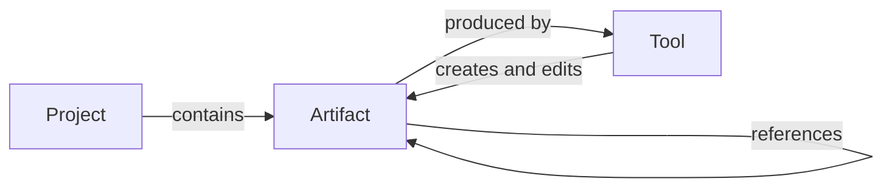

# The Workshop

This design document describes the next version of Iron Arachne: a **workshop** for building
campaigns and worlds, rather than a collection of independent generator pages.

It covers the model the site is built on, how the pieces fit together, and — in
[Tool release readiness](#tool-release-readiness) — the specification a tool must meet before it
is considered finished.

**Status:** accepted; implementation not started. A prototype of the workshop shell exists at
`/workshop` (`src/routes/workshop/+page.svelte`), unlinked from navigation. Nothing else described
here is built yet. The work is broken down in [The plan](#the-plan) and tracked on Worktree under
the `workshop` label.

## The shift

Today the site is a set of self-contained pages. You visit `/culture`, roll a culture, and read
it. If you leave, it is gone — unless it happens to be one of the three generators that can save
(heraldry, culture, religion). Each of those saves into its own global bucket, and nothing that
is saved can be used as an input anywhere else.

That shape has a ceiling. The value of Iron Arachne is not any single generator; it is that a
culture, a religion, a settlement, and a region are pieces of the _same world_, and a world is
built by making pieces and fitting them together. The current site can make the pieces but has
nowhere to put them and no way to join them.

The workshop is that missing structure:

- A user's work lives in a **project** — one campaign, one setting, one world.
- Tools produce **artifacts**: named, saved, editable objects that belong to a project.
- Artifacts **reference each other**, so a settlement can follow a religion you made earlier and
  a region can be built from settlements you have already curated.
- **Tools** are the instruments for making and editing artifacts, mounted inside the workshop
  rather than each living on its own island.

The generators do not go away and neither do their routes. What changes is that their output
stops evaporating and starts accumulating into something.

## Local only

Iron Arachne runs entirely in the browser. **No accounts, no back end, no reliance on remote
services.** This is a core principle of the application, not a consequence of the current stack,
and it is not up for revision as the workshop is built.

Everything in this document is designed within that constraint:

- **Persistence is browser storage**, with explicit file export and import as the way work leaves
  the machine it was made on.
- **Projects are local.** There is no sync, no cross-device continuity, and no server-side copy.
  A user's worlds live on the device they built them on until they export them.
- **Sharing is a file.** Handing a project to a player means giving them a file they import, not
  a link they visit.
- **Collaboration is out of scope.** Two people editing one project is a server-shaped problem
  and this application does not have a server.

The consequences are real and worth naming rather than discovering later. Clearing browser
storage destroys a user's work, so export must be obvious, cheap, and complete — not buried
behind a menu. There is no server-side migration either, which means every `payloadVersion` step
has to be handled in the client, on data that may be arbitrarily old, by a user who has not
opened the site in a year.

Where a feature seems to want a server, it is either solved with files or it is not built.

## Core model

Three concepts. Everything else is detail.

### Project

The top-level container and the unit a user thinks in: "my Dolmenwood campaign", "the
Ashfall setting". A project owns artifacts, and artifacts belong to exactly one project.

A project carries a name, an optional description, free-form tags, and timestamps. It is
deliberately thin — it is a namespace and a workspace, not a document with its own content. What
makes a project meaningful is what is inside it.

Users may have several projects, and the workshop always operates in the context of exactly one
at a time. There is no cross-project referencing: an artifact cannot point at something in a
different project, because a world that depends on another world is not a world.

Copying an artifact between projects is a supported operation, but it copies — the two diverge
afterwards.

### Artifact

A saved, named, editable object produced by a tool. A generated culture that the user kept. A
settlement they then renamed and rewrote half of. The region those settlements sit in.

An artifact has:

| Field                     | Purpose                                                                     |
| ------------------------- | --------------------------------------------------------------------------- |
| `id`                      | Stable identity. Referenced by other artifacts; never reused.               |
| `kind`                    | What it is (`culture`, `religion`, `settlement`). Determines payload shape. |
| `name`                    | User-facing, user-editable, not required to be unique.                      |
| `payload`                 | The content itself, serialisable, versioned by `payloadVersion`.            |
| `provenance`              | How it was first made: tool path, seed, generator config.                   |
| `references`              | Links to other artifacts (see [Composition](#composition)).                 |
| `tags`                    | Free-form, using the existing `$lib/tags` filtering.                        |
| `createdAt` / `updatedAt` | Timestamps.                                                                 |

**The payload is the truth.** Once an artifact exists, its payload is what it is — not a seed to
be re-rolled. This matters because artifacts are editable: as soon as a user renames a deity or
rewrites a settlement's trade blurb, the original seed no longer reproduces what they have. The
seed is kept as provenance so the user can see where a thing came from and can deliberately
re-roll it, but re-rolling is a destructive action that replaces the payload, not a load path.

This is already how the existing saved generators behave —
`src/lib/culture/culture_snapshot.ts` stores the culture and uses an RNG only to rehydrate the
name generators, not to regenerate the culture. The workshop generalises that pattern rather
than inventing one.

#### Artifact kinds

A `kind` identifies a payload shape, and is owned by the library that defines the type. Kinds are
stable strings; renaming one is a migration.

Where the same concept differs by game system, those are **distinct kinds** —
`character.swn` and `character.adnd-2e` are not interchangeable, and pretending otherwise would
push system-specific fields into a shared type or force lossy conversion. System-neutral content
(`culture`, `religion`, `language`, `region`) has one kind covering all uses.

### Tool

A tool is an instrument, and the catalog in `src/lib/tools` already describes them: a path, a
label, a `kind` (`generator`, `editor`, `reference`), a domain, and genre/system tags. The
workshop adds a second half — `src/lib/workshop/tool_panels.ts` maps a catalog path to the
component that renders it, so a tool can be mounted in a panel instead of only on its own route.

The three tool kinds have genuinely different obligations in the workshop:

- **Generator** — rolls new content. Produces artifacts. The bulk of the site (30 of 35 tools).
- **Editor** — modifies content the user supplies. Consumes and produces artifacts.
- **Reference** — a static table or calculator. Produces nothing and saves nothing. Legitimately
  exempt from most of the artifact machinery.

Today most generators are _only_ generators; making them editors of their own output is the
single largest piece of work the workshop implies.

## How the workshop works

The workshop is a single surface with three regions:

- **Project context** — which project is open, and switching between projects.
- **Tool browser** — the catalog, searchable and filterable by genre, system, and domain. This
  exists (`src/lib/tools/tool_search.ts`, `ToolBrowser.svelte`).
- **Panels** — mounted tools and open artifacts.

A user opens a project, picks a tool, generates something, names it, and keeps it. It appears in
the project. They open it again later, edit it, and reference it from something else.

### Panels

Panels are how more than one thing is visible at once, which is the entire point of a workshop:
you cannot build a region _from_ your settlements if you cannot see them while you work.

The existing prototype mounts one tool panel beside the browser. The full version needs several
panels open at once, holding a mix of tools and artifacts, and needs to remember that arrangement
per project so reopening a project restores the bench as it was left.

Panel components are loaded on demand and the import specifiers are written out in full, because
a bundler can only split a dynamic import it can see — a computed specifier would pull every
generator on the site, WebGL renderers and PDF export included, into whatever page opened one
panel. That constraint is already documented in `src/lib/workshop/README.md` and must survive.

### Routes

Every tool keeps its own route. They are the entry point for someone arriving from a search
engine with no project and no interest in one, and they are how a tool is used as a one-off. A
tool must work in both places, which is why the panel registry points at the same component the
route mounts.

The difference is what the _Save_ affordance does: on a route with no project open, saving
prompts for a project (or offers a scratch one); inside the workshop, it saves to the open
project.

## Persistence

Today, saving is per-generator and global. `src/lib/culture/culture_saved_state.ts` writes every
culture the user has ever kept to one storage scope (`generator.culture`) as a flat array, and
`src/lib/persistent_save/saved_data_catalog.ts` enumerates the three domains that can do this by
naming each one explicitly. Adding a fourth savable generator means touching the catalog, the
`SavedDataEntry` union, and the `/saved-data` page.

That does not scale to every generator, and it has no concept of a project.

The workshop needs a **generic, project-scoped artifact store**: one place that stores artifacts
of any kind, keyed by project, without a hand-maintained list of which kinds exist. Individual
libraries keep owning their payload shape — the `toSnapshot` / `fromSnapshot` pair and the
`payloadVersion` — but they stop owning storage, enumeration, and the save UI.

The existing `src/lib/persistent_save/scoped_local_storage.ts` is a reasonable foundation; the
scope becomes the project rather than the generator.

**Migration matters.** Users have saved heraldry, cultures, and religions in
`ironarachne.save.v1.*` today. Those must be adopted into a project on first run rather than
orphaned, and each artifact kind needs a migration path as its `payloadVersion` advances. An
artifact the user spent an hour editing is not something we get to drop because its shape
changed.

Storage is browser storage plus explicit file export/import, per
[Local only](#local-only). There is no server to fall back on, which makes migration and export
load-bearing rather than nice to have: they are the only things standing between a user and
losing their world.

## Export and import

Everything a user has made lives in one browser profile on one machine, so a file is the only
copy that survives clearing site data, replacing a laptop, or a browser deciding on its own that
a site's storage is evictable. Export is not a convenience feature here; it is the backup story,
the migration story, and the sharing story at once.

[Local only](#local-only) asks that export be "obvious, cheap, and complete". Per-project export
satisfies the first two and fails the third: a user with six projects has to remember to export
six files, and the one they forget is the one they lose. **Completeness needs a granularity above
the project** — one file that is the whole vault.

### Three granularities, one format

The vault is everything the user has saved: every project, and every artifact in every project.

| Scope        | Contains                                                    | What it is for                                                          |
| ------------ | ----------------------------------------------------------- | ----------------------------------------------------------------------- |
| **Vault**    | Every project and every artifact, plus project-scoped state | Backup, moving to a new machine, handing someone your whole world.      |
| **Project**  | One project and the artifacts in it                         | Sharing a setting, archiving a finished campaign.                       |
| **Artifact** | One artifact                                                | Handing over a single culture or coat of arms; moving between projects. |

These are **one file format with a `scope` discriminator**, not three formats. One envelope, one
`formatVersion`, one parser, one migration chain, one vocabulary of error messages. Three formats
would triple the migration surface, and migration is the part of a local-only application that has
no server to fix it after the fact.

The envelope carries:

| Field           | Purpose                                                                                         |
| --------------- | ----------------------------------------------------------------------------------------------- |
| format marker   | Identifies the file as ours before anything else is trusted.                                    |
| `formatVersion` | The file format's own version, **distinct from any artifact's `payloadVersion`**.               |
| `scope`         | `vault`, `project`, or `artifact`. Determines the shape of the body.                            |
| `exportedAt`    | Timestamp, for the user's benefit when a Downloads folder holds five of these.                  |
| `appVersion`    | Which build wrote it. Diagnostics only; never a gate on import.                                 |
| `vaultId`       | A random id for the originating browser profile, so import can recognise a file as one of ours. |
| `checksum`      | Over the canonical body, so truncation is reported as damage rather than as a syntax error.     |

Two rules follow from having one format:

1. **Every import entry point accepts every scope.** A user who drags a vault file onto "import
   project" gets their vault imported, not a lecture about the wrong button. The file declares
   what it is; the application reads it.
2. **The body is emitted in a stable order** — fixed key order, artifacts sorted by id — so two
   exports of an unchanged vault differ only in the header. A user who keeps backups in a folder
   or a git repository can diff them, and we get a free equality check in tests.

`payloadVersion` migration is unchanged by any of this: on import, every artifact payload routes
through the kind registry's migration path exactly as it does on read. The file format version
governs the envelope; the kind governs the payload.

### What a vault export is for

Naming the cases, because they are what the failure states have to be measured against:

- **Backup.** Before clearing site data, before a browser update, or just periodically because
  the user has been burned before.
- **A new machine.** Export on the old one, import on the new one, carry on.
- **A different browser**, including moving out of a private window before it closes and takes
  everything with it.
- **Recovering after loss.** Storage was cleared or evicted; the vault file is the only copy left.
- **Handing over everything** to a co-GM or a group archive.
- **Making room.** Export the vault, delete the projects you are not running, keep the file — the
  answer to a storage ceiling that does not involve losing anything.
- **Bug reports.** A vault file reproduces a user's exact state. It also contains everything they
  have ever written on the site, which is worth saying out loud before we ever ask for one.

### Importing

Two modes, and the distinction is the whole design:

| Mode                  | Effect                                                                       | When                                             |
| --------------------- | ---------------------------------------------------------------------------- | ------------------------------------------------ |
| **Restore** (replace) | The vault becomes what is in the file. Anything not in the file is gone.     | Recovering, or moving to a machine with no work. |
| **Merge** (add)       | Every project in the file is added alongside what is there, as new projects. | Combining two machines, taking someone's world.  |

Restore is destructive and must say so in the user's terms — "this removes 4 projects and 212
artifacts" — not in the abstract. Before it writes, it exports the current vault to a file
automatically. That download **is** the undo, and it costs nothing to produce in an application
where the whole vault is already in memory.

Merge never writes into an existing project. Reconciling a file's version of a project against the
one already in storage is a sync problem: it needs causal history the format does not carry and
cannot invent, and every shortcut for it — last-write-wins, newest-timestamp, field-level union —
quietly destroys somebody's edits. **It is not built**, and this is the same reason
[Local only](#local-only) rules out collaboration.

Two projects ending up with the same name is fine and expected; names were never unique. The
imported one is marked as imported so the user can tell them apart, and renaming is theirs to do.

#### Identity on merge

Artifact ids are referenced by other artifacts, which makes id handling the part of merge that
silently corrupts data if it is done casually — and the obvious case is a user importing a backup
taken from the same browser, where every id in the file already exists in the vault.

- Restore preserves ids. It is replacing the vault, so there is nothing to collide with.
- Merge **remints every id** and rewrites the reference graph through the old-to-new map, so a
  culture that pointed at a religion still points at that religion and not at the one already in
  storage under the same id.
- A reference whose target is absent from the file stays absent. Broken references are
  [tolerated and visible](#composition) rather than repaired by guessing, and an import is exactly
  the wrong moment to start guessing.
- Ids duplicated _within_ a single file mean the file is internally inconsistent. Both copies are
  kept under new ids and the fact is reported, because we do not know which one the user wanted.

Because the envelope carries `vaultId`, import can tell the user that a file came from this
browser and offer Restore as the likely intent — the difference between "restore my backup" and
"duplicate all my work" should not rest on the user picking the right radio button. The id is
random and says nothing about who the user is, but it is stable and it travels in any file they
share, which is the honest cost of that affordance.

### Two invariants

Everything in the failure table below is an application of one of these.

1. **Commit is all or nothing.** The import is parsed, migrated, and validated into a staged
   result in memory, and only then written. A file that fails at artifact 900 of 1000 leaves
   storage exactly as it was. A half-imported vault is worse than a rejected file, because the
   user cannot tell it happened.
2. **Nothing is dropped silently.** Data this build cannot interpret is **quarantined** — kept
   verbatim, listed, exportable, marked unreadable — not discarded. The two tempting alternatives
   are both wrong: dropping it destroys work, and rejecting the whole file because one artifact is
   unrecognised makes a 200-artifact backup unusable over a single bad record.

Quarantine is what makes an unknown `kind` survivable. A file written by a newer build, or by a
build that still had a tool we have since removed, imports; the artifacts we understand work
normally, and the ones we do not are still there when a build that understands them arrives.

### Failure states

**Reading the file**

| Condition                                       | Response                                                                                                                                                       |
| ----------------------------------------------- | -------------------------------------------------------------------------------------------------------------------------------------------------------------- |
| Not JSON, or truncated                          | Rejected as damaged, naming the file. Truncation is the common end of an interrupted download and reads as "damaged", not as a parse error at character 40119. |
| Valid JSON, not one of ours                     | Rejected as "not an Iron Arachne file" — a different message from damaged, because it is a different mistake.                                                  |
| Checksum mismatch                               | **Warn, do not block.** Hand-editing a backup is a legitimate thing to do with your own file; we say it looks altered or damaged and let the user proceed.     |
| `formatVersion` older than this build           | Migrated forward through the envelope's own chain, then payloads migrate per kind. This is the case the format exists for.                                     |
| `formatVersion` newer than this build           | Rejected, with the reason: the file came from a newer version, reload the site and retry. Never partially read — a newer envelope may mean anything.           |
| Unknown artifact `kind`                         | Quarantined. The rest of the file imports.                                                                                                                     |
| A payload fails validation or its migration     | That artifact is quarantined with its raw payload. The rest of the file imports.                                                                               |
| Artifact whose project is missing from the file | Attached to a generated "Recovered artifacts" project rather than dropped.                                                                                     |
| Reference cycles                                | Fine. Anything walking references [tolerates them](#composition) already.                                                                                      |
| A vault containing zero projects                | Valid. Reported as empty rather than reported as success, so the user knows they exported nothing.                                                             |
| Gzipped file                                    | Accepted. Import sniffs for it, so compressed and plain files both work and the user never has to know which they have.                                        |

**Writing the vault**

| Condition                             | Response                                                                                                                                                                           |
| ------------------------------------- | ---------------------------------------------------------------------------------------------------------------------------------------------------------------------------------- |
| The import will not fit in storage    | Checked _before_ writing, from the file's own size and `navigator.storage.estimate()` where available. Refused up front with what would be needed, not discovered at artifact 900. |
| `QuotaExceededError` during the write | Rolled back to the pre-import state. The estimate is an estimate; the rollback is what makes it safe to be wrong. See storage limits in [Open questions](#open-questions).         |
| Storage unavailable or blocked        | Reported plainly, including that nothing was saved. Some browsers offer storage that is silently discarded — better to say so than to let a user believe an import worked.         |
| The site is open in another tab       | Detected and warned before importing. Two tabs writing the vault clobber each other, and a restore in one tab under a workshop open in another is the worst version of it.         |
| A restore lands under an open project | The workshop reloads its context afterwards. Panels must not be left bound to artifact ids the restore has removed.                                                                |
| A large import stalls the main thread | Progress is shown and the import is interruptible before commit. Nothing is written until it completes, so cancelling costs nothing.                                               |

**Producing the file**

| Condition                                  | Response                                                                                                                                                                                                                 |
| ------------------------------------------ | ------------------------------------------------------------------------------------------------------------------------------------------------------------------------------------------------------------------------ |
| Storage holds malformed or legacy data     | It is exported verbatim anyway. A backup that refuses to back up the data you most need recovered is exactly backwards.                                                                                                  |
| An artifact's payload cannot be serialised | Reported in the export summary rather than throwing. `strip_function_values_deep` already exists for the closure case.                                                                                                   |
| The browser blocks the download            | Fall back to showing the file for copy, so a download-blocking browser or an unusual mobile context is not a dead end.                                                                                                   |
| The vault is very large                    | Compression via `CompressionStream` is available without a dependency, and is worth taking when size demands it — deferred, not designed away, and the import sniffing above is what keeps it a non-event when it lands. |
| The file lands in a folder with ten others | Named `ironarachne-vault-YYYY-MM-DD.json`, so it sorts and reads correctly. Project exports carry the project slug.                                                                                                      |

Every import ends in a **summary the user can read and copy**: projects added, artifacts added,
artifacts quarantined and why, names that collided, ids reminted. "Import complete" is not a
result; it is a way of not saying what happened.

### What travels and what does not

A vault file carries the user's _work_: projects, artifacts, tags, provenance, references, and
project-scoped state such as panel arrangement if [that is persisted](#open-questions).

It does not carry device-scoped preferences — theme, last-opened project, anything about how this
browser is set up. Restoring a backup should not change the colour of the site, and a file handed
to another person should not reach into their settings.

### Legacy save files

`src/lib/persistent_save/save_file_export.ts` already exports and imports today, but its unit is
storage scopes rather than projects and artifacts, and it checks `SAVE_EXPORT_FORMAT_VERSION` with
strict equality — which turns the first version bump into rejection of every file already in
users' hands.

Vault import **must accept those files**, routing them through the same adoption path as
[#34](#the-plan) so a backup made today still restores in two years. That is the whole point of
having a version field, and the existing exporter is retired only once its files can be read by
its replacement.

## Composition

Composition is the payoff, and it is what makes this a workshop rather than a filing cabinet.

An artifact may reference other artifacts: a culture that follows a specific religion, a region
built from named settlements, a star nation assembled from planets the user designed. A reference
records the target's `id` and `kind`.

Three rules keep this from becoming a swamp:

1. **References are opt-in.** A generator that is handed nothing generates its own inputs, as it
   does now. "Use a saved religion?" is an affordance, not a requirement.
2. **References are by identity, not by copy.** Editing a religion updates every culture that
   follows it, because that is what a user means by "this culture follows _that_ religion". A
   user who wants divergence duplicates the artifact first.
3. **Deleting a referenced artifact is a prompted decision, and dangling references are
   tolerated.** The user is shown what points at the artifact and may delete it anyway; the
   references that survive render as visibly broken rather than crashing their consumer, and
   repairing one is a separate, explicit action. Silently breaking links is not an option, and
   neither is refusing to ever delete anything.

The alternative to rule 3 — blocking a delete until every referrer has been updated — is rejected
because it collapses into never being able to delete. The cost of the rule as stated is that every
consumer of a reference has to treat "the target is gone" as an ordinary state rather than an error
path, and that a broken reference has to be visible where the artifact is shown rather than only in
a validation pass someone has to run.

Reference cycles are possible and acceptable — a realm's ruler is a character from that realm —
so anything that walks references must tolerate them.

## What exists today

Worth being precise about what is already built, since more of the substrate exists than the
absence of a workshop suggests.

| Piece                      | State                                                                                                                                                               |
| -------------------------- | ------------------------------------------------------------------------------------------------------------------------------------------------------------------- |
| Tool catalog with metadata | **Built.** `src/lib/tools`, 35 tools, genre/system tags, search and grouping.                                                                                       |
| Panel registry             | **Built.** `src/lib/workshop/tool_panels.ts`, lazy loaders, parity-tested against the catalog.                                                                      |
| Workshop shell             | **Prototype.** One browser plus one panel at `/workshop`, unlinked.                                                                                                 |
| Snapshot pattern           | **Built for three kinds.** Heraldry, culture, religion.                                                                                                             |
| Scoped storage             | **Built, wrong scope.** Per-generator, not per-project.                                                                                                             |
| Saved data page            | **Built, superseded.** `/saved-data` is a flat three-section list.                                                                                                  |
| Save file export/import    | **Built, wrong unit.** `save_file_export.ts` exports storage scopes, not projects and artifacts, and rejects any `formatVersion` but its own.                       |
| Projects                   | **Not built.**                                                                                                                                                      |
| Generic artifact store     | **Not built.**                                                                                                                                                      |
| Artifact editing           | **Not built.** Two tools are editors; neither edits a saved artifact.                                                                                               |
| Composition                | **Partial.** `SavedCulturePicker` lets the region, settlement, and religion generators take a saved culture — the pattern to generalise, built three times by hand. |

## Tool release readiness

A tool is **release-ready** when it is a first-class citizen of the workshop: discoverable,
correct, durable, and usable both in a panel and on its own. Until then it may still ship — see
[Maturity levels](#maturity-levels) — but it is not finished.

Requirements use MUST and SHOULD in the usual sense. Applicability depends on tool kind, given in
the _Applies to_ column: **G** generator, **E** editor, **R** reference.

### 1. Discoverability

| #   | Requirement                                                                                                                                             | Applies to |
| --- | ------------------------------------------------------------------------------------------------------------------------------------------------------- | ---------- |
| 1.1 | MUST have a catalog entry via `defineTool`, with an accurate `kind` and `domain`.                                                                       | G E R      |
| 1.2 | MUST carry genre and system tags where they apply, and carry none where the output is genre- or system-neutral. A placeholder tag is worse than no tag. | G E R      |
| 1.3 | MUST be registered in `TOOL_PANELS` so it can be mounted in the workshop.                                                                               | G E R      |
| 1.4 | MUST have a label that reads correctly out of context, in a search result or a panel title.                                                             | G E R      |

### 2. Behaviour

| #   | Requirement                                                                                                                                                               | Applies to |
| --- | ------------------------------------------------------------------------------------------------------------------------------------------------------------------------- | ---------- |
| 2.1 | MUST work identically in a panel and on its own route. The panel registry points at the same component the route mounts; a tool that only works in one place is not done. | G E R      |
| 2.2 | MUST be deterministic for a given seed and configuration. Same inputs, same output.                                                                                       | G E        |
| 2.3 | MUST expose its seed and allow the user to set it.                                                                                                                        | G E        |
| 2.4 | MUST NOT generate on mount in a way that discards user input or costs the user work they cannot recover.                                                                  | G E        |
| 2.5 | SHOULD degrade rather than fail when an optional capability is unavailable (for example, a WebGL renderer on hardware that cannot run it).                                | G E R      |

### 3. Artifacts

Reference tools produce no artifacts and this section does not apply to them.

| #   | Requirement                                                                                                                                                           | Applies to |
| --- | --------------------------------------------------------------------------------------------------------------------------------------------------------------------- | ---------- |
| 3.1 | MUST define a single artifact `kind` and a payload type owned by its library.                                                                                         | G E        |
| 3.2 | MUST provide a `toSnapshot` / `fromSnapshot` pair that round-trips losslessly, with functions and other non-serialisable values stripped or reconstructed explicitly. | G E        |
| 3.3 | MUST carry a `payloadVersion` and validate on read, returning a well-defined empty result rather than throwing on unrecognised data.                                  | G E        |
| 3.4 | MUST provide a migration when its `payloadVersion` advances. Saved artifacts are user work and are not discarded because a shape changed.                             | G E        |
| 3.5 | MUST let the user name an artifact on save and rename it afterwards.                                                                                                  | G E        |
| 3.6 | MUST record provenance — tool path, seed, and generator config — on artifacts it creates.                                                                             | G          |
| 3.7 | MUST save into the open project, and MUST handle the no-project case on its own route.                                                                                | G E        |

### 4. Editing

The requirement that separates a workshop from a gallery. An artifact the user cannot change is
a printout.

| #   | Requirement                                                                                                                                                 | Applies to |
| --- | ----------------------------------------------------------------------------------------------------------------------------------------------------------- | ---------- |
| 4.1 | MUST provide an editing view for its artifact kind, covering every field a user would reasonably want to change — at minimum every field displayed to them. | G E        |
| 4.2 | MUST treat the edited payload as authoritative, never silently regenerating from the seed over a user's edits.                                              | G E        |
| 4.3 | MUST make re-rolling explicit and clearly destructive when it would overwrite edits.                                                                        | G E        |
| 4.4 | SHOULD support editing a single part without re-rolling the whole (renaming one deity, rewriting one settlement's problem).                                 | G E        |

### 5. Composition

| #   | Requirement                                                                                                            | Applies to |
| --- | ---------------------------------------------------------------------------------------------------------------------- | ---------- |
| 5.1 | MUST accept referenced artifacts for inputs it would otherwise generate, where an artifact kind exists for that input. | G E        |
| 5.2 | MUST record references by artifact id, not by copying the referenced payload.                                          | G E        |
| 5.3 | MUST work with no references supplied, generating its own inputs as it does today. Composition is opt-in.              | G E        |
| 5.4 | MUST tolerate reference cycles in anything that walks references.                                                      | G E        |

### 6. Output

| #   | Requirement                                                                                                                                                                                                                       | Applies to |
| --- | --------------------------------------------------------------------------------------------------------------------------------------------------------------------------------------------------------------------------------- | ---------- |
| 6.1 | MUST render legibly on mobile. The mobile-first layout is preserved; desktop is progressive enhancement.                                                                                                                          | G E R      |
| 6.2 | MUST be operable by keyboard, with meaningful accessible names on controls and generated imagery.                                                                                                                                 | G E R      |
| 6.3 | SHOULD offer export in a presentation format a user can take to the table — text, Markdown, PDF, SVG. Distinct from artifact export, which the store provides for every kind and which requirement 3.2 is what makes trustworthy. | G E R      |
| 6.4 | Text output MUST be free of layout artifacts such as stray blank lines from empty sections.                                                                                                                                       | G E R      |

### 7. Verification

| #   | Requirement                                                                                                   | Applies to |
| --- | ------------------------------------------------------------------------------------------------------------- | ---------- |
| 7.1 | MUST have unit tests for its library, covering generation, edge cases, and error paths.                       | G E R      |
| 7.2 | MUST have a snapshot round-trip test proving `fromSnapshot(toSnapshot(x))` preserves everything that matters. | G E        |
| 7.3 | MUST have a migration test for every `payloadVersion` step, exercising a real payload of the older shape.     | G E        |
| 7.4 | MUST have an end-to-end test covering generate, save, reopen, edit.                                           | G E        |
| 7.5 | SHOULD hold up under mutation testing. Run by humans, per CLAUDE.md — not in CI.                              | G E R      |

### 8. Documentation

| #   | Requirement                                                                                                                  | Applies to |
| --- | ---------------------------------------------------------------------------------------------------------------------------- | ---------- |
| 8.1 | Its library MUST have a `README.md` describing purpose and usage.                                                            | G E R      |
| 8.2 | Its library MUST have an `index.ts` entrypoint, and consumers MUST import through it.                                        | G E R      |
| 8.3 | MUST follow CODE_STYLE.md: functional style, types separate from usage, snake_case files, no new dependencies without cause. | G E R      |
| 8.4 | SHOULD document any game system it implements, including which edition and what is deliberately omitted.                     | G E        |

### Maturity levels

Not everything ships finished, and pretending otherwise just means the label is ignored. Three
levels, so a tool's state is legible to users and to us:

| Level             | Meaning                                                                  | Bar                       |
| ----------------- | ------------------------------------------------------------------------ | ------------------------- |
| **Experimental**  | Visible in the catalog, may change or vanish. Output may not be savable. | Sections 1 and 2.         |
| **Beta**          | Produces durable artifacts. Editing may be partial.                      | Sections 1–3, 6, 7.1–7.2. |
| **Release-ready** | A full citizen of the workshop.                                          | All sections.             |

Measured against this, **every tool on the site today is Experimental**, except heraldry,
culture, and religion, which are approaching Beta. That is not a criticism of the tools; it is
the size of the gap between what exists and what the workshop needs, and it is better stated
plainly than discovered one generator at a time.

Nothing in the code records a tool's maturity today — `ToolDefinition` has no such field — so
until it does, these levels are a paragraph in a document rather than something a user can see.

## The plan

The work below is derived from this document and tracked on Worktree under the `workshop` label.
Phase boundaries are dependency boundaries, not dates.

### First release

The full spec applied to 35 tools is a very large body of work. The first release therefore proves
the model end to end rather than applying it broadly: the shell, projects, the artifact store, and
**three setting-building generators taken to Release-ready**.

**Phase 1 — Foundation.** The model, with nothing depending on UI.

| Issue                                                  | Depends on |
| ------------------------------------------------------ | ---------- |
| #31 — the project model and its local store            | —          |
| #32 — the artifact kind registry and snapshot contract | —          |
| #33 — the generic project-scoped artifact store        | #31, #32   |

**Phase 2 — Durability.** Load-bearing rather than nice to have, because local-only means these
are the only things standing between a user and losing their world.

| Issue                                                        | Depends on |
| ------------------------------------------------------------ | ---------- |
| #34 — adopt existing saved heraldry, cultures, and religions | #33        |
| #35 — project and artifact export and import as files        | #33        |
| #47 — whole-vault export and import as a single file         | #35        |

#47 follows #35 rather than replacing it: #35 establishes the envelope and the migration chain, and
#47 adds the `vault` scope on top of the same format. It is in the first release because a backup
you have to remember to take six times is not the "obvious, cheap, and complete" export that
[Local only](#local-only) promises.

**Phase 3 — Surface.**

| Issue                                                           | Depends on |
| --------------------------------------------------------------- | ---------- |
| #36 — the workshop shell: project context, panels, project view | #31, #33   |

**Phase 4 — Composition and editing.** Where the workshop stops being a filing cabinet.

| Issue                                          | Depends on |
| ---------------------------------------------- | ---------- |
| #37 — artifact references and a generic picker | #33        |
| #39 — the artifact editing framework           | #33, #36   |

**Phase 5 — Three tools to Release-ready.**

| Issue            | Depends on |
| ---------------- | ---------- |
| #40 — culture    | #37, #39   |
| #41 — religion   | #37, #39   |
| #42 — settlement | #37, #39   |

Independent of every phase and able to land at any point: **#43 — record tool maturity in the
catalog.** Landing it early is better, because it makes the gap this document describes visible in
the product while it is being closed rather than only in this file.

### Why those three tools

They were chosen to stress different parts of the model, not because they are the easiest:

- **Culture** is the most-referenced kind on the site. It tests composition from the _referenced_
  side, which is where "references are by identity, not by copy" actually bites.
- **Religion** sits on both sides of a reference at once — it consumes a culture and is consumed by
  one — so it is the honest test of cycle tolerance. Its pantheon is also the best available test
  of editing one part without re-rolling the whole (requirement 4.4).
- **Settlement** has no snapshot at all today. It is the only one of the three whose payload is
  built against the registry contract from scratch rather than retrofitted from an existing
  pattern, which is where an awkward contract will show up. Better discovered on the first tool
  than the tenth.

### Immediately after

**#44 — retire `/saved-data`.** Blocked on #36 and #34, and deliberately held back by a release:
the old page is the only fallback a user can reach if adoption has a bug, so it must not be removed
in the same release that migrates the data.

### Not in the first release

- **#45 — storage limits.** Recorded rather than answered. It interacts directly with the artifact
  store's keying decision, which is why #33 points at it.
- **Every other tool.** Everything not named above stays Experimental. That is the honest state,
  and #43 is what makes it legible.

## Issues this document superseded

Several issues predating the workshop framing described parts of it in a different shape. They have
been closed in favour of work derived from this document, and are worth reading as motivating
examples rather than as specifications.

| Issue                                                                      | Disposition                                                                                                                                                                                                                                                                                    |
| -------------------------------------------------------------------------- | ---------------------------------------------------------------------------------------------------------------------------------------------------------------------------------------------------------------------------------------------------------------------------------------------- |
| #6 — a "world" container bundling saved artifacts                          | **Closed.** This is the Project, but #6 describes it as a grouping bolted onto `/saved-data` rather than the primary context the site operates in. Superseded by #31.                                                                                                                          |
| #7 — persist output from all setting-building generators                   | **Closed.** Directionally right, wrong mechanism: it extends the per-generator `*_saved_state.ts` pattern to every generator, which multiplies exactly the thing the workshop removes. Superseded by #33.                                                                                      |
| #1 — make `/saved-data` world-aware                                        | **Closed.** `/saved-data` is replaced by the project view, not upgraded. Superseded by #36, with the removal itself in #44.                                                                                                                                                                    |
| #3, #4, #5 — compose star systems, regions, and cultures from saved pieces | **Closed.** Right instinct, too narrow — three bespoke cases of one mechanism. Superseded by #37. Note #5's file references were already stale: the "Use a saved culture?" affordance lives in `SavedCulturePicker.svelte`, used by three generators, not in `src/routes/region/+page.svelte`. |
| #2 — reframe the civilization generator as setting flavor                  | **Open, unaffected.** Orthogonal to the workshop.                                                                                                                                                                                                                                              |
| #16, #17, #18, #19, #29 — entrypoints, declassing, tests, READMEs, imports | **Open, and now load-bearing.** Sections 7 and 8 of the readiness spec are largely these issues restated per tool.                                                                                                                                                                             |

## Open questions

Decisions that materially affect the design and are not made here.

Accounts, sync, hosted sharing, and collaboration are **not** on this list. They are settled by
[Local only](#local-only), which is a principle of the application rather than a decision this
document is entitled to reopen.

1. **Export format and granularity.** _Answered in [Export and import](#export-and-import), and
   tracked in #35 and #47:_ three granularities — vault, project, artifact — expressed as a `scope`
   discriminator on **one** file format, with a file format version distinct from any
   `payloadVersion` and migration on import. What remains open is not the shape but the ceiling:
   see storage limits below.
2. **Storage limits.** Browser storage is finite and a project full of maps and heraldry is not
   small. What happens as a user approaches the ceiling, and whether the workshop should measure
   and report usage before the browser starts refusing writes. _Tracked in #45 and deliberately
   left unanswered for the first release, but it constrains the artifact store's keying decision
   in #33, so the two should be read together._ Vault import (#47) meets the ceiling head-on — it
   is the one operation that can double a vault in a single write — which is why it estimates
   before writing and rolls back if the estimate was wrong, rather than waiting on this question.
3. **Panel layout persistence.** How much arrangement is remembered per project, and whether
   layouts are a user-visible concept or an implementation detail.
4. **Artifact kind granularity.** The proposal splits kinds by game system for characters. Where
   else does that bite — is an SWN starship a `starship`, or is `starship.swn` the honest name?
   This needs settling before #32 registers a kind that would otherwise have to be renamed later,
   because renaming a kind is itself a migration.
5. **Migration of existing saves.** Users have heraldry, cultures, and religions saved under
   `ironarachne.save.v1.*` today. _Answered in #34: adopted into a project on first run,
   idempotently, with the legacy keys left in place as a fallback and provenance recorded as
   absent rather than invented._

### Settled since this document was first written

- **Reference integrity on delete.** Prompt the user with what points at the artifact, allow the
  delete, tolerate the resulting dangling references, and surface them as visibly broken. Recorded
  in [Composition](#composition) and in #37.
- **Scope of the first release.** The shell, projects, the artifact store, and culture, religion,
  and settlement taken to Release-ready. Recorded in [The plan](#the-plan).
