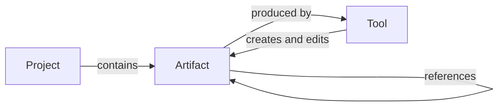
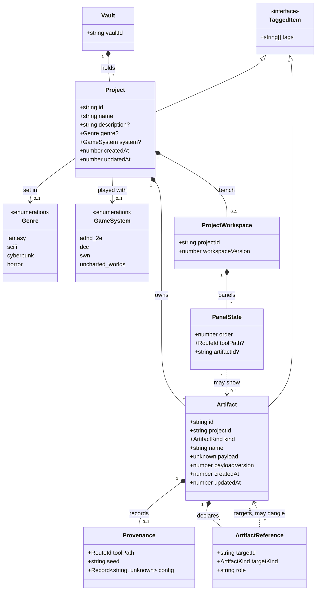
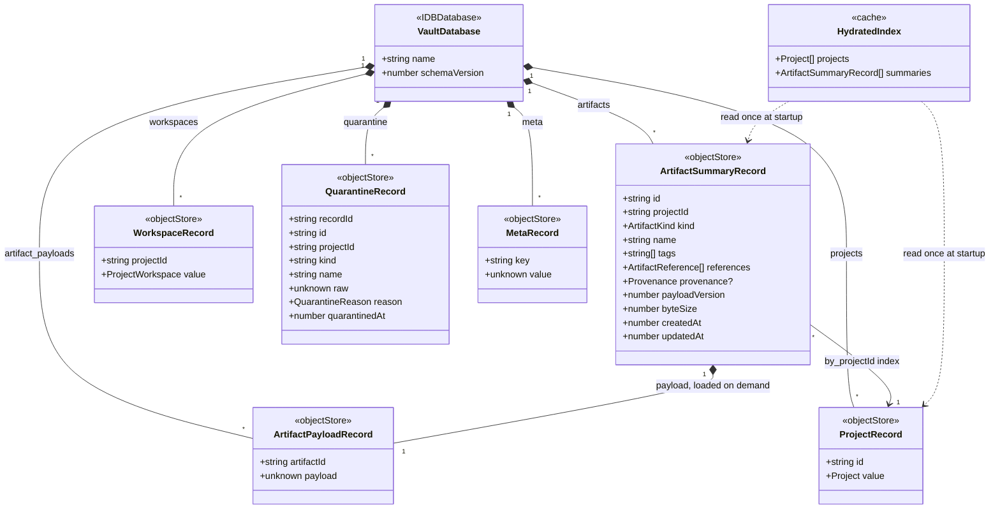
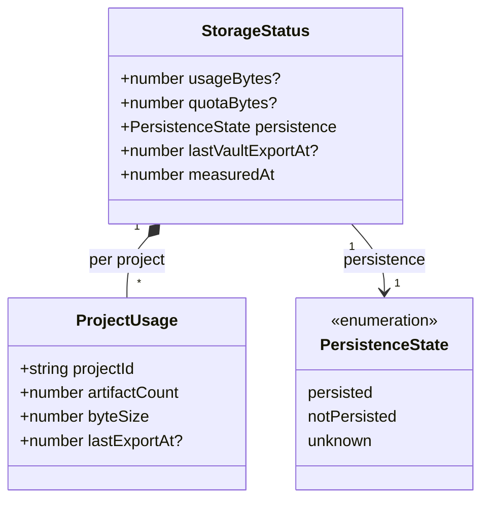
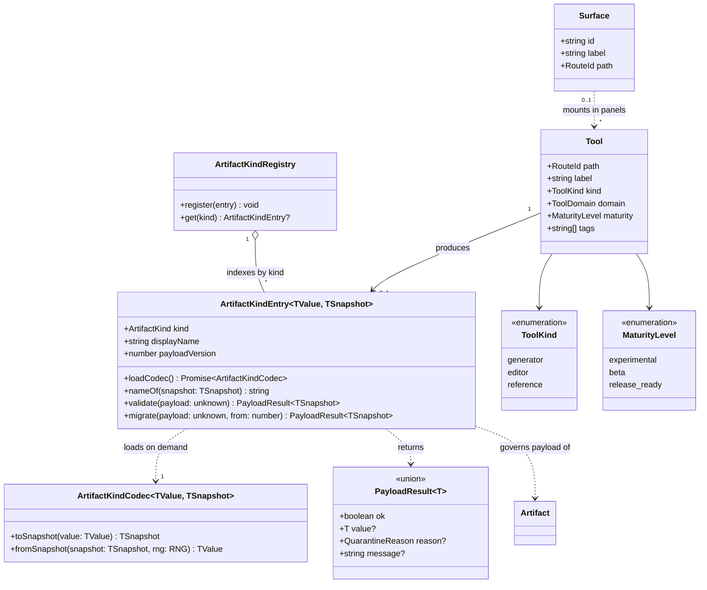
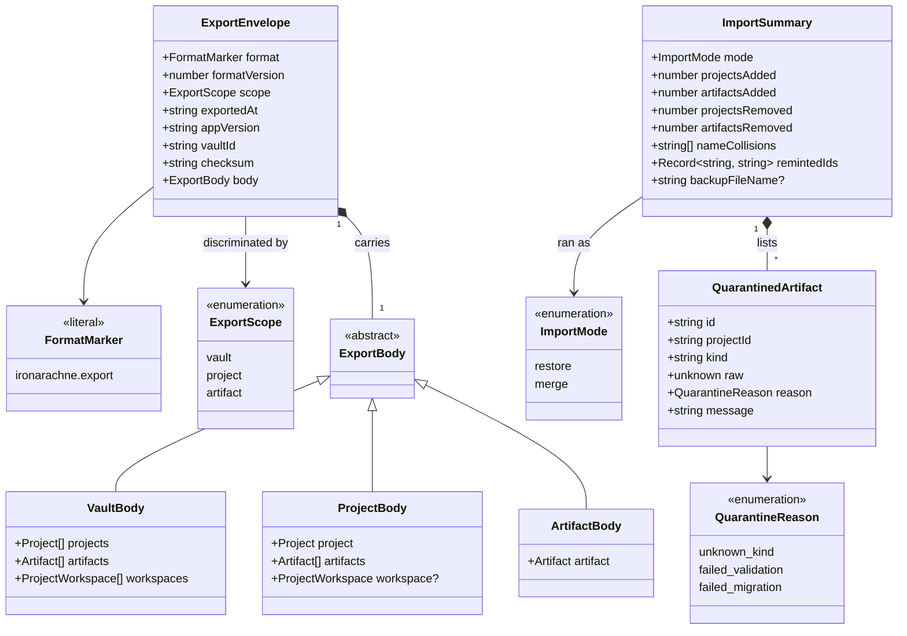

# The Workshop

This design document describes the next version of Iron Arachne: a **workshop** for building
campaigns and worlds, rather than a collection of independent generator pages.

It covers the model the site is built on, how the pieces fit together, the types that model
becomes in [Domain model](#domain-model), and — in
[Tool release readiness](#tool-release-readiness) — the specification a tool must meet before it
is considered finished.

**Status:** accepted; being built. The foundation and durability phases are in place, the shell is
live at `/workshop` — with a project always open, several panels on a bench at once, and a project
view listing what the project holds — and all three of the first release's tools are Release-ready. The work is broken
down in [The plan](#the-plan) and tracked on GitHub under the `workshop` label; what is built and
what is not is in [What exists today](#what-exists-today).

The [domain model](#domain-model) is settled, and the work in [The plan](#the-plan) is built
against it. The nine questions it forced are recorded in
[Decisions taken here](#decisions-taken-here); three of them close open questions this document had
been carrying.

## The shift

Today the site is a set of self-contained pages. You visit `/culture`, roll a culture, and read
it. If you leave, it is gone — unless it happens to be one of the three generators that can save
(heraldry, culture, religion). Each of those saves into its own global bucket, and nothing that
is saved can be used as an input anywhere else.

That shape has a ceiling. The value of Iron Arachne is not any single generator; it is that a
culture, a religion, a settlement, and a region are pieces of the _same world_, and a world is
built by making pieces and fitting them together. The current site can make the pieces but has
nowhere to put them and no way to join them.

The workshop is that missing structure:

- A user's work lives in a **project** — one campaign, one setting, one world.
- Tools produce **artifacts**: named, saved, editable objects that belong to a project.
- Artifacts **reference each other**, so a settlement can follow a religion you made earlier and
  a region can be built from settlements you have already curated.
- **Tools** are the instruments for making and editing artifacts, mounted inside the workshop
  rather than each living on its own island.

The generators do not go away and neither do their routes. What changes is that their output
stops evaporating and starts accumulating into something.

## Local only

Iron Arachne runs entirely in the browser. **No accounts, no back end, no reliance on remote
services.** This is a core principle of the application, not a consequence of the current stack,
and it is not up for revision as the workshop is built.

Everything in this document is designed within that constraint:

- **Persistence is browser storage**, with explicit file export and import as the way work leaves
  the machine it was made on.
- **Projects are local.** There is no sync, no cross-device continuity, and no server-side copy.
  A user's worlds live on the device they built them on until they export them.
- **Sharing is a file.** Handing a project to a player means giving them a file they import, not
  a link they visit.
- **Collaboration is out of scope.** Two people editing one project is a server-shaped problem
  and this application does not have a server.

The consequences are real and worth naming rather than discovering later. Clearing browser
storage destroys a user's work, so export must be obvious, cheap, and complete — not buried
behind a menu. There is no server-side migration either, which means every `payloadVersion` step
has to be handled in the client, on data that may be arbitrarily old, by a user who has not
opened the site in a year.

Where a feature seems to want a server, it is either solved with files or it is not built.

## Core model

Three concepts. Everything else is detail.

### Project

The top-level container and the unit a user thinks in: "my Dolmenwood campaign", "the
Ashfall setting". A project owns artifacts, and artifacts belong to exactly one project.

A project carries a name, an optional description, an optional genre and game system
([Genre and system](#genre-and-system)), free-form tags, and timestamps. It is
deliberately thin — it is a namespace and a workspace, not a document with its own content. What
makes a project meaningful is what is inside it.

Users may have several projects, and the workshop always operates in the context of exactly one
at a time. There is no cross-project referencing: an artifact cannot point at something in a
different project, because a world that depends on another world is not a world.

Copying an artifact between projects is a supported operation, but it copies — the two diverge
afterwards.

#### Genre and system

A project may say what it is **set in**: a genre — `fantasy`, `scifi`, `cyberpunk`, `horror` — and a
game system — `adnd-2e`, `dcc`, `swn`, `uncharted-worlds`. The two are independent and both are
optional. A Stars Without Number campaign is `scifi` and `swn`; a homebrew sword-and-sorcery
setting is `fantasy` and no system at all; a project that is simply a box of tools is neither.

What they buy is a shorter Tools panel. A fantasy campaign has no use for a cyberpunk chop shop in
its tool list, and at 35 tools the noise is real.

**The vocabularies are the tool catalog's, not a second pair.** `Genre` and `GameSystem` are
declared in `src/lib/tools/tool_types.ts` and already expand into `genre:` and `system:` tags on
every catalog entry; `$lib/projects` imports them from there. Two lists of genres is how the
project form and the tool browser end up offering different ones. The dependency runs one way —
projects knows about tools, tools knows nothing about projects — and has to stay that way.

**Both can be changed, at any time.**
[Decision 7](#7-a-projects-genre-and-system-are-fields-and-both-can-change) argues it in full. The
short version is that nothing keys off either field except which tools are listed: no artifact
records the genre of the project it was saved in, no payload changes shape, no reference breaks. A
change costs a different list and nothing else, where a permanent choice costs a user who picked
wrong an entire second project — and since a genre hides most of the catalog, picking wrong is the
likeliest thing that will happen here.

**A tool with no genre is always listed, and so is a tool with no system.** That rule is the whole
filter and it is load-bearing: only four tools carry no genre — `/environment`, `/language`,
`/workshop`, and `/word-generator-cheat-sheet` — so a filter that dropped genre-neutral tools would
take the environment generator away from a fantasy project, which is the opposite of the point. A
tool carrying several genres matches if any of them does: `/spooky-ship` is `scifi` and `horror`
and belongs in both lists. `isCompatibleWithSystem` in `src/lib/tools/tool_search.ts` is already
exactly this shape; `isCompatibleWithGenre` joins it, and the genre criterion in `searchTools`
changes from `hasGenre` — keep only tools carrying this genre — to compatibility. The strict filter
has one caller, a checkbox that is about to go, so nothing depends on the old meaning.

**There is one way past the filter, and it is one control.** The catalog is not evenly spread:

| Project setting | Tools listed, of 35     |
| --------------- | ----------------------- |
| No genre        | 35                      |
| `fantasy`       | 25 (21 + the 4 neutral) |
| `scifi`         | 12 (8 + 4)              |
| `cyberpunk`     | 6 (2 + 4)               |
| `horror`        | 5 (1 + 4)               |
| Any system      | 30 or 31 of 35          |

A `horror` project seeing five tools is a fact about the catalog rather than a bug in the filter —
but a panel that hides thirty tools with no way to say "show me anyway" is a wall, and the one
route around it, typing a tool's URL, is invisible. So the Tools panel filters by default and
offers a single unchecked checkbox, _Show all tools_, that suspends both filters at once, above it
a line naming the setting and counting what is hidden. That state is per session and is not
persisted: looking at the rest of the catalog is not a change to the project. Separate checkboxes
per filter were considered and rejected — two controls in a narrow rail for a distinction nobody
has asked to draw.

This does soften the stance `ToolBrowser`'s present copy takes, that tools for other systems are
never listed. Mixing systems was never a data hazard: kinds are system-qualified
([decision 4](#4-kinds-are-system-qualified-when-the-payload-is)), so an AD&D character saved into
an SWN project is still a `character.adnd-2e` and nothing downstream is confused by it. The hiding
is decluttering, and decluttering may be undone.

**Where they are set.** Two paths create a project. The create row on `/projects` gets both, as
selects defaulting to "Any genre" and "Any system", and the project card's edit form gets the same
pair beside name and description — which is also where a project made before this feature gets one,
and where a wrong choice is corrected. The other path is the save dialog on a tool's own route,
which offers to make a project when the user has none; it stays name-only and creates a project
with neither set. It is reached mid-task by someone who wanted to save a culture, and its one field
is already more than they came for.

Inferring the system there from the tool being saved from — a project created out of
`/swn/character` is probably an SWN project — is tempting, and is not done. "Probably" is the
problem: a fact the user never stated, written silently, that then hides tools they never chose to
hide.

**The field is the answer; the tag is derived.** Genre and system are fields on `Project`, and the
matching `genre:<g>` and `system:<s>` tags are recomputed from those fields on every write — the
both-shapes pattern `defineTool` already uses for `maturity`, for the same reason: every reader
wants exactly one answer, which only a field guarantees, while the tag keeps the fact composing
with the filtering in `$lib/tags`. A project's tags differ from a catalog entry's in one way that
matters, though: `ProjectChanges.tags` lets a caller rewrite them wholesale, and an import carries
whatever the file said. So the derivation strips any incoming `genre:`/`system:` tag before
appending the derived ones, and runs on the read path (`toProject`) as well as the write path
(`toProjectRecord`) — one helper, both places. A stored record whose tag disagrees with its field
is then not a state anything else has to consider.

`ProjectChanges` needs `null` to mean "clear": the convention it uses for strings, where empty
clears, has no honest analogue for an enum, and `'' as Genre` would be a lie. So
`genre?: Genre | null` — absent leaves it alone, `null` unsets it, a value sets it.

**What travels.** Both fields are optional and additive, so `EXPORT_FORMAT_VERSION` does not move,
and must not: `parseExportFile` refuses any file whose version is newer than the build, so a bump
makes every export from the new build unreadable to a deployed older one — a total refusal in
exchange for a field that build would have ignored anyway. Additive-optional degrades the right
way instead; the older build drops what it does not know and keeps the project.

The import side has to degrade the same way, and the obvious implementation does not. `toProject`
returns `undefined` when any field fails its check and `readVaultBody` filters those out, so
validating `genre` as "must be one of `GENRES`" would mean a vault from a future build with a fifth
genre loses the whole project — name, description, tags, id — and spills its artifacts into the
"Recovered artifacts" bucket. The rule is that an unrecognised genre or system **drops the field
and keeps the project**, with a test that says so. It is the same discipline requirement 3.3 asks
of artifact payloads, and here the failure it prevents is worse than a throw.

Three places handle a project field by field and will silently lose these unless they are changed
with the type: `toProjectRecord`, `stageProjectRecord` in `vault_file_import.ts`, which rebuilds an
imported project through a draft, and `sameProject`, which decides whether an update writes at all
— leave it alone and a genre-only edit is discarded as no change.

**What does not key off them, yet.** Genre themes (`fantasy.css`, `scifi.css`, `cyberpunk.css`)
style generated output per tool today, and whether a project's genre should also theme the workshop
is a real question with real arguments on both sides. It is not answered here, and nothing in this
design depends on the answer. Artifact kinds do not key off the project either: they are qualified
by system where the payload demands it (decision 4), which is a property of the payload rather than
of the project holding it. And a panel already mounted for a tool the setting now hides **stays
mounted** — taking a tool out of a list is not a reason to close someone's work.

### Artifact

A saved, named, editable object produced by a tool. A generated culture that the user kept. A
settlement they then renamed and rewrote half of. The region those settlements sit in.

An artifact has:

| Field                     | Purpose                                                                     |
| ------------------------- | --------------------------------------------------------------------------- |
| `id`                      | Stable identity. Referenced by other artifacts; never reused.               |
| `kind`                    | What it is (`culture`, `religion`, `settlement`). Determines payload shape. |
| `name`                    | User-facing, user-editable, not required to be unique.                      |
| `payload`                 | The content itself, serialisable, versioned by `payloadVersion`.            |
| `provenance`              | How it was first made: tool path, seed, generator config.                   |
| `references`              | Links to other artifacts (see [Composition](#composition)).                 |
| `tags`                    | Free-form, using the existing `$lib/tags` filtering.                        |
| `createdAt` / `updatedAt` | Timestamps.                                                                 |

**The payload is the truth.** Once an artifact exists, its payload is what it is — not a seed to
be re-rolled. This matters because artifacts are editable: as soon as a user renames a deity or
rewrites a settlement's trade blurb, the original seed no longer reproduces what they have. The
seed is kept as provenance so the user can see where a thing came from and can deliberately
re-roll it, but re-rolling is a destructive action that replaces the payload, not a load path.

This is already how the existing saved generators behave —
`src/lib/culture/culture_snapshot.ts` stores the culture and uses an RNG only to rehydrate the
name generators, not to regenerate the culture. The workshop generalises that pattern rather
than inventing one.

#### Artifact kinds

A `kind` identifies a payload shape, and is owned by the library that defines the type. Kinds are
stable strings; renaming one is a migration.

Where the same concept differs by game system, those are **distinct kinds** —
`character.swn` and `character.adnd-2e` are not interchangeable, and pretending otherwise would
push system-specific fields into a shared type or force lossy conversion. System-neutral content
(`culture`, `religion`, `language`, `region`) has one kind covering all uses.

[Decision 4](#4-kinds-are-system-qualified-when-the-payload-is) turns that into a rule that decides
new cases rather than an observation about characters.

### Tool

A tool is an instrument, and the catalog in `src/lib/tools` already describes them: a path, a
label, a `kind` (`generator`, `editor`, `reference`), a domain, and genre/system tags. The
workshop adds a second half — `src/lib/workshop/tool_panels.ts` maps a catalog path to the
component that renders it, so a tool can be mounted in a panel instead of only on its own route.

The three tool kinds have genuinely different obligations in the workshop:

- **Generator** — rolls new content. Produces artifacts. The bulk of the site (30 of 35 tools).
- **Editor** — modifies content the user supplies. Consumes and produces artifacts.
- **Reference** — a static table or calculator. Produces nothing and saves nothing. Legitimately
  exempt from most of the artifact machinery.

Today most generators are _only_ generators; making them editors of their own output is the
single largest piece of work the workshop implies.

The catalog holds instruments, and only instruments. The workshop itself is not one — it is the
bench the instruments are clamped into — and neither are Projects, the Result Vault, or the release
notes. Those are **surfaces**: the places a user works, reached from the sidebar rather than from
the tool browser, carrying no `kind` and no maturity because neither question is asked of them. See
[decision 9](#9-the-workshop-is-a-surface-not-a-tool).

## How the workshop works

The workshop is a single surface with three regions:

- **Project context** — which project is open, and switching between projects.
- **Tool browser** — the catalog, searchable and filterable by genre, system, and domain, and
  narrowed to the open project's [genre and system](#genre-and-system) unless the user asks to see
  everything. This exists (`src/lib/tools/tool_search.ts`, `ToolBrowser.svelte`).
- **Panels** — mounted tools and open artifacts.

A user opens a project, picks a tool, generates something, names it, and keeps it. It appears in
the project. They open it again later, edit it, and reference it from something else.

### Panels

Panels are how more than one thing is visible at once, which is the entire point of a workshop:
you cannot build a region _from_ your settlements if you cannot see them while you work.

Built in #36 as `src/lib/workspaces`: several panels at once, holding a mix of tools and artifacts,
opened, closed, and reordered from the panel's own controls, and remembered per project so
reopening a project restores the bench as it was left. A panel is identified by what it holds, so
opening something already on the bench moves to it rather than putting a second copy beside it.

**At most one of those panels is a tool.** Opening a second tool takes the first off the bench;
artifacts are not capped and stay open beside whichever tool is mounted. This narrows the paragraph
above rather than contradicting it: the case it argues for is building a region _from_ settlements
you can see, and those settlements are artifacts. What is single is the **instrument**, not the
bench — a workbench has one thing clamped in it and as many references open around it as you like.

**The tool is mounted at the left-hand end**, in front of whatever artifacts are already open;
artifacts still open at the right. The instrument leads, and a bench that has collected a few
references must not push the tool the user just asked for off to the right of them — on a phone,
where the bench is a single column, that is the work below the fold and the notes above it. The
seat is chosen only on the way in, so the move controls still mean what they say: a user who puts
the tool to the right of an artifact keeps it there.

The invariant is enforced in `renumberPanels`, which every mutation and every read passes through,
so a bench stored before the rule existed comes back obeying it — keeping the rightmost tool, which
was the one most recently opened back when tools were appended. Swapping a tool out asks first when it is holding generated
content nobody has saved, through the same unsaved-edits registry that guards closing a panel;
`SaveArtifactButton` is what registers that answer for a generator.

Panel components are loaded on demand and the import specifiers are written out in full, because
a bundler can only split a dynamic import it can see — a computed specifier would pull every
generator on the site, WebGL renderers and PDF export included, into whatever page opened one
panel. That constraint is already documented in `src/lib/workshop/README.md` and must survive.

### Routes

Every tool keeps its own route. They are the entry point for someone arriving from a search
engine with no project and no interest in one, and they are how a tool is used as a one-off. A
tool must work in both places, which is why the panel registry points at the same component the
route mounts.

The difference is what the _Save_ affordance does: on a route with no project open, saving
prompts for a project (or offers a scratch one); inside the workshop, it saves to the open
project.

## Persistence

Saving used to be per-generator and global. `src/lib/culture/culture_saved_state.ts` wrote every
culture the user had ever kept to one storage scope (`generator.culture`) as a flat array, and
`src/lib/persistent_save/saved_data_catalog.ts` enumerated the three domains that could do this by
naming each one explicitly. Adding a fourth savable generator meant touching the catalog, the
`SavedDataEntry` union, and the `/saved-data` page.

That did not scale to every generator, and it had no concept of a project. What follows is what
replaced it. Those three scopes are still there and still read — they are the fallback #34 left in
place — but they are **read-only** now, and the page and catalog that named them are gone (#44).

The workshop needs a **generic, project-scoped artifact store**: one place that stores artifacts
of any kind, keyed by project, without a hand-maintained list of which kinds exist. Individual
libraries keep owning their payload shape — the `toSnapshot` / `fromSnapshot` pair and the
`payloadVersion` — but they stop owning storage, enumeration, and the save UI.

The substrate that store is built on is **IndexedDB**, not `localStorage`; see
[Storage substrate](#storage-substrate) for why and for what stays behind.

**Migration matters.** Users have saved heraldry, cultures, and religions in
`ironarachne.save.v1.*` today. Those must be adopted into a project on first run rather than
orphaned, and each artifact kind needs a migration path as its `payloadVersion` advances. An
artifact the user spent an hour editing is not something we get to drop because its shape
changed.

Storage is browser storage plus explicit file export/import, per
[Local only](#local-only). There is no server to fall back on, which makes migration and export
load-bearing rather than nice to have: they are the only things standing between a user and
losing their world.

### Storage substrate

The store persists to **IndexedDB**. `localStorage` keeps only small synchronous pointers — the
active project id and UI preferences — which are not user work and are cheap to lose.

The deciding fact is the content. A project is region maps, heraldry SVGs, and star system
imagery, and `localStorage` offers roughly five megabytes per origin, shared across every project
a user has, storing bytes as base64 inside a JSON string at a 33% premium. That is not a project
full of maps; it is one or two. Treating that as a quota-handling problem misreads it — under
`localStorage` the ceiling is reached in ordinary use, and a ceiling reached in ordinary use is
not an edge case, it is the product failing to do the thing it exists for.

IndexedDB is sized against free disk rather than a fixed few megabytes, stores `Blob` and
`ArrayBuffer` natively instead of base64, does its I/O off the main thread instead of blocking it
on a multi-megabyte `JSON.parse`, and commits transactionally. That last property is not a bonus:
[Failure states](#failure-states) already requires a failed vault import to roll back to the
pre-import state, and `localStorage` cannot do that — a multi-key write there can tear and leave
a half-imported vault, which is the outcome that section calls worse than a rejected file.

The cost is an asynchronous API through the store, and it is paid down two ways. **The index is
hydrated once**: projects and artifact summaries are read at startup into memory, so summary reads
stay synchronous for callers and only writes go through a promise. **Payloads stay lazy and
async**, loaded per artifact on demand, which is what you want regardless — nothing should hold
every map in a project resident in memory.

This also dissolves the keying tension #33 recorded. One entry per project holding an array of
summaries existed because `localStorage` has no query: the array was the index. IndexedDB has
indexes, so an artifact is one record keyed by its own id with an index on `projectId`, and
editing one artifact stops rewriting every summary in the project.

Choosing this now rather than later is deliberate. Every consumer of the store is new, so the
switch is cheaper today than it will ever be again — which is the reason #45 said the artifact
store was the moment to weigh it.

Two limits stay real and are not solved by the substrate: private windows offer little or no quota,
and any browser may still evict an origin's storage. Both are handled in
[Eviction and persistence](#eviction-and-persistence) below, and neither changes the standing
conclusion that export is the backup story.

### Storage limits

Three numbers exist, they measure different things, and conflating them produces a display that is
confidently wrong.

| Number                      | Source                               | Good for                               | Not good for                                                                                       |
| --------------------------- | ------------------------------------ | -------------------------------------- | -------------------------------------------------------------------------------------------------- |
| Origin usage and quota      | `navigator.storage.estimate()`       | A proportion, and a rough band         | A byte budget. Browsers deliberately fuzz it, and quota moves as free disk moves.                  |
| Per-project size            | Sum of `byteSize` over its summaries | Attribution — _which_ project is large | The origin total. It excludes index overhead, other stores, and anything the browser counts extra. |
| Whether the next write fits | Nothing reliable                     | —                                      | Everything. There is no pre-flight for a single save.                                              |

The policy that follows:

- **Measure continuously, cheaply.** `estimate()` at startup and after writes that materially change
  size, cached in between. It is cheap, not free, and nothing calls it per keystroke.
- **Do not pre-flight ordinary writes.** Refusing to save a culture because an estimate suggests the
  origin is close to full is refusing real work on the strength of a guess. The exception is bulk
  import (#47), which already estimates before writing, because a 400 MB file is a different
  proposition from one artifact and the failure is far more expensive.
- **Escalate on a threshold, act on an error.** Below 80% of the estimate, nothing is said beyond
  the always-available panel. At 80%, a persistent non-modal notice. `QuotaExceededError` is the
  only authoritative signal and is handled everywhere regardless of what the estimate claimed.

**A failed write is never swallowed**, and three things make that enforceable rather than
aspirational:

- **The store's write API does not return `void`.** It returns a result the caller must handle. An
  API that returns nothing makes silent loss the default and leaves "do not lose saves" to
  discipline, which is the wrong place for it.
- **The hydrated index is not updated until the transaction commits.** Otherwise memory claims a
  save the database does not have, the UI shows saved, and the next reload loses it — the exact
  failure this whole section exists to prevent, arrived at from the inside.
- **The editor keeps the unsaved value.** The artifact stays on screen and stays editable. Whatever
  else has gone wrong, the user has not been made to retype it.

What the user gets on `QuotaExceededError` is blocking, because it is the one storage condition
where continuing to work quietly compounds the loss: what failed, that nothing already saved was
harmed, and a **Download this artifact** action that works with no storage at all — plus export
vault and manage storage. The transaction has already rolled back, so there is no half-written
artifact to reconcile.

### Eviction and persistence

Under [Local only](#local-only) the browser holds the only copy, so eviction is not a tidiness
concern — it is silent total loss, arriving without the user doing anything.

This section and the one after it are designed for implementation in
[The storage disclosure and the persistence request](storage-disclosure.md), which settles which
creation paths trigger a request, what "once per session" means, and where the "told once" stamp
lives.

`navigator.storage.persist()` asks the browser not to evict. The workshop requests it **at first
project creation**, not on first page load. Firefox prompts for it and Chromium decides silently on
engagement heuristics; a prompt shown before the user has made anything is a prompt they dismiss,
and a declined permission is much harder to recover than one not yet asked. At first project
creation there is something worth protecting and the request has a reason the user can see.

If it is refused or unavailable, the workshop does not nag. It re-requests at most once per session
and only after the user has done more work — creating another project, or an export — and it never
asks modally. The status is reported honestly instead, and export carries more of the weight.

Two things this must not imply:

- **Persistence is not a backup.** It resists automatic eviction under storage pressure. It does
  nothing about the user clearing site data, a lost laptop, or a different browser. Presenting
  "Protected" as safety would be the most expensive lie in the product.
- **Safari is a separate case.** Its ITP discards script-writable storage for origins with no user
  interaction for seven days, and its support for persistence is inconsistent. Where that applies,
  the honest line is that export is the protection, and the panel says so rather than showing a
  reassuring badge it cannot back up.

### What the user is told about storage

Local-only means the user is the only backup they have, and someone cannot act on a risk nobody
told them about. Two moments and one place.

The panel, the table and the escalation below are designed for implementation in
[The storage panel](storage-panel.md), which settles where the panel lives now that the shell caps
the sidebar, how a figure that is an estimate is phrased, and what the eighty
per cent banner may say.

**At first project creation — said once, plainly.** Work is stored in this browser only; there is
no account and no server; export is how it leaves. This shares a moment with the persistence
request above, and deliberately: the permission prompt makes sense because the sentence before it
explained why.

**The storage panel — always available, never modal.** Reachable from the workshop, in this order:

1. **Last export.** "Last exported 12 days ago", or "Never exported", with _Export vault_ as the
   primary action.
2. **Protection.** One line of plain language: protected, not protected, or unknown, and what that
   means.
3. **Usage.** The total as a proportion, then a table of projects — name, artifacts, size, last
   exported — sorted by size, because "which one is big" is the question actually being asked.
4. **Actions.** Export vault, export a project, delete a project.

**Escalation.** At 80% a non-modal banner in the workshop, dismissible for the session and back the
next one; it states a true fact about a real condition, so it is not permanently silenceable. On a
failed write, the blocking dialog described above.

Two presentation rules, because a storage display that overstates its own precision teaches users
to ignore it. Quota is never shown as an exact figure — "about 240 MB of roughly 2 GB", not
`251658240 / 2147483648`. And a percentage never appears without the sizes underneath it, since a
percentage of an estimate is two layers of imprecision wearing one number's clothes.

## Export and import

Everything a user has made lives in one browser profile on one machine, so a file is the only
copy that survives clearing site data, replacing a laptop, or a browser deciding on its own that
a site's storage is evictable. Export is not a convenience feature here; it is the backup story,
the migration story, and the sharing story at once.

[Local only](#local-only) asks that export be "obvious, cheap, and complete". Per-project export
satisfies the first two and fails the third: a user with six projects has to remember to export
six files, and the one they forget is the one they lose. **Completeness needs a granularity above
the project** — one file that is the whole vault.

### Three granularities, one format

The vault is everything the user has saved: every project, and every artifact in every project.

| Scope        | Contains                                                    | What it is for                                                          |
| ------------ | ----------------------------------------------------------- | ----------------------------------------------------------------------- |
| **Vault**    | Every project and every artifact, plus project-scoped state | Backup, moving to a new machine, handing someone your whole world.      |
| **Project**  | One project and the artifacts in it                         | Sharing a setting, archiving a finished campaign.                       |
| **Artifact** | One artifact                                                | Handing over a single culture or coat of arms; moving between projects. |

These are **one file format with a `scope` discriminator**, not three formats. One envelope, one
`formatVersion`, one parser, one migration chain, one vocabulary of error messages. Three formats
would triple the migration surface, and migration is the part of a local-only application that has
no server to fix it after the fact.

The envelope carries:

| Field           | Purpose                                                                                         |
| --------------- | ----------------------------------------------------------------------------------------------- |
| format marker   | Identifies the file as ours before anything else is trusted.                                    |
| `formatVersion` | The file format's own version, **distinct from any artifact's `payloadVersion`**.               |
| `scope`         | `vault`, `project`, or `artifact`. Determines the shape of the body.                            |
| `exportedAt`    | Timestamp, for the user's benefit when a Downloads folder holds five of these.                  |
| `appVersion`    | Which build wrote it. Diagnostics only; never a gate on import.                                 |
| `vaultId`       | A random id for the originating browser profile, so import can recognise a file as one of ours. |
| `checksum`      | Over the canonical body, so truncation is reported as damage rather than as a syntax error.     |

Two rules follow from having one format:

1. **Every import entry point accepts every scope.** A user who drags a vault file onto "import
   project" gets their vault imported, not a lecture about the wrong button. The file declares
   what it is; the application reads it.
2. **The body is emitted in a stable order** — fixed key order, artifacts sorted by id — so two
   exports of an unchanged vault differ only in the header. A user who keeps backups in a folder
   or a git repository can diff them, and we get a free equality check in tests.

`payloadVersion` migration is unchanged by any of this: on import, every artifact payload routes
through the kind registry's migration path exactly as it does on read. The file format version
governs the envelope; the kind governs the payload.

### What a vault export is for

Naming the cases, because they are what the failure states have to be measured against:

- **Backup.** Before clearing site data, before a browser update, or just periodically because
  the user has been burned before.
- **A new machine.** Export on the old one, import on the new one, carry on.
- **A different browser**, including moving out of a private window before it closes and takes
  everything with it.
- **Recovering after loss.** Storage was cleared or evicted; the vault file is the only copy left.
- **Handing over everything** to a co-GM or a group archive.
- **Making room.** Export the vault, delete the projects you are not running, keep the file — the
  answer to a storage ceiling that does not involve losing anything.
- **Bug reports.** A vault file reproduces a user's exact state. It also contains everything they
  have ever written on the site, which is worth saying out loud before we ever ask for one.

### Importing

Two modes, and the distinction is the whole design:

| Mode                  | Effect                                                                       | When                                             |
| --------------------- | ---------------------------------------------------------------------------- | ------------------------------------------------ |
| **Restore** (replace) | The vault becomes what is in the file. Anything not in the file is gone.     | Recovering, or moving to a machine with no work. |
| **Merge** (add)       | Every project in the file is added alongside what is there, as new projects. | Combining two machines, taking someone's world.  |

Restore is destructive and must say so in the user's terms — "this removes 4 projects and 212
artifacts" — not in the abstract. Before it writes, it exports the current vault to a file
automatically. That download **is** the undo, and it costs nothing to produce in an application
where the whole vault is already in memory.

Merge never writes into an existing project. Reconciling a file's version of a project against the
one already in storage is a sync problem: it needs causal history the format does not carry and
cannot invent, and every shortcut for it — last-write-wins, newest-timestamp, field-level union —
quietly destroys somebody's edits. **It is not built**, and this is the same reason
[Local only](#local-only) rules out collaboration.

Two projects ending up with the same name is fine and expected; names were never unique. The
imported one is marked as imported so the user can tell them apart, and renaming is theirs to do.

#### Identity on merge

Artifact ids are referenced by other artifacts, which makes id handling the part of merge that
silently corrupts data if it is done casually — and the obvious case is a user importing a backup
taken from the same browser, where every id in the file already exists in the vault.

- Restore preserves ids. It is replacing the vault, so there is nothing to collide with.
- Merge **remints every id** and rewrites the reference graph through the old-to-new map, so a
  culture that pointed at a religion still points at that religion and not at the one already in
  storage under the same id.
- A reference whose target is absent from the file stays absent. Broken references are
  [tolerated and visible](#composition) rather than repaired by guessing, and an import is exactly
  the wrong moment to start guessing.
- Ids duplicated _within_ a single file mean the file is internally inconsistent. Both copies are
  kept under new ids and the fact is reported, because we do not know which one the user wanted.

Because the envelope carries `vaultId`, import can tell the user that a file came from this
browser and offer Restore as the likely intent — the difference between "restore my backup" and
"duplicate all my work" should not rest on the user picking the right radio button. The id is
random and says nothing about who the user is, but it is stable and it travels in any file they
share, which is the honest cost of that affordance.

### Two invariants

Everything in the failure table below is an application of one of these.

1. **Commit is all or nothing.** The import is parsed, migrated, and validated into a staged
   result in memory, and only then written. A file that fails at artifact 900 of 1000 leaves
   storage exactly as it was. A half-imported vault is worse than a rejected file, because the
   user cannot tell it happened.
2. **Nothing is dropped silently.** Data this build cannot interpret is **quarantined** — kept
   verbatim, listed, exportable, marked unreadable — not discarded. The two tempting alternatives
   are both wrong: dropping it destroys work, and rejecting the whole file because one artifact is
   unrecognised makes a 200-artifact backup unusable over a single bad record.

Quarantine is what makes an unknown `kind` survivable. A file written by a newer build, or by a
build that still had a tool we have since removed, imports; the artifacts we understand work
normally, and the ones we do not are still there when a build that understands them arrives.

### Failure states

**Reading the file**

| Condition                                       | Response                                                                                                                                                       |
| ----------------------------------------------- | -------------------------------------------------------------------------------------------------------------------------------------------------------------- |
| Not JSON, or truncated                          | Rejected as damaged, naming the file. Truncation is the common end of an interrupted download and reads as "damaged", not as a parse error at character 40119. |
| Valid JSON, not one of ours                     | Rejected as "not an Iron Arachne file" — a different message from damaged, because it is a different mistake.                                                  |
| Checksum mismatch                               | **Warn, do not block.** Hand-editing a backup is a legitimate thing to do with your own file; we say it looks altered or damaged and let the user proceed.     |
| `formatVersion` older than this build           | Migrated forward through the envelope's own chain, then payloads migrate per kind. This is the case the format exists for.                                     |
| `formatVersion` newer than this build           | Rejected, with the reason: the file came from a newer version, reload the site and retry. Never partially read — a newer envelope may mean anything.           |
| Unknown artifact `kind`                         | Quarantined. The rest of the file imports.                                                                                                                     |
| A payload fails validation or its migration     | That artifact is quarantined with its raw payload. The rest of the file imports.                                                                               |
| Artifact whose project is missing from the file | Attached to a generated "Recovered artifacts" project rather than dropped.                                                                                     |
| Reference cycles                                | Fine. Anything walking references [tolerates them](#composition) already.                                                                                      |
| A vault containing zero projects                | Valid. Reported as empty rather than reported as success, so the user knows they exported nothing.                                                             |
| Gzipped file                                    | Accepted. Import sniffs for it, so compressed and plain files both work and the user never has to know which they have.                                        |

**Writing the vault**

| Condition                             | Response                                                                                                                                                                           |
| ------------------------------------- | ---------------------------------------------------------------------------------------------------------------------------------------------------------------------------------- |
| The import will not fit in storage    | Checked _before_ writing, from the file's own size and `navigator.storage.estimate()` where available. Refused up front with what would be needed, not discovered at artifact 900. |
| `QuotaExceededError` during the write | Rolled back to the pre-import state. The estimate is an estimate; the rollback is what makes it safe to be wrong. See [Storage limits](#storage-limits).                           |
| Storage unavailable or blocked        | Reported plainly, including that nothing was saved. Some browsers offer storage that is silently discarded — better to say so than to let a user believe an import worked.         |
| The site is open in another tab       | Detected and warned before importing. Two tabs writing the vault clobber each other, and a restore in one tab under a workshop open in another is the worst version of it.         |
| A restore lands under an open project | The workshop reloads its context afterwards. Panels must not be left bound to artifact ids the restore has removed.                                                                |
| A large import stalls the main thread | Progress is shown and the import is interruptible before commit. Nothing is written until it completes, so cancelling costs nothing.                                               |

**Producing the file**

| Condition                                  | Response                                                                                                                                                                                                                 |
| ------------------------------------------ | ------------------------------------------------------------------------------------------------------------------------------------------------------------------------------------------------------------------------ |
| Storage holds malformed or legacy data     | It is exported verbatim anyway. A backup that refuses to back up the data you most need recovered is exactly backwards.                                                                                                  |
| An artifact's payload cannot be serialised | Reported in the export summary rather than throwing. `strip_function_values_deep` already exists for the closure case.                                                                                                   |
| The browser blocks the download            | Fall back to showing the file for copy, so a download-blocking browser or an unusual mobile context is not a dead end.                                                                                                   |
| The vault is very large                    | Compression via `CompressionStream` is available without a dependency, and is worth taking when size demands it — deferred, not designed away, and the import sniffing above is what keeps it a non-event when it lands. |
| The file lands in a folder with ten others | Named `ironarachne-vault-YYYY-MM-DD.json`, so it sorts and reads correctly. Project exports carry the project slug.                                                                                                      |

Every import ends in a **summary the user can read and copy**: projects added, artifacts added,
artifacts quarantined and why, names that collided, ids reminted. "Import complete" is not a
result; it is a way of not saying what happened.

### What travels and what does not

A vault file carries the user's _work_: projects, artifacts, tags, provenance, references, and
project-scoped state such as panel arrangement if [that is persisted](#open-questions).

It does not carry device-scoped preferences — theme, last-opened project, anything about how this
browser is set up. Restoring a backup should not change the colour of the site, and a file handed
to another person should not reach into their settings.

### Legacy save files

`src/lib/persistent_save/save_file_export.ts` already exports and imports today, but its unit is
storage scopes rather than projects and artifacts, and it checks `SAVE_EXPORT_FORMAT_VERSION` with
strict equality — which turns the first version bump into rejection of every file already in
users' hands.

Vault import **must accept those files**, routing them through the same adoption path as
[#34](#the-plan) so a backup made today still restores in two years. That is the whole point of
having a version field, and the existing exporter is retired only once its files can be read by
its replacement.

## Composition

Composition is the payoff, and it is what makes this a workshop rather than a filing cabinet.

An artifact may reference other artifacts: a culture that follows a specific religion, a region
built from named settlements, a star nation assembled from planets the user designed. A reference
records the target's `id` and `kind`.

Three rules keep this from becoming a swamp:

1. **References are opt-in.** A generator that is handed nothing generates its own inputs, as it
   does now. "Use a saved religion?" is an affordance, not a requirement.
2. **References are by identity, not by copy.** Editing a religion updates every culture that
   follows it, because that is what a user means by "this culture follows _that_ religion". A
   user who wants divergence duplicates the artifact first.
3. **Deleting a referenced artifact is a prompted decision, and dangling references are
   tolerated.** The user is shown what points at the artifact and may delete it anyway; the
   references that survive render as visibly broken rather than crashing their consumer, and
   repairing one is a separate, explicit action. Silently breaking links is not an option, and
   neither is refusing to ever delete anything.

The alternative to rule 3 — blocking a delete until every referrer has been updated — is rejected
because it collapses into never being able to delete. The cost of the rule as stated is that every
consumer of a reference has to treat "the target is gone" as an ordinary state rather than an error
path, and that a broken reference has to be visible where the artifact is shown rather than only in
a validation pass someone has to run.

Reference cycles are possible and acceptable — a realm's ruler is a character from that realm —
so anything that walks references must tolerate them. The store does: `collectReferencedArtifacts`
visits every id once, and a culture and a religion pointing at each other terminate from either
end (`artifact_loading.test.ts`).

**Today the UI cannot build a cycle**, which #41 found rather than assumed. A reference is recorded
when an artifact is saved, and saving always makes a new artifact, so a user can build
`culture → religion → culture` across three artifacts but cannot close the loop over two. Nothing
here changes: cycles remain legitimate, and the day something can add a reference to an artifact
that already exists — re-saving over one, or editing its links — the walkers are already ready for
what it produces.

## Domain model

The types this document implies, stated as types. What a diagram declares here is what the
corresponding `*-types.ts` file declares in code, so this is where the shape gets argued about —
before [the plan](#the-plan) starts building against it.

Five diagrams rather than one: the store, the storage layer it persists to, storage status, the
registries, and the file format. They are separate concerns with separate versioning, and drawn
together they are unreadable.

Field names are TypeScript. `?` marks an optional field and `[]` an array. `Record<string, unknown>`
is written `Record~string, unknown~` because that is how Mermaid spells a generic.

**These are types, not classes.** CODE_STYLE.md rules classes out and nothing here asks for one.
Mermaid's only "is a" arrow is `<|--`, so it stands for whichever TypeScript construct the case
calls for — an intersection for `TaggedItem`, a discriminated union for `ExportBody` — and never for
`extends`. Read the arrows as structure, not as a hierarchy to implement.

### The store

`Project` and `Artifact` are the two types a user thinks in, and the two the store persists.
`ProjectWorkspace` is persisted alongside them but is not user work; see
[decision 3](#3-panel-state-is-persisted-per-project-and-may-be-dropped).

Reading the relationships:

- **Filled diamonds are ownership and cascade on delete.** Deleting a project deletes its
  artifacts and its bench; there is no orphan state and no cross-project edge, per
  [Project](#project).
- **`projectId` on the artifact is authoritative, and the storage key is an index derived from
  it.** The same edge is expressed twice — once as containment, once as a field — because storage
  is keyed by project, and two representations of one fact can disagree. The field wins; a key that
  contradicts it is a bug in the store, not a second opinion.
- **The dashed edges are the ones that may not resolve.** A reference names a target it does not
  own, and [Composition](#composition) rule 3 makes a missing target an ordinary state rather than
  an error. Every consumer of that edge handles `undefined`; nothing walking it may assume a cycle
  is impossible. A panel bound to a deleted artifact is the same case with a cheaper remedy — it is
  dropped rather than shown broken, because a bench is not work.
- **`role` on a reference is required.** A region references its capital and its member
  settlements, and both are `kind: settlement`, so target kind alone cannot say which is which.
  Without a role, references are an untyped bag and every consumer re-derives intent it cannot
  actually recover. See [decision 1](#1-references-carry-a-required-role).
- **`Provenance` is optional and stays optional.** Artifacts adopted from legacy saves (#34) have
  no honest seed, and inventing one would be a lie the re-roll button acts on. Its `toolPath` is a
  catalog key — the one edge from the store to the registries below.
- **`Genre` and `GameSystem` are the tool catalog's own vocabularies**, imported from
  `src/lib/tools/tool_types.ts` rather than restated — the diagram spells `adnd-2e` and
  `uncharted-worlds` with underscores only because Mermaid reads a hyphen as an operator. Both are
  optional, both may change, and the `genre:`/`system:` tags on the project are derived from the
  fields on every read and write, never authored. See [Genre and system](#genre-and-system) and
  [decision 7](#7-a-projects-genre-and-system-are-fields-and-both-can-change).
- **`payload` is `unknown` here on purpose.** The store deliberately does not know payload shapes —
  that is the whole point of it being generic — so the type is narrowed by `kind` through the
  registry below, not by the store.
- **Exactly one of `PanelState.toolPath` and `artifactId` is set**: a panel holds a mounted tool or
  an open artifact. Both optional is Mermaid's approximation of a two-variant union.

### The storage layer

The diagram above is what a user thinks in. This one is what is written to disk, per
[Storage substrate](#storage-substrate). The two differ in one structural way: `Artifact` splits
into a **summary** and a **payload** held in separate object stores, so listing a project does not
read a single map.

Six object stores — `projects`, `artifacts`, `artifact_payloads`, `workspaces`, `quarantine`, and
`meta`. Each class below is one store's record shape, and the edge label from `VaultDatabase` is
the store's name. `quarantine` arrived with #47, in schema version 2.

Reading it:

- **`byteSize` is new, and it is what makes usage reportable.** It is the serialized size of the
  payload, recorded at write time because that is the one moment the number is free. Summing it
  over a project's summaries attributes usage per project without re-reading a single payload,
  which `navigator.storage.estimate()` cannot do — that reports for the whole origin.
- **`storeVersion` per record is gone.** It existed because `localStorage` has no schema and every
  record had to carry its own. A database has a version and an upgrade transaction, so the schema
  is versioned once in `VaultDatabase.schemaVersion`. `payloadVersion` stays exactly as it is: it
  versions a kind's payload shape, which is the registry's business and not the store's.
- **The `by_projectId` index replaces the per-project summary array.** The arrow is an index, not
  ownership — `projectId` on the record remains authoritative, as
  [The store](#the-store) already requires.
- **`HydratedIndex` is a cache, not a source of truth**, and it holds no payloads. It exists so
  callers listing a project do not await, and it is rebuilt from the database rather than repaired.
- **A cascade is one transaction.** Deleting a project removes its artifacts, their payloads, and
  its workspace atomically, which is the ownership the first diagram draws with filled diamonds and
  the thing `localStorage` could only approximate.
- **A whole-vault write is one transaction too**, across every content store at once (#47). That is
  what makes [invariant 1](#two-invariants) structural rather than remembered: an import that runs
  out of quota part way aborts, and IndexedDB unwinds every put in it, so there is no rollback path
  of our own to get wrong — and no window in which a restore has emptied the vault but not refilled
  it.
- **`QuarantineRecord` is keyed by `recordId`, not by the record's own `id`.** A record damaged
  enough to have lost its id has nothing to be filed under, and two of those would overwrite each
  other — which would be the quarantine store losing the work it exists to keep. It is deliberately
  outside the project cascade: a record nothing can read is not owned by a project that may not
  exist.

### Storage status

What [What the user is told about storage](#what-the-user-is-told-about-storage) displays. Almost
all of it is **derived, not stored** — recomputed from the summaries and from
`navigator.storage` — and the two exceptions are marked, because a field that is persisted has a
migration story and a derived one does not.

Reading it:

- **`usageBytes` and `quotaBytes` are optional because `estimate()` is.** Not every browser answers,
  and a missing number is displayed as unknown rather than as zero. Zero is a claim; unknown is the
  truth.
- **`persistence` is three-valued on purpose.** `unknown` is a real state — the API may be absent, or
  the answer may not have arrived yet — and collapsing it into `notPersisted` would report a
  protected origin as unprotected.
- **`lastVaultExportAt` and `lastExportAt` are the only stored fields here**, written on a
  _successful_ export and nowhere else. `lastVaultExportAt` lives in the `meta` store,
  `lastExportAt` on the project record. They are stored because they are the number that predicts
  loss, per [decision 6](#6-storage-is-reported-continuously-and-export-recency-leads), and a
  measurement that resets on reload cannot answer "how long has this been the only copy".
- **`measuredAt` is what keeps the display honest.** The status is cached between measurements, so
  the UI can say how stale the figure is instead of presenting a cached number as live.
- **`ProjectUsage.byteSize` is a sum, not a measurement.** It adds the `byteSize` recorded on each
  summary; it is attribution across projects and is not reconciled against `usageBytes`, which
  counts overhead this cannot see. The two disagreeing is expected, not a bug.

### Kinds, tools, and the snapshot contract

The registries. `ArtifactKindEntry` is the contract requirement 3.2 describes, given a type.

- **The entry is generic; the registry is not.** `ArtifactKindEntry~TValue, TSnapshot~` keeps a
  library's own types intact where it defines them, and `ArtifactKindRegistry.get` hands back the
  erased form. That confines the cast to the lookup instead of spreading it to every consumer,
  which is what CODE_STYLE.md is asking for when it says to describe shapes at boundaries rather
  than reach for `any`.
- **`TValue` is the live thing; `TSnapshot` is the artifact's payload.** An earlier draft of this
  diagram called both "payload", which cannot hold: `fromSnapshot` needs an RNG, so it is not what
  a validator can return. `validate`, `migrate`, and `nameOf` are handed whatever was in storage or
  in a file and therefore speak in snapshots; only `fromSnapshot` produces a live value.
- **The codec is separate, and loads on demand.** Everything else on the entry is synchronous,
  which is what lets a store read and a project listing stay synchronous. The conversion pair is
  not, because it is the expensive half: rebuilding a coat of arms resolves stored charge names
  against `$lib/charges`, which is 18 MB of glyph art — measured — and only a panel that is
  actually opening an artifact needs it. Assembling the registry through the three libraries'
  entry points costs 296 KB in whatever chunk imports it, against 4 KB through the kind modules
  with their codecs deferred. This is the trade `ToolPanelRegistry` already makes for components,
  applied to payloads: one `await` where a user opens or saves something, in exchange for keeping
  the site's charge library out of the chunk that merely lists what a project contains.
- **`validate` and `migrate` return a result, not a boolean.** A boolean says no without saying
  why, and the reason is exactly what `QuarantineReason` and the import summary have to report.
  `PayloadResult` is a discriminated union on `ok` — the "well-defined empty result rather than
  throwing" of readiness requirement 3.3, given a type.
- **`Tool` is the existing catalog type** (`src/lib/tools/tool_types.ts`) plus `maturity`, which
  #43 added. All of it is built.
- **`Surface` is what the catalog does not hold.** It is `NavDestination`
  (`src/lib/navigation/nav_types.ts`), named here for what it is in this document: a place the user
  works, rather than an instrument they work with. The workshop is the surface that mounts tools;
  Projects and the Result Vault mount none, which is why the association is `0..1` and why it is a
  dependency rather than composition — a bench holds a tool for as long as it is clamped there and
  owns nothing about it. **No arrow runs from `Surface` to `ToolKind` or `MaturityLevel`, and that
  absence is the point**: neither question is asked of a surface. See
  [decision 9](#9-the-workshop-is-a-surface-not-a-tool).
- **`0..1` on _produces_ is the reference tools.** A reference tool defines no kind and saves
  nothing; the cardinality is what keeps section 3 of the readiness spec from applying to it.
- **`get(kind)` returns optional, and that is load-bearing.** An unknown kind is the normal case
  for a file from a newer build, and the miss is what routes it to quarantine instead of an
  exception.
- **`ArtifactKind` is an open string, not an enum**, owned by the library defining the payload.
  Closing it would make an unrecognised kind unrepresentable, which is exactly the data
  [invariant 2](#two-invariants) promises to keep. Its naming rule is
  [decision 4](#4-kinds-are-system-qualified-when-the-payload-is).

`ToolPanelRegistry` is deliberately absent: it already exists, maps path to lazy component loader,
and holds no domain state.

### The file format

One envelope, one `formatVersion`, one parser — per
[Three granularities, one format](#three-granularities-one-format). `scope` discriminates the body.

- **`formatVersion` on the envelope is not `payloadVersion` on the artifact.** They advance
  independently and migrate in separate chains; sharing a field would couple every payload change
  to the file format.
- **`FormatMarker` is a literal, not a string.** It is what identifies the file as ours before
  anything else is trusted, and `string` is precisely the type that cannot do that.
- **`checksum` is SHA-256 of the canonical body**, via `crypto.subtle` — no dependency, and the
  stable key order the format already requires is what makes it reproducible.
- **`remintedIds` is the old-to-new map** merge rewrites the reference graph through
  ([Identity on merge](#identity-on-merge)). Restore leaves it empty, which is the type-level
  statement that restore preserves ids.
- **`QuarantinedArtifact` keeps the whole record, not just the payload.** `raw` is the artifact
  verbatim; `id`, `projectId`, and `kind` are lifted out as plain strings so the record can be
  indexed, reported, and re-adopted. Keeping the `kind` string is not the same as trusting it —
  and without it, a later build that adds the missing kind cannot find the records waiting for it,
  which is the entire promise of [invariant 2](#two-invariants). Dropping `projectId` would leave
  nowhere to restore it to, and dropping the artifact's `name` and `tags` would discard work the
  user authored rather than payload we failed to parse.
- **`ImportSummary` counts removals as well as additions.** Restore destroys, and
  [Importing](#importing) requires saying so in the user's terms; a summary that only counts
  additions cannot describe the half of the operation that loses data. `backupFileName` names the
  automatic pre-restore export — the download that _is_ the undo.
- **`ImportSummary` is a return type, not a toast.** Every field on it is something the summary
  has to be able to say, per [Failure states](#failure-states).

Two refinements the implementation (#35) made, recorded here so the diagram and the code do not
disagree quietly:

- **`QuarantineReason` is the registry's, not a second one.** `$lib/artifact_kinds` already had
  `unknown-kind`, `invalid-payload`, `unsupported-version`, and `migration-failed`, and they are
  what `readArtifactPayloadForKind` returns on every read from storage. The diagram's three names
  were written before that existed; reusing the registry's is what keeps one vocabulary of reasons
  rather than a translation layer between two.
- **`ImportSummary` carries `projectId`.** Where the work landed is something the caller has to be
  able to take the user to, and an import that succeeds while leaving someone to hunt through a
  project list for what arrived has told them less than it knew.

Quarantined records are stored, as of #47: the `quarantine` object store holds them and
`$lib/quarantine` reads them. They are **re-emitted into a file's ordinary `artifacts` array** on
export rather than into a compartment of their own, which is what makes the promise real — a build
that has since learned the missing kind imports one as a normal artifact, with no code that knows
quarantine ever happened. A body with a quarantine section would make every future reader look in
two places for the same thing.

### Decisions taken here

Nine questions the prose left open. The first four modelling forced; the next two are the storage
substrate and the quota policy built on it, settled when #45 was refined; the next two are what a
project is set in, settled when #44 and #78 were designed together; the ninth is what the catalog is
a catalog of, settled when #73 was designed. They are recorded with the reasoning, because a model
that defers its hard parts is not a model.

#### 1. References carry a required `role`

A region references its capital and its member settlements, and both are `kind: settlement`. Target
kind alone therefore cannot say which reference is which, and that case is not exotic — it is the
first composite artifact anyone builds.

`role` is **required**, not optional: a defaulted empty role reconstructs the untyped bag it exists
to prevent. It is a plain string owned by the consuming kind and documented in that kind's registry
entry. It is also what lets a dangling reference render as "capital: missing" rather than "a
settlement is missing", and what the generic picker fills in — "use a saved religion?" is a named
slot, not an anonymous link.

#### 2. Stored work uses epoch milliseconds; the file header uses ISO 8601

`createdAt` and `updatedAt` are `number`. They sort and compare without parsing and survive a JSON
round trip exactly. `exportedAt` is an ISO 8601 string, because it is read by a human in a Downloads
folder and by anyone who opens the file in a text editor, and ISO 8601 sorts lexicographically so
nothing is given up.

The inconsistency is deliberate and now has a rule rather than an excuse: **stored work uses epoch
numbers, the file header uses ISO strings.** There is exactly one field on the boundary, it is
diagnostic only, and nothing compares it — which is what makes the split safe instead of a
recurring source of off-by-one-timezone bugs.

#### 3. Panel state is persisted per project, and may be dropped

Persisted, because [Panels](#panels) asks that reopening a project restore the bench as it was left.
Not a user-visible concept: no named layouts and no layout manager, which is a feature with its own
UI and migration surface and no evidence anyone wants it. It travels in vault and project exports so
a new machine keeps the bench, and is absent from artifact exports, having nothing to attach to. It
carries its own `workspaceVersion` because panel shape will churn faster than either the file format
or any payload.

The consequential half: **a workspace that cannot be read resets to a default bench, and a panel
bound to an artifact that no longer exists is dropped silently.** That is a deliberate carve-out
from [invariant 2](#two-invariants), and it is worth stating in the invariant's own terms —
invariant 2 protects _work_, and a panel arrangement is not work. Quarantining a layout would be
absurd; losing a culture would not.

#### 4. Kinds are system-qualified when the payload is

The rule: **a kind is system-qualified when its payload cannot round-trip through another system's
tool without inventing or dropping fields.** That is the lossy-conversion test
[Artifact kinds](#artifact-kinds) already applies to characters, stated generally so it decides the
next case instead of being re-argued per tool.

So `character.swn`, `character.adnd-2e`, and `character.dcc` qualify, since their stat blocks differ
structurally. An SWN starship is `starship.swn` — hull, class, and fittings come from SWN's rules.
`culture`, `religion`, `language`, `region`, `settlement`, and `heraldry` stay neutral.

Two supporting rules:

- **An unqualified kind is never a supertype of a qualified one.** Nothing reads `character.swn` as
  a partial `character`; that is the lossy conversion this document already rejects.
- **When in doubt, qualify.** Renaming a kind is a migration either way, but the costs are not
  symmetric. A qualified kind that turns out to be neutral can be aliased cheaply. A neutral kind
  that turns out to need splitting requires inspecting every stored payload to guess which system it
  came from — and guessing over user data is the thing this design keeps refusing to do.

This answers [open question 4](#open-questions) and unblocks #32.

#### 5. The store persists to IndexedDB

**Decided: IndexedDB is the storage back end for projects, artifact summaries, artifact payloads,
and workspaces.** `localStorage` is kept only for small synchronous pointers that are not user
work. The reasoning is in [Storage substrate](#storage-substrate); what belongs here is why it was
settled ahead of the rest of #45.

The other three questions #45 raises — whether to measure usage or wait for a failed write, where
the ceiling actually sits, and what happens when a write fails — are quota _policy_, and policy
can be revised in a release. The substrate cannot: it decides whether the store's API is
synchronous or asynchronous, and that shape propagates into every caller. Deciding it late means
rewriting them all.

It is also the answer that makes the remaining three tractable rather than urgent. Under
`localStorage` they were forced questions, because ordinary use hit the ceiling. Under IndexedDB
the ceiling moves far enough out that quota exhaustion is a genuine edge case, which is the
condition under which "warn, then fail loudly, then point at export" is an adequate answer instead
of a euphemism for losing work.

What the substrate does settle by implication: usage is measurable per project via `byteSize`
rather than guessed at, a failed write rolls back rather than tearing, and the estimate reported
by `navigator.storage.estimate()` stays advisory while `QuotaExceededError` stays authoritative.
What remains open in #45 is the policy built on those — thresholds, what the UI shows, and when it
shows it.

#### 6. Storage is reported continuously, and export recency leads

**Decided: the workshop always shows what is stored, and the first number it shows is how long ago
the user last exported — not how full storage is.**

A usage meter answers "how full am I". Under [Local only](#local-only) that is not the question. A
user at 12% of quota who has never exported is one cleared browser away from losing everything,
and a meter reports them as comfortable. A user at 85% who exported this morning has a tidying
problem, not a loss problem. **Fullness predicts inconvenience; export recency predicts loss.** So
recency goes first and takes the primary action, and usage is diagnostic detail below it.

That ordering is also what makes the display honest about which risk is actually likely. Running
out of space is now rare — that is what [decision 5](#5-the-store-persists-to-indexeddb) bought.
Eviction, a cleared browser, and a replaced laptop are not rare, and none of them announce
themselves. Leading with the meter would put the loudest element of the UI on the least likely
hazard.

The rest follows from the same principle — measure continuously rather than wait for a failure,
escalate at 80%, block only on an actual failed write, and request persistence at first project
creation rather than first load. The reasoning for each is in
[Storage limits](#storage-limits) and [Eviction and persistence](#eviction-and-persistence).

This answers the remainder of #45.

#### 7. A project's genre and system are fields, and both can change

`Project` gains `genre?: Genre` and `system?: GameSystem` as fields, with the `genre:`/`system:`
tags derived from them. A field is the only shape that guarantees one answer to "what is this
project set in", and `ProjectChanges.tags` is a wholesale rewrite — a genre kept only as a tag is a
genre any caller can change by accident, and an imported file could arrive carrying two of them.

The harder half is whether either may change once set. The proposal for genre (#78) was that it
cannot: artifacts accumulate under a project, and a project that quietly changes what it is about
is worse than a second project. That argument does not survive contact with the model. Nothing in
the store keys off either field — no artifact records the genre of the project it was saved into,
no payload shape depends on it, no reference resolves through it — so changing one invalidates
nothing and destroys nothing. The entire consequence is which tools the Tools panel lists.

Set against that, permanence is expensive in exactly the case that will happen most. A genre hides
between ten and thirty of the catalog's thirty-five tools, which makes a mis-pick both easy and
punishing, and the remedy under permanence is to create a second project and copy artifacts across
— a real cost, imposed to protect a list filter. Permanence also doubles the states every surface
must handle: unset-and-settable, and set-forever, each with its own copy and its own confirmation.

So both change, from the same control, with no confirmation. The alternative that was genuinely
close is making both permanent — one rule, honestly stated, and a project that means something
durable. It loses to the asymmetry of the mistake: an unwanted change is one select away from being
undone, and an unwanted permanence is not. What is refused outright is the shape the two issues
arrived in, genre permanent and system not, because the consequence of changing either is
identical and no sentence explains the difference to a user.

#### 8. The Tools panel filters by the project's setting, and one control suspends it

The filter is on whenever the open project has a genre or a system, with no per-project opt-out to
remember, and a single session-scoped _Show all tools_ checkbox reveals the rest of the catalog.

The competing answer — hide unconditionally, as `ToolBrowser` already claims to do for system — is
the stronger statement and the worse tool. It is defensible while a filter hides four tools of
thirty-five, which is all a system does; it is not defensible when a `horror` project's panel shows
five entries and the only route to the other thirty is a URL nobody is told about. Hiding is a
default here, not a rule, because nothing about mixing settings is unsafe: kinds are
system-qualified, artifacts are payloads rather than promises about a genre, and the worst outcome
of generating a cyberpunk street name inside a fantasy campaign is that the user wanted one.

Keeping it to one checkbox rather than one per filter is the same judgement in miniature. The panel
lives in a narrow rail; "show me everything" is a request users actually make, and "show me other
genres but keep hiding other systems" is not.

#### 9. The workshop is a surface, not a tool

The workshop had a catalog entry reading `kind: 'editor'`, `maturity: 'experimental'`, and both
values were wrong in the same way. An editor modifies content the user supplies; the workshop
modifies nothing. It is a container — a bench that mounts one instrument and holds artifacts open
beside it — and the reason no `kind` fits is that the catalog is a catalog of instruments, not of
places to stand.

So the entry goes, rather than acquiring a better `kind`. The workshop joins Projects, the Result
Vault, and the release notes as a **surface**: listed in `NAV_DESTINATIONS` and nowhere else. Those
three are surfaces by exactly this argument and have never had catalog entries, which makes the
workshop's entry the anomaly rather than the precedent — and `e2e/page_manifest.ts` had already
reached the conclusion in a comment, classifying `/workshop` as `static` rather than `tool` because
"the workshop mounts tools, it is not one".

That answers the maturity question along with it. The ladder measures what becomes of the work a
tool produces, and a bench produces no work of its own, so there is nothing for a level to promise.
`experimental` was borrowed for the honest-sounding half of its meaning — the workshop is still
being built and may change under the user — but the sentence a user actually reads beside the badge
is "This tool may change or disappear, and its output may not be savable", and the second clause is
false of the one surface on the site whose entire job is saving. `WorkshopPage` already carried a
comment admitting exactly that. A badge that has to be explained away is worse than no badge.

The competing answer was a fourth `ToolKind` — `surface`, `workspace`, `container` — with the
readiness spec growing an **S** column and `MATURITIES` growing a value meaning "not measured on
this scale". It fails on arithmetic: the category would have one member inside the catalog and two
obvious non-members outside it, since Projects and the Result Vault qualify identically and nobody
wants them in the tool browser. A classification that cannot say why its members are in and its
non-members are out is a label rather than a classification. A maturity meaning "ignore this" fails
for the reason #43 already established when it stopped showing Release-ready: a level that qualifies
nothing is a decoration, and decorations are what stop the two levels that carry a warning from
being read.

The discoverability argument the entry carried — "a surface nothing can find is a surface nobody
uses" — does not survive contact with what the entry does. `WorkshopPage` builds its browser from
the tools it can mount, so the workshop's own row has never been visible to anyone; the sidebar
lists the workshop on every page of the site, which is stronger placement than a row in a browser
that only opens inside the workshop. Nothing becomes harder to find.

What removal takes with it is the machinery the anomaly required. `PATHS_WITHOUT_TOOL_PANELS`
exists solely to hold `/workshop`; with it empty, the parity test stops saying "every tool has a
panel unless it is on this list" and starts saying "every tool has a panel". The exemption was
there to tell "no panel" apart from "we forgot the panel", and a rule with no exceptions tells them
apart better. The top bar's tool count goes from 35 to 34 and starts counting instruments.
`toolMaturityForPath('/workshop')`, the badge it feeds, and the row in `e2e/tool_maturity.spec.ts`
asserting the false sentence all go with it.

None of that relaxes an obligation. Sections 6, 7 and 8 bind on the workshop because they bind on
any page a user reaches: the bench and its panels must lay out on a phone (6.1) and be operable
from the keyboard, opening, closing and reordering panels included (6.2); `src/lib/workshop` keeps
its `README.md` and its `index.ts` and the rest of section 8; and the bench earns an end-to-end
test of its own — open a project, mount a tool, save what it makes, reopen the project, find the
bench as it was left — which is 7.4 rewritten for a surface that composes artifacts instead of
producing one. Genuinely inapplicable are section 1 (an entry it should not have), 2.2 through 2.4
(there is no seed), and sections 3, 4 and 5 (there is no artifact of its own). That list, rather
than a level, is what "finished" means for the workshop, and #73 is done when it holds.

## What exists today

Worth being precise about what is already built, since more of the substrate exists than the
absence of a workshop suggests.

| Piece                      | State                                                                                                                                                                                                                                                                                                                                                                         |
| -------------------------- | ----------------------------------------------------------------------------------------------------------------------------------------------------------------------------------------------------------------------------------------------------------------------------------------------------------------------------------------------------------------------------- |
| Tool catalog with metadata | **Built.** `src/lib/tools`, 34 tools — instruments only, the workshop having left the catalog in #73 ([decision 9](#9-the-workshop-is-a-surface-not-a-tool)) — genre/system/maturity tags, search and grouping. Maturity (#43) is required on every entry and shown to the user.                                                                                              |
| Panel registry             | **Built.** `src/lib/workshop/tool_panels.ts`, lazy loaders, parity-tested against the catalog.                                                                                                                                                                                                                                                                                |
| Workshop shell             | **Built (#36).** `/workshop`, linked from navigation: project context, a bench of panels, and the project view. A surface rather than a catalog entry since #73 ([decision 9](#9-the-workshop-is-a-surface-not-a-tool)).                                                                                                                                                      |
| Snapshot pattern           | **Built for four kinds.** Heraldry, culture, religion, settlement — the last built against the contract from scratch rather than retrofitted.                                                                                                                                                                                                                                 |
| Scoped storage             | **Built, wrong scope.** `src/lib/persistent_save` is per-generator rather than per-project, and still on `localStorage`, which is now where the small pointers live and nothing else.                                                                                                                                                                                         |
| Saved data page            | **Removed (#44).** `/saved-data` redirects to the workshop. The legacy storage scopes it browsed are untouched and still read; the page, its catalog, its per-kind downloads, and its deep-link builders are gone.                                                                                                                                                            |
| Save file export/import    | **Superseded, still present.** `save_file_export.ts` exports storage scopes and rejects any `formatVersion` but its own. `src/lib/vault_file` replaces it and **reads its files** (#47), so retiring it is now #44's to do.                                                                                                                                                   |
| The file format            | **Built (#35, #47).** `src/lib/vault_file` — the envelope, the canonical body, the checksum, the parser, and the migration chain, at all three scopes. Restore and merge, the pre-restore backup, quarantine, the capacity check, gzip sniffing, and legacy save files.                                                                                                       |
| Quarantine                 | **Built (#47).** `src/lib/quarantine` and the `quarantine` object store — records this build cannot interpret, kept verbatim, listed, and carried in every subsequent export until a build that understands them arrives.                                                                                                                                                     |
| Projects                   | **Built (#31, #176, #44, #78).** `src/lib/projects` — the type, create/rename/edit/delete/list, and the active project. Deleting one cascades to its artifacts in a single transaction. A project may say what it is set in, and the Tools panel narrows to it.                                                                                                               |
| Generic artifact store     | **Built (#33, #176).** `src/lib/artifacts` — any registered kind, scoped to a project, migrating payloads on read. One record per summary, one per payload.                                                                                                                                                                                                                   |
| Vault database             | **Built (#176).** `src/lib/vault_db` — the five IndexedDB stores of [the storage layer](#the-storage-layer), hydrated summaries, transactional writes that return a result.                                                                                                                                                                                                   |
| Legacy save adoption       | **Built (#34).** `src/lib/legacy_adoption` — the three `generator.*` scopes become artifacts in a project on page load, idempotently, leaving the originals in place.                                                                                                                                                                                                         |
| Quota handling             | **Built (#180).** A write refused for want of room blocks, says nothing already saved was harmed, and offers a download built from the value in hand — `buildUnsavedArtifactExportFile`, which reads no storage because storage is what failed. That file imports back as an ordinary artifact.                                                                               |
| Storage status             | **Built (#177).** `src/lib/storage_status` — usage, quota, persistence, per-project attribution, and the export stamps, as `StorageStatus`. The panel that displays it is built too (#27) — see [the storage panel](storage-panel.md).                                                                                                                                        |
| Persistence and disclosure | **Built (#26).** `requestPersistenceIfWarranted` asks the browser not to evict, from the three completions of real work that may ask and nowhere else; the local-only sentence is said once at the first project creation and stamped in the vault's `meta` store. See [storage-disclosure.md](storage-disclosure.md).                                                        |
| The bench                  | **Built (#36).** `src/lib/workspaces` — `ProjectWorkspace` and `PanelState`, persisted per project, reset rather than migrated, and dropped panel by panel when a target is gone.                                                                                                                                                                                             |
| Saving from a tool         | **Built for four kinds (#36).** `saveToolArtifact` plus `SaveArtifactButton`; heraldry, culture, religion, and settlement save into the open project, and prompt for one on their own routes.                                                                                                                                                                                 |
| Artifact editing           | **Framework built (#39); culture (#40), religion (#41), and settlement (#20) fill it.** `openArtifactForEditing`, the dirty/save lifecycle, the destructive re-roll, and the unsaved-edits guard, with a per-kind editor slot — and a per-kind **viewer** slot beside it, for a kind that can draw itself (6.3) before it can be edited (4.1). Heraldry is the one that does. |
| Composition                | **Built (#37).** `SavedArtifactPicker` offers any registered kind, `loadArtifactValue` rebuilds the choice, and references are recorded, resolved both ways, and shown where they break.                                                                                                                                                                                      |

## Tool release readiness

A tool is **release-ready** when it is a first-class citizen of the workshop: discoverable,
correct, durable, and usable both in a panel and on its own. Until then it may still ship — see
[Maturity levels](#maturity-levels) — but it is not finished.

Requirements use MUST and SHOULD in the usual sense. Applicability depends on tool kind, given in
the _Applies to_ column: **G** generator, **E** editor, **R** reference.

This spec measures **tools**. A [surface](#tool) — the workshop, Projects, the Result Vault — is not
in the catalog and carries no maturity, so sections 1 through 5 have nothing to say about it.
Sections 6, 7 and 8 bind on it regardless: they are requirements about a page a user reaches and a
library that backs it, and a surface is both. See
[decision 9](#9-the-workshop-is-a-surface-not-a-tool).

### 1. Discoverability

| #   | Requirement                                                                                                                                             | Applies to |
| --- | ------------------------------------------------------------------------------------------------------------------------------------------------------- | ---------- |
| 1.1 | MUST have a catalog entry via `defineTool`, with an accurate `kind` and `domain`.                                                                       | G E R      |
| 1.2 | MUST carry genre and system tags where they apply, and carry none where the output is genre- or system-neutral. A placeholder tag is worse than no tag. | G E R      |
| 1.3 | MUST be registered in `TOOL_PANELS` so it can be mounted in the workshop.                                                                               | G E R      |
| 1.4 | MUST have a label that reads correctly out of context, in a search result or a panel title.                                                             | G E R      |

### 2. Behaviour

| #   | Requirement                                                                                                                                                               | Applies to |
| --- | ------------------------------------------------------------------------------------------------------------------------------------------------------------------------- | ---------- |
| 2.1 | MUST work identically in a panel and on its own route. The panel registry points at the same component the route mounts; a tool that only works in one place is not done. | G E R      |
| 2.2 | MUST be deterministic for a given seed and configuration. Same inputs, same output.                                                                                       | G E        |
| 2.3 | MUST expose its seed and allow the user to set it.                                                                                                                        | G E        |
| 2.4 | MUST NOT generate on mount in a way that discards user input or costs the user work they cannot recover.                                                                  | G E        |
| 2.5 | SHOULD degrade rather than fail when an optional capability is unavailable (for example, a WebGL renderer on hardware that cannot run it).                                | G E R      |

### 3. Artifacts

Reference tools produce no artifacts and this section does not apply to them.

| #   | Requirement                                                                                                                                                           | Applies to |
| --- | --------------------------------------------------------------------------------------------------------------------------------------------------------------------- | ---------- |
| 3.1 | MUST define a single artifact `kind` and a payload type owned by its library.                                                                                         | G E        |
| 3.2 | MUST provide a `toSnapshot` / `fromSnapshot` pair that round-trips losslessly, with functions and other non-serialisable values stripped or reconstructed explicitly. | G E        |
| 3.3 | MUST carry a `payloadVersion` and validate on read, returning a well-defined empty result rather than throwing on unrecognised data.                                  | G E        |
| 3.4 | MUST provide a migration when its `payloadVersion` advances. Saved artifacts are user work and are not discarded because a shape changed.                             | G E        |
| 3.5 | MUST let the user name an artifact on save and rename it afterwards.                                                                                                  | G E        |
| 3.6 | MUST record provenance — tool path, seed, and generator config — on artifacts it creates.                                                                             | G          |
| 3.7 | MUST save into the open project, and MUST handle the no-project case on its own route.                                                                                | G E        |

### 4. Editing

The requirement that separates a workshop from a gallery. An artifact the user cannot change is
a printout.

| #   | Requirement                                                                                                                                                 | Applies to |
| --- | ----------------------------------------------------------------------------------------------------------------------------------------------------------- | ---------- |
| 4.1 | MUST provide an editing view for its artifact kind, covering every field a user would reasonably want to change — at minimum every field displayed to them. | G E        |
| 4.2 | MUST treat the edited payload as authoritative, never silently regenerating from the seed over a user's edits.                                              | G E        |
| 4.3 | MUST make re-rolling explicit and clearly destructive when it would overwrite edits.                                                                        | G E        |
| 4.4 | SHOULD support editing a single part without re-rolling the whole (renaming one deity, rewriting one settlement's problem).                                 | G E        |

### 5. Composition

| #   | Requirement                                                                                                            | Applies to |
| --- | ---------------------------------------------------------------------------------------------------------------------- | ---------- |
| 5.1 | MUST accept referenced artifacts for inputs it would otherwise generate, where an artifact kind exists for that input. | G E        |
| 5.2 | MUST record references by artifact id, not by copying the referenced payload.                                          | G E        |
| 5.3 | MUST work with no references supplied, generating its own inputs as it does today. Composition is opt-in.              | G E        |
| 5.4 | MUST tolerate reference cycles in anything that walks references.                                                      | G E        |

### 6. Output

| #   | Requirement                                                                                                                                                                                                                       | Applies to |
| --- | --------------------------------------------------------------------------------------------------------------------------------------------------------------------------------------------------------------------------------- | ---------- |
| 6.1 | MUST render legibly on mobile. The mobile-first layout is preserved; desktop is progressive enhancement.                                                                                                                          | G E R      |
| 6.2 | MUST be operable by keyboard, with meaningful accessible names on controls and generated imagery.                                                                                                                                 | G E R      |
| 6.3 | SHOULD offer export in a presentation format a user can take to the table — text, Markdown, PDF, SVG. Distinct from artifact export, which the store provides for every kind and which requirement 3.2 is what makes trustworthy. | G E R      |
| 6.4 | Text output MUST be free of layout artifacts such as stray blank lines from empty sections.                                                                                                                                       | G E R      |

### 7. Verification

| #   | Requirement                                                                                                   | Applies to |
| --- | ------------------------------------------------------------------------------------------------------------- | ---------- |
| 7.1 | MUST have unit tests for its library, covering generation, edge cases, and error paths.                       | G E R      |
| 7.2 | MUST have a snapshot round-trip test proving `fromSnapshot(toSnapshot(x))` preserves everything that matters. | G E        |
| 7.3 | MUST have a migration test for every `payloadVersion` step, exercising a real payload of the older shape.     | G E        |
| 7.4 | MUST have an end-to-end test covering generate, save, reopen, edit.                                           | G E        |
| 7.5 | SHOULD hold up under mutation testing. Run by humans, per CLAUDE.md — not in CI.                              | G E R      |

### 8. Documentation

| #   | Requirement                                                                                                                  | Applies to |
| --- | ---------------------------------------------------------------------------------------------------------------------------- | ---------- |
| 8.1 | Its library MUST have a `README.md` describing purpose and usage.                                                            | G E R      |
| 8.2 | Its library MUST have an `index.ts` entrypoint, and consumers MUST import through it.                                        | G E R      |
| 8.3 | MUST follow CODE_STYLE.md: functional style, types separate from usage, snake_case files, no new dependencies without cause. | G E R      |
| 8.4 | SHOULD document any game system it implements, including which edition and what is deliberately omitted.                     | G E        |

### Maturity levels

Not everything ships finished, and pretending otherwise just means the label is ignored. Three
levels, so a tool's state is legible to users and to us:

| Level             | Meaning                                                                  | Bar                       |
| ----------------- | ------------------------------------------------------------------------ | ------------------------- |
| **Experimental**  | Visible in the catalog, may change or vanish. Output may not be savable. | Sections 1 and 2.         |
| **Beta**          | Produces durable artifacts. Editing may be partial.                      | Sections 1–3, 6, 7.1–7.2. |
| **Release-ready** | A full citizen of the workshop.                                          | All sections.             |

Measured against this, **every tool on the site today is Experimental**, except heraldry, which is
Beta, and **culture (#40), religion (#41), and settlement (#20), which are Release-ready**. That is
not a criticism of the tools; it is the size of the gap between what exists and what the workshop
needs, and it is better stated plainly than discovered one generator at a time.

**The catalog records this.** `maturity` is a required field on `ToolDefinition` and `Tool`,
with no default — a default would let a tool claim a level nobody assessed, which is the one thing
the levels exist to prevent — and it is expanded into a `maturity:` tag beside `genre:` and
`system:`, so "tools that will keep my work" is the same filtering operation as a genre. The level
appears beside the heading on the tool's own page, with the sentence saying what it promises, and
beside every entry in the workshop's tool browser. `GeneratorPage` takes the catalog path for that
reason and requires it: a page cannot render a tool without stating where the tool stands.

**Release-ready is recorded but not shown (#43).** Experimental and Beta each qualify what will
happen to the user's work; Release-ready qualifies nothing, and a badge that promises everything is
fine is a decoration rather than a warning. So it stays a classifier — the field, the tag, and
`toolsWithMaturity` are unchanged, and every surface that would have displayed it shows nothing.
`showsMaturityBadge` in `$lib/tools` is the single place that decides, because the badge and the
elements callers wrap it in have to make the same call.

Heraldry's Beta was assessed rather than inherited from "approaching Beta": it clears sections 1–3,
6, and 7.1–7.2, and what holds it short of Release-ready is 4.1 — `ARTIFACT_EDITORS` gives it a
viewer and no editor, so a saved coat of arms can be seen and downloaded but not changed.

**The workshop has no level, and that is not an omission (#73).** Every level in the table above is
a promise about what becomes of the work a tool produces, and the bench produces none: it is where
the saving happens rather than a thing that might fail to save. It is not on this scale because it
is not a tool — [decision 9](#9-the-workshop-is-a-surface-not-a-tool) takes it out of the catalog
rather than inventing a fourth level meaning "not measured", which is a level a user would have to
learn in order to ignore.

## The plan

The work below is derived from this document and tracked on GitHub under the `workshop` label.
Phase boundaries are dependency boundaries, not dates.

### First release

The full spec applied to 35 tools is a very large body of work. The first release therefore proves
the model end to end rather than applying it broadly: the shell, projects, the artifact store, and
**three setting-building generators taken to Release-ready**.

**Phase 1 — Foundation.** The model, with nothing depending on UI.

| Issue                                                  | Depends on |
| ------------------------------------------------------ | ---------- |
| #31 — the project model and its local store            | —          |
| #32 — the artifact kind registry and snapshot contract | —          |
| #33 — the generic project-scoped artifact store        | #31, #32   |
| #176 — move the artifact store onto IndexedDB          | #33        |

#176 is in this phase rather than a later one because it changes whether the store's API is
synchronous, and every later issue is a caller. It is the one piece of
[decision 5](#5-the-store-persists-to-indexeddb) that cannot be deferred without being paid for
twice.

**Phase 2 — Durability.** Load-bearing rather than nice to have, because local-only means these
are the only things standing between a user and losing their world.

| Issue                                                        | Depends on |
| ------------------------------------------------------------ | ---------- |
| #34 — adopt existing saved heraldry, cultures, and religions | #33        |
| #35 — project and artifact export and import as files        | #33        |
| #47 — whole-vault export and import as a single file         | #35        |
| #177 — report storage status                                 | #176       |
| #180 — handle `QuotaExceededError` without losing work       | #176       |

#47 follows #35 rather than replacing it: #35 establishes the envelope and the migration chain, and
#47 adds the `vault` scope on top of the same format. It is in the first release because a backup
you have to remember to take six times is not the "obvious, cheap, and complete" export that
[Local only](#local-only) promises.

**Phase 3 — Surface.**

| Issue                                                               | Depends on |
| ------------------------------------------------------------------- | ---------- |
| #36 — the workshop shell: project context, panels, project view     | #31, #33   |
| #178 — request persistence and disclose local-only at first project | #36        |
| #179 — the storage panel                                            | #36, #177  |

#178 and #179 are the half of #45 that faces the user, and they are in the first release rather
than after it because a user who is not told their work lives in one browser cannot take the one
action that protects it. Shipping the workshop without them would mean shipping the risk without
the disclosure.

**Phase 4 — Composition and editing.** Where the workshop stops being a filing cabinet.

| Issue                                          | Depends on |
| ---------------------------------------------- | ---------- |
| #37 — artifact references and a generic picker | #33        |
| #39 — the artifact editing framework           | #33, #36   |

**Phase 5 — Three tools to Release-ready.**

| Issue            | Depends on | State                                                                                        |
| ---------------- | ---------- | -------------------------------------------------------------------------------------------- |
| #40 — culture    | #37, #39   | **Done.** The first kind with an editor, and the first reference.                            |
| #41 — religion   | #37, #39   | **Done.** Editing inside a list of sub-objects, and both ends of a reference.                |
| #20 — settlement | #37, #39   | **Done.** A payload built against the contract from scratch, and sixteen shapes of one kind. |

Independent of every phase and able to land at any point: **#43 — record tool maturity in the
catalog. Done.** It landed while settlement was still open, which was the point: the gap this
document describes was visible in the product while it was being closed rather than only in this
file.

### Why those three tools

They were chosen to stress different parts of the model, not because they are the easiest:

- **Culture** is the most-referenced kind on the site. It tests composition from the _referenced_
  side, which is where "references are by identity, not by copy" actually bites.
- **Religion** sits on both sides of a reference at once — it consumes a culture and is consumed by
  one — so it is the honest test of cycle tolerance. Its pantheon is also the best available test
  of editing one part without re-rolling the whole (requirement 4.4).
- **Settlement** had no snapshot at all. It is the only one of the three whose payload was built
  against the registry contract from scratch rather than retrofitted from an existing pattern,
  which is where an awkward contract would show up. Better discovered on the first tool than the
  tenth.

#### What settlement found

The contract held. What it exposed was in the payload rather than in the registry, and it is
recorded here because it is what the next kind will meet:

- **The contract's own words earn their place.** Requirement 3.2 says non-serialisable values are
  "stripped **or reconstructed explicitly**", and a settlement needs all of the second. Its
  organizations carry three `Map`s each, which `JSON.stringify` empties to `{}` without
  complaining; its coats of arms carry a render function per charge group, which `structuredClone`
  refuses outright; and its characters carry the equipment tables they were rolled from, which are
  66 KB apiece and are generator input rather than content. Stored naively, one enriched settlement
  is a megabyte with its organizations silently hollowed out. Converted by name — entries, charge
  names, archetype names — it is about forty kilobytes and round-trips exactly.
- **A kind can have more than one legitimate shape.** `enrich_settlement.ts` is opt-in four times
  over, so sixteen combinations are all current payloads at version 1. That is not a version
  problem and must not be treated as one: `validate` accepts each optional layer when absent and
  checks it when present, which is also what makes a payload written by a build with different
  enrichment defaults readable rather than quarantined (requirement 3.3).
- **Determinism needs a single roll path, and the page is not it.** The generator built its
  configuration inline, drawing name sets and an environment off a shared RNG in an order nothing
  else could reproduce, so requirement 2.2 was true only for as long as nobody edited the
  component and a re-roll had nothing to reproduce from. `rollSettlement` in the library is what
  both the page and `ARTIFACT_EDITORS`'s roller now call.
- **`role` on a reference is doing real work.** A settlement holds two links of different kinds at
  once — a culture it took its names from, and a religion recorded as the local faith — and they
  behave differently: the culture is an input, gated on the roll that used it, while the faith
  follows the picker because it is something the user says about the place afterwards. Without the
  required `role` of [decision 1](#1-references-carry-a-required-role) the panel could not tell
  them apart.
- **A provenance `config` must be plain data.** IndexedDB serialises with `structuredClone`, which
  refuses a Proxy, so a config held in a Svelte `$state` object fails the write with
  `could not be cloned`. It is a loud failure and the user keeps their content, but it is a trap
  every future tool walks past; it is written down in `$lib/workshop`'s README beside
  `saveToolArtifact`.

### Immediately after

**#44 — retire `/saved-data`. Done.** It was held back a release exactly as planned: adoption
shipped in 2.5.0 with the old page still reachable, and the removal followed. `/saved-data` now
redirects to the workshop, and the legacy scopes it browsed are still there, still read, and now
read-only.

### Not in the first release

- **Every other tool.** Everything not named above stays Experimental, and now says so on its own
  page and in the tool browser. That is the honest state, and #43 is what makes it legible.

The first of those tools to be designed is the pair that shares one kind: the AD&D 2E character
builder and generator, in [The AD&D 2E character artifact](adnd-character.md). It is accepted and
not yet built. A character is the first payload here that is mostly rule data applied to a few user
decisions, so what it settles — rule tables stored by name, every derived number kept, and a build
recorded as provenance so a hand-built character is reproducible — is what the next system-qualified
character kind will meet.

The system-neutral **Fantasy Character** generator follows it in
[The fantasy character artifact](fantasy-character.md), which is accepted and not yet built. It
takes the same bargain one step further — a species and an archetype stored by
name rather than embedded — and in doing so moves the `StoredCharacter` shape out of
`$lib/settlements`, which is what makes the settlement payload the first here to advance a
`payloadVersion`.

**Everything else is designed together, in [the readiness pass](tool-readiness.md).** Twenty-eight
tools remain, and taken one at a time they would answer the same questions twenty-eight times and
differently: where the stored form of a character lives, whether a rendered image is a payload,
what a tool that returns a paragraph of prose is worth saving as. The pass settles those once and
splits the per-tool work across five documents by catalog domain —
[characters](readiness-characters.md), [factions](readiness-factions.md),
[locations](readiness-locations.md), [objects](readiness-objects.md) and
[utilities](readiness-utilities.md). Its most consequential finding is not about any one tool:
**every remaining generator seeds from the clock**, in the component and often in its library's
default-config helper too, so requirement 2.2 is failing site-wide and every re-roll from
provenance depends on fixing it.

The paragraph below refers to the **pre-migration** #45, which was about storage. Issue numbers all
changed when the forge moved to GitHub, and today's #45 is the character builder above.

#45 used to sit on this list. It does not any more: it is answered in
[decisions 5](#5-the-store-persists-to-indexeddb) and
[6](#6-storage-is-reported-continuously-and-export-recency-leads), and the work it implies is
#176, #177, #178, #179, and #180 — all of them in the phases above. The substrate could not wait,
because it decides whether the store's API is synchronous; the disclosure could not wait, because
shipping local-only storage without telling anyone is shipping the risk without the warning.

## Issues this document superseded

Several issues predating the workshop framing described parts of it in a different shape. They have
been closed in favour of work derived from this document, and are worth reading as motivating
examples rather than as specifications.

| Issue                                                                      | Disposition                                                                                                                                                                                                                                                                                    |
| -------------------------------------------------------------------------- | ---------------------------------------------------------------------------------------------------------------------------------------------------------------------------------------------------------------------------------------------------------------------------------------------- |
| #6 — a "world" container bundling saved artifacts                          | **Closed.** This is the Project, but #6 describes it as a grouping bolted onto `/saved-data` rather than the primary context the site operates in. Superseded by #31.                                                                                                                          |
| #7 — persist output from all setting-building generators                   | **Closed.** Directionally right, wrong mechanism: it extends the per-generator `*_saved_state.ts` pattern to every generator, which multiplies exactly the thing the workshop removes. Superseded by #33.                                                                                      |
| #1 — make `/saved-data` world-aware                                        | **Closed.** `/saved-data` is replaced by the project view, not upgraded. Superseded by #36, with the removal itself in #44.                                                                                                                                                                    |
| #3, #4, #5 — compose star systems, regions, and cultures from saved pieces | **Closed.** Right instinct, too narrow — three bespoke cases of one mechanism. Superseded by #37. Note #5's file references were already stale: the "Use a saved culture?" affordance lives in `SavedCulturePicker.svelte`, used by three generators, not in `src/routes/region/+page.svelte`. |
| #2 — reframe the civilization generator as setting flavor                  | **Open, unaffected.** Orthogonal to the workshop.                                                                                                                                                                                                                                              |
| #16, #17, #18, #19, #29 — entrypoints, declassing, tests, READMEs, imports | **Open, and now load-bearing.** Sections 7 and 8 of the readiness spec are largely these issues restated per tool.                                                                                                                                                                             |

## Open questions

Decisions that materially affect the design and are not made here.

Accounts, sync, hosted sharing, and collaboration are **not** on this list. They are settled by
[Local only](#local-only), which is a principle of the application rather than a decision this
document is entitled to reopen.

1. **Export format and granularity.** _Answered in [Export and import](#export-and-import), and
   tracked in #35 and #47:_ three granularities — vault, project, artifact — expressed as a `scope`
   discriminator on **one** file format, with a file format version distinct from any
   `payloadVersion` and migration on import. The ceiling that once qualified this is settled below.
2. **Storage limits.** Browser storage is finite and a project full of maps and heraldry is not
   small. What happens as a user approaches the ceiling, and whether the workshop should measure
   and report usage before the browser starts refusing writes. _Answered in
   [decision 5](#5-the-store-persists-to-indexeddb) and
   [decision 6](#6-storage-is-reported-continuously-and-export-recency-leads): the substrate is
   IndexedDB, which moves the ceiling from megabytes to a share of free disk; usage is measured
   continuously and reported per project; a failed write blocks rather than being swallowed; and
   the workshop leads with how long ago the user last exported rather than with a fullness meter,
   because fullness predicts inconvenience and export recency predicts loss. That also settles the
   keying question #33 raised — an index on `projectId` replaces the per-project summary array.
   Tracked in #176, #177, #178, #179, and #180._ Vault import (#47) meets the ceiling head-on — it
   is the one operation that can double a vault in a single write — which is why it estimates
   before writing and rolls back if the estimate was wrong.
3. **Panel layout persistence.** How much arrangement is remembered per project, and whether
   layouts are a user-visible concept or an implementation detail. _Answered in
   [decision 3](#3-panel-state-is-persisted-per-project-and-may-be-dropped): persisted per project
   as `ProjectWorkspace`, an implementation detail rather than a user-visible concept, and the one
   thing an import is allowed to drop silently._
4. **Artifact kind granularity.** The proposal splits kinds by game system for characters. Where
   else does that bite — is an SWN starship a `starship`, or is `starship.swn` the honest name?
   This needs settling before #32 registers a kind that would otherwise have to be renamed later,
   because renaming a kind is itself a migration. _Answered in
   [decision 4](#4-kinds-are-system-qualified-when-the-payload-is): qualify when the payload cannot
   round-trip through another system's tool without loss, and when in doubt qualify. An SWN starship
   is `starship.swn`._
5. **Migration of existing saves.** Users have heraldry, cultures, and religions saved under
   `ironarachne.save.v1.*` today. _Answered in #34 and now built as `src/lib/legacy_adoption`:
   adopted into a project on page load, idempotently, with the legacy keys left in place as a
   fallback and provenance recorded as absent rather than invented. Payloads go through the kind
   registry's read path, so a version 1 coat of arms migrates there by the same code every other
   read uses._

### Settled since this document was first written

- **Reference integrity on delete.** Prompt the user with what points at the artifact, allow the
  delete, tolerate the resulting dangling references, and surface them as visibly broken. Recorded
  in [Composition](#composition) and in #37.
- **What a reference records.** Target id, target kind, and a required `role`, because two
  references to the same kind are otherwise indistinguishable. Recorded in
  [decision 1](#1-references-carry-a-required-role).
- **Timestamp representation.** Epoch milliseconds on stored work, ISO 8601 in the export header.
  Recorded in [decision 2](#2-stored-work-uses-epoch-milliseconds-the-file-header-uses-iso-8601).
- **Scope of the first release.** The shell, projects, the artifact store, and culture, religion,
  and settlement taken to Release-ready. Recorded in [The plan](#the-plan).
- **Whether the maturity ladder applies to the workshop itself.** It does not: the ladder promises
  what becomes of the work a tool produces, and the bench produces none. The entry that raised the
  question leaves the catalog rather than acquiring a `kind` and a level that would both mean "not
  measured". Recorded in [decision 9](#9-the-workshop-is-a-surface-not-a-tool) and beside
  [Maturity levels](#maturity-levels); tracked in #73.
- **What a project is set in.** An optional genre and an optional game system, both changeable,
  narrowing the Tools panel with one control that suspends the filter. Recorded in
  [Genre and system](#genre-and-system),
  [decision 7](#7-a-projects-genre-and-system-are-fields-and-both-can-change), and
  [decision 8](#8-the-tools-panel-filters-by-the-projects-setting-and-one-control-suspends-it);
  tracked in #44 and #78.
